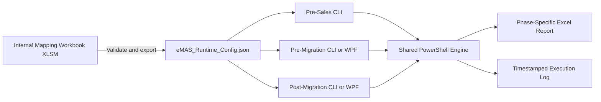

# eMAS — eCTD Migration Assessment Script

eMAS is a read-only, mapping-driven migration assessment framework supporting:

- Pre-Sales Assessment;
- Pre-Migration Readiness;
- Post-Migration Verification.

## Core architecture



- **Authoring source of truth:** reviewed internal XLSM.
- **Runtime source of truth:** validated immutable JSON exported from the approved XLSM.
- **Execution source:** exact JSON version and checksum loaded for a run.
- PowerShell never reads the XLSM and never creates, repairs or reinterprets the runtime JSON.
- The same runtime JSON is used by all three phases.
- Each phase defines its own inputs, checks, depth, decisions and controlled report template.
- Shared technical processing belongs in `engine/`.
- Source evidence remains read-only.

## Effective requirements baseline

The Product Owner approved all 171 reviewed recommendations on 13 July 2026. The decisions are consolidated into Enterprise Requirements v3.1 and the three Version 3.0 configuration documents. Implementation, verification, SME content approval and release completion remain separately tracked states.

Primary effective references:

- [Enterprise Requirements v3.1](docs/requirements/eMAS_Final_Enterprise_Requirements_v3.1.md)
- [Mapping Configuration Functional Requirements v3.0](docs/configuration/01_eMAS_Mapping_Configuration_Functional_Requirements.md)
- [Mapping Configuration Technical Requirements v3.0](docs/configuration/02_eMAS_Mapping_Configuration_Technical_Requirements.md)
- [Mapping Configuration Content Catalogue v3.0](docs/configuration/03_eMAS_Mapping_Configuration_Content_Catalogue.md)
- [Approved Decision Baseline v1.0](docs/governance/eMAS_Approved_Decision_Baseline_v1.0.md)
- [Permanent Decision Log](docs/governance/eMAS_Decision_Log.md)
- [Authority and Precedence Policy](docs/governance/00_authority_and_precedence.md)
- [Document Governance and Change Control](docs/governance/eMAS_Document_Governance.md)
- [Controlled Terminology](docs/governance/eMAS_Terminology.md)
- [Canonical Document Index](docs/CANONICAL_DOCUMENT_INDEX.md)
- [Machine-readable LLM Context Index](docs/llm-development-context/context-index.yaml)
- [Runtime JSON Contract](docs/configuration/04_eMAS_Runtime_JSON_Contract.md)
- [Normalized Rule Model](docs/configuration/05_eMAS_Normalized_Rule_Model.md)
- [Runtime JSON Schema](config/schema/eMAS-runtime-config.schema.json)
- [Operational LLM Skills](docs/llm-development-context/skills/README.md)

## Assessment outcomes

| Phase | Execution | Approved outcome terminology |
|---|---|---|
| Pre-Sales Assessment | CLI or simple launcher | Complexity band, confidence, scope and clarifications |
| Pre-Migration Readiness | CLI or optional WPF | Ready, Ready with Accepted Exceptions, Blocked |
| Post-Migration Verification | CLI or optional WPF | Reconciled, Reconciled with Accepted Exceptions, Review Required, Not Reconciled |

Pre-Sales remains intentionally lightweight and customer-friendly. Pre-Migration creates the reusable baseline consumed by Post-Migration Verification.

## Repository structure

```text
eMAS/
├── .github/      Pull-request, ownership and CI controls
├── scripts/      Phase entry scripts
├── engine/       Shared PowerShell modules
├── config/       XLSM authoring source, VBA, schema and runtime configuration
├── templates/    Controlled phase-specific report templates
├── ui/           Optional pre/post WPF interfaces
├── docs/         Requirements, architecture, governance and guidance
├── tests/        Unit, integration, scenario and performance tests
├── build/        Validation and packaging scripts
├── releases/     Release notes and manifests
├── output/       Local generated reports; not source-controlled
├── logs/         Local generated logs; not source-controlled
└── dist/         Local generated packages; not source-controlled
```

See:

- [Documentation Index](docs/index.md)
- [Canonical Document Index](docs/CANONICAL_DOCUMENT_INDEX.md)
- [Repository Structure](docs/repository/eMAS_Repository_Structure.md)
- [Repository Architecture](docs/architecture/eMAS_Repository_Architecture.md)
- [Project Flow](docs/architecture/eMAS_Project_Flow.md)
- [Superseded Document Register](docs/archive/SUPERSEDED_DOCUMENT_REGISTER.md)

## Development controls

1. Start from the latest `main` on a dedicated branch.
2. Apply the canonical index and authority policy.
3. Cite applicable DecisionIds and requirement IDs.
4. Keep business and regulatory interpretation in approved configuration, not PowerShell.
5. Update dependent schema, requirements, architecture, tests and guidance or track them explicitly.
6. Obtain approvals required by the change-authority matrix.
7. Stop when a conflict affects regulatory interpretation, JSON compatibility, phase decisions, report meaning or evidence traceability.
8. Merge through a reviewed pull request; do not commit directly to `main`.

Repository workflow is defined in [CONTRIBUTING.md](CONTRIBUTING.md), [CODEOWNERS](.github/CODEOWNERS) and the pull-request template.

## Repository safety

Do not commit customer data, customer reports, migration evidence, production logs, credentials, project-specific accepted exceptions, temporary JSON exports, confidential internal workbooks or uncontrolled generated packages.

This repository is public. Internal reviewed workbooks, confidential branding, controlled project evidence and historical internal Word packs remain in approved internal storage or a private repository. Their governance status is represented through sanitized repository records.

## Positioning

eMAS provides structured, reproducible and traceable migration assessment evidence. It does not perform migration, regulatory validation, formal customer validation, electronic approval or customer acceptance.
