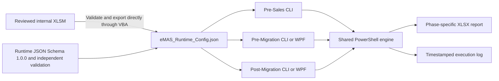

# eMAS — eCTD Migration Assessment Script

eMAS is a read-only, mapping-driven migration assessment framework supporting:

- Pre-Sales Assessment;
- Pre-Migration Readiness;
- Post-Migration Verification.

## Core architecture



- **Authoring source:** reviewed internal XLSM.
- **Runtime source:** validated immutable JSON exported by the XLSM.
- **Execution source:** exact JSON version and checksum loaded for a run.
- PowerShell never reads the XLSM and never creates, repairs or reinterprets runtime JSON.
- All phases use the same runtime JSON and shared engine.
- Source evidence remains read-only and normal runtime execution is offline.

## Effective and implemented baseline

The approved dependency sequence currently includes:

1. governance, authority and terminology — complete;
2. Enterprise/configuration requirements synchronization — complete;
3. normalized relationship matrix and data dictionary — frozen;
4. Runtime JSON Schema 1.0.0 and independent fixtures — complete;
5. Solution Architecture and phase contracts — Effective;
6. seven operational LLM skills — Effective and automatically validated;
7. source-controlled XLSM/VBA proof of concept and automated conformance harness — implemented.

Stage 7 repository evidence includes a synthetic 43-table workbook definition, deterministic XLSX generation, nine reviewable VBA modules, valid/boundary/negative workbook fixtures, deterministic golden JSON hash, Schema 1.0.0 checks, unit tests and CI.

**Native desktop Excel/VBA execution is still a required manual qualification gate.** The repository does not claim that supported Excel versions, 32/64-bit Office, German/English locales, production signing or controlled workbook release are qualified.

## Primary references

- [Enterprise Requirements v3.1](docs/requirements/eMAS_Final_Enterprise_Requirements_v3.1.md)
- [Configuration Documentation](docs/configuration/README.md)
- [Runtime JSON Contract v1.2](docs/configuration/04_eMAS_Runtime_JSON_Contract.md)
- [Runtime JSON Schema 1.0.0](config/schema/eMAS-runtime-config.schema.json)
- [Solution Architecture v1.0](docs/architecture/eMAS_Solution_Architecture.md)
- [Phase Contracts](docs/architecture/phase-contracts/README.md)
- [Operational LLM Skills](docs/llm-development-context/skills/README.md)
- [XLSM/VBA POC and Conformance Contract](docs/configuration/09_eMAS_XLSM_VBA_POC_and_Conformance.md)
- [Synthetic POC Source](config/authoring/poc/README.md)
- [Canonical Document Index](docs/CANONICAL_DOCUMENT_INDEX.md)

## POC validation

Automated source and conformance validation:

```bash
python -m pip install -r build/requirements-schema-validation.txt
python build/validate_xlsm_vba_poc.py
python -m unittest discover -s tests/vba -p "test_*.py" -v
```

Native internal build/test on supported Windows and desktop Excel:

```powershell
.\build\Build-eMASMappingPoc.ps1
.\build\Test-eMASMappingPoc.ps1
```

The native test runs VBA validation, exports deterministic JSON twice, compares both exports with the approved golden SHA-256 and validates the result independently against Schema 1.0.0.

## Phase outcomes

| Phase | Execution | Controlled outcome |
|---|---|---|
| Pre-Sales Assessment | CLI or simple launcher | Complexity, confidence, scope, drivers and clarifications |
| Pre-Migration Readiness | CLI or optional WPF | Ready, Ready with Accepted Exceptions, Blocked |
| Post-Migration Verification | CLI or optional WPF | Reconciled, Reconciled with Accepted Exceptions, Review Required, Not Reconciled |

## Development controls

1. Start from current `main` on a dedicated branch.
2. Apply the canonical index, authority policy and approved decision baseline.
3. Use the frozen logical model, Schema 1.0.0, architecture and applicable phase contract.
4. Select the narrowest Effective operational skill.
5. Keep business/regulatory interpretation in approved configuration.
6. Update affected contracts, fixtures, tests and indexes together.
7. Stop for regulatory, schema, baseline, report-meaning or evidence conflicts.
8. Use the review skill before merge.

## Repository safety

Do not commit customer data, customer reports, migration evidence, production logs, credentials, project-specific exceptions, controlled production workbooks or uncontrolled generated packages. Committed fixtures and POC content must remain synthetic.

## Positioning

eMAS provides structured, reproducible and traceable migration assessment evidence. It does not perform migration, regulatory validation, formal customer validation, electronic approval or customer acceptance.
