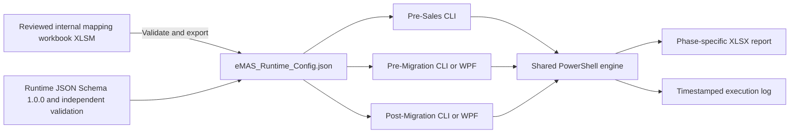

# eMAS — eCTD Migration Assessment Script

eMAS is a read-only, mapping-driven migration assessment framework supporting:

- Pre-Sales Assessment;
- Pre-Migration Readiness;
- Post-Migration Verification.

## Core architecture



- **Authoring source of truth:** reviewed internal XLSM.
- **Runtime source of truth:** validated immutable JSON exported from the approved XLSM.
- **Execution source:** exact JSON version and checksum loaded for a run.
- PowerShell never reads the XLSM and never creates, repairs or reinterprets runtime JSON.
- The same runtime JSON is used by all phases.
- Phase scripts own orchestration; shared technical processing belongs in `engine/`.
- Source evidence remains read-only.
- Normal runtime execution is offline and requires no central database.

## Effective baseline

The Product Owner approved the 171-item decision baseline on 13 July 2026. The following stages are complete:

1. authority, precedence, terminology and document governance;
2. Enterprise and configuration requirement synchronization;
3. normalized relationship matrix and data-dictionary freeze;
4. Runtime JSON Schema 1.0.0, fixtures and independent semantic validation;
5. Solution Architecture and three Effective phase contracts.

Primary references:

- [Enterprise Requirements v3.1](docs/requirements/eMAS_Final_Enterprise_Requirements_v3.1.md)
- [Configuration Documentation](docs/configuration/README.md)
- [Runtime JSON Contract v1.2](docs/configuration/04_eMAS_Runtime_JSON_Contract.md)
- [Normalized Rule Model v1.1](docs/configuration/05_eMAS_Normalized_Rule_Model.md)
- [Normalized Relationship Matrix v1.0](docs/configuration/06_eMAS_Normalized_Relationship_Matrix.md)
- [Logical Data Dictionary v1.0](docs/configuration/07_eMAS_Data_Dictionary.md)
- [Schema Validation and Fixture Contract v1.0](docs/configuration/08_eMAS_Schema_Validation_and_Fixture_Contract.md)
- [Runtime JSON Schema 1.0.0](config/schema/eMAS-runtime-config.schema.json)
- [Solution Architecture v1.0](docs/architecture/eMAS_Solution_Architecture.md)
- [Project Flow v2.0](docs/architecture/eMAS_Project_Flow.md)
- [Phase Contracts](docs/architecture/phase-contracts/README.md)
- [Canonical Document Index](docs/CANONICAL_DOCUMENT_INDEX.md)
- [Approved Decision Baseline](docs/governance/eMAS_Approved_Decision_Baseline_v1.0.md)

## Phase outcomes

| Phase | Execution | Controlled outcome |
|---|---|---|
| Pre-Sales Assessment | CLI or simple launcher | Complexity, confidence, scope, drivers and clarifications |
| Pre-Migration Readiness | CLI or optional WPF | Ready, Ready with Accepted Exceptions, Blocked |
| Post-Migration Verification | CLI or optional WPF | Reconciled, Reconciled with Accepted Exceptions, Review Required, Not Reconciled |

Pre-Sales remains lightweight and customer-friendly. Pre-Migration creates the approved baseline. Post-Migration consumes that baseline and agreed `MigrationSummary.xlsx` detail.

## Reporting rules

Each phase uses a separate controlled XLSX template. Reports keep `EvaluationStatus`, `RAG`, `ValueSource`, `Confidence` and `ReviewRequired` distinct, preserve findings and accepted-exception traceability, include execution/configuration metadata and state intended use and limitations. Raw scoring remains internal by default.

## Repository structure

```text
eMAS/
├── .github/      Pull-request, ownership and CI controls
├── scripts/      Phase entry scripts and launchers
├── engine/       Shared PowerShell modules
├── config/       XLSM authoring, VBA, schema, fixtures and runtime configuration
├── templates/    Controlled phase-specific report templates
├── ui/           Optional Pre-/Post-Migration WPF
├── docs/         Requirements, architecture, governance and guidance
├── tests/        Schema, unit, integration, scenario and performance tests
├── build/        Independent validation and packaging scripts
├── releases/     Release notes and manifests
├── output/       Local generated reports; not source-controlled
├── logs/         Local generated logs; not source-controlled
└── dist/         Local generated packages; not source-controlled
```

## Development controls

1. Start from current `main` on a dedicated branch.
2. Apply the canonical index, authority policy and approved decision baseline.
3. Use the frozen logical model, Schema 1.0.0, Solution Architecture and applicable phase contract.
4. Keep business/regulatory interpretation in approved configuration.
5. Update affected contracts, tests, templates and guidance together.
6. Stop when a conflict affects regulatory meaning, schema compatibility, phase results, report meaning or evidence traceability.
7. Merge through a reviewed pull request.

## Repository safety

Do not commit customer data, customer reports, migration evidence, production logs, credentials, project-specific exceptions, temporary JSON exports, confidential internal workbooks or uncontrolled generated packages. Committed fixtures must be synthetic.

## Positioning

eMAS provides structured, reproducible and traceable migration assessment evidence. It does not perform migration, regulatory validation, formal customer validation, electronic approval or customer acceptance.
