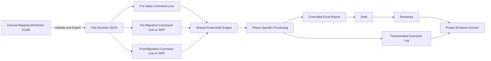
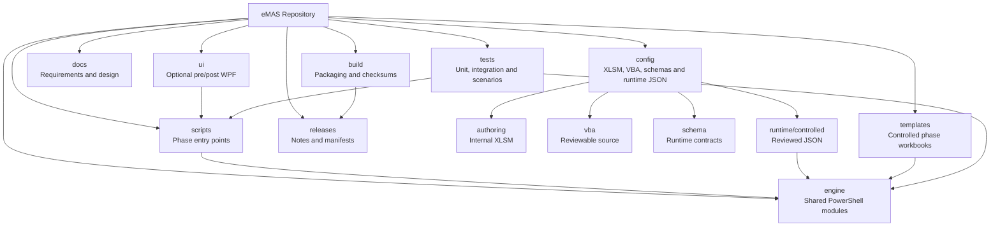

# eMAS — eCTD Migration Assessment Script

eMAS is a read-only, mapping-driven migration assessment framework supporting:

- pre-sales migration scoping;
- pre-migration readiness assessment;
- post-migration reconciliation.

The central design principle is that business and regulatory rules are maintained in an internal Excel `.xlsm` mapping workbook. The workbook validates the maintained configuration and exports one runtime JSON file directly from Excel. PowerShell does not read the mapping workbook and does not create the JSON.

## Project flow



The detailed phase-level flow is documented in [eMAS Project Flow](docs/architecture/eMAS_Project_Flow.md).

## Repository map



The canonical structure and folder responsibilities are defined in:

- [eMAS Repository Structure](docs/repository/eMAS_Repository_Structure.md)
- [eMAS Repository Architecture](docs/architecture/eMAS_Repository_Architecture.md)
- [Documentation Index](docs/index.md)

## Top-level structure

```text
eMAS/
├── .github/      Pull-request, issue and CI controls
├── scripts/      Phase entry scripts and launchers
├── engine/       Shared PowerShell processing modules
├── config/       Mapping authoring, VBA, schemas and runtime JSON
├── templates/    Controlled phase-specific Excel templates
├── ui/           Optional pre- and post-migration WPF interfaces
├── docs/         Requirements, architecture and guidance
├── tests/        Unit, integration, scenario and performance tests
├── build/        Build, validation and packaging scripts
├── releases/     Release notes, limitations and manifests
├── output/       Local generated reports; not source-controlled
├── logs/         Local generated logs; not source-controlled
└── dist/         Local generated packages; not source-controlled
```

## Create the same structure locally

The preferred approach is to clone the repository because tracked `README.md` and `.gitkeep` files already create the active scaffold:

```powershell
git clone https://github.com/MightyM-ouse/eMAS.git
cd eMAS
```

To create or repair the complete target folder structure in an existing local clone, run:

```powershell
.\build\Initialize-eMASRepositoryStructure.ps1 -RootPath .
```

To preview the folders that would be created:

```powershell
.\build\Initialize-eMASRepositoryStructure.ps1 -RootPath . -WhatIf
```

The script creates missing directories and placeholder files only. It does not overwrite implementation files.

## Core design rules

- The internal Excel mapping workbook is the business and regulatory rule-authoring application.
- The workbook validates and exports one UTF-8 runtime JSON file directly from Excel.
- PowerShell never reads the `.xlsm` workbook and never generates the runtime JSON.
- The same reviewed JSON is used by pre-sales, pre-migration and post-migration.
- Each phase has its own inputs, assessment depth, checks, decision logic and controlled report template.
- Shared technical operations are implemented once in `engine/` and reused by every phase.
- All phases support command-line execution.
- Pre-migration and post-migration may additionally use an optional portable WPF interface.
- The WPF interface invokes the same scripts and does not contain separate assessment logic.
- Every execution produces a phase-specific Excel report and a detailed timestamped log.
- Source evidence remains read-only.

## Assessment phases

| Phase | Execution | Primary outcome |
|---|---|---|
| Pre-Sales | Command line or simple launcher | Complexity, confidence, scope and customer clarifications |
| Pre-Migration | Command line or optional WPF | Ready, Ready with Accepted Exceptions, or Blocked; reusable baseline |
| Post-Migration | Command line or optional WPF | Reconciled, Reconciled with Accepted Exceptions, Review Required, or Not Reconciled |

Pre-sales remains intentionally lightweight because it may be executed by a customer before project initiation. Pre-migration performs detailed readiness checks and produces the baseline consumed by post-migration reconciliation.

## Source repository and delivery packages

The GitHub repository is the internal source and build structure. Delivery packages are generated from approved source; they are not maintained as duplicated folders in the repository.

### Internal controlled package

Contains the approved scripts, shared engine, one reviewed runtime JSON, phase templates, optional WPF files, instructions, release notes, known limitations and checksum manifest.

### Customer pre-sales package

Contains only the lightweight pre-sales subset:

```text
eMAS_PreSales_Package_<Version>/
├── eMAS-PreSalesAssessment.ps1
├── engine/
├── eMAS_Runtime_Config.json
├── eMAS_PreSales_Template.xlsx
├── Start-eMAS-PreSales.cmd
├── Instructions.pdf
└── Output/
```

The customer package must not include the internal mapping workbook, authoring VBA, pre-migration or post-migration interfaces, internal tests or internal governance documentation.

## Documentation baseline

- [Enterprise Requirements v3.0](docs/requirements/eMAS_Final_Enterprise_Requirements_v3.0.md)
- [Project Flow and Mermaid Diagrams](docs/architecture/eMAS_Project_Flow.md)
- [Repository Architecture](docs/architecture/eMAS_Repository_Architecture.md)
- [Repository Structure](docs/repository/eMAS_Repository_Structure.md)
- [Mapping Functional Requirements](docs/configuration/01_eMAS_Mapping_Configuration_Functional_Requirements.md)
- [Mapping Technical Requirements](docs/configuration/02_eMAS_Mapping_Configuration_Technical_Requirements.md)
- [Mapping Content Catalogue](docs/configuration/03_eMAS_Mapping_Configuration_Content_Catalogue.md)
- [Decision Register Review](docs/governance/decision-register/README.md)
- [LLM Development Context](docs/llm-development-context/README.md)

Use [docs/index.md](docs/index.md) as the repository documentation entry point.

## Decision governance

The evidence-based review currently tracks 171 decision and pending-work items. AI proposals are not approvals. Open questions are discussed and recorded one by one before they are applied to the mapping workbook, runtime JSON contract or implementation.

- [Decision-register overview](docs/governance/decision-register/README.md)
- [Review summary](docs/governance/decision-register/eMAS_Decision_Register_Review_Summary_2026-07-12.md)
- [Open-question workflow](docs/governance/decision-register/open-question-workflow.md)

## Development workflow

1. Create a dedicated branch from the current `main`.
2. Keep changes within the responsible repository area.
3. Update requirements, architecture, schemas, tests and guidance when the change affects them.
4. Run the applicable validation and tests.
5. Open a pull request with requirement, rule, configuration, template and test traceability where applicable.
6. Review and merge only after evidence and repository-safety checks are complete.

## Repository safety

Do not commit:

- customer source folders or dossier exports;
- customer reports or migration evidence;
- production execution logs;
- credentials or secrets;
- project-specific accepted exceptions;
- uncontrolled generated packages;
- temporary development JSON exports.

The production mapping workbook, controlled runtime JSON, official internal templates and confidential branding must only be added after the repository has approved internal access control. They must not be placed in a public repository.

This repository is public. Internal reviewed decision workbooks and historical Word packs remain in approved internal storage; the repository records their status through sanitized Markdown summaries and supersession notices.

## Intended positioning

eMAS provides structured, reproducible and traceable migration assessment evidence. It does not perform migration, regulatory validation, formal customer validation, electronic approval or customer acceptance.

**Branding:** EXTEDO | a cormeo brand
