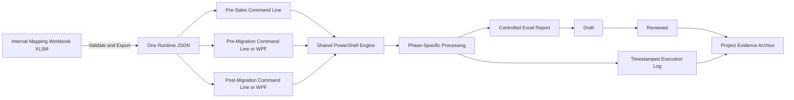

# eMAS — eCTD Migration Assessment Script

eMAS is a read-only, mapping-driven migration assessment framework for:

- pre-sales migration scoping;
- pre-migration readiness assessment;
- post-migration reconciliation.

## Project flow



The detailed project flow, phase-level activities and architecture are available in:

- [eMAS Project Flow and Mermaid Diagrams](docs/architecture/eMAS_Project_Flow.md)

## Core design

- Business and regulatory rules are maintained in an internal Excel `.xlsm` mapping workbook.
- The workbook validates the maintained rules and exports one runtime JSON file directly from Excel.
- PowerShell does not read the mapping workbook and does not create the JSON.
- The same JSON is used by pre-sales, pre-migration and post-migration.
- Each phase defines its own inputs, checks, assessment depth, decision logic and report structure.
- All phases support command-line execution.
- Pre-migration and post-migration may additionally use an optional portable WPF interface.
- Each run produces a phase-specific Excel report and a detailed timestamped execution log.

## Current baseline

The approved design baseline is documented here:

- [eMAS Final Enterprise Requirements v3.0](docs/requirements/eMAS_Final_Enterprise_Requirements_v3.0.md)
- [eMAS Project Flow and Mermaid Diagrams](docs/architecture/eMAS_Project_Flow.md)

## Intended positioning

The pre-sales phase supports early estimation and customer clarification. Pre-migration and post-migration provide GxP-oriented, traceable assessment evidence. eMAS does not perform migration, regulatory validation, formal customer validation or electronic approval.

## Planned repository structure

```text
eMAS/
├── scripts/
├── engine/
├── config/
├── templates/
├── ui/
├── docs/
├── tests/
├── output/
└── logs/
```

**Branding:** EXTEDO | a cormeo brand
