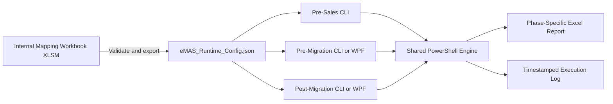

# eMAS — eCTD Migration Assessment Script

eMAS is a read-only, mapping-driven migration assessment framework supporting:

- Pre-Sales Assessment;
- Pre-Migration Readiness;
- Post-Migration Verification.

## Core architecture



- **Authoring source of truth:** reviewed internal XLSM.
- **Runtime source of truth:** validated immutable JSON exported from the approved XLSM.
- **Execution source:** exact JSON version and checksum loaded for a run.
- PowerShell never reads the XLSM and never creates or repairs the runtime JSON.
- The same runtime JSON is used by all three phases.
- Each phase defines its own inputs, checks, depth, decisions and controlled report template.
- Shared technical processing belongs in `engine/`.
- Source evidence remains read-only.

## Approved decisions

The Product Owner approved the evidence-based recommendation for all 171 items in the reviewed decision register on 13 July 2026. Approval establishes the design decisions; implementation and documentation synchronization remain tracked work.

Primary approved references:

- [Approved Decision Baseline v1.0](docs/governance/eMAS_Approved_Decision_Baseline_v1.0.md)
- [Authority and Precedence Policy](docs/governance/00_authority_and_precedence.md)
- [Controlled Terminology](docs/governance/eMAS_Terminology.md)
- [Runtime JSON Contract](docs/configuration/04_eMAS_Runtime_JSON_Contract.md)
- [Normalized Rule Model](docs/configuration/05_eMAS_Normalized_Rule_Model.md)
- [Runtime JSON Schema](config/schema/eMAS-runtime-config.schema.json)
- [Operational LLM Skills](docs/llm-development-context/skills/README.md)

## Assessment outcomes

| Phase | Execution | Approved outcome terminology |
|---|---|---|
| Pre-Sales Assessment | CLI or simple launcher | Complexity band, confidence, scope and clarifications |
| Pre-Migration Readiness | CLI or optional WPF | Ready, Ready with Accepted Exceptions, Blocked |
| Post-Migration Verification | CLI or optional WPF | Reconciled, Reconciled with Accepted Exceptions, Review Required, Not Reconciled |

Pre-sales remains intentionally lightweight and customer-friendly. Pre-migration creates the reusable baseline consumed by post-migration verification.

## Repository structure

```text
eMAS/
├── .github/      Pull-request and CI controls
├── scripts/      Phase entry scripts
├── engine/       Shared PowerShell modules
├── config/       XLSM authoring source, VBA, schema and runtime configuration
├── templates/    Controlled phase-specific report templates
├── ui/           Optional pre/post WPF interfaces
├── docs/         Requirements, architecture, governance and guidance
├── tests/        Unit, integration, scenario and performance tests
├── build/        Validation and packaging scripts
├── releases/     Release notes and manifests
├── output/       Local generated reports; not source-controlled
├── logs/         Local generated logs; not source-controlled
└── dist/         Local generated packages; not source-controlled
```

See:

- [Documentation Index](docs/index.md)
- [Repository Structure](docs/repository/eMAS_Repository_Structure.md)
- [Repository Architecture](docs/architecture/eMAS_Repository_Architecture.md)
- [Project Flow](docs/architecture/eMAS_Project_Flow.md)

## Development controls

1. Start from the latest `main` on a dedicated branch.
2. Apply the authority and precedence policy.
3. Keep business and regulatory interpretation in approved configuration, not PowerShell.
4. Update schema, requirements, architecture, tests and guidance when affected.
5. Record requirement IDs, rule IDs, versions, tests and evidence in the pull request.
6. Stop when a conflict affects regulatory interpretation, JSON compatibility, phase decisions or report meaning.

## Repository safety

Do not commit customer data, customer reports, migration evidence, production logs, credentials, project-specific accepted exceptions, temporary JSON exports or uncontrolled generated packages.

This repository is public. Internal reviewed workbooks, confidential branding, controlled project evidence and historical internal Word packs remain in approved internal storage or a private repository.

## Positioning

eMAS provides structured, reproducible and traceable migration assessment evidence. It does not perform migration, regulatory validation, formal customer validation, electronic approval or customer acceptance.
