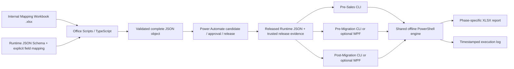

# eMAS — eCTD Migration Assessment Script

eMAS is a read-only, configuration-driven migration assessment framework supporting:

- Pre-Sales Assessment;
- Pre-Migration Readiness;
- Post-Migration Verification.

> **September 2026 update:** the current working target architecture no longer uses XLSM/VBA as the production authoring/export route. The July XLSM/VBA implementation remains in this repository as historical proof-of-concept evidence. See [September 2026 Consolidation](docs/updates/2026-09-12/README.md).

## Current target architecture

```mermaid
flowchart LR
    A[Internal Mapping Workbook .xlsx] --> B[Office Scripts / TypeScript]
    S[Runtime JSON Schema + explicit field mapping] --> B
    B --> C[Validated complete JSON object]
    C --> D[Power Automate candidate / approval / release]
    D --> E[Released Runtime JSON + trusted release evidence]
    E --> F[Pre-Sales CLI]
    E --> G[Pre-Migration CLI or optional WPF]
    E --> H[Post-Migration CLI or optional WPF]
    F --> I[Shared offline PowerShell engine]
    G --> I
    H --> I
    I --> J[Phase-specific XLSX report]
    I --> K[Timestamped execution log]
```

- **Internal authoring:** macro-free Excel `.xlsx`, primarily Excel for the web, under controlled SharePoint storage/versioning.
- **Runtime contract:** JSON-first and independently defined from workbook layout.
- **Transformation:** reviewed Office Scripts / TypeScript implement explicit workbook-to-JSON mapping and validation.
- **Release:** Power Automate coordinates frozen candidates, independent approval, immutable publication and release evidence.
- **Runtime source:** one immutable released Runtime JSON shared by all phases, plus separate trusted release evidence containing the expected digest/governance metadata.
- **PowerShell boundary:** PowerShell never reads, converts or repairs the Mapping Workbook; normal customer/project runtime is offline and does not require Excel, SharePoint, Office Scripts, Power Automate, a central database or a Microsoft 365 account.
- **Assessment data boundary:** customer/project assessment input and derived evidence must not be exported into Runtime JSON.

## September 2026 design baseline

Recent eMAS work expands the repository baseline in four major areas:

1. **Enterprise architecture v4 direction** — `.xlsx` + SharePoint + Office Scripts + Power Automate, immutable Runtime JSON, release digest/manifest, separate configuration approval and project report review.
2. **Integrated assessment workbook** — project, dossier, sequence and evidence layers coexist with reusable configuration while `DataScope` prevents project/customer evidence from becoming runtime rules.
3. **Filterable assessment catalogue** — 3,726 condition rows across 55 profiles, structured by Region → Format → Version → Application/Dossier Type and phase.
4. **Regulatory/technical migration guide** — separates dossier/application, region/authority, technical format, application/pathway, dossier/content type and lifecycle purpose; expands profile thinking beyond EU/FDA and connects physical/XML evidence to migration rules, RAG, confidence, readiness and reconciliation.

See:

- [September 2026 Consolidation](docs/updates/2026-09-12/README.md)
- [September Design Delta](docs/updates/2026-09-12/eMAS_September_2026_Design_Delta.md)
- [Enterprise Requirements v4 Update Summary](docs/requirements/eMAS_Enterprise_Requirements_v4.0_UPDATE_SUMMARY.md)
- [Mapping/Runtime v4 Update Summary](docs/configuration/eMAS_Mapping_Runtime_v4.0_UPDATE_SUMMARY.md)
- [Regulatory Assessment Principles — 12 Sep 2026](docs/regulatory/eMAS_Regulatory_Assessment_Principles_2026-09-12.md)
- [September Source Artifact Manifest](docs/updates/2026-09-12/ARTIFACT_MANIFEST.md)

## Regulatory and assessment principles

- eMAS is a migration assessment framework, not a migration execution or formal regulatory-validation system.
- Region, technical format, application/pathway type, dossier/content type and lifecycle purpose are independent dimensions.
- **ASMF is a regulatory dossier/master-file concept, not a unique transport format.** An ASMF may be delivered using eCTD.
- Folder names are supporting evidence; strong identification should use authoritative metadata/XML/profile evidence where available.
- For material XML-derived conclusions, preserve the traceability chain: physical file → XML path/element/attribute/value → interpretation → RuleId → finding → severity/confidence → migration action.
- `Unknown` and `Not Assessed` are meaningful outcomes. Missing/inaccessible evidence must not silently become Green/Pass.
- Severity/RAG and confidence are separate concepts.
- Technical completeness is not equivalent to an authority's complete official validation-rule execution.

## Phase outcomes

| Phase | Execution | Controlled outcome |
|---|---|---|
| Pre-Sales Assessment | CLI or simple launcher | Complexity, confidence, scope, drivers and clarifications |
| Pre-Migration Readiness | CLI or optional portable WPF | Readiness status, blockers/warnings, remediation and expected baseline |
| Post-Migration Verification | CLI or optional portable WPF | Reconciled, Reconciled with Accepted Exceptions, Review Required, Not Reconciled |

Post-migration interpretation should remain comparable to the approved pre-migration baseline and its pinned configuration release, or explicitly document/approve the configuration transition.

## Existing July POC content

The repository contains a synthetic 43-table XLSM/VBA proof-of-concept design, reviewable VBA modules, fixtures, deterministic JSON/hash tests, schema checks and CI. This remains useful technical history and may inform reusable concepts, but it is **not the implementation authority for the September target architecture**.

Do not remove or reinterpret the POC without a controlled archival/cleanup decision. Do not extend the VBA route merely because the source remains present.

## Existing references retained for history and compatibility analysis

- [Enterprise Requirements v3.1](docs/requirements/eMAS_Final_Enterprise_Requirements_v3.1.md)
- [Configuration Documentation](docs/configuration/README.md)
- [Runtime JSON Contract v1.2](docs/configuration/04_eMAS_Runtime_JSON_Contract.md)
- [Runtime JSON Schema 1.0.0](config/schema/eMAS-runtime-config.schema.json)
- [Solution Architecture v1.0](docs/architecture/eMAS_Solution_Architecture.md)
- [Phase Contracts](docs/architecture/phase-contracts/README.md)
- [Operational LLM Skills](docs/llm-development-context/skills/README.md)
- [XLSM/VBA POC and Conformance Contract](docs/configuration/09_eMAS_XLSM_VBA_POC_and_Conformance.md)
- [Synthetic POC Source](config/authoring/poc/README.md)
- [Canonical Document Index](docs/CANONICAL_DOCUMENT_INDEX.md)

These older references continue to apply only where they do not conflict with later controlled decisions.

## Development controls

1. Start from the current approved baseline on a dedicated branch.
2. Resolve source/requirement precedence before implementation when baselines conflict.
3. Keep generic technical discovery in code and business/regulatory interpretation in controlled configuration.
4. Maintain stable RuleIds, source evidence and version/profile applicability.
5. Keep assessment/project evidence outside Runtime JSON.
6. Update affected contracts, mappings, validation rules, fixtures, tests and indexes together.
7. Stop for regulatory, schema, baseline, report-meaning or evidence conflicts rather than silently assuming an answer.
8. Re-verify regulatory source versions before controlled rule release.

## Repository safety

Do not commit customer data, customer reports, migration evidence, production logs, credentials, project-specific accepted exceptions, controlled production workbooks or uncontrolled generated packages. Committed fixtures and examples must remain synthetic.

## Positioning

eMAS provides structured, reproducible and traceable migration assessment evidence. It does not perform migration, formal regulatory validation, customer validation, electronic approval or customer acceptance solely from an assessment result.
