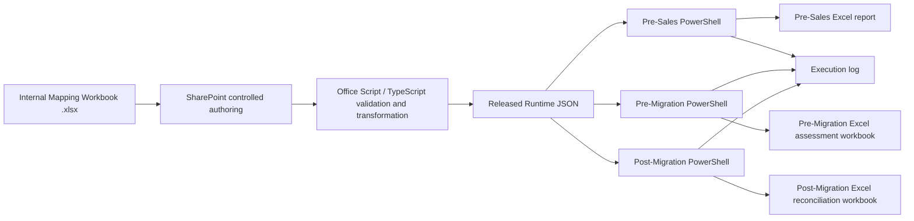

# eMAS — eCTD Migration Assessment Script

eMAS (**eCTD Migration Assessment Script**) is a configurable, read-only migration assessment framework for regulatory-content migrations across different source systems and migration scenarios.

It supports three phases:

- **Pre-Sales Assessment** — establish scope, complexity, confidence, effort drivers and missing information with minimal customer burden;
- **Pre-Migration Readiness** — perform detailed scenario-appropriate assessment and establish a controlled migration baseline;
- **Post-Migration Verification** — reconcile the approved baseline against migration/import and target evidence.

> eMAS is not only an eCTD-folder scanner. Although the product name remains **eCTD Migration Assessment Script**, its migration assessment scope may use source databases, physical archives, DMS exports, regulatory dossier/export folders, ZIP/container repositories, source-system metadata and migration/import evidence, depending on the migration scenario.

## Current v5.0 requirements direction

```text
Migration Project
      ↓
Identify Migration Scenario
      ↓
Determine Available Evidence
      ↓
Select Applicable Assessment Modules
      ↓
Assess Source-System + Regulatory + Technical Migration Risks
      ↓
Pre-Migration Baseline
      ↓
Migration occurs outside eMAS
      ↓
Post-Migration Reconciliation
```

The current target architecture is deliberately simple:


```mermaid
flowchart LR
    A[Internal Mapping Workbook .xlsx] --> B[SharePoint controlled authoring]
    B --> C[Office Script / TypeScript validation and transformation]
    C --> D[Released Runtime JSON]
    D --> E[Pre-Sales PowerShell]
    D --> F[Pre-Migration PowerShell]
    D --> G[Post-Migration PowerShell]
    E --> H[Pre-Sales Excel report]
    F --> I[Pre-Migration Excel assessment workbook]
    G --> J[Post-Migration Excel reconciliation workbook]
    E --> K[Execution log]
    F --> K
    G --> K
```

### Architecture principles

- The internal Mapping Workbook uses macro-free `.xlsx` format.
- SharePoint provides internal collaboration, permissions and version history.
- Office Scripts / TypeScript validate and deterministically transform reviewed configuration into Runtime JSON.
- Runtime PowerShell consumes released JSON, not the Mapping Workbook.
- Normal runtime does not require Excel desktop, SharePoint, Office Scripts, Power Automate or internet access.
- Excel is the primary human-facing review/reporting experience.
- No dedicated WPF or custom web application is required by the current baseline.
- Source evidence remains read-only.
- eMAS does not execute migration.

## Scenario-driven assessment

The applicable checks depend on the migration scenario and available evidence. Examples include:

| Scenario | Typical evidence | Example assessment focus |
|---|---|---|
| Existing EXTEDO on-prem → cloud | DB, archive, application environment, exports | source-system inventory, DB/archive integrity, dependencies, readiness |
| Existing EXTEDO on-prem → on-prem | DB, archive, application environment | compatibility, source integrity, scope and migration risks |
| Database + archive migration | DB records + physical archive | record/object correlation, missing/multiple/inaccessible objects |
| New/third-party customer with exports | dossier/export folders, ZIPs, metadata | dossier discovery, region/format, sequences, XML/reference/file integrity |
| Third-party system migration | vendor export, metadata, files, optional DB extracts | source model, metadata completeness, mapping and relationships |
| DMS/content migration | DMS metadata, documents/renditions | document identity, metadata mapping, file availability and relationships |
| Partial or mixed evidence | only DB, only archive, only export, backups, mixed repositories | coverage, confidence, follow-up questions and manual review |

Not every project executes every assessment module.

## Assessment capability areas

Depending on applicability, eMAS may assess:

- migration scenario and source-system context;
- source DB inventory and relationships;
- archive/physical-object presence and integrity;
- DMS/export metadata and document mappings;
- repository/ZIP/container discovery;
- product/application/dossier grouping;
- region, authority, technical format and specification version;
- application/pathway and dossier/regulatory context;
- sequence/submission-unit and lifecycle evidence;
- XML/reference/file integrity;
- volume, complexity and effort drivers;
- RAG/severity and evidence confidence;
- remediation and accepted exceptions;
- Pre-Migration readiness;
- Post-Migration reconciliation.

## Important regulatory modelling principles

- Region, authority, technical format, specification version, application type, dossier/regulatory context, procedure and lifecycle purpose are separate dimensions.
- ASMF/DMF are not transport formats.
- IND/NDA/ANDA/BLA/MAA/CTA are not eCTD formats.
- eCTD v3 and eCTD v4 require version-appropriate parsing semantics.
- Folder names are supporting evidence, not authoritative identity by themselves.
- Missing evidence must not silently become Green/Pass.
- Severity/RAG and confidence are separate concepts.
- Technical completeness is not the same as formal health-authority validation.

## Phase outcomes

| Phase | Interface | Controlled outcome |
|---|---|---|
| Pre-Sales Assessment | PowerShell/script-based | Scope, complexity, confidence, effort drivers and clarifications |
| Pre-Migration Readiness | PowerShell + controlled Excel assessment workbook | Ready / Ready with Accepted Exceptions / Blocked |
| Post-Migration Verification | PowerShell + controlled Excel reconciliation workbook | Reconciled / Reconciled with Accepted Exceptions / Review Required / Not Reconciled |

## Current requirements references

- [Enterprise Requirements v5.0](docs/requirements/eMAS_Enterprise_Requirements_v5.0.md)
- [v5.0 Previous Baseline Carry-Forward Register](docs/requirements/eMAS_v5.0_Previous_Baseline_Carry_Forward.md)

Detailed regulatory, parser, SQL, XPath, workbook-layout and test specifications are intentionally kept outside the enterprise requirements baseline and should be maintained in the appropriate lower-level controlled specifications.

## Repository safety

Do not commit customer data, customer reports, migration evidence, production logs, credentials, project-specific accepted exceptions or uncontrolled production artifacts to the repository.

## Positioning

eMAS converts available migration evidence into structured, reproducible and traceable migration assessment results. It helps determine what is known, what is missing, what may block migration, what requires remediation, and whether the migrated target reconciles with the approved baseline.

It does not perform the migration itself, formal regulatory validation, scientific assessment, electronic approval or customer acceptance.
