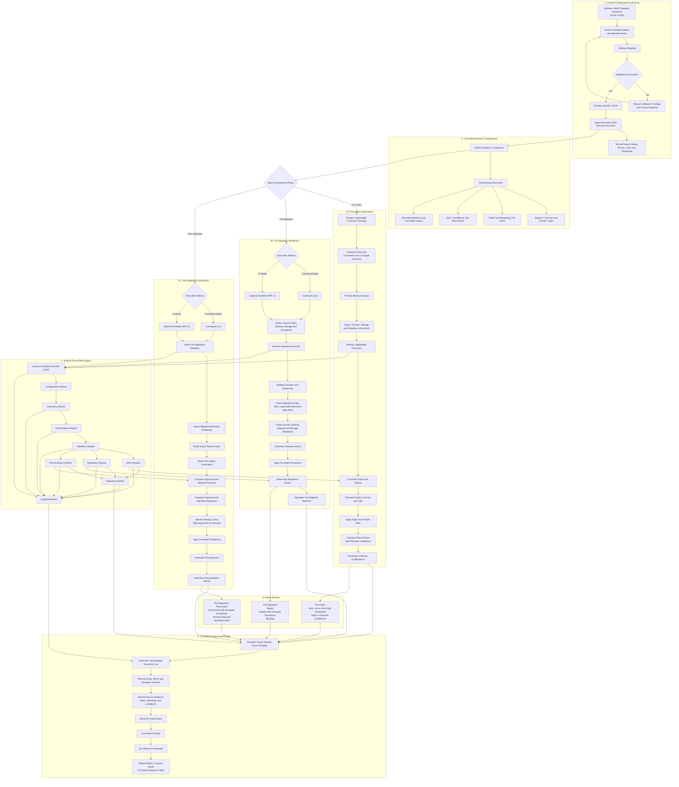
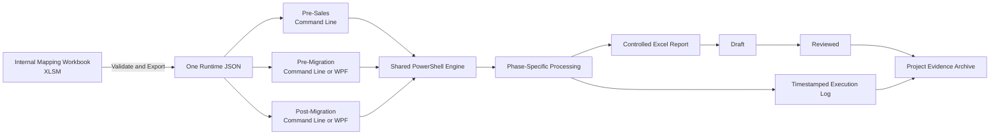

# eMAS Project Flow

**Project:** eMAS — eCTD Migration Assessment Script  
**Document Type:** Project Flow and Architecture Diagram  
**Version:** 1.0  
**Status:** Final Design Baseline  
**Date:** 11 July 2026

This document shows the complete eMAS project flow from internal mapping maintenance through pre-sales, pre-migration and post-migration execution, shared PowerShell processing, reporting, review and evidence retention.

---

## 1. Detailed Project Flow

---

## 2. Simplified Executive Flow

---

## 3. Key Flow Rules

- The internal Excel mapping workbook validates and exports one runtime JSON directly.
- PowerShell does not read the mapping workbook and does not generate the JSON.
- The same JSON is used by all three assessment phases.
- The pre-sales phase remains lightweight and command-line driven for customer execution.
- Pre-migration and post-migration support command-line execution and an optional portable WPF interface.
- The WPF interface invokes the same PowerShell scripts and does not contain separate business logic.
- Each phase defines its own input requirements, checks, assessment depth, decision logic and report structure.
- Every run creates a phase-specific Excel report and a detailed timestamped execution log.
- Reports follow the lifecycle `Draft → Reviewed` and are retained with supporting evidence in the project folder.
