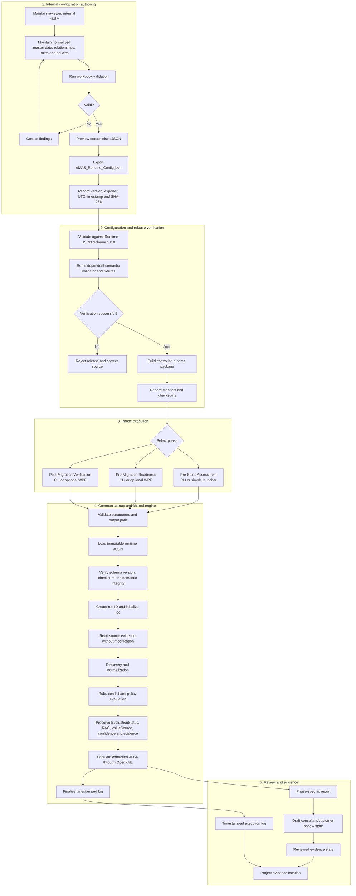
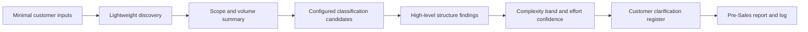
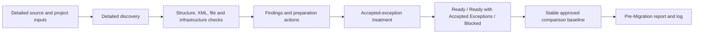
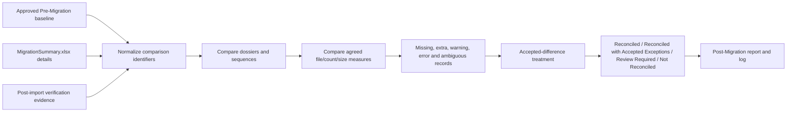
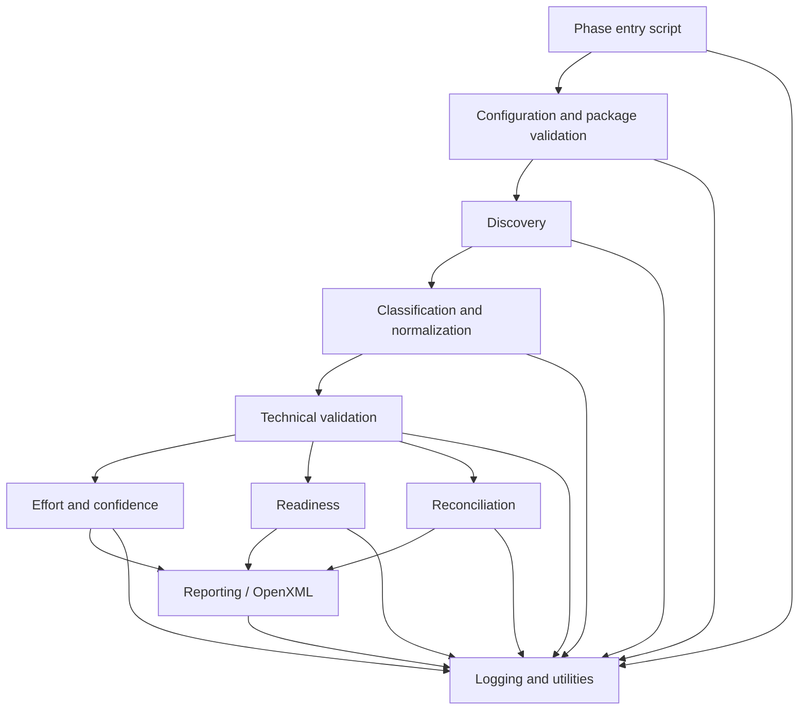
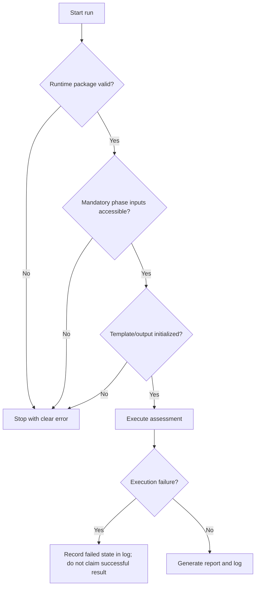

# eMAS Project Flow

**Version:** 2.0  
**Status:** Effective Architecture Flow  
**Effective date:** 2026-07-13  
**Owner:** Technical Architect  
**Canonical references:** Enterprise Requirements v3.1; Solution Architecture v1.0; Runtime JSON Contract v1.2; Runtime JSON Schema 1.0.0; three Effective phase contracts

## 1. End-to-end controlled flow

## 2. Phase-specific flow

### 2.1 Pre-Sales Assessment

Rules:

- remains lightweight and customer-friendly;
- does not determine readiness or reconciliation;
- raw score remains internal by default;
- raw inventory is optional;
- report includes assumptions, limitations, intended use and non-validation wording;
- completion output identifies the report and log to share.

### 2.2 Pre-Migration Readiness

Rules:

- original findings, RAG and evidence remain visible after exception treatment;
- baseline records stable identifiers, scope, exclusions, limitations and integrity metadata;
- CLI and WPF invoke the same phase entry script.

### 2.3 Post-Migration Verification

Rules:

- the approved baseline is mandatory;
- `MigrationSummary.xlsx` is read without modification using controlled mappings;
- original discrepancies and evidence remain visible after accepted-difference treatment;
- CLI and WPF invoke the same phase entry script.

## 3. Shared engine call model

Only modules required by the selected phase are invoked. Entry scripts do not duplicate shared behavior, and the WPF interface does not contain assessment logic.

## 4. Failure paths

Missing optional evidence encountered after startup is represented using configured evaluation status, assumptions, limitations and review requirements; it is not silently treated as Green.

## 5. Controlled flow rules

- The internal XLSM validates and exports one runtime JSON directly.
- PowerShell never reads the XLSM or generates/repairs runtime JSON.
- The same JSON is used by all phases.
- Runtime JSON Schema 1.0.0 and semantic validation are checked before controlled release and defensively at runtime.
- Pre-Sales uses CLI/simple launcher only; WPF is limited to Pre- and Post-Migration.
- Every phase produces one controlled XLSX report and one detailed timestamped log.
- Report generation must not require Excel on the execution host.
- Source evidence is read-only.
- Accepted exceptions never erase original findings or discrepancies.
- Generated evidence remains outside the source repository.

## 6. Revision history

| Version | Date | Change |
|---|---|---|
| 1.0 | 2026-07-11 | Initial project-flow baseline |
| 2.0 | 2026-07-13 | Synchronized flow with Solution Architecture v1.0, Schema 1.0.0, independent configuration validation and the three Effective phase contracts |
