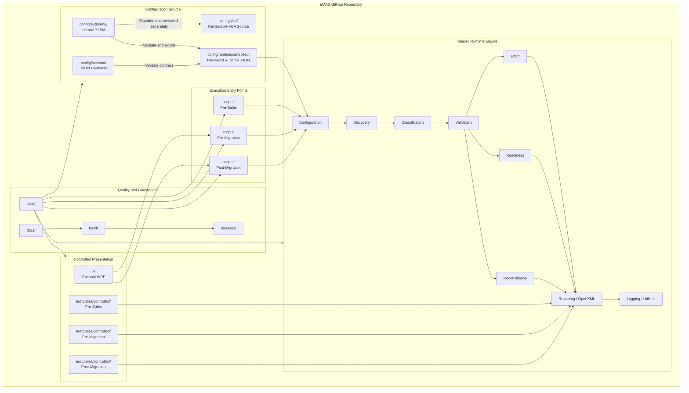
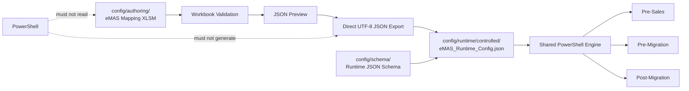
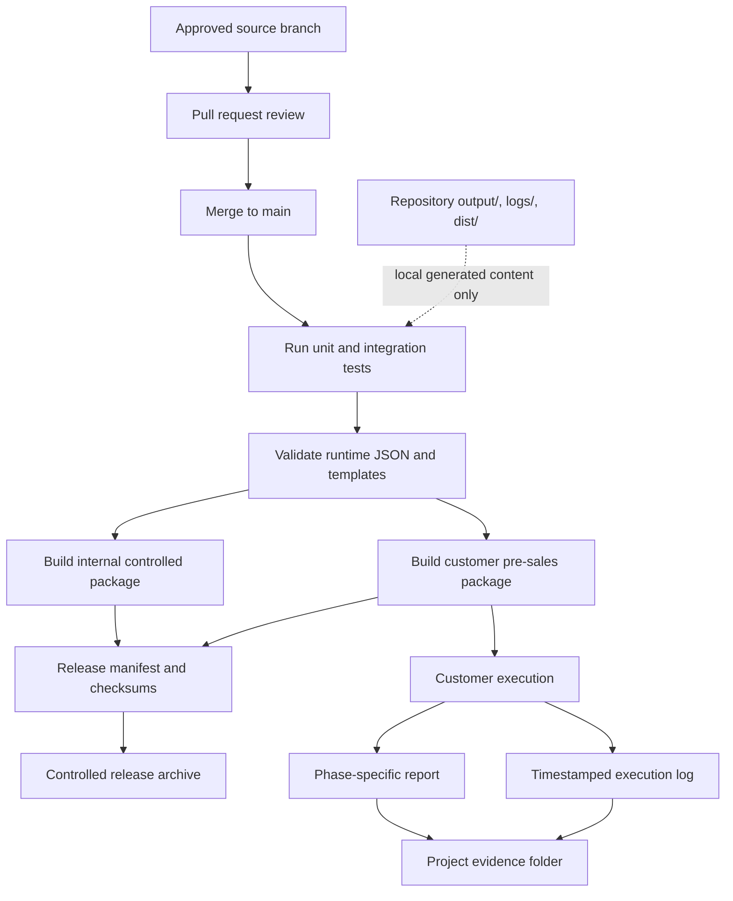
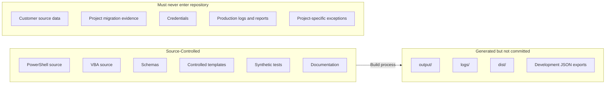

# eMAS Repository Architecture

**Project:** eMAS — eCTD Migration Assessment Script  
**Document Type:** Source Repository and Release Architecture  
**Version:** 1.0  
**Status:** Approved Structure Baseline  
**Date:** 12 July 2026

## 1. Purpose

This document shows how the eMAS source repository maps to configuration authoring, runtime execution, testing, controlled reporting and release packaging.

The repository is organized around two separations:

- business and regulatory rule authoring versus runtime execution;
- internal source assets versus generated customer or consultant packages.

## 2. Repository component architecture

## 3. Configuration-to-runtime boundary

The workbook is the internal authoring application. The exported JSON is the runtime contract. PowerShell loads only the JSON and applies phase-specific orchestration through the shared engine.

## 4. Source-to-release flow

## 5. Repository and evidence boundaries

## 6. Folder-to-architecture mapping

| Architecture responsibility | Repository location |
|---|---|
| Phase orchestration | `scripts/` |
| Shared technical processing | `engine/` |
| Mapping authoring | `config/authoring/` |
| Reviewable workbook code | `config/vba/` |
| Runtime contracts | `config/schema/` |
| Reviewed runtime rules | `config/runtime/controlled/` |
| Phase report presentation | `templates/controlled/` |
| Optional execution interface | `ui/` |
| Automated and controlled testing | `tests/` |
| Packaging and checksum generation | `build/` |
| Requirements, design and operating guidance | `docs/` |
| Release notes and manifests | `releases/` |
| Local generated artifacts | `output/`, `logs/`, `dist/` |

## 7. Architectural constraints

- Entry scripts must not duplicate business or shared technical logic.
- The WPF interface must invoke the same pre-migration and post-migration scripts used in command-line mode.
- The UI must not maintain an independent rule set.
- Runtime JSON must be validated against the supported schema and engine compatibility rules.
- Separate controlled templates must be used for pre-sales, pre-migration and post-migration.
- Test fixtures must be synthetic, approved and free of customer-identifiable information.
- Generated reports and logs belong in a project evidence location, not in the source repository.

See [eMAS Repository Structure](../repository/eMAS_Repository_Structure.md) for the complete folder tree and source-control rules.
