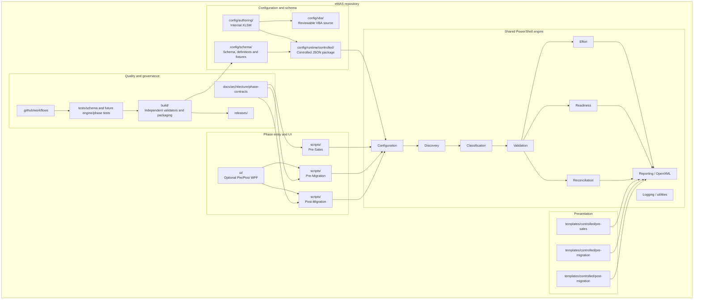
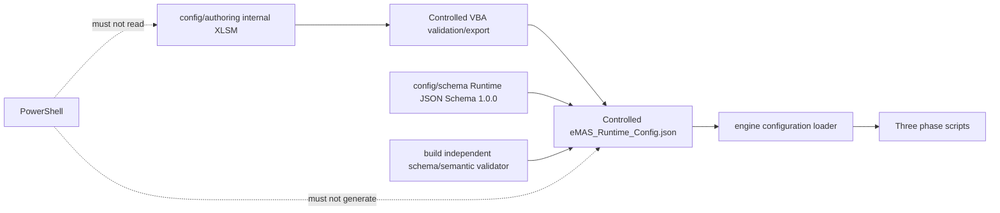
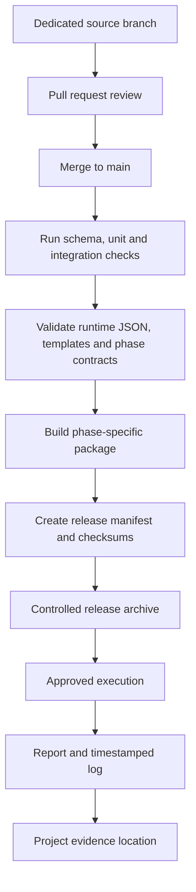

# eMAS Repository Architecture

**Version:** 1.1  
**Status:** Effective Repository Architecture  
**Effective date:** 2026-07-13  
**Owner:** Technical Architect  
**Canonical references:** Solution Architecture v1.0; Enterprise Requirements v3.1; Runtime JSON Schema 1.0.0; Repository Structure

## 1. Purpose

This document maps eMAS solution components, phase contracts, configuration sources, verification controls, controlled templates and release evidence to repository locations.

## 2. Repository component architecture

## 3. Folder responsibility map

| Responsibility | Repository location |
|---|---|
| Phase entry scripts and launchers | `scripts/` |
| Shared PowerShell technical processing | `engine/` |
| Internal mapping authoring workbook | `config/authoring/` |
| Reviewable VBA source | `config/vba/` |
| Runtime JSON Schema, definitions and synthetic fixtures | `config/schema/` |
| Approved runtime packages used for controlled builds | `config/runtime/controlled/` |
| Controlled phase report templates | `templates/controlled/` |
| Optional portable WPF interface | `ui/` |
| Solution and phase contracts | `docs/architecture/` and `docs/architecture/phase-contracts/` |
| Automated tests | `tests/` |
| Independent validators, build and packaging tools | `build/` |
| CI workflows and ownership controls | `.github/` |
| Release notes, manifests and checksums | `releases/` |
| Local generated artifacts | `output/`, `logs/`, `dist/` |

## 4. Configuration boundary

Python and `jsonschema` remain build/CI dependencies. They are not placed in runtime customer packages.

## 5. Source-to-release flow

## 6. Package boundaries

### Customer Pre-Sales package

Permitted runtime content:

- Pre-Sales script and optional simple launcher;
- only required engine modules;
- controlled runtime JSON and integrity evidence;
- controlled Pre-Sales template;
- customer instructions and output structure.

Excluded: internal XLSM/VBA, WPF, other phase scripts, internal tests/governance and confidential assets.

### Internal Pre-/Post-Migration packages

May include the appropriate phase script, required shared modules, controlled JSON, controlled template, operating guidance and optional portable WPF. Post-Migration guidance includes baseline and `MigrationSummary.xlsx` input requirements.

## 7. Source-control and evidence boundaries

| Classification | Examples | Repository treatment |
|---|---|---|
| Source-controlled | PowerShell, reviewable VBA, schemas, synthetic fixtures, controlled blank templates, documentation | Commit through reviewed PR |
| Generated local | reports, logs, package output, development JSON | Do not commit |
| Controlled external/internal storage | reviewed production XLSM, released runtime JSON, signed/approved manifests where confidential | Store in approved controlled location; commit sanitized metadata where appropriate |
| Prohibited | customer data, project evidence, credentials, production logs/reports, project-specific exceptions | Never commit |

## 8. Architectural constraints

- Entry scripts follow their Effective phase contracts.
- Shared behavior belongs in `engine/` and is not copied between scripts.
- WPF invokes the same Pre-/Post-Migration scripts and contains no independent assessment logic.
- Runtime configuration is immutable and defensively validated before use.
- Report generation uses controlled templates and OpenXML-compatible processing without requiring Excel.
- Template changes that affect meaning require synchronized phase-contract/report-specification review.
- Post-Migration baseline compatibility must be maintained across any Pre-Migration baseline format change.
- Schema fixtures are synthetic and are not regulatory-content authority.

## 9. Revision history

| Version | Date | Change |
|---|---|---|
| 1.0 | 2026-07-12 | Approved repository structure baseline |
| 1.1 | 2026-07-13 | Synchronized repository architecture with the Effective Solution Architecture, phase contracts, Schema 1.0.0 and independent validation boundary |
