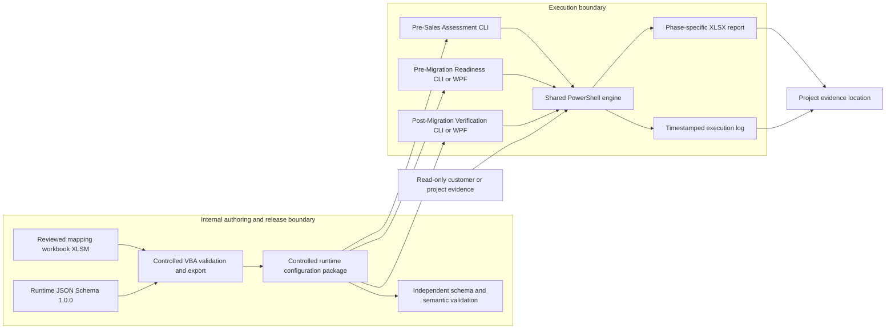
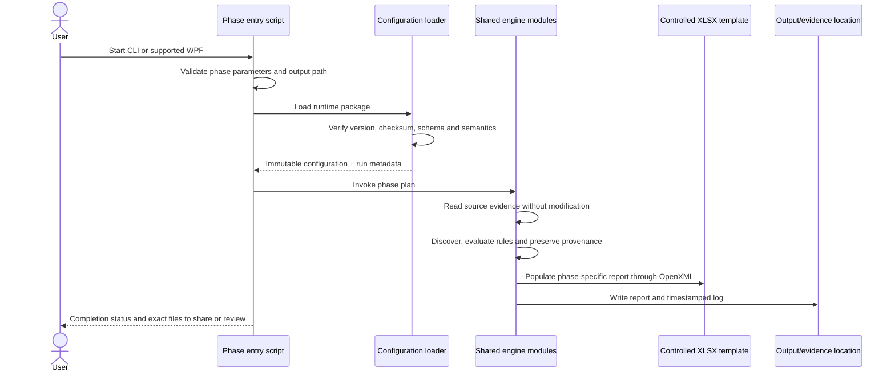

# eMAS Solution Architecture

**Version:** 1.0  
**Status:** Effective Architecture Baseline  
**Effective date:** 2026-07-13  
**Owner:** Technical Architect  
**Decision references:** Approved Decision Baseline v1.0; AP-001–AP-012; JSON-001–JSON-023; RM-001–RM-027; FN-001–FN-021  
**Canonical references:** Enterprise Requirements v3.1; Runtime JSON Contract v1.2; Normalized Rule Model v1.1; Normalized Relationship Matrix v1.0; Logical Data Dictionary v1.0; Runtime JSON Schema 1.0.0

## 1. Purpose

This document defines the effective solution architecture for eMAS across configuration authoring, controlled release, the three assessment phases, shared PowerShell processing, optional WPF execution, controlled reporting, logging and evidence retention.

It establishes component responsibilities and boundaries. It does not define detailed regulatory content, effort weights, report sheet layouts or implementation-specific parameter names.

## 2. Architectural principles

1. eMAS is read-only against customer source evidence.
2. The reviewed internal XLSM is the authoring source of truth.
3. The XLSM validates and exports one deterministic `eMAS_Runtime_Config.json` directly through controlled VBA.
4. PowerShell never reads the XLSM and never creates, repairs or reinterprets runtime JSON.
5. The validated immutable JSON is the runtime source of truth for all three phases.
6. The exact JSON version and SHA-256 checksum loaded for a run is the execution source.
7. Phase entry scripts own orchestration; reusable technical behavior belongs in the shared engine.
8. Business and regulatory interpretation belongs in approved runtime configuration, not hardcoded PowerShell.
9. All phases support CLI. Portable WPF is limited to Pre-Migration Readiness and Post-Migration Verification and invokes the same scripts.
10. Every run creates one controlled phase-specific XLSX report and one detailed timestamped log.
11. Python schema tooling is build/CI-only and is not a customer or PowerShell runtime dependency.
12. Normal execution is offline and requires no central database.

## 3. System context

## 4. Logical component architecture

| Component | Responsibility | Must not do |
|---|---|---|
| Internal XLSM | Author controlled master data, normalized rules, policies, terminology and relationships; validate and export JSON | Be distributed to customers; depend on PowerShell to build JSON |
| Controlled VBA | Validate workbook state, preview/export JSON, record export history and checksum | Embed customer-specific evidence; silently bypass validation |
| Runtime JSON Schema 1.0.0 | Define exact runtime serialization | Define project workflow or customer-specific exceptions |
| Independent schema validator | Verify structure, semantics and fixture expectations during build/CI/release | Become a customer runtime dependency |
| Runtime configuration package | Carry the approved JSON, checksum and release evidence | Contain the authoring workbook or uncontrolled content |
| Phase entry script | Validate phase-specific parameters, establish run context and orchestrate shared modules | Duplicate shared technical logic or business rules |
| Optional WPF | Collect parameters and invoke the same phase script | Contain independent rules, calculations or report logic |
| Configuration module | Load immutable JSON; verify schema compatibility, package integrity and required sections | Repair, rewrite or enrich JSON in place |
| Discovery module | Enumerate files, folders, XML and permitted input workbook evidence | Modify source evidence |
| Classification module | Evaluate configured evidence and classification rules | Hardcode regulatory mappings |
| Validation module | Perform generic technical checks and record findings/evidence | Convert missing evidence to Green/Pass |
| Effort module | Calculate configured drivers, bands and confidence | Expose raw internal score unless approved |
| Readiness module | Determine Pre-Migration result using configured policies and accepted-exception treatment | Erase original findings or RAG |
| Reconciliation module | Compare approved baseline with migrated/import evidence | Treat unmatched evidence as accepted without policy/evidence |
| Reporting/OpenXML module | Populate controlled XLSX templates without requiring Excel | Change template meaning or omit required metadata |
| Logging module | Record run, versions, parameters, steps, warnings, evidence references and failures | Store credentials or sensitive content unnecessarily |

## 5. Runtime configuration consumption

The shared engine consumes the Schema 1.0.0 top-level collections as follows:

| Runtime section | Primary consumer |
|---|---|
| `configuration` | Configuration loader, compatibility and evidence logging |
| `valueLists` | All modules and reporting |
| `fieldCatalogue`, `metricCatalogue` | Discovery, validation, effort and report population |
| `masterData`, `relationships` | Classification and validation |
| `rules`, `rulePhases`, `conditionGroups`, `ruleConditions`, `ruleOutputs` | Rule evaluator and phase orchestration |
| `findings`, `recommendations`, `findingRecommendationLinks` | Validation, readiness, reconciliation and reporting |
| `exceptionPolicies` | Readiness and reconciliation; project-specific accepted exceptions remain external evidence |
| `aliases` | Controlled normalization of source labels and values |
| `policies` | Conflict, RAG, confidence, effort and phase-result evaluation |
| `questionnaireMap` | Pre-Sales and other configured clarification generation |
| `reportTerminology` | Controlled headings, result codes and report wording |

The runtime loader must reject unsupported schema versions, failed controlled-package checksums, invalid mandatory sections, unknown executable operators/output types and semantic integrity failures.

## 6. Execution sequence

## 7. Common run contract

Every phase run must establish:

- unique run ID;
- phase code;
- UTC start and completion timestamps;
- executing identity and host information appropriate for the log;
- script, engine, template, schema, mapping and workbook versions;
- runtime JSON file name, size and SHA-256 checksum;
- sanitized input parameter summary;
- selected output location;
- source-evidence references;
- evaluation status, RAG, ValueSource, confidence and review requirement as separate concepts;
- warnings, limitations, assumptions and failures;
- report and log file paths.

Failures before output initialization must still produce a clear console error. Once logging is initialized, a failure must be recorded in the log and must not produce a misleading successful report status.

## 8. Phase boundaries

| Capability | Pre-Sales | Pre-Migration | Post-Migration |
|---|---:|---:|---:|
| CLI | Required | Required | Required |
| Simple launcher | Permitted | Permitted | Permitted |
| Portable WPF | Prohibited/not required | Optional | Optional |
| Lightweight discovery | Required | Included at detailed depth | Limited to reconciliation needs |
| Deep source validation | Not mandatory | Required where applicable | Not repeated unless needed for comparison |
| Complexity/effort band | Primary result | Supporting information | Not primary result |
| Readiness result | Prohibited | Required | Prohibited |
| Baseline creation | Prohibited | Required | Prohibited |
| Baseline consumption | Prohibited | Prohibited | Required |
| MigrationSummary.xlsx consumption | Prohibited | Prohibited | Required where supplied |
| Reconciliation result | Prohibited | Prohibited | Required |

Detailed behavior is controlled by the phase contracts under `docs/architecture/phase-contracts/`.

## 9. Reporting architecture

Each phase uses a separate controlled template. Report generation must use OpenXML-compatible processing and must not require Microsoft Excel on the execution host.

All report designs must:

- remove customer/sample data from controlled templates;
- include execution and configuration metadata;
- keep `EvaluationStatus`, `RAG`, `ValueSource`, `Confidence` and `ReviewRequired` distinct;
- use normalized classification dimensions;
- include assumptions, limitations, intended use and a non-validation statement;
- preserve findings, evidence and accepted-exception traceability;
- avoid versions and internal Confluence identifiers in generated customer-facing filenames;
- keep raw scoring internal by default;
- make raw inventory optional where the phase contract permits it.

Pre-Sales additionally includes a customer-clarification register and must not use readiness terminology. Post-Migration consumes the approved Pre-Migration baseline and the agreed `MigrationSummary.xlsx` details.

## 10. Baseline and reconciliation interface

Pre-Migration must produce a controlled baseline within its approved report/evidence package. The baseline must contain stable comparison identifiers, expected dossier/sequence measures, scoped exclusions, accepted exceptions, limitations and configuration/run references.

The exact physical representation of the baseline is controlled by the reporting and implementation contract. It may not be changed independently of Post-Migration reader compatibility.

Post-Migration must:

- require an approved compatible baseline;
- record the baseline identifier and checksum or equivalent integrity evidence;
- consume agreed `MigrationSummary.xlsx` detail and post-import verification evidence;
- compare expected, migrated, missing, extra, warning and error records;
- preserve raw discrepancy evidence and exception treatment;
- stop or return Review Required when comparison identity or evidence is ambiguous.

## 11. Deployment and package profiles

### 11.1 Customer Pre-Sales package

Contains only:

- Pre-Sales entry script and optional simple launcher;
- required shared-engine modules;
- controlled runtime JSON and integrity evidence;
- controlled Pre-Sales template;
- concise execution instructions;
- output folder structure.

It excludes the XLSM, VBA source, WPF, Pre-/Post-Migration scripts, internal tests, governance documents and confidential source assets.

### 11.2 Internal/consultant Pre-Migration package

Contains the Pre-Migration entry script, required engine modules, runtime configuration, controlled template, optional portable WPF and operating instructions.

### 11.3 Internal/consultant Post-Migration package

Contains the Post-Migration entry script, required engine modules, runtime configuration, controlled template, optional portable WPF and baseline/MigrationSummary input guidance.

## 12. Security, privacy and safety

- Source evidence is opened read-only where technically possible.
- No credentials are stored in scripts, configuration, reports or logs.
- Normal execution performs no external transmission and needs no internet connection.
- Output is written only below the selected output root.
- Logs minimize sensitive values while retaining traceability.
- Customer data, production reports and project evidence must not enter the public source repository.
- Temporary working files must be isolated under the run output location and cleaned without affecting source evidence.

## 13. Failure and stop conditions

Execution must stop before assessment when:

- the runtime package is missing, invalid, incompatible or fails checksum verification;
- a mandatory phase input is missing or inaccessible;
- output initialization fails;
- a required controlled template is missing or incompatible;
- semantic configuration validation fails;
- a required Pre-Migration baseline is missing or incompatible for Post-Migration;
- MigrationSummary evidence required for the selected Post-Migration mode is unreadable;
- a conflict would change regulatory interpretation, phase result meaning or evidence traceability.

Input-specific missing evidence encountered during assessment is represented using the configured `EvaluationStatus`; it is not automatically a configuration failure.

## 14. Quality attributes

| Attribute | Architectural response |
|---|---|
| Traceability | Version/checksum/run metadata, detailed log, preserved findings and evidence references |
| Determinism | Immutable JSON, controlled templates, stable rule ordering and culture-invariant serialization |
| Portability | Windows PowerShell 5.1 baseline; optional portable WPF; OpenXML report generation |
| Maintainability | Shared modules, phase orchestration separation, normalized configuration and operational skills |
| Safety | Read-only source handling and explicit output boundary |
| Usability | Lightweight customer Pre-Sales package; clear console progress and completion message |
| Testability | Schema fixtures, semantic validator, phase contracts and future engine conformance tests |
| Offline operation | No normal runtime internet or central-database dependency |

## 15. Architecture conformance

A change conforms only when it:

1. preserves the authoring/runtime/execution source boundaries;
2. uses the shared engine without duplicating business logic;
3. follows the applicable phase contract;
4. maintains Runtime JSON Schema 1.0.0 compatibility or follows controlled schema change;
5. preserves read-only and evidence-traceability requirements;
6. updates affected tests, templates, documentation and package manifests;
7. does not claim implementation or release completion without evidence.

## 16. Revision history

| Version | Date | Change |
|---|---|---|
| 1.0 | 2026-07-13 | Established the Effective solution architecture synchronized to Enterprise Requirements v3.1, the frozen logical model, Runtime JSON Schema 1.0.0 and the three phase contracts |
