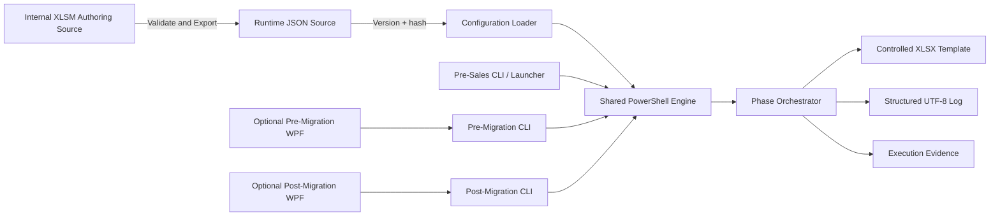

# eMAS Solution Architecture

**Version:** 3.1  
**Status:** Approved  
**Decision baseline:** Approved decision log

## 1. Architecture principles

- read-only source processing;
- controlled XLSM authoring;
- one reviewed runtime JSON;
- shared modular PowerShell engine;
- phase-specific orchestration and templates;
- deterministic evidence and traceability;
- optional WPF only for Pre-Migration and Post-Migration;
- no central database requirement.

## 2. Logical architecture

## 3. Trust boundaries

### Authoring boundary

Internal XLSM, source-controlled VBA, reviewed master data, rule validation and export history.

### Runtime configuration boundary

Immutable JSON, schema version, mapping version, rulesContentHash and release-manifest SHA-256.

### Execution boundary

PowerShell 5.1 modules, source evidence, phase parameters, project exception input and controlled templates.

### Evidence boundary

Generated report, log, baseline, discrepancy details and review status. Evidence is retained in project storage, not the public source repository.

## 4. Shared engine modules

1. Configuration
2. Discovery
3. Classification
4. Validation
5. Effort
6. Readiness
7. Reconciliation
8. Reporting
9. Logging
10. Utilities

Each is packaged as a `.psm1` module with a `.psd1` manifest. Phase scripts import the modules by relative path.

## 5. Entry scripts

- `eMAS-PreSalesAssessment.ps1`
- `eMAS-PreMigrationAssessment.ps1`
- `eMAS-PostMigrationVerification.ps1`

All accept `-ConfigPath`; no script accepts a mapping-workbook runtime parameter.

## 6. Core data contracts

### EvidenceRecord

EvidenceId, SourceType, SourceReference, ObservedValue, CollectedAtUtc, Component.

### EvaluationResult

RuleId, Phase, EvaluationStatus, RAG, Severity, IsBlocker, DecisionImpact, EvidenceIds, ManualReviewRequired.

### FindingRecord

FindingId, FindingCode, original result values, recommendation links and source evidence.

### ExceptionAdjustment

AppliedExceptionId, ExceptionEffect, adjusted decision impact and immutable original values.

### BaselineRecord

DossierKey, SequenceKey, expected counts, source path, classification dimensions, inclusion/exclusion status and baseline execution metadata.

## 7. Error handling

Stop execution for invalid controlled configuration, unsupported schema major, missing mandatory sections, broken references, unknown executable operators or checksum mismatch.

Continue with explicit findings or limitations for unavailable optional evidence, inaccessible non-mandatory paths and unreadable individual items.

## 8. Reporting technology decision

The approved target is template-based OpenXML part editing through .NET APIs available to Windows PowerShell 5.1. A technical spike must prove that named-table population produces valid workbooks without Excel or external modules. Shipping a Microsoft OpenXML SDK assembly requires a documented exception only if the spike fails.

## 9. Security

- no source modification;
- no credentials or customer content excerpts in logs;
- paths and technical metadata are recorded only where required;
- customer/project evidence is never committed to the public repository;
- controlled VBA is signed;
- release artifacts have checksum manifests.
