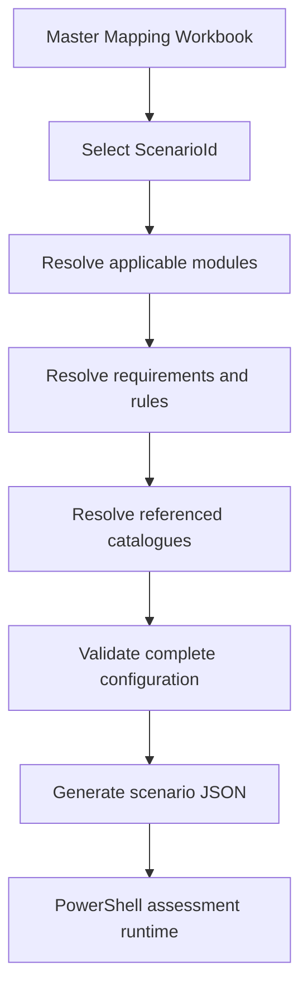

# eMAS Mapping Workbook and Scenario JSON MVP Requirements

**Project:** eMAS - eCTD Migration Assessment Script
**Document type:** Detailed Mapping Workbook and Runtime JSON requirements
**Version:** 4.0 MVP
**Status:** Draft MVP requirements baseline for review
**Scope:** One human-readable master workbook and deterministic scenario-specific Runtime JSON
**Classification:** Internal
**Prepared:** 13 September 2026
**Parent requirement:** eMAS Enterprise Requirements v5.0

## 1. Purpose and MVP decision

This document defines the immediate eMAS MVP. The MVP shall prove two working capabilities before SharePoint integration, formal configuration release workflow, or GxP-oriented controls are implemented:

1. one Mapping Workbook contains all configurable requirements needed by the eMAS migration assessment scripts and is understandable, filterable, and maintainable without reading PowerShell code; and
2. the workbook can be transformed deterministically into Runtime JSON for a selected migration scenario.

The workbook is the human-maintained source for migration assessment meaning. The scenario-specific JSON is the machine-readable source consumed by the runtime. PowerShell shall not read the workbook and shall not generate or repair the configuration JSON.

The MVP is successful only when a reviewer can select a scenario, see every applicable requirement and relationship in Excel, generate the corresponding JSON, and trace each JSON object back to its workbook record.

## 2. MVP boundary

### 2.1 Included in the MVP

| Area | MVP requirement |
|---|---|
| Workbook | One macro-free `.xlsx` master workbook with named sheets and filterable Excel Tables |
| Content | Migration scenarios, assessment modules, evidence fields, regulatory profiles, rule catalogues, findings, actions, RAG, confidence, effort, readiness, reconciliation, sources, and JSON mapping |
| Human use | Plain-language descriptions, controlled values, source-verification details, examples, filters, freeze panes, and navigation |
| Scenario selection | One explicit `ScenarioId` selected for each JSON generation |
| JSON generation | Deterministic transformation of active applicable workbook records into one scenario-specific JSON file |
| JSON scope | All applicable Pre-Sales, Pre-Migration, and Post-Migration configuration for the selected scenario |
| Validation | Workbook structure, types, identifiers, references, applicability, rule conditions, and JSON completeness |
| Traceability | Requirement -> module -> rule -> finding/action -> JSON path -> engine capability |
| Runtime boundary | Generic PowerShell operations consume JSON and customer/project evidence offline |

### 2.2 Deferred until after the MVP works

The following are intentionally deferred and shall not block MVP acceptance:

- SharePoint hosting, permissions, co-authoring, and version history;
- Office Script deployment in a Microsoft 365 tenant;
- Power Automate approval or release orchestration;
- formal configuration approval, immutable release packaging, electronic signatures, and GxP validation evidence;
- production checksum manifest, release revocation, and controlled promotion workflow;
- final workbook protection, corporate signing, and retention rules;
- production regulatory content approval for every supported region;
- polished dashboards, optional user interfaces, and customer distribution packaging.

These items may be designed later without changing the fundamental Workbook -> Scenario JSON -> PowerShell boundary.

### 2.3 Explicit exclusions

The Mapping Workbook shall not:

- scan customer files, databases, archives, DMS repositories, or XML;
- contain customer-specific answers, paths, credentials, accepted exceptions, or assessment results;
- execute migration, repair source content, or modify evidence;
- contain PowerShell, VBA, JavaScript, SQL, XPath evaluation code, or other executable expressions in cells;
- claim formal regulatory validation, customer acceptance, or validated-system status;
- define low-level generic operations such as directory enumeration, ZIP extraction, XML parsing, checksum calculation, logging, or OpenXML report writing.

## 3. MVP operating model



One master workbook shall support every scenario. Separate workbooks per scenario are prohibited because they create duplicated rules and inconsistent maintenance.

One JSON generation shall select exactly one `ScenarioId`. The generated file shall contain the rules for all phases applicable to that scenario. Phase scripts may consume only their own section, but shall use the same scenario JSON.

## 4. Design principles

| ID | Priority | Requirement |
|---|---|---|
| MVP-GEN-001 | MUST | The workbook shall describe what eMAS assesses and how evidence is interpreted. |
| MVP-GEN-002 | MUST | PowerShell shall implement only generic technical capabilities and phase orchestration. |
| MVP-GEN-003 | MUST | Every executable workbook record shall have a stable identifier. |
| MVP-GEN-004 | MUST | Human-readable labels and explanations shall accompany technical codes. |
| MVP-GEN-005 | MUST | One row shall represent one atomic record or condition. |
| MVP-GEN-006 | MUST | Multi-value logic shall use relationship rows or condition rows, not comma-separated free text. |
| MVP-GEN-007 | MUST | Region, authority, format, specification version, application/pathway, dossier context, procedure, sequence, and lifecycle shall remain separate dimensions. |
| MVP-GEN-008 | MUST | ASMF/DMF shall not be represented as transport formats. |
| MVP-GEN-009 | MUST | IND, NDA, ANDA, BLA, MAA, and CTA shall not be represented as eCTD formats. |
| MVP-GEN-010 | MUST | Folder labels shall not override stronger structured evidence such as XML, database, or controlled metadata. |
| MVP-GEN-011 | MUST | Missing evidence shall not become Green, Pass, Ready, or Reconciled. |
| MVP-GEN-012 | MUST | Severity/RAG and confidence shall remain independent. |
| MVP-GEN-013 | MUST | Findings and recommended actions shall remain separate reusable objects. |
| MVP-GEN-014 | MUST | Regulatory requirements, reviewed interpretations, and eMAS design decisions shall be distinguishable. |
| MVP-GEN-015 | MUST | Every JSON object shall be traceable to workbook rows and every exported workbook rule shall have a defined JSON path. |

## 5. Migration scenario catalogue

The MVP workbook shall contain at least the following scenario families. Additional variants may be added using the same dimensions rather than inventing unrelated structures.

| ScenarioId | Scenario name | Primary evidence | Principal focus |
|---|---|---|---|
| `SCN-EXT-OP-CLOUD` | Existing eCTDmanager on-premises to cloud | Database, archive, application/environment, optional exports | Source inventory, DB/archive integrity, dependencies, readiness, and target reconciliation |
| `SCN-EXT-OP-OP` | Existing eCTDmanager on-premises to on-premises | Database, archive, application/environment | Compatibility, source integrity, repository scope, and infrastructure risks |
| `SCN-DB-ARCHIVE` | Database and archive migration | Database records and physical archive | DB record to archive-object correlation, missing/multiple/inaccessible objects, counts, and size |
| `SCN-NEW-EXPORT` | New or third-party customer regulatory export | Export folders, ZIPs, XML, files, optional metadata | Repository discovery, region/format/dossier classification, sequence, XML, references, and files |
| `SCN-THIRD-SYSTEM` | Third-party source-system migration | Vendor export, metadata, files, optional DB extract | Source model, identity, metadata mapping, relationships, and regulatory context |
| `SCN-DMS-CONTENT` | DMS or content migration | DMS metadata, documents, renditions, relationships | Document identity, metadata mapping, rendition availability, and relationship preservation |
| `SCN-EXT-ESUB` | eCTDmanager and eSUBmanager related migration | DB/archive plus exported submissions and storage information | Managed dossier/submission identity, storages, export dependencies, and reconciliation |
| `SCN-PARTIAL` | Partial-evidence assessment | Only DB, only archive, only export, backup, or incomplete repository | Coverage, limitations, confidence, follow-up questions, and safe Not Assessed results |
| `SCN-MIXED` | Mixed or unknown repository | Multiple products, regions, formats, applications, or containers | Topology discovery, separation into migration units, classification, and manual review |
| `SCN-EXT-UPGRADE` | Migration and eCTDmanager Sequential Upgrade | Current eCTDmanager environment, DB/archive, version and upgrade path | Migration assessment plus explicit sequential-upgrade prerequisites and risks |

Scenario identity shall be derived from controlled dimensions, including customer relationship, source system, source hosting, target hosting, migration method, available evidence, DMS dependency, eSUBmanager dependency, and upgrade requirement. `SCN-PARTIAL` and `SCN-MIXED` are safe fallback scenarios, not substitutes for guessing missing values.

## 6. Assessment module catalogue

| ModuleId | Module | Main responsibility |
|---|---|---|
| `MOD-SCENARIO` | Migration Scenario | Derive or confirm scenario and evidence availability |
| `MOD-SOURCE` | Source System | Assess source product, version, environment, and dependencies |
| `MOD-DB` | Database | Inventory database records and supported relationships |
| `MOD-ARCHIVE` | Archive | Locate, count, size, and assess physical objects |
| `MOD-DMS` | DMS | Assess external metadata, documents, renditions, and relationships |
| `MOD-REPOSITORY` | Repository Discovery | Discover folders, ZIPs, nested ZIPs, wrappers, and candidate dossier roots |
| `MOD-CLASSIFY` | Regulatory Classification | Determine region, authority, format, version, application, and dossier context |
| `MOD-SEQUENCE` | Sequence and Lifecycle | Inventory sequence/submission units, gaps, duplicates, and lifecycle |
| `MOD-REFERENCE` | XML and Reference Integrity | Assess backbone XML, regional XML, referenced files, and orphan candidates |
| `MOD-FILE` | File and Technical Integrity | Assess readability, zero-byte, extension, PDF, path, and checksum observations |
| `MOD-VOLUME` | Volume and Complexity | Calculate counts, sizes, diversity, and complexity metrics |
| `MOD-MAPPING` | Migration Mapping | Assess source-to-target fields, identifiers, transformations, and comparison keys |
| `MOD-INTERPRET` | RAG Confidence and Effort | Convert observations into severity, confidence, effort, and actions |
| `MOD-READINESS` | Pre-Migration Readiness | Determine Ready, Ready with Accepted Exceptions, or Blocked |
| `MOD-RECONCILE` | Post-Migration Reconciliation | Compare the approved baseline with target/import evidence |

Each scenario shall explicitly map every module to `Required`, `Conditional`, `Optional`, or `NotApplicable`. Absence of a mapping is an error.

## 7. Required workbook structure

The MVP workbook shall contain the following sheets in this order. Sheet names are stable contract values.

| Order | Sheet | Maintained or generated | Purpose |
|---:|---|---|---|
| 0 | `00_Home` | Maintained | Purpose, navigation, glossary, selected scenario, and generation instructions |
| 1 | `01_Migration_Scenarios` | Maintained | Supported scenario catalogue and scenario dimensions |
| 2 | `02_Scenario_Questionnaire` | Maintained | Non-technical questions used to identify a scenario and missing information |
| 3 | `03_Assessment_Modules` | Maintained | Reusable assessment capabilities |
| 4 | `04_Scenario_Module_Map` | Maintained | Required/conditional/optional modules for every scenario |
| 5 | `05_Requirement_Catalogue` | Maintained | Complete human-readable inventory of migration-script requirements |
| 6 | `06_Fields_Evidence` | Maintained | Evidence keys, data types, producers, operators, and scope |
| 7 | `07_Regulatory_Profiles` | Maintained | Region/authority/format/version/dossier dimensions and evidence locations |
| 8 | `08_Dossier_Sequence_ID` | Maintained | Dossier, application, sequence, and lifecycle identification rules |
| 9 | `09_Folder_File_Structure` | Maintained | Expected folder/file/container structure rules |
| 10 | `10_Missing_Refs_Integrity` | Maintained | XML references, orphan candidates, checksums, and physical-file integrity |
| 11 | `11_Technical_Observations` | Maintained | PDF, XML, path, schema, extension, encryption, and other technical observations |
| 12 | `12_Size_Volume_Metrics` | Maintained | Counts, sizes, diversity, units, and calculation definitions |
| 13 | `13_Source_DB_Archive_DMS` | Maintained | Source-system, database, archive, DMS, and identifier mapping rules |
| 14 | `14_RAG_Severity` | Maintained | Finding severity, RAG, blocker, and aggregation rules |
| 15 | `15_Confidence` | Maintained | Evidence strength, coverage, conflicts, and confidence rules |
| 16 | `16_Effort_Drivers` | Maintained | Complexity drivers, bands, weights, floors, and double-counting groups |
| 17 | `17_Findings` | Maintained | Reusable finding definitions |
| 18 | `18_Recommendations_Actions` | Maintained | Reusable customer and consultant actions linked to findings |
| 19 | `19_PreMigration_Readiness` | Maintained | Readiness decision rules and baseline requirements |
| 20 | `20_PostMigration_Reconciliation` | Maintained | Scenario-aware comparison rules, keys, tolerances, and outcomes |
| 21 | `21_Value_Lists` | Maintained | Controlled dropdown and runtime code values |
| 22 | `22_Source_References` | Maintained | Regulatory, vendor, product, and internal sources |
| 23 | `23_Final_Config_Master` | Generated | Filterable flattened view of everything included/excluded for a selected scenario |
| 24 | `24_JSON_Field_Map` | Maintained | Explicit workbook-column to JSON-property transformation contract |
| 25 | `25_JSON_Preview` | Generated | Scenario JSON preview and section counts |
| 26 | `26_Validation_Results` | Generated | Blocking errors, warnings, affected record, reason, and correction |

## 8. Common workbook conventions

### 8.1 Identifier and relationship rules

The workbook shall use these stable identifiers where relevant:

- `ScenarioId`;
- `QuestionId`;
- `ModuleId`;
- `RequirementId`;
- `FieldCode`;
- `ProfileId`;
- `RuleId`;
- `ConditionId`;
- `MetricCode`;
- `FindingCode`;
- `RecommendationCode`;
- `SourceId`;
- `MappingId`.

Identifiers shall be unique, shall not depend on row number, and shall not be reused for a different meaning. Display labels may change without changing identifiers.

### 8.2 Common rule columns

Every executable rule sheet shall use the applicable subset of the following columns.

| Column | Type | Why it is needed |
|---|---|---|
| `RuleId` | Identifier | Stable traceability from workbook through JSON, engine evaluation, log, and report |
| `RequirementId` | Reference | Shows which migration-script requirement the rule implements |
| `ModuleId` | Reference | Connects the rule to scenario applicability through `04_Scenario_Module_Map` |
| `IsActive` | Boolean | Retains draft/history rows while excluding inactive content from MVP JSON |
| `Priority` | Integer | Gives deterministic rule evaluation order |
| `Phase` | Code | Limits behavior to Pre-Sales, Pre-Migration, Post-Migration, or All |
| `ScenarioId` | Code | Supports a scenario-specific override; `ALL` means module-driven applicability |
| `Region` | Code | Filters regional logic without mixing it with authority or format |
| `Authority` | Code | Identifies the responsible authority separately from region |
| `TechnicalFormat` | Code | eCTD v3, eCTD v4, NeeS, VNeeS, non-eCTD, or Unknown |
| `SpecificationVersion` | Text | Selects the version-appropriate rule/parser behavior |
| `ApplicationType` | Code | IND, NDA, ANDA, BLA, MAA, CTA, and other pathways |
| `DossierContext` | Code | ASMF, DMF, investigational, marketing, device, and other regulatory context |
| `ScopeLevel` | Code | Repository, application, dossier, sequence, module, document, or file |
| `ConditionGroup` | Text | Conditions in the same group are ANDed |
| `ConditionSequence` | Integer | Preserves deterministic condition order |
| `FieldCode` | Reference | Identifies the observed or derived evidence evaluated by the condition |
| `Operator` | Code | Defines the supported comparison without executable code |
| `Value1` | Typed scalar | First expected operand |
| `Value2` | Typed scalar | Second operand for range operators |
| `FindingCode` | Reference | Produces a reusable finding without duplicating text |
| `RecommendationCode` | Reference | Links a standard action to the result |
| `RagImpact` | Code | Records risk interpretation separately from evidence and confidence |
| `Severity` | Code | Records seriousness independently from display colour |
| `ConfidenceImpact` | Code | Records how this evidence changes confidence |
| `EffortImpact` | Code/number | Connects the observation to complexity without unsupported hours |
| `EngineCapability` | Code | Names the generic PowerShell capability required to evaluate the rule |
| `SourceId` | Reference | Provides source traceability |
| `SourceSection` | Text | Identifies the precise source location, XML section, table, or internal decision |
| `RequirementBasis` | Code | Distinguishes AuthorityRequirement, ReviewedInterpretation, ProductRequirement, and eMASDesign |
| `BusinessExplanation` | Text | Explains the rule to non-developers |

### 8.3 Condition model

- One row represents one atomic condition.
- Conditions with the same `RuleId` and `ConditionGroup` use AND.
- Different condition groups for the same `RuleId` use OR.
- An unconditional rule uses `ConditionMode=Always` and no condition row.
- Missing, inaccessible, or invalid evidence produces an undetermined evaluation unless a specific missing-evidence policy applies.
- `NotEquals` and `NotExists` shall not become true merely because the evidence could not be read.
- Adding an `Operator` or `EngineCapability` value to `21_Value_Lists` does not implement it in PowerShell.

## 9. Sheet-by-sheet requirements

### 9.1 `00_Home`

This sheet makes the workbook usable without reading this specification.

| Field or area | Required | Why |
|---|---:|---|
| Workbook purpose and boundary | Yes | Prevents the mapping workbook from being mistaken for the assessment engine |
| MVP status | Yes | States what works and what is deferred |
| `SelectedScenarioId` | Yes | Drives `23_Final_Config_Master` and JSON generation |
| Scenario name/description | Calculated | Lets the reviewer confirm the selected code |
| Navigation links | Yes | Provides direct access to every sheet |
| Validation summary | Calculated | Shows errors, warnings, and export eligibility |
| JSON section counts | Calculated | Lets the reviewer compare workbook inclusion with preview |
| Generation instructions | Yes | Explains the exact MVP workflow |
| Glossary | Yes | Explains scenario, module, evidence, finding, RAG, confidence, and JSON |

`00_Home` is authoring-only and is not exported.

### 9.2 `01_Migration_Scenarios`

One row defines one selectable scenario.

| Column | Type | Required | Why / JSON mapping |
|---|---|---:|---|
| `ScenarioId` | Identifier | Yes | Primary key -> `scenario.id` |
| `ScenarioName` | Text | Yes | Human label -> `scenario.name` |
| `ScenarioFamily` | Code | Yes | Groups variants -> `scenario.family` |
| `Description` | Text | Yes | Explains when to use the scenario |
| `ExistingCustomer` | Code | Yes | Yes/No/Unknown scenario dimension |
| `SourceSystem` | Code | Yes | eCTDmanager, third-party, DMS, export-only, or Unknown |
| `SourceHosting` | Code | Yes | OnPremises, Cloud, Hybrid, Unknown |
| `TargetHosting` | Code | Yes | OnPremises, Cloud, Hybrid, ToBeDefined |
| `MigrationMethod` | Code | Yes | DBArchive, ExportImport, DirectCopy, DMS, Hybrid, Unknown |
| `DatabaseExpected` | Code | Yes | Required/Optional/Unavailable/NotApplicable |
| `ArchiveExpected` | Code | Yes | Required/Optional/Unavailable/NotApplicable |
| `ExportExpected` | Code | Yes | Required/Optional/Unavailable/NotApplicable |
| `DmsExpected` | Code | Yes | Required/Optional/Unavailable/NotApplicable |
| `ESubmanagerDependency` | Code | Yes | Required/Optional/NotApplicable/Unknown |
| `SequentialUpgrade` | Boolean | Yes | Enables upgrade-related module/rules |
| `FallbackScenario` | Boolean | Yes | Identifies Partial or Mixed safe fallbacks |
| `IsActive` | Boolean | Yes | Controls selectable/exportable scenarios |
| `SourceId` | Reference | Yes | Basis for scenario definition |

### 9.3 `02_Scenario_Questionnaire`

This sheet contains reusable question definitions. Actual customer answers belong to an execution input/report and shall not be exported as reusable configuration values.

| Column | Type | Required | Why / JSON mapping |
|---|---|---:|---|
| `QuestionId` | Identifier | Yes | Stable question key -> `questionnaire[].questionId` |
| `QuestionText` | Text | Yes | Plain-language question |
| `BusinessMeaning` | Text | Yes | Explains why the answer matters |
| `AnswerType` | Code | Yes | Boolean, CodeList, Number, Text, or Size |
| `AnswerListCode` | Reference | Conditional | Dropdown source for CodeList answers |
| `AnswerOwner` | Code | Yes | Customer, EXTEDO, or Derived; customer input focuses on current source information |
| `Phase` | Code | Yes | Limits the question to the relevant phase |
| `TriggerQuestionId` | Reference | No | Supports dependent questions without free-form expressions |
| `TriggerOperator` | Code | No | Controlled dependency operator |
| `TriggerValue` | Scalar | No | Required answer that reveals this question |
| `MapsToScenarioField` | Text | No | Scenario field populated or evaluated by the answer |
| `MissingAnswerImpact` | Code | Yes | FollowUp, ConfidenceDown, NotAssessed, or Blocker |
| `ScenarioDerivationPriority` | Integer | Yes | Deterministic derivation order |
| `Guidance` | Text | Yes | Where a non-technical user finds the answer |
| `VerificationEvidence` | Text | Yes | What source should be recorded in the project report |
| `IsActive` | Boolean | Yes | Export eligibility |
| `SourceId` | Reference | Yes | Requirement basis |

Pre-Sales questionnaire behavior shall request only scenario-relevant current-system information. Target-system technical details may remain blank for EXTEDO to complete. For archive, index, database, and direct-copy evidence, the default lightweight request is availability and total size; detailed file/folder/content inventory is requested only for export-based discovery or a later detailed phase.

### 9.4 `03_Assessment_Modules`

| Column | Type | Required | Why / JSON mapping |
|---|---|---:|---|
| `ModuleId` | Identifier | Yes | Primary key -> `modules[].moduleId` |
| `ModuleName` | Text | Yes | Human-readable module name |
| `Purpose` | Text | Yes | Explains what the module assesses |
| `PrimaryEngineComponent` | Code | Yes | Names the generic runtime component |
| `SupportedPhases` | Relationship | Yes | Represented by one row per phase or a controlled child table |
| `ProducesBaselineData` | Boolean | Yes | Identifies Pre-Migration baseline contribution |
| `UsedForReconciliation` | Boolean | Yes | Identifies Post-Migration comparison contribution |
| `IsActive` | Boolean | Yes | Module availability |

### 9.5 `04_Scenario_Module_Map`

This is the central scenario switchboard.

| Column | Type | Required | Why / JSON mapping |
|---|---|---:|---|
| `ScenarioModuleId` | Identifier | Yes | Stable relationship key |
| `ScenarioId` | Reference | Yes | Selected scenario |
| `ModuleId` | Reference | Yes | Applicable capability |
| `Applicability` | Code | Yes | Required, Conditional, Optional, NotApplicable |
| `Phase` | Code | Yes | Explicit phase behavior |
| `RequiredEvidenceKey` | Reference | Conditional | Evidence required to execute the module |
| `ActivationFieldCode` | Reference | Conditional | Evidence used for a conditional module |
| `ActivationOperator` | Code | Conditional | Controlled activation comparison |
| `ActivationValue` | Scalar | Conditional | Expected activation value |
| `MissingEvidenceOutcome` | Code | Yes | NotAssessed, InsufficientEvidence, FollowUp, or Blocked |
| `Reason` | Text | Yes | Explains applicability to reviewers |
| `IsActive` | Boolean | Yes | Relationship eligibility |

Every active scenario shall have a row for every active module. This makes omissions visible and prevents accidental execution by default.

### 9.6 `05_Requirement_Catalogue`

This sheet is the complete, plain-language inventory of what the migration scripts must support.

| Column | Type | Required | Why / JSON mapping |
|---|---|---:|---|
| `RequirementId` | Identifier | Yes | Primary traceability key -> `requirements[].requirementId` |
| `RequirementTitle` | Text | Yes | Short filterable name |
| `RequirementText` | Text | Yes | Testable statement of required behavior |
| `RequirementArea` | Code | Yes | Scenario, source, DB, archive, DMS, repository, regulatory, sequence, reference, file, volume, interpretation, readiness, reconciliation, report |
| `RequirementType` | Code | Yes | Functional, Data, Validation, Interface, or Constraint |
| `Priority` | Code | Yes | Must, Should, May |
| `ModuleId` | Reference | Yes | Owner module |
| `Phase` | Code | Yes | Phase applicability |
| `ScenarioId` | Code | Yes | `ALL` or exact scenario override |
| `EngineOrConfiguration` | Code | Yes | WorkbookRule, EngineCapability, Hybrid, or ReportOnly |
| `AcceptanceCriterion` | Text | Yes | Observable proof that the requirement is met |
| `RuleSheet` | Text | Conditional | Workbook sheet that implements configurable behavior |
| `RuleId` | Reference | Conditional | Direct implementing rule when one-to-one |
| `JSONPath` | Text | Conditional | Expected runtime location |
| `SourceId` | Reference | Yes | Source/decision basis |
| `SourceSection` | Text | Yes | Precise source location |
| `RequirementBasis` | Code | Yes | AuthorityRequirement, ReviewedInterpretation, ProductRequirement, eMASDesign |
| `Status` | Code | Yes | Draft, Reviewed, Implemented, Verified, Deferred |
| `Notes` | Text | No | Limits or explanation |

At minimum, this catalogue shall cover every requirement area listed in Sections 5, 6, and 9 of this document. A requirement without an implementing rule, named engine capability, report field, or explicit Deferred status is incomplete.

### 9.7 `06_Fields_Evidence`

| Column | Type | Required | Why / JSON mapping |
|---|---|---:|---|
| `FieldCode` | Identifier | Yes | Stable evidence key -> `fields[].fieldCode` |
| `DisplayName` | Text | Yes | Human-readable name |
| `Description` | Text | Yes | Exact semantic meaning |
| `DataType` | Code | Yes | String, Integer, Decimal, Boolean, Date, Code, Path, Hash, or Object |
| `EvidenceSourceType` | Code | Yes | Folder, File, XML, DB, Archive, DMS, Manifest, Customer, Derived, Target |
| `ProducerCapability` | Code | Yes | Generic engine function that produces it |
| `ScopeLevel` | Code | Yes | Repository, dossier, sequence, document, or other entity level |
| `AllowedOperator` | Relationship | Yes | One row per valid operator or controlled child table |
| `MissingValueMeaning` | Code | Yes | Absent, Unavailable, Invalid, NotApplicable, or Unknown |
| `Unit` | Code | Conditional | Bytes, Count, Percent, Days, or other unit |
| `ExampleValue` | Scalar | No | Demonstrates expected type only |
| `IsActive` | Boolean | Yes | Runtime inclusion |

### 9.8 `07_Regulatory_Profiles`

This sheet defines independent classification dimensions and where strong evidence can be found.

| Column | Type | Required | Why / JSON mapping |
|---|---|---:|---|
| `ProfileId` | Identifier | Yes | Primary key -> `regulatoryProfiles[].profileId` |
| `Region` | Code | Yes | Jurisdiction dimension |
| `Authority` | Code | Yes | Authority dimension |
| `TechnicalFormat` | Code | Yes | eCTD v3, eCTD v4, NeeS, VNeeS, non-eCTD, Unknown |
| `SpecificationVersion` | Text | Yes | Version-specific parsing contract |
| `RegionalImplementation` | Code | Yes | EU, US, CA, UK, CH, AU, JP, SG, or future profile |
| `ApplicationType` | Code | No | IND/NDA/ANDA/BLA/MAA/CTA when applicable |
| `DossierContext` | Code | No | ASMF/DMF and other dossier contexts |
| `ProcedureContext` | Code | No | Centralised, national, mutual recognition, decentralised, or other |
| `BackboneFile` | Text | No | Example `index.xml` |
| `RegionalXmlFile` | Text | No | Example `eu-regional.xml` or `us-regional.xml` |
| `XmlNamespace` | Text | No | Exact namespace/version evidence |
| `XmlElementOrPath` | Text | No | XML element/XPath-like location to inspect |
| `XmlAttribute` | Text | No | Attribute containing the classification evidence |
| `FolderEvidence` | Text | No | Supporting path/folder evidence |
| `EvidenceStrength` | Code | Yes | Strong, Medium, Weak |
| `ParserProfile` | Code | Yes | Version-appropriate parser contract |
| `SourceId` | Reference | Yes | Regulatory source |
| `SourceSection` | Text | Yes | Exact source section |
| `IsActive` | Boolean | Yes | Runtime inclusion |

### 9.9 `08_Dossier_Sequence_ID`

This sheet contains rules that identify applications/dossiers, sequences/submission units, and lifecycle context.

In addition to the common rule columns, include:

| Column | Type | Required | Why / JSON mapping |
|---|---|---:|---|
| `DetectionTarget` | Code | Yes | Region, Authority, Format, Version, ApplicationType, DossierContext, DossierId, SequenceId, Lifecycle |
| `EvidenceFile` | Text | Conditional | Backbone or regional XML filename |
| `XmlNamespace` | Text | Conditional | Selects version-appropriate XML semantics |
| `XmlElementOrPath` | Text | Conditional | Exact element/section to inspect |
| `XmlAttribute` | Text | Conditional | Exact attribute to read |
| `ExpectedPattern` | Text | Conditional | Controlled filename/folder/value pattern |
| `CandidateValue` | Code | Yes | Classification result proposed by the rule |
| `EvidenceStrength` | Code | Yes | Strong, Medium, Weak |
| `ConflictGroup` | Text | Yes | Identifies mutually competing results |
| `ConflictStrategy` | Code | Yes | HighestEvidenceScore or ManualReview by default |

The rules shall support `index.xml` plus regional XML, eCTD v3/v4 differences, EU and US regional evidence, other supported regions, ASMF/DMF context, IND/NDA/ANDA/BLA/MAA/CTA pathways, numeric sequence patterns, sequence gaps, duplicate/nested sequence folders, XML-folder sequence mismatch, application conflicts, and ambiguous/manual-review outcomes. A gap such as `0000`, `0001`, `0003` shall be an observation, not automatically a regulatory defect.

### 9.10 `09_Folder_File_Structure`

| Column | Type | Required | Why / JSON mapping |
|---|---|---:|---|
| Common rule columns | Mixed | Yes | Scope, traceability, conditions, outputs, and source |
| `TargetType` | Code | Yes | Container, DossierRoot, SequenceFolder, ModuleFolder, RegionalFolder, File |
| `RelativePathPattern` | Text | Yes | Expected location relative to the assessed root |
| `NamePattern` | Text | No | Exact name or approved pattern |
| `RequirementLevel` | Code | Yes | Mandatory, Optional, Conditional, Prohibited, NotApplicable |
| `MinimumOccurrences` | Integer | No | Lower allowed count |
| `MaximumOccurrences` | Integer | No | Upper allowed count |
| `AllowEmpty` | Boolean | Conditional | Controls empty-folder/file behavior |
| `ContainerDepthLimit` | Integer | Conditional | Bounds nested container discovery |
| `UnexpectedItemPolicy` | Code | Yes | Ignore, Observe, Warn, Error, ManualReview |

The sheet shall cover ZIP and nested ZIP discovery, wrapper folders, folder-within-folder packaging, duplicate/nested sequences, non-consecutive sequences, multiple applications/products, add-promotional-material or similarly unexpected product branches, backup/temp/system files, unknown folders, eCTD sequence roots, module folders, regional Module 1 folders, backbone XML, regional XML, checksum/index files, leaf files, empty folders, and unrecognizable hierarchies.

### 9.11 `10_Missing_Refs_Integrity`

| Column | Type | Required | Why / JSON mapping |
|---|---|---:|---|
| Common rule columns | Mixed | Yes | Standard rule identity and interpretation |
| `CheckType` | Code | Yes | XmlReference, OrphanCandidate, Checksum, PhysicalPresence, DuplicateReference, ExternalReference |
| `SourceXmlFile` | Text | Conditional | XML document containing the reference |
| `XmlElementOrPath` | Text | Conditional | Element containing the link/checksum |
| `ReferenceAttribute` | Text | Conditional | Attribute such as href or checksum value |
| `ResolutionBase` | Code | Conditional | SequenceRoot, XmlDirectory, DossierRoot, ArchiveRoot |
| `NormalizationPolicy` | Code | Conditional | Path separator, URI decoding, case, extension, identifier normalization |
| `ChecksumAlgorithm` | Code | Conditional | MD5, SHA1, SHA256, or source-declared algorithm |
| `ExpectedState` | Code | Yes | Present, Absent, Match, Unique, Internal, Readable |
| `FailureState` | Code | Yes | Missing, Mismatch, Multiple, Invalid, Inaccessible, External |

Missing referenced files and orphan candidates shall be reported separately. The rules shall also cover absolute/external references, broken lifecycle targets, duplicate references, zero-byte/unreadable referenced files, checksum mismatches, inaccessible targets, and provenance containing source file, element/path, attribute, and observed value.

### 9.12 `11_Technical_Observations`

| Column | Type | Required | Why / JSON mapping |
|---|---|---:|---|
| Common rule columns | Mixed | Yes | Standard rule linkage |
| `ObservationType` | Code | Yes | PDFVersion, Encryption, Signature, XmlWellFormed, Namespace, Schema, ExtensionMismatch, PathLength, IllegalName, DuplicateContent, Symlink, Unreadable |
| `TargetExtension` | Text | No | Limits a check to PDF/XML/etc. |
| `ExpectedValue` | Scalar | No | Expected technical characteristic |
| `MinimumValue` | Scalar | No | Lower permitted threshold |
| `MaximumValue` | Scalar | No | Upper permitted threshold |
| `ComparisonUnit` | Code | No | Version, Characters, Bytes, Count |
| `TechnicalImpact` | Text | Yes | Explains migration relevance without claiming authority validation |

The sheet shall support malformed XML, unexpected namespaces/schema versions, invalid constructs, PDF version, encrypted/password-protected files, unreadable files, extension/content mismatch, zero-byte files, excessive path length, illegal names, duplicate content candidates, and platform-specific path risks.

### 9.13 `12_Size_Volume_Metrics`

| Column | Type | Required | Why / JSON mapping |
|---|---|---:|---|
| `MetricCode` | Identifier | Yes | Primary key -> `metrics[].metricCode` |
| `MetricName` | Text | Yes | Human-readable measure |
| `ModuleId` | Reference | Yes | Owning assessment module |
| `ScopeLevel` | Code | Yes | Repository, DB, archive, DMS, dossier, sequence, file |
| `EvidenceSourceType` | Code | Yes | Where it is measured |
| `Aggregation` | Code | Yes | Count, Sum, DistinctCount, Min, Max, Average, Percent |
| `SourceFieldCode` | Reference | Yes | Raw evidence used for calculation |
| `Unit` | Code | Yes | Bytes, GB, Count, Percent |
| `Phase` | Code | Yes | Phase applicability |
| `ScenarioId` | Code | Yes | `ALL` or scenario override |
| `StoreDetail` | Boolean | Yes | Controls whether only aggregate or item-level evidence is retained |
| `EffortDriverId` | Reference | No | Connects volume to complexity |
| `IsActive` | Boolean | Yes | Runtime inclusion |

Required metrics include DB size/count, archive size/object count, export/storage size, dossier/application count, sequence/submission-unit count, document/file/folder count, ZIP/nested-ZIP count, total bytes, missing/multiple/inaccessible count, region/format/version diversity, unknown classifications, malformed XML, broken references, and reconciliation differences.

### 9.14 `13_Source_DB_Archive_DMS`

This sheet holds source-specific mapping configuration without storing executable proprietary SQL.

| Column | Type | Required | Why / JSON mapping |
|---|---|---:|---|
| `MappingRuleId` | Identifier | Yes | Stable mapping identity -> `sourceMappings[]` |
| `RequirementId` | Reference | Yes | Requirement traceability |
| `ModuleId` | Reference | Yes | Source, DB, Archive, DMS, or Mapping module |
| `ScenarioId` | Code | Yes | Applicable scenario |
| `SourceSystem` | Code | Yes | Product/vendor/source family |
| `SourceVersionFrom` | Text | No | Minimum supported version |
| `SourceVersionTo` | Text | No | Maximum supported version |
| `SourceEntity` | Text | Yes | Application, dossier, sequence, document, rendition, archive object |
| `SourceIdentifierField` | Text | Yes | Logical identifier, not executable query text |
| `IdentifierFormat` | Code | Yes | GUID, SHA-derived name, path, database key, vendor key |
| `NormalizationPolicy` | Code | Yes | Named conversion policy applied before lookup |
| `TargetEntity` | Text | Yes | ArchiveObject, MigratedDocument, TargetDossier, etc. |
| `TargetLookupField` | Text | Yes | Logical target key |
| `ComparisonKey` | Code | Yes | Stable reconciliation key |
| `LookupStatusMap` | Code | Yes | Found/Missing/Multiple/Invalid/Inaccessible mapping |
| `FalseMissingSafeguard` | Code | Yes | Named safeguard profile |
| `AdapterKey` | Code | Yes | Engine adapter implementing the technical read |
| `Phase` | Code | Yes | Phase applicability |
| `SourceId` | Reference | Yes | Product/vendor/internal specification |
| `BusinessExplanation` | Text | Yes | Explains the mapping to reviewers |
| `IsActive` | Boolean | Yes | Runtime inclusion |

False-missing safeguards shall verify identifier mapping, conversion, root selection, recursion, extension assumptions, case behavior, duplicate candidates, and access before declaring an object missing. Business/display filename shall not automatically be treated as archive identity. Archive verification shall remain distinct from regulatory dossier validation.

For DMS sources, the same structure shall support document ID, version/rendition ID, metadata fields, relationships, ownership/source reference, export completeness, and unsupported semantics returning Unknown or Not Assessed.

### 9.15 `14_RAG_Severity`

| Column | Type | Required | Why / JSON mapping |
|---|---|---:|---|
| `RagRuleId` | Identifier | Yes | Stable rule -> `interpretation.ragRules[]` |
| `FindingCode` | Reference | Yes | Finding being interpreted |
| `Phase` | Code | Yes | Allows phase-specific risk treatment |
| `ScenarioId` | Code | Yes | `ALL` or override |
| `EvidenceState` | Code | Yes | Present, ConfirmedAbsent, Unavailable, Invalid, Conflict |
| `EvaluationStatus` | Code | Yes | Assessed, NotAssessed, NotApplicable, Unknown, Error |
| `Severity` | Code | Yes | Info, Low, Medium, High, Critical |
| `RAG` | Code | Yes | Green, Amber, Red, Unknown |
| `IsBlocker` | Boolean | Yes | Readiness decision effect |
| `AggregationStrategy` | Code | Yes | MostSevere, Aggregate, FirstMatch, ManualReview |
| `Rationale` | Text | Yes | Explains the interpretation |
| `SourceId` | Reference | Yes | Basis for the rule |

`NotAssessed` and `NotApplicable` are statuses, not colours. Missing, inaccessible, invalid, or conflicting mandatory evidence shall not resolve to Green.

### 9.16 `15_Confidence`

| Column | Type | Required | Why / JSON mapping |
|---|---|---:|---|
| `ConfidenceRuleId` | Identifier | Yes | Stable rule -> `interpretation.confidenceRules[]` |
| `ModuleId` | Reference | Yes | Assessment area |
| `ScenarioId` | Code | Yes | Scenario scope |
| `EvidenceStrength` | Code | Yes | Strong, Medium, Weak, None |
| `RequiredEvidenceCoverage` | Decimal | No | Coverage threshold where meaningful |
| `ConflictCountFrom` | Integer | No | Lower boundary |
| `ConflictCountTo` | Integer | No | Upper boundary |
| `UnavailableEvidenceImpact` | Code | Yes | DownOneLevel, Low, Unknown, NoChange |
| `ResultConfidence` | Code | Yes | High, Medium, Low, Unknown |
| `ReasonTemplate` | Text | Yes | Human-readable explanation |
| `Priority` | Integer | Yes | Deterministic selection |
| `SourceId` | Reference | Yes | Basis |

Classification confidence, assessment coverage, and effort-estimate confidence shall remain separately reportable even if they share the same controlled levels.

### 9.17 `16_Effort_Drivers`

| Column | Type | Required | Why / JSON mapping |
|---|---|---:|---|
| `EffortDriverId` | Identifier | Yes | Stable driver -> `interpretation.effortDrivers[]` |
| `DriverName` | Text | Yes | Human-readable driver |
| `ScenarioId` | Code | Yes | Scenario scope |
| `ModuleId` | Reference | Yes | Owning assessment area |
| `MetricCode` | Reference | Yes | Measured value |
| `Operator` | Code | Yes | Threshold comparison |
| `LowerBound` | Decimal | No | Inclusive lower boundary |
| `UpperBound` | Decimal | No | Exclusive upper boundary by default |
| `Unit` | Code | Yes | Same unit as the metric |
| `ScoreImpact` | Decimal | Yes | Internal weighted contribution |
| `MinimumBand` | Code | No | Mandatory complexity floor |
| `DoubleCountGroup` | Text | No | Prevents duplicate scoring of one cause |
| `CustomerExplanation` | Text | Yes | Explains the driver without exposing arbitrary maths |
| `RecommendationCode` | Reference | No | Suggested planning action |
| `IsActive` | Boolean | Yes | Runtime inclusion |

Effort shall report validated complexity bands and drivers unless an approved hours model exists. Thresholds shall reject overlaps, gaps where complete coverage is intended, inverted ranges, and unit mismatches.

### 9.18 `17_Findings`

| Column | Type | Required | Why / JSON mapping |
|---|---|---:|---|
| `FindingCode` | Identifier | Yes | Stable result code -> `findings[]` |
| `FindingTitle` | Text | Yes | Short report label |
| `Category` | Code | Yes | Filterable domain |
| `Description` | Text | Yes | Meaning of the finding |
| `DefaultSeverity` | Code | Yes | Default seriousness |
| `DefaultRAG` | Code | Yes | Default colour when assessed |
| `ExceptionEligible` | Boolean | Yes | Whether project governance may accept it |
| `ReportAudience` | Code | Yes | Customer, Consultant, Both |
| `IsActive` | Boolean | Yes | Runtime inclusion |
| `SourceId` | Reference | Yes | Basis |

### 9.19 `18_Recommendations_Actions`

| Column | Type | Required | Why / JSON mapping |
|---|---|---:|---|
| `RecommendationCode` | Identifier | Yes | Stable action -> `recommendations[]` |
| `FindingCode` | Reference | Yes | Finding addressed |
| `Phase` | Code | Yes | Phase-specific action |
| `ScenarioId` | Code | Yes | Scenario scope |
| `CustomerText` | Text | Yes | Clear customer-facing action |
| `ConsultantNote` | Text | No | Internal interpretation guidance suitable for runtime packaging |
| `NextAction` | Text | Yes | Concrete next step |
| `ResponsibilityCategory` | Code | Yes | Customer, EXTEDO, Joint, RegulatorySME, MigrationTeam |
| `Sequence` | Integer | Yes | Ordered output |
| `IsActive` | Boolean | Yes | Runtime inclusion |
| `SourceId` | Reference | Yes | Basis |

Changing recommendation wording shall not change the identity or evidence of a historical finding.

### 9.20 `19_PreMigration_Readiness`

| Column | Type | Required | Why / JSON mapping |
|---|---|---:|---|
| `ReadinessRuleId` | Identifier | Yes | Stable decision rule -> `phaseRules.preMigration[]` |
| `ScenarioId` | Code | Yes | Scenario scope |
| `ModuleId` | Reference | Yes | Assessment area contributing to readiness |
| `ConditionGroup` | Text | Yes | AND/OR grouping |
| `FieldCode` | Reference | Yes | Readiness evidence or derived metric |
| `Operator` | Code | Yes | Controlled comparison |
| `Value1` | Scalar | No | Expected value |
| `Outcome` | Code | Yes | Ready, ReadyWithAcceptedExceptions, Blocked |
| `BlockerOverride` | Boolean | Yes | Forces Blocked when unresolved |
| `RequiredBaselineEntity` | Code | No | Dossier, sequence, document, archive object, DB record, DMS record |
| `RequiredComparisonKey` | Code | No | Key to preserve for Post-Migration |
| `MissingEvidenceOutcome` | Code | Yes | NotAssessed, FollowUp, or Blocked |
| `FindingCode` | Reference | Yes | Decision evidence |
| `RecommendationCode` | Reference | Yes | Remediation action |
| `Priority` | Integer | Yes | Ordered first-match with blocker override |

The baseline shall record the expected migration population, comparison keys, exclusions, accepted exceptions, unavailable evidence, and limitations at the entity levels applicable to the scenario.

### 9.21 `20_PostMigration_Reconciliation`

| Column | Type | Required | Why / JSON mapping |
|---|---|---:|---|
| `ReconciliationRuleId` | Identifier | Yes | Stable comparison rule -> `phaseRules.postMigration[]` |
| `ScenarioId` | Code | Yes | Scenario scope |
| `SourceEntity` | Code | Yes | DB record, archive object, dossier, sequence, metadata, file, relationship, count |
| `TargetEntity` | Code | Yes | Target object being compared |
| `ComparisonKey` | Code | Yes | Identity used for matching |
| `SourceFieldCode` | Reference | Yes | Expected/baseline value |
| `TargetFieldCode` | Reference | Yes | Observed target value |
| `ComparisonType` | Code | Yes | Exists, Equals, SetEquals, CountEquals, HashEquals, RelationshipEquals, Tolerance |
| `ToleranceValue` | Decimal | No | Permitted difference when justified |
| `ToleranceUnit` | Code | No | Count, Percent, Bytes, Days |
| `ApprovedExceptionTreatment` | Code | Yes | Preserve, ExcludeFromDecision, AcceptDifference, NotAllowed |
| `MissingOutcome` | Code | Yes | ReviewRequired or NotReconciled |
| `DifferenceOutcome` | Code | Yes | ReconciledWithAcceptedExceptions, ReviewRequired, NotReconciled |
| `FindingCode` | Reference | Yes | Difference result |
| `RecommendationCode` | Reference | Yes | Investigation/remediation |
| `Priority` | Integer | Yes | Deterministic evaluation |

Rules shall support DB record to target object, archive object to migrated document, dossier/application identity, sequence/submission unit, metadata, files, checksums, relationships/lifecycle, counts/volume, and approved exceptions. The approved outcomes are Reconciled, Reconciled with Accepted Exceptions, Review Required, and Not Reconciled.

### 9.22 `21_Value_Lists`

| Column | Type | Required | Why / JSON mapping |
|---|---|---:|---|
| `ListCode` | Identifier | Yes | Identifies the controlled list -> `valueLists` |
| `Code` | Code | Yes | Stable machine value |
| `Label` | Text | Yes | Human display value |
| `Description` | Text | Yes | Exact meaning |
| `SortOrder` | Integer | Yes | Stable display/serialization order |
| `Usage` | Code | Yes | AuthoringOnly, Runtime, Both |
| `IsActive` | Boolean | Yes | Dropdown/runtime eligibility |

At minimum, lists shall include phase, scenario family, applicability, module, region, authority, technical format, application type, dossier context, procedure, lifecycle, evidence source/state, evaluation status, RAG, severity, confidence, operator, data type, scope level, finding category, effort band, decision outcome, comparison type, requirement basis, engine capability, and status.

### 9.23 `22_Source_References`

| Column | Type | Required | Why / JSON mapping |
|---|---|---:|---|
| `SourceId` | Identifier | Yes | Primary key -> `sources[].sourceId` |
| `SourceType` | Code | Yes | AuthorityPublication, VendorDocument, ProductRequirement, InternalDecision, Example |
| `SourceTitle` | Text | Yes | Exact title |
| `SourceVersion` | Text | Yes | Edition/version or Unknown |
| `SourceDate` | Date | No | Issue/publication date |
| `Reference` | Text | Yes | URL, document identifier, or repository reference |
| `AuthorityOrOwner` | Text | Yes | Issuing authority or accountable owner |
| `VerificationStatus` | Code | Yes | Unverified, Verified, Example |
| `VerifiedBy` | Text | Conditional | Required only when actually verified |
| `VerifiedOn` | Date | Conditional | Required only when actually verified |
| `Notes` | Text | No | Scope and limitations |
| `IsActive` | Boolean | Yes | Runtime/reference eligibility |

Each rule shall additionally record the precise source section in its own row because the same source may support several different conclusions.

### 9.24 `23_Final_Config_Master`

This generated sheet is the reviewer’s filterable answer to: “What exactly will be included in JSON for this scenario, and why?” It shall not be manually edited.

| Column | Why |
|---|---|
| `SelectedScenarioId` | Confirms the generation context |
| `Phase` | Shows which phase consumes the record |
| `ModuleId` and `ModuleApplicability` | Shows the scenario-module decision |
| `RequirementId` and `RequirementText` | Shows the human requirement |
| `SourceSheet` and `SourceRecordId` | Locates the exact workbook row |
| `RecordType` | Scenario, Module, Requirement, Field, Profile, Rule, Finding, Recommendation, Source, ValueList |
| `InclusionStatus` | Included, Excluded, Conditional, Error |
| `InclusionReason` | Explains the join/filter decision |
| `JSONPath` | Shows the destination in JSON |
| `ReferencedBy` | Shows dependency that caused inclusion |
| `ValidationStatus` | Valid, Warning, Error |
| `EngineCapability` | Shows the runtime feature needed |

The sheet shall show excluded records as well as included records. Otherwise, a reviewer cannot distinguish intentional exclusion from a broken join.

### 9.25 `24_JSON_Field_Map`

| Column | Type | Required | Why |
|---|---|---:|---|
| `MappingId` | Identifier | Yes | Stable mapping record |
| `SourceSheet` | Text | Yes | Workbook origin |
| `SourceTable` | Text | Yes | Exact Excel Table |
| `SourceColumn` | Text | Yes | Exact column header |
| `SourceRecordKey` | Text | Yes | Stable primary key, never row number |
| `JSONPath` | Text | Yes | Root-relative target path |
| `JSONProperty` | Text | Yes | Exact property name |
| `DataType` | Code | Yes | Required JSON type |
| `Transformation` | Code | Yes | Named transform such as Trim, ToBoolean, ToNumber, GroupConditions, ResolveReference |
| `NullPolicy` | Code | Yes | Error, Omit, Null, EmptyArray |
| `InclusionRule` | Code | Yes | ActiveAndApplicable, ReferencedDependency, AuthoringOnly |
| `SortKey` | Text | Yes | Deterministic array order |
| `SchemaVersion` | Text | Yes | Contract compatibility |
| `ExampleInput` | Text | No | Review example |
| `ExampleOutput` | Text | No | Review example |
| `Notes` | Text | No | Join/grouping explanation |

The mapping sheet documents a controlled transformation. It shall not contain executable JavaScript or PowerShell. A mapping row without a matching source column or JSON property is a blocking error.

### 9.26 `25_JSON_Preview`

| Column or area | Required behavior |
|---|---|
| Scenario header | Shows `ScenarioId`, scenario name, mapping version, and schema version |
| Section counts | Shows modules, requirements, rules by family, findings, recommendations, sources, and value lists |
| JSON text | Shows the complete candidate JSON or a clearly linked generated file |
| Traceability links | Opens matching `23_Final_Config_Master` rows |
| Stale indicator | Becomes stale whenever an included source table changes |
| Validation state | Shows Eligible or Blocked with the related validation run |

Preview and exported JSON shall use the same transformation logic.

### 9.27 `26_Validation_Results`

| Column | Why |
|---|---|
| `ValidationId` | Stable result identity |
| `Severity` | Error, Warning, Info |
| `ControlCode` | Identifies the failed validation |
| `SheetName` and `RecordId` | Locates the issue |
| `ColumnName` | Identifies the field to correct |
| `Message` | Explains the problem |
| `WhyItMatters` | Explains the JSON/runtime impact |
| `CorrectiveAction` | Tells the maintainer what to change |
| `Blocking` | Controls export eligibility |
| `SelectedScenarioId` | Distinguishes global from scenario-specific validation |

## 10. Minimum configurable requirement coverage

The following coverage is mandatory before the workbook can claim to contain all migration-script requirements.

| Requirement family | Minimum workbook coverage |
|---|---|
| Scenario | All scenario families, scenario dimensions, questionnaire derivation, fallback behavior, and module applicability |
| Source systems | Supported products/versions, adapters, dependencies, unsupported semantics, and evidence availability |
| Database | Connectivity/readability evidence, inventory entities, logical IDs, counts/size, and comparison keys |
| Archive | Object identity, normalization, path/key lookup, Found/Missing/Multiple/Invalid/Inaccessible, size/count, and false-missing safeguards |
| DMS | Document/version/rendition IDs, metadata, relationships, ownership/source reference, file availability, and export completeness |
| Repository | Folders, ZIPs, nested ZIPs, wrappers, multiple roots, mixed content, backups/temp/system content, and original container context |
| Regulatory classification | Separate region, authority, format, specification, regional implementation, application, dossier/procedure, lifecycle, and confidence |
| Sequence/lifecycle | Numeric patterns, gaps, duplicates, nesting, XML/folder mismatch, application conflict, lifecycle references, and manual review |
| Folder/file structure | Expected roots, modules, regional folders, mandatory/optional/conditional/prohibited items, names, counts, and empty behavior |
| XML/reference | Backbone/regional XML, namespace, exact element/attribute/path, missing targets, orphans, external references, malformed XML, and lifecycle targets |
| File integrity | Presence, readability, zero-byte, extension mismatch, duplicate candidates, checksum, PDF characteristics, path/name risks |
| Metrics | DB/archive/export/DMS/dossier/sequence/document/file counts and sizes, diversity, missing counts, and comparison totals |
| RAG/severity | Independent evaluation status, evidence state, severity, RAG, blocker, and aggregation |
| Confidence | Evidence strength, coverage, contradiction, unavailable evidence, classification confidence, and estimate confidence |
| Effort | Source complexity, volume, diversity, integrity issues, mappings, remediation, dependencies, bands, floors, and double counting |
| Findings/actions | Stable findings, customer text, consultant notes, responsibility, next action, and phase/scenario applicability |
| Pre-Migration | Required inputs, blockers, remediation, exceptions, baseline population, and comparison keys |
| Post-Migration | Scenario-specific expected-vs-observed comparison for records, objects, dossiers, sequences, metadata, files, hashes, relationships, and counts |
| Reporting | Phase outcomes, limitations, traceability IDs, and safe wording without validation/acceptance claims |

## 11. Scenario-to-sheet-to-JSON connection

| Workbook source | Join path | JSON destination |
|---|---|---|
| `01_Migration_Scenarios` | Selected `ScenarioId` | `scenario` |
| `02_Scenario_Questionnaire` | Questions relevant to selected scenario/phase | `questionnaire` |
| `03_Assessment_Modules` | Via `04_Scenario_Module_Map` | `modules[]` |
| `05_Requirement_Catalogue` | Module + phase + scenario | `requirements[]` |
| `06_Fields_Evidence` | Referenced by included rules/modules | `catalogues.fields[]` |
| `07_Regulatory_Profiles` | Referenced by included classification rules | `catalogues.regulatoryProfiles[]` |
| Rule sheets `08`-`13` | Requirement + module + scenario + scope | `rules.<family>[]` and `sourceMappings[]` |
| Interpretation sheets `14`-`16` | Finding/metric/module references | `interpretation.*` |
| `17_Findings` | Referenced by included rules | `findings[]` |
| `18_Recommendations_Actions` | Referenced by included findings/rules | `recommendations[]` |
| `19_PreMigration_Readiness` | Selected scenario | `phaseRules.preMigration[]` |
| `20_PostMigration_Reconciliation` | Selected scenario | `phaseRules.postMigration[]` |
| `21_Value_Lists` | Runtime lists and referenced codes | `valueLists` |
| `22_Source_References` | Referenced by included objects | `sources[]` |
| `23_Final_Config_Master` | Generated lineage view | Not exported |
| `24_JSON_Field_Map` | Transformation contract | Not exported |
| `25_JSON_Preview` | Generated representation | Same structure as exported JSON |
| `26_Validation_Results` | Validation evidence | Not exported in Runtime JSON |

## 12. Scenario-specific JSON contract

### 12.1 Canonical top-level structure

```json
{
  "configuration": {
    "configurationId": "EMAS-MVP",
    "mappingVersion": "0.1.0",
    "schemaVersion": "0.1.0-mvp",
    "scenarioId": "SCN-NEW-EXPORT"
  },
  "scenario": {},
  "modules": {
    "included": [],
    "conditional": []
  },
  "evidenceRequirements": [],
  "questionnaire": [],
  "catalogues": {
    "fields": [],
    "regulatoryProfiles": []
  },
  "requirements": [],
  "rules": {
    "repositoryDiscovery": [],
    "regulatoryClassification": [],
    "dossierSequenceIdentification": [],
    "folderFileStructure": [],
    "referenceIntegrity": [],
    "technicalObservations": [],
    "sizeVolumeMetrics": []
  },
  "sourceMappings": [],
  "interpretation": {
    "ragSeverityRules": [],
    "confidenceRules": [],
    "effortDrivers": []
  },
  "findings": [],
  "recommendations": [],
  "phaseRules": {
    "preSales": [],
    "preMigration": [],
    "postMigration": []
  },
  "policies": {
    "missingEvidence": {},
    "conflict": {},
    "falseMissingSafeguards": []
  },
  "valueLists": {},
  "sources": []
}
```

The MVP JSON shall contain no generation timestamp inside the canonical content because identical workbook content and `ScenarioId` must produce identical bytes. Run time, generator version, and file hash may be logged externally during the MVP.

### 12.2 Inclusion algorithm

For a selected `ScenarioId`, the transformer shall:

1. validate that exactly one active scenario exists;
2. load all scenario-module mappings for all supported phases;
3. include Required, Optional, and Conditional modules; exclude NotApplicable modules while recording the reason in `23_Final_Config_Master`;
4. include active requirements for the included modules where `ScenarioId` is `ALL` or the selected scenario;
5. include active rules that implement those requirements and match the scenario/module/phase scope;
6. include every referenced evidence field, metric, regulatory profile, finding, recommendation, source, and runtime value-list entry;
7. include scenario-specific Pre-Migration and Post-Migration rules;
8. reject unresolved or inactive references;
9. sort objects and condition groups by defined keys rather than worksheet row position;
10. serialize using UTF-8, invariant numbers, JSON booleans, explicit arrays, and stable property order;
11. validate section counts against `23_Final_Config_Master`;
12. write one file named `eMAS_Runtime_<ScenarioId>_<MappingVersion>.json`.

## 13. JSON examples by migration scenario

The examples below show the required scenario-specific shape. Rule arrays contain IDs for brevity; the generated JSON shall contain the complete referenced objects.

### 13.1 Existing eCTDmanager on-premises to cloud

```json
{
  "configuration": {"scenarioId": "SCN-EXT-OP-CLOUD", "mappingVersion": "0.1.0"},
  "scenario": {"sourceSystem": "eCTDmanager", "sourceHosting": "OnPremises", "targetHosting": "Cloud", "migrationMethod": "DBArchive"},
  "modules": {"included": ["MOD-SCENARIO", "MOD-SOURCE", "MOD-DB", "MOD-ARCHIVE", "MOD-VOLUME", "MOD-MAPPING", "MOD-INTERPRET", "MOD-READINESS", "MOD-RECONCILE"], "conditional": ["MOD-REPOSITORY", "MOD-CLASSIFY"]},
  "evidenceRequirements": ["source.productVersion", "database.available", "archive.available", "database.totalBytes", "archive.totalBytes"],
  "sourceMappings": ["MAP-ECTDMGR-DB-APPLICATION", "MAP-ECTDMGR-DB-ARCHIVE-OBJECT"],
  "phaseRules": {"preSales": ["RULE-EFF-DBSIZE"], "preMigration": ["RULE-RDY-DBARCHIVE"], "postMigration": ["RULE-REC-DB-TARGET", "RULE-REC-ARCHIVE-TARGET"]}
}
```

### 13.2 Existing eCTDmanager on-premises to on-premises

```json
{
  "configuration": {"scenarioId": "SCN-EXT-OP-OP", "mappingVersion": "0.1.0"},
  "scenario": {"sourceSystem": "eCTDmanager", "sourceHosting": "OnPremises", "targetHosting": "OnPremises", "migrationMethod": "DBArchive"},
  "modules": {"included": ["MOD-SCENARIO", "MOD-SOURCE", "MOD-DB", "MOD-ARCHIVE", "MOD-VOLUME", "MOD-MAPPING", "MOD-INTERPRET", "MOD-READINESS", "MOD-RECONCILE"], "conditional": ["MOD-REPOSITORY", "MOD-CLASSIFY"]},
  "evidenceRequirements": ["source.productVersion", "source.databaseVersion", "database.available", "archive.available"],
  "phaseRules": {"preSales": ["RULE-EFF-INFRA"], "preMigration": ["RULE-RDY-COMPATIBILITY"], "postMigration": ["RULE-REC-DB-TARGET", "RULE-REC-ARCHIVE-TARGET"]}
}
```

### 13.3 Database and archive migration

```json
{
  "configuration": {"scenarioId": "SCN-DB-ARCHIVE", "mappingVersion": "0.1.0"},
  "scenario": {"migrationMethod": "DBArchive", "databaseExpected": "Required", "archiveExpected": "Required"},
  "modules": {"included": ["MOD-SCENARIO", "MOD-DB", "MOD-ARCHIVE", "MOD-VOLUME", "MOD-MAPPING", "MOD-INTERPRET", "MOD-READINESS", "MOD-RECONCILE"], "conditional": []},
  "sourceMappings": ["MAP-DB-STORED-OBJECT-ID", "MAP-OBJECT-ID-NORMALIZATION", "MAP-ARCHIVE-PHYSICAL-LOOKUP"],
  "policies": {"lookupOutcomes": ["Found", "Missing", "Multiple", "Invalid", "Inaccessible"], "falseMissingSafeguards": ["CheckMapping", "CheckConversion", "CheckRoot", "CheckRecursion", "CheckExtension", "CheckAccess"]}
}
```

### 13.4 New or third-party regulatory export

```json
{
  "configuration": {"scenarioId": "SCN-NEW-EXPORT", "mappingVersion": "0.1.0"},
  "scenario": {"sourceSystem": "ExportOnly", "exportExpected": "Required", "migrationMethod": "ExportImport"},
  "modules": {"included": ["MOD-SCENARIO", "MOD-REPOSITORY", "MOD-CLASSIFY", "MOD-SEQUENCE", "MOD-REFERENCE", "MOD-FILE", "MOD-VOLUME", "MOD-INTERPRET", "MOD-READINESS", "MOD-RECONCILE"], "conditional": []},
  "rules": {"repositoryDiscovery": ["RULE-ZIP", "RULE-NESTED-ZIP", "RULE-WRAPPER"], "regulatoryClassification": ["RULE-EU-XML", "RULE-US-XML"], "dossierSequenceIdentification": ["RULE-SEQUENCE-PATTERN", "RULE-SEQUENCE-GAP"], "referenceIntegrity": ["RULE-MISSING-REFERENCE", "RULE-ORPHAN-CANDIDATE"]},
  "catalogues": {"regulatoryProfiles": ["PROFILE-EU-ECTD3", "PROFILE-EU-ECTD4", "PROFILE-US-ECTD3", "PROFILE-US-ECTD4"]}
}
```

### 13.5 Third-party source-system migration

```json
{
  "configuration": {"scenarioId": "SCN-THIRD-SYSTEM", "mappingVersion": "0.1.0"},
  "scenario": {"sourceSystem": "ThirdParty", "migrationMethod": "Hybrid"},
  "modules": {"included": ["MOD-SCENARIO", "MOD-SOURCE", "MOD-DMS", "MOD-REPOSITORY", "MOD-CLASSIFY", "MOD-VOLUME", "MOD-MAPPING", "MOD-INTERPRET", "MOD-READINESS", "MOD-RECONCILE"], "conditional": []},
  "sourceMappings": ["MAP-VENDOR-APPLICATION-ID", "MAP-VENDOR-DOCUMENT-ID", "MAP-VENDOR-METADATA", "MAP-VENDOR-RELATIONSHIP"],
  "policies": {"unsupportedSemanticsOutcome": "NotAssessed"}
}
```

### 13.6 DMS or content migration

```json
{
  "configuration": {"scenarioId": "SCN-DMS-CONTENT", "mappingVersion": "0.1.0"},
  "scenario": {"sourceSystem": "DMS", "dmsExpected": "Required", "migrationMethod": "DMS"},
  "modules": {"included": ["MOD-SCENARIO", "MOD-SOURCE", "MOD-DMS", "MOD-VOLUME", "MOD-MAPPING", "MOD-INTERPRET", "MOD-READINESS", "MOD-RECONCILE"], "conditional": []},
  "sourceMappings": ["MAP-DMS-DOCUMENT", "MAP-DMS-VERSION", "MAP-DMS-RENDITION", "MAP-DMS-METADATA", "MAP-DMS-RELATIONSHIP"],
  "phaseRules": {"preMigration": ["RULE-RDY-DMS-EXPORT"], "postMigration": ["RULE-REC-DMS-DOCUMENT", "RULE-REC-DMS-METADATA", "RULE-REC-DMS-RENDITION"]}
}
```

### 13.7 eCTDmanager and eSUBmanager related migration

```json
{
  "configuration": {"scenarioId": "SCN-EXT-ESUB", "mappingVersion": "0.1.0"},
  "scenario": {"sourceSystem": "eCTDmanager", "eSubmanagerDependency": "Required", "migrationMethod": "Hybrid"},
  "modules": {"included": ["MOD-SCENARIO", "MOD-SOURCE", "MOD-DB", "MOD-ARCHIVE", "MOD-REPOSITORY", "MOD-MAPPING", "MOD-VOLUME", "MOD-INTERPRET", "MOD-READINESS", "MOD-RECONCILE"], "conditional": ["MOD-CLASSIFY", "MOD-SEQUENCE"]},
  "sourceMappings": ["MAP-ECTDMGR-DOSSIER", "MAP-ESUB-STORAGE", "MAP-EXPORTED-SUBMISSION"],
  "phaseRules": {"preMigration": ["RULE-RDY-STORAGE-MAP", "RULE-RDY-EXPORT-DEPENDENCY"], "postMigration": ["RULE-REC-DOSSIER-SUBMISSION", "RULE-REC-STORAGE"]}
}
```

### 13.8 Partial-evidence assessment

```json
{
  "configuration": {"scenarioId": "SCN-PARTIAL", "mappingVersion": "0.1.0"},
  "scenario": {"fallbackScenario": true, "migrationMethod": "Unknown"},
  "modules": {"included": ["MOD-SCENARIO", "MOD-VOLUME", "MOD-INTERPRET"], "conditional": ["MOD-DB", "MOD-ARCHIVE", "MOD-DMS", "MOD-REPOSITORY", "MOD-CLASSIFY"]},
  "policies": {"missingEvidence": {"evaluationStatus": "NotAssessed", "rag": "Unknown", "confidence": "Low", "action": "FollowUp"}},
  "phaseRules": {"preSales": ["RULE-PARTIAL-COVERAGE"], "preMigration": ["RULE-PARTIAL-NOT-READY"], "postMigration": ["RULE-PARTIAL-NOT-RECONCILABLE"]}
}
```

### 13.9 Mixed or unknown repository

```json
{
  "configuration": {"scenarioId": "SCN-MIXED", "mappingVersion": "0.1.0"},
  "scenario": {"fallbackScenario": true, "sourceSystem": "Unknown", "migrationMethod": "Unknown"},
  "modules": {"included": ["MOD-SCENARIO", "MOD-REPOSITORY", "MOD-CLASSIFY", "MOD-SEQUENCE", "MOD-FILE", "MOD-VOLUME", "MOD-INTERPRET", "MOD-READINESS"], "conditional": ["MOD-REFERENCE"]},
  "rules": {"repositoryDiscovery": ["RULE-MULTIPLE-ROOTS", "RULE-MIXED-FORMATS", "RULE-MIXED-PRODUCTS"], "regulatoryClassification": ["RULE-MANUAL-REVIEW-CONFLICT"]},
  "policies": {"conflict": {"strategy": "ManualReview"}}
}
```

### 13.10 Migration and eCTDmanager Sequential Upgrade

```json
{
  "configuration": {"scenarioId": "SCN-EXT-UPGRADE", "mappingVersion": "0.1.0"},
  "scenario": {"sourceSystem": "eCTDmanager", "sequentialUpgrade": true, "migrationMethod": "DBArchive"},
  "modules": {"included": ["MOD-SCENARIO", "MOD-SOURCE", "MOD-DB", "MOD-ARCHIVE", "MOD-VOLUME", "MOD-MAPPING", "MOD-INTERPRET", "MOD-READINESS", "MOD-RECONCILE"], "conditional": []},
  "evidenceRequirements": ["source.productVersion", "source.databaseVersion", "upgrade.supportedPath", "database.available", "archive.available"],
  "phaseRules": {"preSales": ["RULE-EFF-SEQUENTIAL-UPGRADE"], "preMigration": ["RULE-RDY-UPGRADE-PATH", "RULE-RDY-UPGRADE-BACKUP"], "postMigration": ["RULE-REC-UPGRADED-VERSION", "RULE-REC-MIGRATED-POPULATION"]}
}
```

## 14. Validation requirements

JSON generation shall be blocked when any of the following is true:

- a required sheet, Table, column, or selected scenario is missing;
- an identifier is blank, duplicated, unstable, or unresolved;
- an active record references an inactive or nonexistent dependency;
- a scenario lacks a module mapping;
- a requirement has no implementation/deferred disposition;
- a rule refers to an unsupported field, operator, data type, engine capability, or parser profile;
- condition grouping is incomplete or inconsistent;
- numeric thresholds overlap, invert, or use mismatched units;
- a required source or exact source section is missing;
- a classification rule collapses prohibited dimensions;
- a Not Assessed/Unavailable state is mapped to Green or Pass;
- an included finding lacks its referenced recommendation where required;
- a JSON mapping points to a missing column/property or incompatible type;
- `23_Final_Config_Master` and generated JSON section counts disagree;
- generated JSON is not valid JSON or fails the MVP schema;
- a second generation from unchanged workbook content and the same scenario produces different canonical bytes.

Warnings may identify draft/unverified source content, example values, optional missing descriptions, or conditional modules without available project evidence. Warnings shall remain visible and shall not be silently converted into successful evidence.

## 15. Engine capability boundary

The workbook may reference only named generic capabilities implemented by the engine, for example:

- `FileExists`, `FolderExists`, `EnumerateDirectory`, `EnumerateZip`, `EnumerateNestedZip`;
- `XmlWellFormed`, `XmlElementExists`, `XmlAttributeEquals`, `XmlNamespaceEquals`, `ResolveXmlReference`;
- `CountItems`, `SumBytes`, `DistinctCount`, `CompareValue`, `CompareSet`, `CompareHash`;
- `CalculateChecksum`, `DetectZeroByte`, `DetectExtensionMismatch`, `ReadPdfVersion`;
- `ReadDatabaseAdapter`, `ReadArchiveAdapter`, `ReadDmsAdapter`, `NormalizeIdentifier`, `LookupPhysicalObject`;
- `ClassifyCandidates`, `DetectSequenceGap`, `AggregateRag`, `CalculateConfidence`, `CalculateEffortBand`;
- `EvaluateReadiness`, `BuildBaseline`, `ReconcileEntities`, `GenerateReport`, `WriteLog`.

The workbook configures parameters and interpretation for these capabilities. It does not implement them. Any rule requiring an unimplemented capability shall be marked `Deferred` or shall block JSON generation for scenarios that require it.

## 16. MVP acceptance tests

| TestId | Test | Expected result |
|---|---|---|
| `MVP-AT-001` | Select `SCN-EXT-OP-CLOUD` | Final Config Master shows DB/archive/source/readiness/reconciliation content and excludes irrelevant DMS/export-only rules |
| `MVP-AT-002` | Select `SCN-NEW-EXPORT` | Repository/regulatory/sequence/XML/file rules are included; DB/archive mappings are excluded |
| `MVP-AT-003` | Select `SCN-PARTIAL` | Missing evidence remains Not Assessed/Unknown and generates follow-up requirements |
| `MVP-AT-004` | Filter Final Config Master by Phase/Module/Region | Reviewer sees all applicable requirements and source rows |
| `MVP-AT-005` | Trace one JSON rule | Rule resolves to RequirementId, source sheet/row ID, finding, recommendation, source, and engine capability |
| `MVP-AT-006` | Change one rule value | Only the expected JSON object and dependent canonical content change |
| `MVP-AT-007` | Generate twice without changes | Canonical JSON bytes are identical |
| `MVP-AT-008` | Remove a referenced finding/source/field | Generation is blocked with an actionable validation result |
| `MVP-AT-009` | Create a sequence gap fixture | Gap is reported as an observation and interpreted by configured context, not automatically as a defect |
| `MVP-AT-010` | Provide inaccessible evidence | Result is Unavailable/Not Assessed or Blocked by policy; never Green |
| `MVP-AT-011` | Compare all scenario JSON outputs | Each contains only applicable modules/rules plus required dependencies |
| `MVP-AT-012` | Run PowerShell with workbook absent | Runtime loads the selected scenario JSON and does not require Excel |

## 17. MVP definition of done

The MVP is complete when:

1. all 27 required sheets exist with the specified stable names and columns;
2. every migration-script requirement is represented in `05_Requirement_Catalogue` and linked to a rule, engine capability, report-only behavior, or explicit deferral;
3. every supported scenario has complete phase-by-phase module applicability;
4. a reviewer can filter `23_Final_Config_Master` and understand why each record is included or excluded;
5. scenario-specific JSON can be generated for all scenarios in Section 5;
6. every JSON object is traceable to workbook records;
7. invalid or incomplete workbook content blocks generation with actionable messages;
8. unchanged input and scenario selection produce identical canonical JSON;
9. the PowerShell runtime consumes JSON without reading Excel;
10. SharePoint, formal release governance, and GxP controls remain clearly deferred rather than being falsely represented as complete.

## 18. Planned review sequence

The workbook shall be reviewed and populated in this order:

1. Migration Scenarios and Scenario Questionnaire;
2. Assessment Modules and Scenario-Module Map;
3. Requirement Catalogue;
4. Fields/Evidence and Value Lists;
5. Regulatory Profiles and Dossier/Sequence Identification;
6. Folder/File Structure;
7. Missing References/File Integrity;
8. Size/Volume and Technical Observations;
9. Source-System/DB/Archive/DMS rules;
10. RAG/Severity and Confidence;
11. Effort Drivers;
12. Findings and Recommendations/Actions;
13. Pre-Migration Readiness;
14. Post-Migration Reconciliation;
15. Source References;
16. Final Config Master and JSON Field Map;
17. scenario-by-scenario JSON preview, validation, and acceptance testing.

Each review step shall answer four questions:

1. What information must this sheet contain?
2. Are the columns understandable and sufficient, and why is each needed?
3. How does each row connect to other sheets and the Final Config Master?
4. How does the row appear in scenario-specific JSON?

## 19. Revision history

| Version | Date | Change |
|---|---|---|
| 3.0 | 13 July 2026 | Previous XLSM/VBA and governance-oriented functional baseline |
| 4.0 MVP | 13 September 2026 | Refocused the immediate implementation on a complete human-readable master workbook and deterministic scenario-specific Runtime JSON; added exact sheets, columns, relationships, coverage, JSON shape, scenario examples, validation, and acceptance tests; deferred SharePoint/GxP release controls |
