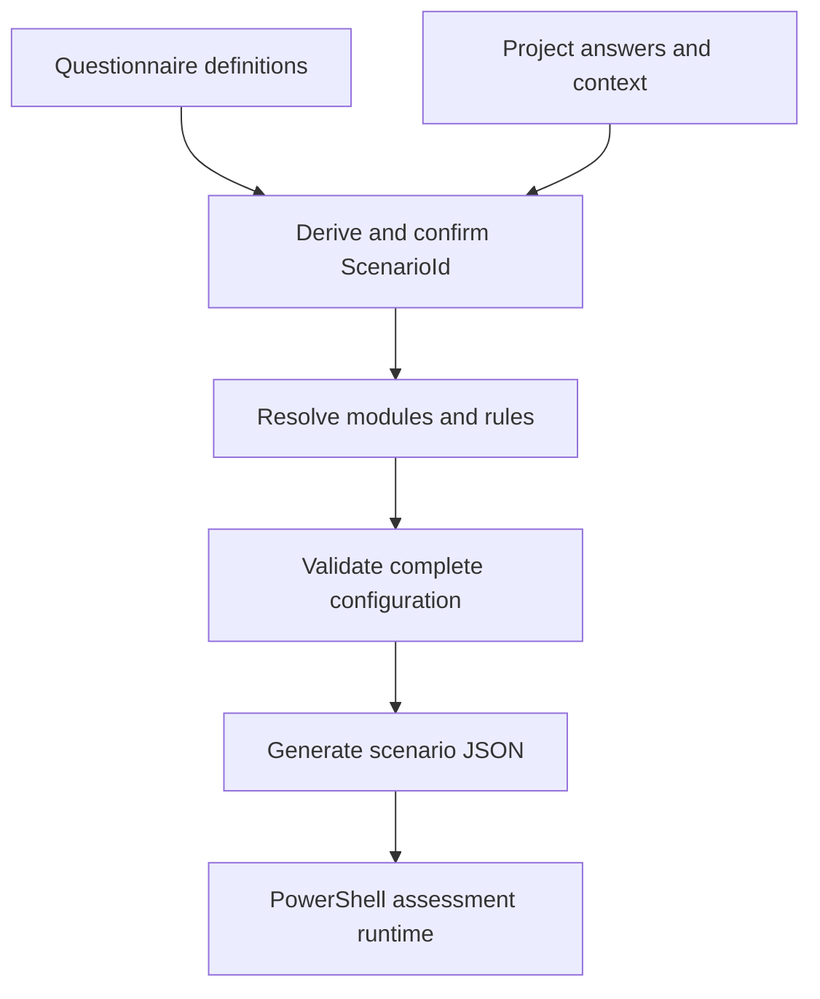

# eMAS Mapping Workbook and Scenario JSON MVP Requirements

**Project:** eMAS - eCTD Migration Assessment Script
**Document type:** Detailed Mapping Workbook and Runtime JSON requirements
**Version:** 4.14 MVP
**Status:** Approved MVP design baseline; implementation and verification pending
**Scope:** One human-readable master workbook and deterministic scenario-specific Runtime JSON
**Classification:** Internal
**Prepared:** 15 September 2026
**Parent requirement:** eMAS Enterprise Requirements v5.0
**Decision references:** DEC-2026-013 through DEC-2026-026

## 1. Purpose and MVP decision

This document defines the immediate eMAS MVP. The MVP shall prove two working capabilities before SharePoint integration, formal configuration release workflow, or GxP-oriented controls are implemented:

1. one Mapping Workbook contains all configurable requirements needed by the eMAS migration assessment scripts and is understandable, filterable, and maintainable without reading PowerShell code; and
2. the workbook can be transformed deterministically into Runtime JSON for a selected migration scenario.

The workbook is the human-maintained source for migration assessment meaning. The scenario-specific JSON is the machine-readable source consumed by the runtime. PowerShell shall not read the workbook and shall not generate or repair the configuration JSON.

The MVP is successful only when a reviewer can select a scenario, see every applicable requirement and relationship in Excel, generate the corresponding JSON, and trace each JSON object back to its workbook record.

## 2. MVP boundary

### 2.1 Included in the MVP

| Area | MVP requirement |
|---|---|
| Workbook | One macro-free `.xlsx` master workbook with named sheets and filterable Excel Tables |
| Content | Migration scenarios, assessment modules, evidence fields, regulatory profiles, rule catalogues, findings, actions, RAG, confidence, effort, readiness, reconciliation, sources, and JSON mapping |
| Human use | Plain-language descriptions, controlled values, source-verification details, examples, filters, freeze panes, and navigation |
| Scenario selection | Questionnaire/project context derives one base `ScenarioId`, which is confirmed for each JSON generation |
| JSON generation | Deterministic transformation of active applicable workbook records into one scenario-specific JSON file |
| JSON scope | All applicable Pre-Sales, Pre-Migration, and Post-Migration configuration for the selected scenario |
| Validation | Workbook structure, types, identifiers, references, applicability, rule conditions, and JSON completeness |
| Traceability | Requirement -> module -> rule -> finding/action -> JSON path -> engine capability |
| Runtime boundary | Generic PowerShell operations consume JSON and customer/project evidence offline |

### 2.2 Deferred until after the MVP works

The following are intentionally deferred and shall not block MVP acceptance:

- SharePoint hosting, permissions, co-authoring, and version history;
- Office Script deployment in a Microsoft 365 tenant;
- Power Automate approval or release orchestration;
- formal configuration approval, immutable release packaging, electronic signatures, and GxP validation evidence;
- production checksum manifest, release revocation, and controlled promotion workflow;
- final workbook protection, corporate signing, and retention rules;
- production regulatory content approval for every supported region;
- polished dashboards, optional user interfaces, and customer distribution packaging.

These items may be designed later without changing the fundamental Workbook -> Scenario JSON -> PowerShell boundary.

### 2.3 Explicit exclusions

The Mapping Workbook shall not:

- scan customer files, databases, archives, DMS repositories, or XML;
- contain customer-specific answers, paths, credentials, accepted exceptions, or assessment results;
- execute migration, repair source content, or modify evidence;
- contain PowerShell, VBA, JavaScript, SQL, XPath evaluation code, or other executable expressions in cells;
- claim formal regulatory validation, customer acceptance, or validated-system status;
- treat DMS-to-DMS migration as a supported scenario; such a request requires consultant review and separate scope definition;
- define low-level generic operations such as directory enumeration, ZIP extraction, XML parsing, checksum calculation, logging, or OpenXML report writing.

## 3. MVP operating model



One master workbook shall support every scenario. Separate workbooks per scenario are prohibited because they create duplicated rules and inconsistent maintenance.

One JSON generation shall use exactly one confirmed `ScenarioId`, derived from questionnaire context or explicitly selected for testing. The generated file shall contain the rules for all phases applicable to that scenario. Phase scripts may consume only their own section, but shall use the same scenario JSON.

## 4. Design principles

| ID | Priority | Requirement |
|---|---|---|
| MVP-GEN-001 | MUST | The workbook shall describe what eMAS assesses and how evidence is interpreted. |
| MVP-GEN-002 | MUST | PowerShell shall implement only generic technical capabilities and phase orchestration. |
| MVP-GEN-003 | MUST | Every executable workbook record shall have a stable identifier. |
| MVP-GEN-004 | MUST | Human-readable labels and explanations shall accompany technical codes. |
| MVP-GEN-005 | MUST | One row shall represent one atomic record or condition. |
| MVP-GEN-006 | MUST | Multi-value logic shall use relationship rows or condition rows, not comma-separated free text. |
| MVP-GEN-007 | MUST | Region, authority, format, specification version, application/pathway, dossier context, procedure, sequence, and lifecycle shall remain separate dimensions. |
| MVP-GEN-008 | MUST | ASMF/DMF shall not be represented as transport formats. |
| MVP-GEN-009 | MUST | IND, NDA, ANDA, BLA, MAA, and CTA shall not be represented as eCTD formats. |
| MVP-GEN-010 | MUST | Folder labels shall not override stronger structured evidence such as XML, database, or controlled metadata. |
| MVP-GEN-011 | MUST | Missing evidence shall not become Green, Pass, Ready, or Reconciled. |
| MVP-GEN-012 | MUST | Severity/RAG and confidence shall remain independent. |
| MVP-GEN-013 | MUST | Findings and recommended actions shall remain separate reusable objects. |
| MVP-GEN-014 | MUST | Regulatory requirements, reviewed interpretations, and eMAS design decisions shall be distinguishable. |
| MVP-GEN-015 | MUST | Every JSON object shall be traceable to workbook rows and every exported workbook rule shall have a defined JSON path. |

## 5. Migration scenario catalogue

The approved MVP catalogue contains eight base migration scenarios. A scenario represents the principal migration route. Hosting, scope, dependencies, upgrade requirements, repository composition, and evidence completeness are separate qualifiers so they do not create an uncontrolled number of scenario combinations.

| ScenarioId | ScenarioCode | Scenario name | Selection basis | Principal focus |
|---|---|---|---|---|
| `MS-01` | `ECTDMGR_SQL_TO_SQL` | eCTDmanager SQL Server to SQL Server | Existing eCTDmanager source with SQL Server database | DB/archive inventory, compatibility, migration population, readiness, and reconciliation |
| `MS-02` | `ECTDMGR_ACCESS_TO_SQL` | eCTDmanager Access to SQL Server | Existing legacy eCTDmanager source with Access database | Legacy extraction, archive correlation, conversion risks, and reconciliation |
| `MS-03` | `ECTDMGR_ORACLE_TO_SQL` | eCTDmanager Oracle to SQL Server | Existing eCTDmanager source with Oracle database | Oracle source mapping, archive correlation, conversion risks, and reconciliation |
| `MS-04` | `REGULATORY_EXPORT_TO_ECTDMGR` | Regulatory Submission Export to eCTDmanager | Source consists primarily of regulatory submission exports | Repository, ZIP, dossier, region, format, sequence, XML, and file assessment |
| `MS-05` | `HYBRID_MIGRATION` | Hybrid Migration | Two or more primary migration inputs are included in the migration population | Combined DB/archive, export, DMS, or mixed-source assessment and reconciliation |
| `MS-06` | `ARCHIVE_STORAGE_ONLY` | Archive or Storage Only | Physical archive/storage is itself the intended migration input rather than merely the only evidence currently available | Archive discovery, identity limitations, counts, size, and reduced confidence |
| `MS-07` | `SCENARIO_PENDING` | Scenario Pending or Incomplete | Available answers cannot reliably identify another scenario | Missing information, follow-up questions, and safe Not Assessed outcomes |
| `MS-08` | `THIRD_PARTY_DMS_TO_ECTDMGR` | Third-Party System or DMS to eCTDmanager | Content and metadata originate from a third-party system or DMS and the supported target is eCTDmanager | Source adapter, metadata, documents, renditions, relationships, and mapping |

The following are qualifiers rather than separate scenarios:

| Qualifier | Values or examples | Effect |
|---|---|---|
| `CustomerRelationship` | Existing, New, Unknown | Supports business context and questionnaire branching |
| `SourceHosting` | OnPremises, Cloud, Hybrid, Unknown | Activates source-access and infrastructure rules |
| `TargetHosting` | OnPremises, Cloud, Hybrid, ToBeDefined | Activates target dependency and readiness rules |
| `MigrationScope` | AllContent, SelectedContent, Mixed, Unknown | Controls inventory, exclusions, and baseline scope |
| `EvidenceCompleteness` | Complete, Partial, Minimal, Unknown | Controls coverage, confidence, and follow-up |
| `RepositoryComposition` | Single, Multiple, Mixed, Unknown | Controls repository discovery depth |
| `ESubmanagerDependency` | Yes, No, Unknown | Activates storage and exported-submission dependency rules |
| `DmsDependency` | Yes, No, Unknown | Activates DMS assessment where it is not already the primary source |
| `OtherIntegrationDependency` | Yes, No, Unknown | Creates dependency clarification and readiness requirements |
| `SequentialUpgradeRequired` | Yes, No, ToBeDetermined | Activates upgrade-path requirements |

Partial evidence does not automatically produce `MS-07`. When the migration route is known, the applicable base scenario remains selected and `EvidenceCompleteness` records the limitation. Mixed repository content remains a qualifier unless it establishes a Hybrid migration or prevents reliable scenario identification.

`MS-08` does not include DMS-to-DMS migration. When the source and intended target are both DMS platforms, or the target platform is another unsupported third-party system, derivation shall return `MS-07` with `NeedsReview`, identify the requested route as outside the current scenario catalogue, and require discussion with an EXTEDO consultant before further assessment.

## 6. Assessment module catalogue

| ModuleId | Module | Main responsibility |
|---|---|---|
| `MOD-SCENARIO` | Migration Scenario | Derive or confirm scenario and evidence availability |
| `MOD-SOURCE` | Source System | Assess source product, version, environment, and dependencies |
| `MOD-DB` | Database | Inventory database records and supported relationships |
| `MOD-ARCHIVE` | Archive | Locate, count, size, and assess physical objects |
| `MOD-DMS` | DMS | Assess external metadata, documents, renditions, and relationships |
| `MOD-REPOSITORY` | Repository Discovery | Discover folders, ZIPs, nested ZIPs, wrappers, and candidate dossier roots |
| `MOD-CLASSIFY` | Regulatory Classification | Determine region, authority, format, version, application, and dossier context |
| `MOD-SEQUENCE` | Sequence and Lifecycle | Inventory sequence/submission units, gaps, duplicates, and lifecycle |
| `MOD-REFERENCE` | XML and Reference Integrity | Assess backbone XML, regional XML, referenced files, and orphan candidates |
| `MOD-FILE` | File and Technical Integrity | Assess readability, zero-byte, extension, PDF, path, and checksum observations |
| `MOD-VOLUME` | Volume and Complexity | Calculate counts, sizes, diversity, and complexity metrics |
| `MOD-MAPPING` | Migration Mapping | Assess source-to-target fields, identifiers, transformations, and comparison keys |
| `MOD-INTERPRET` | RAG Confidence and Effort | Convert observations into severity, confidence, effort, and actions |
| `MOD-READINESS` | Pre-Migration Readiness | Determine Ready, Ready with Accepted Exceptions, or Blocked |
| `MOD-RECONCILE` | Post-Migration Reconciliation | Compare the approved baseline with target/import evidence |

Each scenario shall explicitly map every module to `Required`, `Conditional`, `Optional`, or `NotApplicable`. Absence of a mapping is an error.

## 7. Required workbook structure

The MVP workbook shall contain the following sheets in this order. Sheet names are stable contract values.

| Order | Sheet | Maintained or generated | Purpose |
|---:|---|---|---|
| 0 | `00_Home` | Maintained | Purpose, navigation, glossary, selected scenario, and generation instructions |
| 1 | `01_Migration_Scenarios` | Maintained | Supported base-scenario catalogue and stable scenario identity |
| 2 | `02_Scenario_Questionnaire` | Maintained | Non-technical questions used to identify a scenario and missing information |
| 3 | `03_Scenario_Derivation_Rules` | Maintained | Structured rules that convert questionnaire answers into one base scenario, qualifiers, and follow-up status |
| 4 | `04_Assessment_Modules` | Maintained | Reusable assessment capabilities |
| 5 | `05_Scenario_Module_Map` | Maintained | Required/conditional/optional modules for every scenario |
| 6 | `06_Requirement_Catalogue` | Maintained | Complete human-readable inventory of migration-script requirements |
| 7 | `07_Fields_Evidence` | Maintained | Canonical reusable field meaning, type/cardinality, producer, provenance, permitted use, and JSON contract |
| 8 | `08_Regulatory_Profiles` | Maintained | Region/authority/format/version/dossier dimensions and evidence locations |
| 9 | `09_Dossier_Sequence_ID` | Maintained | Dossier, application, sequence, and lifecycle identification rules |
| 10 | `10_Folder_File_Structure` | Maintained | Expected folder/file/container structure rules |
| 11 | `11_Missing_Refs_Integrity` | Maintained | XML references, orphan candidates, checksums, and physical-file integrity |
| 12 | `12_Technical_Observations` | Maintained | PDF, XML, path, schema, extension, encryption, and other technical observations |
| 13 | `13_Size_Volume_Metrics` | Maintained | Counts, sizes, diversity, units, and calculation definitions |
| 14 | `14_Source_DB_Archive_DMS` | Maintained | Source-system, database, archive, DMS, and identifier mapping rules |
| 15 | `15_RAG_Severity` | Maintained | Finding severity, RAG, blocker, and aggregation rules |
| 16 | `16_Confidence` | Maintained | Evidence strength, coverage, conflicts, and confidence rules |
| 17 | `17_Effort_Drivers` | Maintained | Complexity drivers, bands, weights, floors, and double-counting groups |
| 18 | `18_Findings` | Maintained | Reusable finding definitions |
| 19 | `19_Recommendations_Actions` | Maintained | Reusable customer and consultant actions linked to findings |
| 20 | `20_PreMigration_Readiness` | Maintained | Readiness decision rules and baseline requirements |
| 21 | `21_PostMigration_Reconciliation` | Maintained | Scenario-aware comparison rules, keys, tolerances, and outcomes |
| 22 | `22_Value_Lists` | Maintained | Controlled machine codes, human labels, meanings, sources, and runtime eligibility |
| 23 | `23_Source_References` | Maintained | Regulatory, vendor, product, and internal sources |
| 24 | `24_Final_Config_Master` | Generated | Filterable flattened view of everything included/excluded for a selected scenario |
| 25 | `25_JSON_Field_Map` | Maintained | Explicit workbook-column to JSON-property transformation contract |
| 26 | `26_JSON_Preview` | Generated | Scenario JSON preview and section counts |
| 27 | `27_Validation_Results` | Generated | Blocking errors, warnings, affected record, reason, and correction |

## 8. Common workbook conventions

### 8.1 Identifier and relationship rules

The workbook shall use these stable identifiers where relevant:

- `ScenarioId`;
- `QuestionId`;
- `DerivationRuleId`;
- `ModuleId`;
- `RequirementId`;
- `FieldCode`;
- `ProfileId`;
- `RuleId`;
- `ConditionId`;
- `MetricCode`;
- `FindingCode`;
- `RecommendationCode`;
- `SourceId`;
- `MappingId`.

Identifiers shall be unique, shall not depend on row number, and shall not be reused for a different meaning. Display labels may change without changing identifiers.

### 8.2 Common rule columns

Every executable rule sheet shall use the applicable subset of the following columns.

| Column | Type | Why it is needed |
|---|---|---|
| `RuleId` | Identifier | Stable traceability from workbook through JSON, engine evaluation, log, and report |
| `RequirementId` | Reference | Shows which migration-script requirement the rule implements |
| `ModuleId` | Reference | Connects the rule to scenario applicability through `05_Scenario_Module_Map` |
| `IsActive` | Boolean | Retains draft/history rows while excluding inactive content from MVP JSON |
| `Priority` | Integer | Gives deterministic rule evaluation order |
| `Phase` | Code | Limits behavior to Pre-Sales, Pre-Migration, Post-Migration, or All |
| `ScenarioId` | Code | Supports a scenario-specific override; `ALL` means module-driven applicability |
| `Region` | Code | Filters regional logic without mixing it with authority or format |
| `Authority` | Code | Identifies the responsible authority separately from region |
| `TechnicalFormat` | Code | eCTD v3, eCTD v4, NeeS, VNeeS, non-eCTD, or Unknown |
| `SpecificationVersion` | Text | Selects the version-appropriate rule/parser behavior |
| `ApplicationType` | Code | IND, NDA, ANDA, BLA, MAA, CTA, and other pathways |
| `DossierContext` | Code | ASMF, DMF, investigational, marketing, device, and other regulatory context |
| `ScopeLevel` | Code | Repository, application, dossier, sequence, module, document, or file |
| `ConditionGroup` | Text | Conditions in the same group are ANDed |
| `ConditionSequence` | Integer | Preserves deterministic condition order |
| `FieldCode` | Reference | Identifies the observed or derived evidence evaluated by the condition |
| `Operator` | Code | Defines the supported comparison without executable code |
| `Value1` | Typed scalar | First expected operand |
| `Value2` | Typed scalar | Second operand for range operators |
| `FindingCode` | Reference | Produces a reusable finding without duplicating text |
| `RecommendationCode` | Reference | Links a standard action to the result |
| `RagImpact` | Code | Records risk interpretation separately from evidence and confidence |
| `Severity` | Code | Records seriousness independently from display colour |
| `ConfidenceImpact` | Code | Records how this evidence changes confidence |
| `EffortImpact` | Code/number | Connects the observation to complexity without unsupported hours |
| `EngineCapability` | Code | Names the generic PowerShell capability required to evaluate the rule |
| `SourceId` | Reference | Provides source traceability |
| `SourceSection` | Text | Identifies the precise source location, XML section, table, or internal decision |
| `RequirementBasis` | Code | Distinguishes AuthorityRequirement, ReviewedInterpretation, ProductRequirement, and eMASDesign |
| `BusinessExplanation` | Text | Explains the rule to non-developers |

### 8.3 Condition model

- One row represents one atomic condition.
- Conditions with the same `RuleId` and `ConditionGroup` use AND.
- Different condition groups for the same `RuleId` use OR.
- An unconditional rule uses `ConditionMode=Always` and no condition row.
- Missing, inaccessible, or invalid evidence produces an undetermined evaluation unless a specific missing-evidence policy applies.
- `NotEquals` and `NotExists` shall not become true merely because the evidence could not be read.
- Adding an `Operator` or `EngineCapability` value to `22_Value_Lists` does not implement it in PowerShell.

## 9. Sheet-by-sheet requirements

### 9.1 `00_Home`

This sheet makes the workbook usable without reading this specification.

| Field or area | Required | Why |
|---|---:|---|
| Workbook purpose and boundary | Yes | Prevents the mapping workbook from being mistaken for the assessment engine |
| MVP status | Yes | States what works and what is deferred |
| `SelectedScenarioId` | Yes | Drives `24_Final_Config_Master` and JSON generation |
| Scenario name/description | Calculated | Lets the reviewer confirm the selected code |
| Navigation links | Yes | Provides direct access to every sheet |
| Validation summary | Calculated | Shows errors, warnings, and export eligibility |
| JSON section counts | Calculated | Lets the reviewer compare workbook inclusion with preview |
| Generation instructions | Yes | Explains the exact MVP workflow |
| Glossary | Yes | Explains scenario, module, evidence, finding, RAG, confidence, and JSON |

`00_Home` is authoring-only and is not exported.

### 9.2 `01_Migration_Scenarios`

One row defines one stable base migration scenario. Hosting, scope, evidence completeness, repository composition, eSUBmanager/DMS dependencies, other integrations, and sequential-upgrade needs are qualifiers; they shall not create duplicate scenario identities.

| Column | Type | Required | Why / JSON mapping |
|---|---|---:|---|
| `ScenarioId` | Identifier | Yes | Primary key -> `scenario.id` |
| `ScenarioCode` | Code | Yes | Short stable code -> `scenario.code` |
| `ScenarioName` | Text | Yes | Human label -> `scenario.name` |
| `ScenarioFamily` | Code | Yes | Groups variants -> `scenario.family` |
| `BusinessDescription` | Text | Yes | Plain-language boundary and intended use -> `scenario.description` |
| `ExistingECTDManager` | Code | Yes | Yes, No, Partial, or Unknown; supports deterministic derivation |
| `SourceSystemCategory` | Code | Yes | eCTDmanager, RegulatoryExport, ThirdPartySystemOrDMS, ArchiveStorage, Hybrid, or Unknown; the exact third-party/DMS input remains in project context |
| `SourceDatabaseType` | Code | Yes | SQLServer, Access, Oracle, NotApplicable, or Unknown |
| `PrimaryMigrationMethod` | Code | Yes | DatabaseArchive, ExportImport, ArchiveOnly, Adapter, Hybrid, or Unknown |
| `TargetPlatform` | Code | Yes | Target product/platform family without embedding hosting |
| `SupportsMixedScope` | Boolean | Yes | Identifies scenarios that intentionally combine source mechanisms |
| `FallbackScenario` | Boolean | Yes | True only for the safe pending/incomplete route |
| `DisplaySequence` | Integer | Yes | Stable human display and serialization order; never used to hide conflicting derivation matches |
| `IsActive` | Boolean | Yes | Controls selectable/exportable scenarios |
| `SourceId` | Reference | Yes | Basis for scenario definition |
| `Notes` | Text | No | Boundary clarification; never executable logic |

The approved base catalogue is `MS-01` through `MS-08` in Section 5. Qualifier definitions belong in `22_Value_Lists`, questionnaire mappings, and applicable rules. Actual project qualifier values belong to execution input/evidence, not the reusable Mapping Workbook or Runtime JSON.

### 9.3 `02_Scenario_Questionnaire`

This sheet contains reusable question definitions. Actual customer answers belong to an execution input/report and shall not be exported as reusable configuration values.

| Column | Type | Required | Why / JSON mapping |
|---|---|---:|---|
| `QuestionId` | Identifier | Yes | Stable question key -> `questionnaire.questions[].questionId` |
| `SectionCode` | Code | Yes | Groups questions in the approved business-first order |
| `DisplaySequence` | Integer | Yes | Stable display order within the questionnaire |
| `QuestionText` | Text | Yes | Plain-language question |
| `BusinessMeaning` | Text | Yes | Explains why the answer matters |
| `AnswerType` | Code | Yes | Boolean, CodeList, MultiSelectCodeList, Number, Text, or Size |
| `AnswerListCode` | Reference | Conditional | Dropdown source for CodeList and MultiSelectCodeList answers |
| `AnswerOwner` | Code | Yes | Customer, EXTEDO, or Derived; customer input focuses on current source information |
| `Phase` | Code | Yes | Limits the question to the relevant phase |
| `ParentQuestionId` | Reference | No | Supports dependent questions without free-form expressions |
| `TriggerOperator` | Code | No | Controlled dependency operator |
| `TriggerValue` | Scalar | No | Required answer that reveals this question |
| `MapsToContextField` | Text | No | Project context/qualifier evaluated by derivation and applicability rules |
| `RequiredWhenShown` | Boolean | Yes | Separates display logic from mandatory-answer logic |
| `MissingAnswerImpact` | Code | Yes | FollowUp, ConfidenceDown, NotAssessed, or Blocker |
| `Guidance` | Text | Yes | Where a non-technical user finds the answer |
| `VerificationGuidance` | Text | Yes | What evidence should be recorded in the project report |
| `PreSalesDetailLevel` | Code | Yes | AvailabilityOnly, ApproximateSize, Summary, Detailed, or NotApplicable |
| `IsActive` | Boolean | Yes | Export eligibility |
| `SourceId` | Reference | Yes | Requirement basis |

Questions shall be reviewed in this order:

| Section | Purpose | Minimum questions |
|---|---|---|
| A - Current source and customer situation | Establish whether eCTDmanager is the current source, what is in scope, and what will actually be supplied for migration | `Q-SCN-001` Dossiers currently in eCTDmanager?; `Q-SCN-002` All, selected, or mixed scope?; `Q-SCN-003` Content from another system/repository?; `Q-SCN-021` Primary migration input? |
| B - Hosting and destination | Capture the target product and hosting qualifiers without multiplying scenario identities | `Q-SCN-004` Source hosting?; `Q-SCN-005` Intended target hosting?; `Q-SCN-022` Intended target platform?; `Q-SCN-006` Target technical environment defined? |
| C - Dependencies and migration shape | Reveal related products, repositories, integrations, upgrade needs, and the composition of a Hybrid migration | `Q-SCN-023` Inputs included in Hybrid?; `Q-SCN-007` eSUBmanager used?; `Q-SCN-008` DMS/external repository used?; `Q-SCN-009` Other integrations?; `Q-SCN-010` Sequential upgrade required? |
| D - Available technical evidence | Determine which assessment modules can run | `Q-SCN-011` Source DB available?; `Q-SCN-012` DB type?; `Q-SCN-013` Archive/storage available?; `Q-SCN-014` Regulatory exports available?; `Q-SCN-015` Third-party metadata available?; `Q-SCN-016` Documents/renditions available? |
| E - Pre-Sales scale | Capture lightweight planning measures only | `Q-SCN-017` Approximate DB size?; `Q-SCN-018` Approximate archive size?; `Q-SCN-019` Approximate export size?; `Q-SCN-020` Approximate dossier/application count? |

The initial reusable question rows shall use the following controlled intent. Exact display wording may be improved without changing `QuestionId` or meaning.

| QuestionId | Question | Controlled answer or type | Display condition | MapsToContextField |
|---|---|---|---|---|
| `Q-SCN-001` | Are the dossiers currently managed in eCTDmanager? | Yes, No, Partially, NotSure | Always | `CurrentContentInECTDManager` |
| `Q-SCN-002` | Is the intended migration scope all content, selected content, or a mixed scope? | AllContent, SelectedContent, Mixed, Unknown | Always | `MigrationScope` |
| `Q-SCN-003` | Is migration content also coming from another system or repository? | Yes, No, Unknown | Always | `MultipleSourceMechanisms` |
| `Q-SCN-021` | What will be the main migration input supplied to EXTEDO? | ECTDManagerDatabaseArchive, RegulatorySubmissionExport, ThirdPartySystem, DMS, ArchiveStorageOnly, MultipleSources, Unknown | Always; business answer confirmed by EXTEDO | `PrimarySourceMechanism` |
| `Q-SCN-023` | Which migration input types are included in the Hybrid migration? | Multi-select: ECTDManagerDatabaseArchive, RegulatorySubmissionExport, ThirdPartySystem, DMS, ArchiveStorage | When `PrimarySourceMechanism=MultipleSources`; at least two values required | `IncludedSourceMechanisms` |
| `Q-SCN-004` | How is the current source hosted? | OnPremises, Cloud, Hybrid, Unknown | Always | `SourceHosting` |
| `Q-SCN-005` | What is the intended target hosting model? | OnPremises, Cloud, Hybrid, ToBeDefined | Always | `TargetHosting` |
| `Q-SCN-022` | Which target platform should receive the migrated content? | eCTDmanager, OtherEXTEDOProduct, DMS, ThirdPartySystem, ToBeDefined | Always; business answer confirmed by EXTEDO | `TargetPlatform` |
| `Q-SCN-006` | Is the target technical environment defined? | Yes, Partially, No, Unknown | Always; customer may answer Unknown | `TargetEnvironmentDefined` |
| `Q-SCN-007` | Is eSUBmanager used or in migration scope? | Yes, No, Unknown | Always | `ESubmanagerDependency` |
| `Q-SCN-008` | Is a DMS or external content repository used or in migration scope? | Yes, No, Unknown | Always | `DmsDependency` |
| `Q-SCN-009` | Are other interfaces or integrations relevant to migration? | Yes, No, Unknown | Always | `OtherIntegrationDependency` |
| `Q-SCN-010` | Is a sequential eCTDmanager upgrade expected before or during migration? | Yes, No, ToBeDetermined | When eCTDmanager is current or partial | `SequentialUpgradeRequired` |
| `Q-SCN-011` | Is the source database available for assessment? | Yes, No, Unknown | When primary input is eCTDmanager DB/archive or MultipleSources | `SourceDatabaseAvailable` |
| `Q-SCN-012` | What is the source database type? | SQLServer, Access, Oracle, Other, Unknown, NotApplicable | When database availability is Yes or Unknown | `SourceDatabaseType` |
| `Q-SCN-013` | Is the archive or physical storage available? | Yes, Partial, No, Unknown | When primary input is eCTDmanager DB/archive, ArchiveStorageOnly, or MultipleSources | `ArchiveAvailable` |
| `Q-SCN-014` | Are regulatory submission exports available? | Yes, Partial, No, Unknown | When primary input is RegulatorySubmissionExport or MultipleSources | `RegulatoryExportAvailable` |
| `Q-SCN-015` | Is third-party system metadata available? | Yes, Partial, No, Unknown | When primary input is ThirdPartySystem, DMS, or MultipleSources | `ThirdPartyMetadataAvailable` |
| `Q-SCN-016` | Are the source documents and renditions available? | Yes, Partial, No, Unknown | When primary input is ThirdPartySystem, DMS, or MultipleSources | `SourceDocumentsAvailable` |
| `Q-SCN-017` | What is the approximate source database size? | Size plus unit | When source database is available | `SourceDatabaseApproxBytes` |
| `Q-SCN-018` | What is the approximate archive/storage size? | Size plus unit | When archive/storage is available or partial | `ArchiveApproxBytes` |
| `Q-SCN-019` | What is the approximate regulatory-export size? | Size plus unit | When regulatory exports are available or partial | `RegulatoryExportApproxBytes` |
| `Q-SCN-020` | What is the approximate dossier/application count? | Non-negative integer or Unknown | Always | `ApproxDossierCount` |

`Q-SCN-023` shall use `AnswerType=MultiSelectCodeList` and a controlled value list. The project answer shall be serialized as a JSON array; comma-separated free text in a cell is prohibited. If fewer than two mechanisms are selected, detailed assessment and JSON generation shall be blocked until the primary route is corrected or the Hybrid composition is completed.

Pre-Sales shall ask for availability and approximate sizes, not detailed DB-to-archive object verification. Physical verification of `DB record -> archive key -> physical object` is a Pre-Migration/Post-Migration activity. Target technical fields may remain for EXTEDO to complete. Missing answers shall create follow-up/confidence effects through configuration; they shall not silently invent a scenario. New/non-eCTDmanager customers shall see only questions relevant to their chosen primary migration input; they shall not be asked for eCTDmanager database, archive-path, or infrastructure details unless `MultipleSources` or another database-backed route is explicitly selected.

### 9.4 `03_Scenario_Derivation_Rules`

This sheet converts normalized questionnaire context into one candidate base scenario and an explainable selection status. It contains reusable decision and consistency logic, never customer answers. It evaluates normalized context fields rather than display text so questionnaire wording can change without changing scenario behavior.

| Column | Type | Required | Why / JSON mapping |
|---|---|---:|---|
| `DerivationRuleId` | Identifier | Yes | Stable rule -> `questionnaire.derivationRules[].derivationRuleId` |
| `RulePurpose` | Code | Yes | `SelectScenario`, `ValidateContext`, or `Fallback` |
| `RuleName` | Text | Yes | Human-readable rule name |
| `Priority` | Integer | Yes | Defines deterministic evaluation order; it shall not hide contradictory matches |
| `ConditionGroup` | Text | Yes | Groups AND conditions; different groups for one rule use OR |
| `ConditionSequence` | Integer | Yes | Stable order for review and serialization |
| `InputContextField` | Reference | Yes | Normalized project-context field evaluated by the condition |
| `OriginQuestionId` | Reference | Conditional | Question that produced the context value; blank only for a derived context field |
| `Operator` | Code | Yes | Controlled comparison operator |
| `ExpectedValue` | Scalar | Conditional | Value required for the match |
| `CandidateScenarioId` | Reference | Conditional | Candidate `MS-*` scenario for selection/fallback rules |
| `OnMatchStatus` | Code | Yes | `Derived`, `DerivedWithFollowUp`, `Pending`, or `NeedsReview` |
| `MissingInputAction` | Code | Yes | `Continue`, `FollowUp`, or `UseFallback` |
| `FollowUpQuestionId` | Reference | Conditional | Question required to complete or resolve the selection |
| `ReasonCode` | Code | Yes | Stable machine-readable explanation |
| `ReasonTemplate` | Text | Yes | Human explanation of why the scenario was derived |
| `BaseConfidence` | Code | Yes | High, Medium, Low, or Unknown scenario-selection confidence; separate from assessment confidence |
| `IsActive` | Boolean | Yes | Runtime inclusion |
| `SourceId` | Reference | Yes | Requirement/decision basis |
| `Notes` | Text | No | Boundary and maintenance explanation |

One workbook row represents one atomic condition. Rows sharing `DerivationRuleId` and `ConditionGroup` use AND. Different condition groups for the same rule use OR. A `Fallback` rule is evaluated only after all active validation and selection rules. `MatchEffect` is not required: every complete `SelectScenario` rule proposes its `CandidateScenarioId`.

The approved derivation rules are:

| Priority | Rule ID | Required normalized context | Result |
|---:|---|---|---|
| 10 | `SDR-TARGET-UNSUPPORTED` | `TargetPlatform` is DMS, ThirdPartySystem, or OtherEXTEDOProduct | `MS-07 / NeedsReview`; record `OUTSIDE_SUPPORTED_TARGET` and require consultant discussion |
| 20 | `SDR-MS05-MULTI` | `TargetPlatform=eCTDmanager` and `PrimarySourceMechanism=MultipleSources` | `MS-05 / Derived` |
| 30 | `SDR-MS01-SQL` | `TargetPlatform=eCTDmanager`, `PrimarySourceMechanism=ECTDManagerDatabaseArchive`, `SourceDatabaseType=SQLServer` | `MS-01 / Derived` |
| 31 | `SDR-MS02-ACCESS` | `TargetPlatform=eCTDmanager`, `PrimarySourceMechanism=ECTDManagerDatabaseArchive`, `SourceDatabaseType=Access` | `MS-02 / Derived` |
| 32 | `SDR-MS03-ORACLE` | `TargetPlatform=eCTDmanager`, `PrimarySourceMechanism=ECTDManagerDatabaseArchive`, `SourceDatabaseType=Oracle` | `MS-03 / Derived` |
| 40 | `SDR-MS04-EXPORT` | `TargetPlatform=eCTDmanager` and `PrimarySourceMechanism=RegulatorySubmissionExport` | `MS-04 / Derived` |
| 50 | `SDR-MS08-THIRD` | `TargetPlatform=eCTDmanager` and `PrimarySourceMechanism=ThirdPartySystem` | `MS-08 / Derived` |
| 51 | `SDR-MS08-DMS` | `TargetPlatform=eCTDmanager` and `PrimarySourceMechanism=DMS` | `MS-08 / Derived` |
| 60 | `SDR-MS06-ARCHIVE` | `TargetPlatform=eCTDmanager` and `PrimarySourceMechanism=ArchiveStorageOnly` | `MS-06 / Derived` |
| 900 | `SDR-MS07-FALLBACK` | No supported selection rule matches, a required classifier is unknown, an unsupported DB/source route is supplied, or answers conflict | `MS-07 / Pending` or `MS-07 / NeedsReview` |

The selection status has the following meaning:

| Status | Meaning |
|---|---|
| `Derived` | Required scenario-identity fields are known and mutually consistent |
| `DerivedWithFollowUp` | Base scenario is known, but non-identity evidence or supporting information is incomplete |
| `Pending` | Required scenario-identity information is missing; `MS-07` is selected until clarified |
| `NeedsReview` | Answers conflict or identify an unsupported route; `MS-07` is selected pending consultant review |
| `ConfirmedOverride` | Project-level confirmation selects a different scenario with the derived candidate, reason, confirmer, and date retained as execution evidence |

The transformer shall normalize answers, execute context-validation rules, evaluate every applicable selection rule, and then apply the fallback. Exactly one valid selection match produces that scenario. More than one different selection match is a configuration or input conflict and shall produce `MS-07 / NeedsReview`; priority shall not silently discard the conflict. No match produces `MS-07 / Pending`. An explicit supported scenario with missing non-identity evidence remains selected with `DerivedWithFollowUp`.

Required edge-case behavior:

| Project context | Required outcome |
|---|---|
| eCTDmanager SQL route is known; archive is unavailable | `MS-01 / DerivedWithFollowUp`; evidence completeness is reduced |
| eCTDmanager content is partial, but only selected eCTDmanager dossiers are in scope | `MS-01`, `MS-02`, or `MS-03` according to DB type; not automatically Hybrid |
| eCTDmanager and external/DMS content are both migration inputs | `MS-05` |
| A DMS stores the source, but EXTEDO receives regulatory export packages as the migration input | `MS-04` |
| DMS metadata/documents/renditions are migrated into eCTDmanager | `MS-08` |
| DMS content is intended to migrate into another DMS | `MS-07 / NeedsReview`; DMS-to-DMS is outside current scope and requires consultant discussion |
| DMS is only an eCTDmanager dependency | Keep the applicable `MS-01` to `MS-05` base scenario and set the DMS qualifier/module applicability |
| The archive is merely the only evidence currently available, but the intended migration route is unknown | `MS-07`, not automatically `MS-06` |
| Archive/storage itself is the intended migration input | `MS-06` |
| Sequential upgrade, eSUBmanager, hosting, or mixed formats change | Keep the base scenario; update qualifiers and applicable rules |

Missing archive evidence does not change a known SQL Server migration from `MS-01` to `MS-07`; it changes the evidence-completeness qualifier and module outcomes. Mixed dossier formats inside one regulatory export remain `MS-04`. Multiple primary migration inputs use `MS-05`. `MS-07` is the explicit unresolved or unsupported route, not a catch-all replacement for a known supported scenario with incomplete evidence.

Illustrative grouped JSON produced from the atomic rows for `SDR-MS01-SQL`:

```json
{
  "derivationRuleId": "SDR-MS01-SQL",
  "rulePurpose": "SelectScenario",
  "priority": 30,
  "candidateScenarioId": "MS-01",
  "conditionGroups": [
    {
      "groupId": "G1",
      "all": [
        {
          "contextField": "TargetPlatform",
          "originQuestionId": "Q-SCN-022",
          "operator": "Equals",
          "value": "eCTDmanager"
        },
        {
          "contextField": "PrimarySourceMechanism",
          "originQuestionId": "Q-SCN-021",
          "operator": "Equals",
          "value": "ECTDManagerDatabaseArchive"
        },
        {
          "contextField": "SourceDatabaseType",
          "originQuestionId": "Q-SCN-012",
          "operator": "Equals",
          "value": "SQLServer"
        }
      ]
    }
  ],
  "onMatch": {
    "status": "Derived",
    "reasonCode": "ECTDMGR_SQL_PRIMARY",
    "baseConfidence": "High"
  },
  "onMissing": {
    "action": "FollowUp",
    "questionIds": ["Q-SCN-012", "Q-SCN-021", "Q-SCN-022"]
  }
}
```

### 9.5 `04_Assessment_Modules`

This sheet defines reusable assessment capabilities and their boundaries. It does not decide whether a module runs for a particular scenario or phase; that decision belongs to `05_Scenario_Module_Map`.

| Column | Type | Required | Why / JSON mapping |
|---|---|---:|---|
| `ModuleId` | Identifier | Yes | Primary key -> `modules[].moduleId` |
| `ModuleName` | Text | Yes | Human-readable module name |
| `BusinessPurpose` | Text | Yes | Explains the business question answered by the module |
| `AssessmentBoundary` | Text | Yes | Prevents overlap and states what the module shall not conclude |
| `ModuleLayer` | Code | Yes | Context, Evidence, Interpretation, Readiness, or Reconciliation |
| `ExecutionMode` | Code | Yes | Runtime, ConfigurationOnly, or Orchestration |
| `PrimaryEvidenceDomain` | Code | Yes | Principal evidence family used by the module |
| `PrimaryEngineCapabilityGroup` | Code | Yes | Names the generic PowerShell capability group without embedding code |
| `SupportsPreSales` | Boolean | Yes | Declares whether a phase mapping is permitted |
| `SupportsPreMigration` | Boolean | Yes | Declares whether a phase mapping is permitted |
| `SupportsPostMigration` | Boolean | Yes | Declares whether a phase mapping is permitted |
| `InputSummary` | Text | Yes | Human explanation of expected evidence/context inputs |
| `OutputSummary` | Text | Yes | Human explanation of observations, metrics, or decisions produced |
| `ProducesFindings` | Boolean | Yes | Indicates whether rules owned by the module can emit findings |
| `ProducesMetrics` | Boolean | Yes | Indicates whether the module can emit reusable measures |
| `CanProduceBaselineData` | Boolean | Yes | Identifies possible Pre-Migration baseline contribution; actual use is mapped per scenario/phase |
| `CanSupportReconciliation` | Boolean | Yes | Identifies possible Post-Migration comparison contribution; actual use is mapped per scenario/phase |
| `IsRuntimeModule` | Boolean | Yes | Distinguishes runtime assessment from authoring-only/configuration concepts |
| `IsActive` | Boolean | Yes | Module availability and export eligibility |
| `SourceId` | Reference | Yes | Requirement/decision basis |
| `Notes` | Text | No | Maintenance explanation |

The approved MVP module catalogue is:

| ModuleId | Module name | Business responsibility and boundary |
|---|---|---|
| `MOD-SCENARIO` | Migration Scenario Assessment | Confirms and records the already derived scenario and qualifiers at runtime; it shall not re-derive or silently replace the scenario. |
| `MOD-SOURCE` | Source-System Assessment | Assesses source product, version, environment, dependencies and adapter support; it does not perform DB, archive, DMS or regulatory-detail checks owned by other modules. |
| `MOD-DB` | Database Assessment | Inventories source DB entities, records, counts, sizes and relationships; Pre-Sales is limited to availability and scale, while detailed correlation begins in Pre-Migration. |
| `MOD-ARCHIVE` | Archive / Physical Object Assessment | Assesses archive identity, physical presence, counts, sizes and lookup outcomes; archive verification remains distinct from regulatory validity. |
| `MOD-DMS` | DMS / External Repository Assessment | Assesses source metadata, documents, versions, renditions and relationships for migration into eCTDmanager; DMS-to-DMS migration is outside MVP scope. |
| `MOD-REPOSITORY` | Repository / Container Discovery | Discovers folders, ZIPs, nested ZIPs, wrappers, roots and container context; discovery alone shall not assert regulatory validity. |
| `MOD-CLASSIFY` | Regulatory Classification | Classifies independent regulatory dimensions such as region, authority, format, specification version, application and dossier context. |
| `MOD-SEQUENCE` | Sequence / Lifecycle Assessment | Identifies sequences or submission units and lifecycle relationships; numeric gaps are observations unless stronger configured evidence makes them findings. |
| `MOD-REFERENCE` | XML / Reference Integrity | Assesses XML references, missing targets, orphan candidates, external references, lifecycle targets and checksums; deep checks are optional in Pre-Sales. |
| `MOD-FILE` | File / Technical Integrity | Assesses readability, zero-byte files, extensions, PDF characteristics, paths, duplicate candidates and technical integrity; it shall not repair content. |
| `MOD-VOLUME` | Volume / Complexity Metrics | Produces counts, sizes, diversity and other factual measures; RAG, confidence and effort interpretation belong to `MOD-INTERPRET`. |
| `MOD-MAPPING` | Migration Mapping Assessment | Defines identifiers, source-to-target mappings, transformations and comparison keys; executable SQL or source-specific code is prohibited in the workbook. |
| `MOD-INTERPRET` | RAG / Confidence / Effort Interpretation | Applies controlled severity, RAG, confidence and effort rules and links findings to recommendations; it does not collect source evidence itself. |
| `MOD-READINESS` | Pre-Migration Readiness | Determines Ready, Ready with Accepted Exceptions, or Blocked from detailed evidence; it is a Pre-Migration-only outcome module. |
| `MOD-RECONCILE` | Post-Migration Reconciliation | Compares the approved baseline with target/import evidence; it is a Post-Migration-only outcome module and is unavailable for unresolved `MS-07`. |

### 9.6 `05_Scenario_Module_Map`

This is the central scenario-and-phase switchboard. One logical record shall exist for every active `ScenarioId × Phase × ModuleId` combination, including explicit `NotApplicable` records. With eight scenarios, three phases and fifteen modules, the approved MVP seed contains exactly **360 logical mappings**. Explicit rows make omissions visible and prevent accidental execution by default.

| Column | Type | Required | Why / JSON mapping |
|---|---|---:|---|
| `ScenarioModuleMapId` | Identifier | Yes | Stable relationship key -> `modules[].scenarioModuleMapId` |
| `ScenarioId` | Reference | Yes | Selected scenario |
| `Phase` | Code | Yes | PreSales, PreMigration, or PostMigration |
| `ModuleId` | Reference | Yes | Applicable capability |
| `Applicability` | Code | Yes | Required, Conditional, Optional, NotApplicable |
| `AssessmentDepth` | Code | Yes | AvailabilityOnly, Summary, Detailed, Reconciliation, or NotApplicable |
| `ActivationContextField` | Reference | Conditional | Project context used to activate a Conditional module |
| `ActivationOperator` | Code | Conditional | Controlled activation comparison |
| `ActivationValue` | Scalar | Conditional | Expected activation value |
| `ActivationValueListCode` | Reference | Conditional | Controlled list used by multi-value activation; avoids comma-separated logic |
| `DefaultMissingEvidenceOutcome` | Code | Yes | NotAssessed, InsufficientEvidence, FollowUp, or Blocked |
| `PhaseOutcomeImpact` | Code | Yes | None, ConfidenceDown, FollowUp, ReadinessBlocker, or ReconciliationBlocker |
| `BaselineContribution` | Code | Yes | None, Candidate, Required, or Supporting |
| `ReconciliationRole` | Code | Yes | None, BaselineSource, TargetEvidence, Comparison, or Outcome |
| `ReasonCode` | Code | Yes | Stable explanation used in validation/reporting |
| `BusinessReason` | Text | Yes | Plain-language explanation for reviewers |
| `IsActive` | Boolean | Yes | Relationship eligibility and export inclusion |
| `SourceId` | Reference | Yes | Requirement/decision basis |
| `Notes` | Text | No | Maintenance explanation |

Detailed evidence-field dependencies shall be modelled through `06_Requirement_Catalogue` and `07_Fields_Evidence`. They shall not be stored as comma-separated evidence keys in this sheet.

Applicability has the following controlled meaning:

| Applicability | Required behavior |
|---|---|
| `Required` | The module is evaluated and reported for that scenario and phase. Missing evidence produces the configured outcome; it does not remove the module. |
| `Conditional` | The module runs when the configured activation condition is true. An unknown activation value shall not be interpreted as false; it produces the configured follow-up or evidence outcome. |
| `Optional` | The module may be enabled when evidence, time and assessment purpose justify it. Omitting it does not change the formal phase outcome. |
| `NotApplicable` | The module is excluded for that scenario and phase, and the record retains a reason code and business reason. |

The approved seed matrix below is a compact representation of all 360 logical records. Each module code in each row shall be expanded into an individual workbook row.

| Code | ModuleId | Code | ModuleId | Code | ModuleId |
|---|---|---|---|---|---|
| SCN | `MOD-SCENARIO` | SRC | `MOD-SOURCE` | DB | `MOD-DB` |
| ARC | `MOD-ARCHIVE` | DMS | `MOD-DMS` | REP | `MOD-REPOSITORY` |
| CLS | `MOD-CLASSIFY` | SEQ | `MOD-SEQUENCE` | REF | `MOD-REFERENCE` |
| FILE | `MOD-FILE` | VOL | `MOD-VOLUME` | MAP | `MOD-MAPPING` |
| INT | `MOD-INTERPRET` | RDY | `MOD-READINESS` | REC | `MOD-RECONCILE` |

#### Pre-Sales module mapping

Pre-Sales uses `AvailabilityOnly` or `Summary` depth. Detailed XML/reference, checksum and DB-to-archive correlation are not required by default.

| Scenario | Required | Conditional | Optional | NotApplicable |
|---|---|---|---|---|
| `MS-01` | SCN, SRC, DB, ARC, VOL, MAP, INT | DMS, REP, CLS, SEQ, FILE | REF | RDY, REC |
| `MS-02` | SCN, SRC, DB, ARC, VOL, MAP, INT | DMS, REP, CLS, SEQ, FILE | REF | RDY, REC |
| `MS-03` | SCN, SRC, DB, ARC, VOL, MAP, INT | DMS, REP, CLS, SEQ, FILE | REF | RDY, REC |
| `MS-04` | SCN, REP, CLS, SEQ, FILE, VOL, MAP, INT | SRC, DMS | REF | DB, ARC, RDY, REC |
| `MS-05` | SCN, SRC, VOL, MAP, INT | DB, ARC, DMS, REP, CLS, SEQ, FILE | REF | RDY, REC |
| `MS-06` | SCN, SRC, ARC, REP, VOL, MAP, INT | CLS, SEQ, FILE | REF | DB, DMS, RDY, REC |
| `MS-07` | SCN, INT | SRC, DB, ARC, DMS, REP, CLS, SEQ, FILE, VOL, MAP | REF | RDY, REC |
| `MS-08` | SCN, SRC, VOL, MAP, INT | DB, ARC, DMS, REP, CLS, SEQ, FILE | REF | RDY, REC |

#### Pre-Migration module mapping

Pre-Migration uses `Detailed` depth for applicable evidence modules and establishes the baseline. `MOD-READINESS` is Required for `MS-07` so incomplete/unsupported routes produce an explicit `Blocked` outcome rather than disappearing from the report.

| Scenario | Required | Conditional | Optional | NotApplicable |
|---|---|---|---|---|
| `MS-01` | SCN, SRC, DB, ARC, VOL, MAP, INT, RDY | DMS, REP, CLS, SEQ, REF, FILE | — | REC |
| `MS-02` | SCN, SRC, DB, ARC, VOL, MAP, INT, RDY | DMS, REP, CLS, SEQ, REF, FILE | — | REC |
| `MS-03` | SCN, SRC, DB, ARC, VOL, MAP, INT, RDY | DMS, REP, CLS, SEQ, REF, FILE | — | REC |
| `MS-04` | SCN, REP, CLS, SEQ, REF, FILE, VOL, MAP, INT, RDY | SRC, DMS | — | DB, ARC, REC |
| `MS-05` | SCN, SRC, VOL, MAP, INT, RDY | DB, ARC, DMS, REP, CLS, SEQ, REF, FILE | — | REC |
| `MS-06` | SCN, SRC, ARC, REP, FILE, VOL, MAP, INT, RDY | CLS, SEQ, REF | — | DB, DMS, REC |
| `MS-07` | SCN, INT, RDY | SRC, DB, ARC, DMS, REP, CLS, SEQ, REF, FILE, VOL, MAP | — | REC |
| `MS-08` | SCN, SRC, FILE, VOL, MAP, INT, RDY | DB, ARC, DMS, REP, CLS, SEQ, REF | — | REC |

#### Post-Migration module mapping

Post-Migration uses `Reconciliation` depth and the approved baseline. `MOD-RECONCILE` is `NotApplicable` for `MS-07` because an unresolved/unsupported route has no approved comparison basis.

| Scenario | Required | Conditional | Optional | NotApplicable |
|---|---|---|---|---|
| `MS-01` | SCN, SRC, DB, ARC, VOL, MAP, INT, REC | DMS, REP, CLS, SEQ, REF, FILE | — | RDY |
| `MS-02` | SCN, SRC, DB, ARC, VOL, MAP, INT, REC | DMS, REP, CLS, SEQ, REF, FILE | — | RDY |
| `MS-03` | SCN, SRC, DB, ARC, VOL, MAP, INT, REC | DMS, REP, CLS, SEQ, REF, FILE | — | RDY |
| `MS-04` | SCN, REP, CLS, SEQ, REF, FILE, VOL, MAP, INT, REC | SRC, DMS | — | DB, ARC, RDY |
| `MS-05` | SCN, SRC, VOL, MAP, INT, REC | DB, ARC, DMS, REP, CLS, SEQ, REF, FILE | — | RDY |
| `MS-06` | SCN, SRC, ARC, REP, FILE, VOL, MAP, INT, REC | CLS, SEQ, REF | — | DB, DMS, RDY |
| `MS-07` | SCN, INT | SRC, DB, ARC, DMS, REP, CLS, SEQ, REF, FILE, VOL, MAP | — | RDY, REC |
| `MS-08` | SCN, SRC, FILE, VOL, MAP, INT, REC | DB, ARC, DMS, REP, CLS, SEQ, REF | — | RDY |

For `MS-05`, conditional activation shall use `IncludedSourceMechanisms` from `Q-SCN-023`. Selecting `DMS` activates `MOD-DMS` only for migration into eCTDmanager; a DMS target remains outside scope and routes to `MS-07 / NeedsReview` before module resolution.

Illustrative JSON emitted from two atomic `MS-01 / PreSales` mappings:

```json
[
  {
    "scenarioModuleMapId": "SMM-MS01-PS-DB",
    "scenarioId": "MS-01",
    "phase": "PreSales",
    "moduleId": "MOD-DB",
    "applicability": "Required",
    "assessmentDepth": "AvailabilityOnly",
    "activation": null,
    "defaultMissingEvidenceOutcome": "FollowUp",
    "phaseOutcomeImpact": "ConfidenceDown",
    "baselineContribution": "None",
    "reconciliationRole": "None",
    "reasonCode": "PRIMARY_DB_ROUTE",
    "businessReason": "Database availability and approximate scale are required for Pre-Sales scope and complexity."
  },
  {
    "scenarioModuleMapId": "SMM-MS01-PS-DMS",
    "scenarioId": "MS-01",
    "phase": "PreSales",
    "moduleId": "MOD-DMS",
    "applicability": "Conditional",
    "assessmentDepth": "Summary",
    "activation": {
      "contextField": "DmsDependency",
      "operator": "Equals",
      "value": "Yes"
    },
    "defaultMissingEvidenceOutcome": "FollowUp",
    "phaseOutcomeImpact": "ConfidenceDown",
    "baselineContribution": "None",
    "reconciliationRole": "None",
    "reasonCode": "DMS_DEPENDENCY_ONLY",
    "businessReason": "Assess the DMS only when it is a dependency or included source, not as a DMS-to-DMS target route."
  }
]
```

### 9.7 `06_Requirement_Catalogue`

This sheet is the complete, plain-language inventory of what the eMAS workbook, transformer, runtime assessment modules, reporting and logging components must support. It is the requirements ledger, not a duplicate rule database.

One row shall contain one atomic, testable obligation with one primary owner, one scope and one acceptance criterion. When independently verifiable behavior, phase outcomes or ownership differ, the requirement shall be split into separate rows. Requirement statements describe **what** eMAS must do; rule sheets define the detailed conditions, parameters and outputs used to implement it.

| Column | Type | Required | Why / JSON mapping |
|---|---|---:|---|
| `RequirementId` | Identifier | Yes | Primary traceability key -> `requirements[].requirementId` |
| `RequirementTitle` | Text | Yes | Short filterable name |
| `RequirementStatement` | Text | Yes | One testable shall/should/may statement |
| `BusinessPurpose` | Text | Yes | Explains the migration, regulatory, technical or safety reason in plain language |
| `RequirementDomain` | Code | Yes | Filterable family such as Archive, Classification, JSON, Reporting or Security |
| `RequirementType` | Code | Yes | Functional, Data, Validation, Interface, Constraint, NonFunctional, or Safety |
| `ObligationLevel` | Code | Yes | Must, Should, or May; avoids confusing obligation with rule execution priority |
| `OwningComponent` | Code | Yes | AssessmentModule, Workbook, Transformer, Runtime, Reporting, or Logging |
| `ModuleId` | Reference | Conditional | Required only when `OwningComponent=AssessmentModule`; cross-cutting requirements do not use a false module owner |
| `LifecycleStage` | Code | Yes | Authoring, Generation, Runtime, Reporting, or CrossCutting |
| `PhaseScope` | Code | Yes | AllPhases, PreSales, PreMigration, PostMigration, PreAndPostMigration, or NotApplicable |
| `ApplicabilityBasis` | Code | Yes | Global, ModuleDriven, or ScenarioSpecific |
| `ScenarioId` | Reference | Conditional | Required only for ScenarioSpecific behavior; Global and ModuleDriven requirements leave it blank |
| `MissingEvidenceBehavior` | Code | Yes | NotAssessed, InsufficientEvidence, FollowUp, Blocked, or NotApplicable |
| `PhaseOutcomeImpact` | Code | Yes | None, ConfidenceDown, FollowUp, ReadinessBlocker, or ReconciliationBlocker |
| `ImplementationDisposition` | Code | Yes | WorkbookRule, EngineCapability, Hybrid, TransformerOnly, ValidationOnly, ReportOnly, or Deferred |
| `ImplementationSheet` | Text | Conditional | Primary maintained sheet containing configurable implementation; additional rules link back through `RequirementId` |
| `EngineCapability` | Code | Conditional | Primary generic PowerShell capability when required; detailed rule rows may reference additional capabilities |
| `RuntimeExport` | Boolean | Yes | Controls whether the applicable requirement is projected into scenario JSON |
| `JSONPath` | Text | Conditional | Required when `RuntimeExport=True`; normally `requirements[]` |
| `AcceptanceCriterion` | Text | Yes | Observable evidence that proves the requirement |
| `VerificationMethod` | Code | Yes | WorkbookValidation, UnitTest, IntegrationTest, ScenarioTest, ManualReview, or Inspection |
| `TestReference` | Text | No | Stable test ID or test-specification reference when available |
| `SourceId` | Reference | Yes | Primary regulatory, product or internal decision source |
| `SourceSection` | Text | Conditional | Exact section, table, paragraph or decision; may be blank only when `SourceId` identifies one atomic internal decision |
| `RequirementBasis` | Code | Yes | AuthorityRequirement, ReviewedInterpretation, ProductRequirement, eMASDesign |
| `RequirementStatus` | Code | Yes | Draft, Reviewed, Approved, Deferred, or Retired |
| `ImplementationStatus` | Code | Yes | NotStarted, InProgress, Implemented, or NotApplicable |
| `VerificationStatus` | Code | Yes | NotTested, Passed, Failed, or NotApplicable |
| `IsActive` | Boolean | Yes | Current inclusion without deleting historical requirements |
| `Notes` | Text | No | Limits, assumptions or maintenance explanation |

The first four columns shall remain frozen in the workbook so the requirement identity and human meaning stay visible while technical columns are reviewed.

#### Requirement relationship rules

- `ModuleId` is conditional because workbook, transformer, runtime, report, log and safety requirements may be cross-cutting rather than owned by one of the fifteen assessment modules.
- A requirement may be implemented by many rules. Every implementing rule row shall reference its `RequirementId`; comma-separated `RuleId` values and duplicated requirement rows are prohibited.
- `ImplementationSheet` records only the primary maintained location. `24_Final_Config_Master` performs the reverse join from all implementing rule sheets and shows every linked `RuleId`, field, finding, recommendation, source and engine capability.
- `ApplicabilityBasis=ModuleDriven` uses `05_Scenario_Module_Map`. `ScenarioSpecific` is used only when the required behavior itself differs for one scenario. Requirements shall not be copied across scenarios merely to reproduce module applicability.
- Requirements that differ in phase outcome shall be separate atomic requirements. For example, a missing mandatory input that reduces Pre-Sales confidence and blocks Pre-Migration shall not be represented as one ambiguous row.
- Actual customer answers, paths, detected values, findings, accepted exceptions and execution results are project evidence and shall not be entered in this catalogue.

#### Mandatory requirement families

There is no arbitrary required row count. Completeness is established by decomposing every applicable source obligation into atomic requirements and proving its disposition. At minimum, the catalogue shall cover:

| Prefix | Requirement family | Minimum required coverage |
|---|---|---|
| `REQ-WBK` | Workbook | One master workbook, 28 stable sheets, named/filterable Tables, understandable text, controlled values, atomic rows, stable identifiers, no executable code and no project data |
| `REQ-SCN` | Scenario | Eight scenarios, qualifiers, questionnaire/derivation, confirmation, Hybrid composition, partial evidence, pending/unsupported routes and the DMS-to-DMS exclusion |
| `REQ-MOD` | Module applicability | Fifteen module boundaries, all 360 mappings, applicability meanings, phase depth, activation and missing-evidence behavior |
| `REQ-SRC` | Source system | Product, version, environment, dependencies, source adapters and unsupported-source semantics |
| `REQ-DB` | Database | Availability/type, Pre-Sales scale, detailed inventory, identifiers, counts, sizes, relationships, correlation and read-only access |
| `REQ-ARC` | Archive | Identity, normalization, physical lookup, Found/Missing/Multiple/Invalid/Inaccessible, false-missing safeguards, counts, sizes, relationships and path provenance |
| `REQ-DMS` | DMS / third-party | Metadata, documents, versions, renditions, identifiers, relationships, ownership/source reference, export completeness and eCTDmanager-target boundary |
| `REQ-REP` | Repository / container | Folders, ZIPs, nested ZIPs, wrappers, multiple roots, nested/duplicate sequences, mixed content, temporary/system content, unexpected hierarchy and preserved context |
| `REQ-CLS` | Regulatory classification | Independent region, authority, format, specification, regional implementation, application, dossier, procedure, activity, identity and evidence-precedence requirements |
| `REQ-SEQ` | Sequence / lifecycle | Inventory, numeric patterns, gap observations, duplicates, nesting, XML/folder mismatch, application conflicts and lifecycle relationships |
| `REQ-REF` | XML / reference | XML readability, namespaces, elements/attributes/paths, missing targets, orphan candidates, external references, lifecycle targets and XML-derived provenance |
| `REQ-FIL` | File integrity | Presence, readability, zero-byte, extensions, duplicate candidates, checksums, PDF properties, paths, names and inaccessible files |
| `REQ-VOL` | Volume / metrics | DB, archive, export, DMS, dossier, sequence, document and file counts/sizes, units, aggregation and diversity |
| `REQ-MAP` | Migration mapping | Source/target identifiers, DB/archive and metadata mappings, declarative transformations, comparison keys, version-specific mappings and no executable SQL |
| `REQ-INT` | Interpretation | Evaluation/evidence state, RAG, severity, confidence, effort, findings, recommendations, conflict handling and exception preservation |
| `REQ-RDY` | Pre-Migration readiness | Detailed required evidence, blockers, remediation, exceptions, baseline population, comparison keys and permitted readiness outcomes |
| `REQ-REC` | Post-Migration reconciliation | Baseline compatibility and comparison of records, objects, dossiers, sequences, metadata, files/hashes, relationships, counts and accepted differences |
| `REQ-JSN` | JSON transformation | Selected-scenario filtering, 45 module objects, dependency resolution, deterministic serialization, native types, schema validation and object traceability |
| `REQ-RUN` | Runtime | JSON-only loading, generic capabilities, defensive validation/error handling, offline execution and no configuration repair/reinterpretation |
| `REQ-RPT` | Reporting | Phase-specific Excel output, execution/configuration context, scope, findings/actions, confidence, limitations, baseline/reconciliation and safe terminology |
| `REQ-LOG` | Logging | Execution identity, timestamps, environment, versions, checksum, parameters, processing steps, warnings/errors, outcome and output paths |
| `REQ-SEC` | Safety / security | Read-only evidence, no credentials, no external transmission, approved outputs, no source/target update and no customer evidence in reusable configuration |
| `REQ-NFR` | Non-functional | Portability, culture-invariant data, supported runtime, large-repository handling, progress, recoverable errors and deterministic behavior |
| `REQ-TST` | Testing / traceability | Requirement-to-rule-to-JSON-to-engine-to-test-to-evidence-to-report traceability plus unit, integration, scenario, regression and negative tests |

Every normative statement from the approved enterprise baseline and every applicable retained lower-level requirement shall be assigned `Covered`, `Deferred`, or `Superseded` during population. A source statement with no catalogue disposition is a completeness error; a high row count alone is not evidence of completeness.

#### Illustrative atomic requirement

| Field | Example |
|---|---|
| `RequirementId` | `REQ-SEQ-003` |
| `RequirementTitle` | Treat numeric sequence gaps as observations |
| `RequirementStatement` | eMAS shall record a numeric sequence gap as an observation and shall not automatically classify the absent number as a required missing sequence. |
| `BusinessPurpose` | A missing folder number alone does not prove that a regulatory sequence should exist. |
| `RequirementDomain` | Sequence |
| `RequirementType` | Constraint |
| `ObligationLevel` | Must |
| `OwningComponent` / `ModuleId` | AssessmentModule / `MOD-SEQUENCE` |
| `LifecycleStage` / `PhaseScope` | Runtime / AllPhases |
| `ApplicabilityBasis` | ModuleDriven |
| `MissingEvidenceBehavior` / `PhaseOutcomeImpact` | NotAssessed / None |
| `ImplementationDisposition` | Hybrid |
| `ImplementationSheet` | `09_Dossier_Sequence_ID` |
| `EngineCapability` | `DetectSequenceGap` |
| `RuntimeExport` / `JSONPath` | True / `requirements[]` |
| `AcceptanceCriterion` | For `0000`, `0001`, `0003`, record a gap observation without automatically creating a Red missing-sequence finding. |
| `RequirementBasis` | ReviewedInterpretation |

Illustrative scenario-JSON projection:

```json
{
  "requirementId": "REQ-SEQ-003",
  "title": "Treat numeric sequence gaps as observations",
  "statement": "Record a numeric sequence gap as an observation without automatically treating the absent number as a required missing sequence.",
  "domain": "Sequence",
  "type": "Constraint",
  "obligationLevel": "Must",
  "owner": {
    "component": "AssessmentModule",
    "moduleId": "MOD-SEQUENCE"
  },
  "scope": {
    "phaseScope": "AllPhases",
    "applicabilityBasis": "ModuleDriven",
    "scenarioId": null
  },
  "missingEvidenceBehavior": "NotAssessed",
  "phaseOutcomeImpact": "None",
  "implementation": {
    "disposition": "Hybrid",
    "sheet": "09_Dossier_Sequence_ID",
    "engineCapability": "DetectSequenceGap"
  },
  "source": {
    "sourceId": "SRC-INT-SEQ-GAP",
    "basis": "ReviewedInterpretation"
  }
}
```

For one selected scenario, the transformer shall include Global runtime requirements, include ModuleDriven requirements when the module is Required, Optional or Conditional for at least one phase, preserve the Conditional activation through the corresponding module mapping, and include ScenarioSpecific requirements only for the matching `ScenarioId`. Authoring-only, Transformer-only and Report-only requirements are retained in the workbook but are not exported unless `RuntimeExport=True` and the JSON contract explicitly requires them.

An active requirement is incomplete when it lacks an implementing rule, named engine capability, transformer/validation behavior, report behavior or explicit Deferred disposition. Conversely, every active rule, engine capability and controlled report behavior shall resolve to at least one `RequirementId`.

At minimum, this catalogue shall cover every requirement area listed in Sections 5, 6, and 9 of this document. A requirement without an implementing rule, named engine capability, report field, or explicit Deferred status is incomplete.

### 9.8 `07_Fields_Evidence`

This sheet is the canonical semantic dictionary of every reusable value that eMAS may receive, observe, import, derive, compare, or report. One row defines one stable `FieldCode`; it does not store an actual customer value or one project observation.

The sheet defines what a field means, its type, how it may be obtained and used, and the minimum provenance required. Exact XML filenames, namespaces, elements, attributes and XPath-like extraction locations belong in `08_Regulatory_Profiles` or the applicable rule sheet. Logical DB/archive/DMS source mappings belong in `14_Source_DB_Archive_DMS`. This separation permits one semantic field to be populated from different formats and source systems without duplicating or redefining it.

| Column | Type | Required | Why / JSON mapping |
|---|---|---:|---|
| `FieldCode` | Identifier | Yes | Stable evidence key -> `catalogues.fields[].fieldCode`; recommended form is `DOMAIN.CONCEPT`, for example `ARCHIVE.LOOKUP_STATUS` |
| `DisplayName` | Text | Yes | Human-readable name |
| `Definition` | Text | Yes | Exact business and technical meaning without an extraction expression |
| `OwnerModuleId` | Reference | Yes | Primary accountable producer/owner in `04_Assessment_Modules`; reuse by other modules does not duplicate the field |
| `FieldRole` | Code | Yes | Context, Input, Observation, Derived, Outcome, or Metadata |
| `EntityType` | Code | Yes | Entity to which the value belongs, such as Repository, Dossier, Sequence, File, ArchiveObject, or TargetObject |
| `DataType` | Code | Yes | String, Code, Integer, Decimal, Boolean, Date, DateTime, Path, URI, Hash, or Object |
| `Cardinality` | Code | Yes | One, ZeroOrOne, ZeroOrMany, or OneOrMany; arrays are cardinality, not a data type |
| `ValueDomainType` | Code | Conditional | None, ValueList, ScenarioCatalogue, ModuleCatalogue, RequirementCatalogue, FindingCatalogue, RecommendationCatalogue, or SourceCatalogue |
| `ValueDomainCode` | Reference | Conditional | Required for controlled Code values; identifies the `22_Value_Lists.ListCode` or referenced workbook catalogue |
| `UnitCode` | Code | Conditional | Canonical unit for a quantity; required for numeric values where a unit is meaningful |
| `CanonicalFormat` | Text | Conditional | Serialization rule such as ISO 8601 date/time, integer bytes, or normalized hash text |
| `DefaultValueOrigin` | Code | Yes | CustomerProvided, Observed, Imported, Derived, or TargetObserved; `Assumed` is prohibited |
| `PrimaryEvidenceSourceType` | Code | Yes | Typical source such as Customer, FileMetadata, XML, Database, Archive, DMS, Manifest, TargetSystem, or Derived |
| `ProducerCapability` | Code | Conditional | Named generic capability that produces the field; conditional for CustomerProvided or Imported values |
| `NormalizationCode` | Code | Yes | Named implemented normalization operation; `None` is valid and cells shall not contain executable expressions |
| `ProvenanceProfileCode` | Code | Yes | Minimum provenance contract for customer, path, file, XML, DB, archive, DMS, import, derived, or target evidence |
| `NullPolicy` | Code | Yes | DisallowNull, AllowNull, OmitWhenUnavailable, or EmptyCollection; this controls serialization, not evidence meaning |
| `OperatorListCode` | Reference | Yes | References a datatype-appropriate operator `ListCode` in `22_Value_Lists` |
| `PhaseListCode` | Reference | Yes | References a controlled list containing the phases in which the field can be available |
| `BaselineRole` | Code | Yes | None, Identifier, ComparisonKey, ExpectedValue, SupportingEvidence, ExclusionFlag, or ExceptionReference |
| `ReconciliationRole` | Code | Yes | None, SourceKey, TargetKey, ExpectedValue, ObservedValue, ComparisonEvidence, or Outcome |
| `ReportUsage` | Code | Yes | Never, Summary, Detail, or EvidenceOnly |
| `LogUsage` | Code | Yes | Never, IdentifierOnly, Sanitized, or Full |
| `SensitivityClass` | Code | Yes | NonSensitive, Internal, CustomerMetadata, CustomerContent, PersonalData, or Confidential |
| `ExportPolicy` | Code | Yes | ReferencedDependency, Always, or AuthoringOnly |
| `SourceId` | Reference | Yes | Definition source in `23_Source_References` |
| `SourceSection` | Text | Yes | Precise supporting section or approved internal decision |
| `DefinitionStatus` | Code | Yes | Draft, Reviewed, Approved, Deferred, or Retired; separate from runtime evidence/evaluation status |
| `IsActive` | Boolean | Yes | Eligibility for reference and export |
| `ExampleValue` | Scalar | No | Illustrates the declared type/format only and shall not contain customer data |
| `Notes` | Text | No | Author guidance and known limitations |

`FieldCode` shall be unique among active rows and shall not be reused for a different meaning. A controlled label or definition may be clarified without changing the code, but a semantic change requires a new code.

Fields and metrics remain separate. `07_Fields_Evidence` defines raw, normalized and derived evidence fields. `13_Size_Volume_Metrics` defines calculations and shall reference its input `SourceFieldCode`; where a calculated metric must be consumed like a field, the metric definition shall identify an approved output `FieldCode` rather than creating a second conflicting definition.

#### Evidence-state separation

The value, evidence state, evaluation status, severity/RAG, and confidence are independent. A blank or null value does not establish why evidence is missing.

| Situation | Value/evidence representation | Evidence state | Evaluation status |
|---|---|---|---|
| Evidence is obtained and usable | Typed value is present | `Present` | `Evaluated` |
| A complete search positively establishes non-existence | No value, or a controlled lookup outcome records the result | `ConfirmedAbsent` | `Evaluated` |
| Expected evidence was not provided or could not be accessed | No usable value plus reason | `Unavailable` | `NotAssessed` or `InsufficientEvidence` |
| Evidence exists but cannot be parsed or validated | No usable value plus parse/validation reason | `Invalid` | `InsufficientEvidence` |
| Credible sources disagree | Conflicting values and both evidence references | `Conflict` | `Conflict` |
| Applicability cannot be determined | No supported conclusion | `Unknown` | `NotAssessed` or `InsufficientEvidence` |
| Module/rule does not apply | No observation is created | Not an evidence state | `NotApplicable` |

`MISSING` shall evaluate true only for `ConfirmedAbsent`. `Unavailable`, `Invalid`, `Conflict`, and `Unknown` shall produce the configured indeterminate/missing-evidence behavior and shall not silently satisfy `MISSING`. Similarly, `EXISTS` requires usable `Present` evidence.

For example, `ARCHIVE.LOOKUP_STATUS=Inaccessible` may be a valid `Present` observation because the attempted lookup produced a controlled outcome. A dependent field such as `ARCHIVE.OBJECT_SIZE_BYTES` is `Unavailable` because the object could not be inspected.

DMS fields may support third-party/DMS source assessment into eCTDmanager and DMS dependency checks. Their presence in this catalogue shall not create or imply DMS-to-DMS support; that route remains `MS-07 / NeedsReview` and requires consultant review.

### 9.9 `08_Regulatory_Profiles`

This sheet defines version-specific regulatory technical profiles and the controlled evidence locators that can populate canonical fields from `07_Fields_Evidence`. It answers **where a fact can be obtained for a particular profile**; it does not decide whether the extracted evidence passes, fails, or establishes a final classification. Interpretation remains in `09_Dossier_Sequence_ID` and the other rule sheets.

The sheet shall contain two normalized Excel Tables. This preserves the stable worksheet name while avoiding comma-separated locators, repeated profile definitions, or one falsely universal XML path.

#### 9.9.1 `tblRegulatoryProfiles`

One row represents one exact supported combination of region, authority, technical format, core specification version, and regional implementation version.

| Column | Type | Required | Why / JSON mapping |
|---|---|---:|---|
| `ProfileId` | Identifier | Yes | Primary key -> `regulatoryProfiles[].profileId` |
| `ProfileName` | Text | Yes | Human-readable profile name |
| `Region` | Code | Yes | Jurisdiction dimension; independent of authority |
| `Authority` | Code | Yes | Receiving authority or controlled authority family |
| `TechnicalFormat` | Code | Yes | eCTD3, eCTD4, NeeS, VNeeS, NonECTD, or Unknown; application/dossier types are prohibited here |
| `SpecificationVersion` | Text | Yes | Core technical specification version and parser compatibility boundary |
| `RegionalImplementation` | Code | Yes | Named regional implementation, independent of the core format |
| `RegionalImplementationVersion` | Text | Yes | Exact regional specification version to which locators apply |
| `BackboneModel` | Code | Yes | Compatible structural model, for example ICH eCTD v3, ICH eCTD v4, or folder-based |
| `ParserProfile` | Code | Yes | Implemented generic parser capability; it shall not contain executable code |
| `LifecycleModel` | Code | Yes | Applicable lifecycle interpretation model |
| `AllowedApplicationTypeListCode` | Value-list reference | No | Permitted application/pathway codes without duplicating profiles |
| `AllowedDossierContextListCode` | Value-list reference | No | Permitted ASMF/DMF or other dossier contexts without treating them as formats |
| `AllowedProcedureContextListCode` | Value-list reference | No | Permitted procedure-context codes |
| `SupportStatus` | Code | Yes | Supported, Partial, Planned, ReferenceOnly, or Unsupported |
| `SourceId` | Reference | Yes | Primary authority specification or controlled interpretation source |
| `SourceSection` | Text | Yes | Precise supporting section |
| `IsActive` | Boolean | Yes | Authoring activation; runtime inclusion additionally requires supported status and parser capability |
| `Notes` | Text | No | Limitations, verification notes, and reviewer explanation |

`ApplicationType`, `DossierContext`, and `ProcedureContext` shall not be stored as one fixed value on a profile. A technical profile may allow several values, and the actual project/dossier classification is produced by rules. ASMF, DMF, IND, NDA, ANDA, BLA, MAA, and CTA shall never be represented as technical formats.

#### 9.9.2 `tblProfileEvidenceLocators`

One row represents one declarative, version-specific way of obtaining one canonical field.

| Column | Type | Required | Why / JSON mapping |
|---|---|---:|---|
| `ProfileEvidenceId` | Identifier | Yes | Stable locator key -> `regulatoryProfiles[].evidenceLocators[].profileEvidenceId` |
| `ProfileId` | Reference | Yes | Parent profile |
| `EvidencePurpose` | Code | Yes | Region, authority, format, version, dossier ID, sequence ID, lifecycle, or other controlled purpose |
| `ArtifactType` | Code | Yes | Backbone XML, regional XML, submission-unit XML, folder, filename, regulatory document, source metadata, or manifest |
| `FileNameOrPattern` | Text | Conditional | Expected filename or constrained pattern |
| `NamespaceUri` | Text | Conditional | Exact namespace/version discriminator where XML semantics depend on it |
| `SelectorType` | Code | Yes | XmlElement, XmlAttribute, NamespaceUri, RestrictedXPath, FolderPattern, FileNamePattern, MetadataKey, or ConstantFromProfile |
| `Selector` | Text | Yes | Declarative, validated location or pattern; unrestricted executable expressions are prohibited |
| `AttributeName` | Text | Conditional | Exact attribute to read where applicable |
| `ExpectedValueOrPattern` | Typed text | No | Optional controlled match condition |
| `OutputFieldCode` | Field reference | Yes | Canonical field from `07_Fields_Evidence` populated by the locator |
| `EvidenceStrength` | Code | Yes | Strong, Medium, or Weak |
| `EvidenceRole` | Code | Yes | Primary, Corroborating, Fallback, or Negative |
| `Priority` | Integer | Yes | Stable evaluation order among alternatives |
| `FallbackOnly` | Boolean | Yes | Prevents weak evidence replacing available stronger evidence |
| `ProducerCapability` | Code | Yes | Generic engine operation required to execute the locator |
| `ConflictStrategy` | Code | Yes | HighestStrength, RequireAgreement, ManualReview, or DoNotInfer |
| `SourceId` | Reference | Yes | Supporting regulatory source |
| `SourceSection` | Text | Yes | Exact source section |
| `IsActive` | Boolean | Yes | Locator activation |
| `Notes` | Text | No | Explanation and profile-specific constraints |

#### 9.9.3 Controlled values in `22_Value_Lists`

The following controlled-list families are mandatory for this sheet:

| List code | Minimum values |
|---|---|
| `TECHNICAL_FORMAT` | eCTD3, eCTD4, NeeS, VNeeS, NonECTD, Unknown |
| `PROFILE_SUPPORT_STATUS` | Supported, Partial, Planned, ReferenceOnly, Unsupported |
| `BACKBONE_MODEL` | ICH_ECTD_V3, ICH_ECTD_V4, NEES_FOLDER, LEGACY_FOLDER, NONE |
| `PROFILE_EVIDENCE_PURPOSE` | Region, Authority, TechnicalFormat, SpecificationVersion, RegionalImplementation, ApplicationType, DossierContext, ProcedureContext, DossierId, SequenceId, SubmissionUnitId, LifecycleOperation, LifecycleTarget, ReferencedFile |
| `PROFILE_ARTIFACT_TYPE` | BackboneXml, RegionalXml, SubmissionUnitXml, FolderStructure, FileName, RegulatoryDocument, SourceSystemMetadata, Manifest |
| `PROFILE_SELECTOR_TYPE` | XmlElement, XmlAttribute, NamespaceUri, RestrictedXPath, FolderPattern, FileNamePattern, MetadataKey, ConstantFromProfile |
| `EVIDENCE_STRENGTH` | Strong, Medium, Weak |
| `EVIDENCE_ROLE` | Primary, Corroborating, Fallback, Negative |
| `PROFILE_CONFLICT_STRATEGY` | HighestStrength, RequireAgreement, ManualReview, DoNotInfer |
| `LIFECYCLE_MODEL` | ECTD3_LIFECYCLE, ECTD4_CONTEXT_OF_USE, DOCUMENT_REPLACEMENT, NONE |

Region, authority, application type, dossier context, procedure context, parser profile, and producer capability shall use their dedicated controlled lists. Adding a code to a value list shall not imply that the related parser or assessment behavior has been implemented.

#### 9.9.4 Sheet relationships and decision boundary

The controlled flow is:

`08 profile -> 08 evidence locator -> 07 canonical field -> 09 identification rule -> finding/confidence/RAG/action rules -> Final Config Master -> scenario JSON`

`08_Regulatory_Profiles` may produce candidate field values and evidence metadata. `09_Dossier_Sequence_ID` determines what those candidates mean, resolves permitted combinations and conflicts, and produces a classification conclusion. `index.xml` presence alone shall not determine region or authority. Folder or filename evidence shall not override conflicting stronger structured evidence.

#### 9.9.5 Runtime JSON projection

Each included profile shall project as a profile object with nested, individually identified locators:

```json
{
  "regulatoryProfiles": [
    {
      "profileId": "RP-EU-ECTD3-M1-VERIFIED",
      "region": "EU",
      "authority": "EU_AUTHORITY",
      "technicalFormat": "eCTD3",
      "specificationVersion": "3.2.2",
      "regionalImplementation": {
        "name": "EU Module 1",
        "version": "<verified-version>"
      },
      "backboneModel": "ICH_ECTD_V3",
      "parserProfile": "PARSER-ECTD3-EU",
      "lifecycleModel": "ECTD3_LIFECYCLE",
      "supportStatus": "Supported",
      "evidenceLocators": [
        {
          "profileEvidenceId": "PEL-EU-002",
          "purpose": "Region",
          "artifactType": "RegionalXml",
          "fileNameOrPattern": "eu-regional.xml",
          "selectorType": "NamespaceUri",
          "selector": "<verified-namespace>",
          "outputFieldCode": "REGULATORY.REGION",
          "evidenceStrength": "Strong",
          "evidenceRole": "Primary",
          "priority": 10,
          "conflictStrategy": "ManualReview"
        }
      ]
    }
  ]
}
```

Angle-bracket placeholders in this example are explanatory only and shall fail workbook validation if present in an active runtime record.

A scenario JSON shall include a profile only when the selected scenario activates regulatory classification, an included rule references the profile, the profile and required locators are active, `SupportStatus` permits runtime use, its parser/producer capabilities are implemented, and all referenced fields, values, and sources validate. Planned, ReferenceOnly, Unsupported, unverified, or parser-incomplete profiles may remain visible for authoring but shall not be emitted as supported runtime behavior.

#### 9.9.6 Mandatory validation and safeguards

Generation shall be blocked when any of the following applies:

1. `ProfileId` or `ProfileEvidenceId` is not unique;
2. a locator references an absent/inactive profile, field, value, capability, or source;
3. one profile collapses technical format, application type, dossier context, or procedure context into one semantic field;
4. an eCTD v3 profile uses an eCTD v4 backbone/lifecycle parser, or vice versa;
5. a version-dependent XML locator lacks the exact implementation version, namespace, or source section;
6. one generic selector is used across incompatible specification versions;
7. a locator contains comma-separated selectors or executable PowerShell/JavaScript/unrestricted XPath;
8. `index.xml`, a folder label, or another weak heuristic is configured to independently establish region, authority, application identity, or dossier context contrary to stronger evidence;
9. conflicting strong evidence can be resolved without an explicit controlled strategy;
10. an active runtime profile is Planned, ReferenceOnly, Unsupported, unverified, or lacks an implemented parser capability; or
11. a placeholder or unverified namespace, version, selector, or source remains in an active row.

The supplied Regulatory, Technical & Migration Assessment Guide may be cited as a controlled internal interpretation source. Exact versions, namespaces, selectors, authority semantics, and activation decisions shall additionally resolve to the applicable official ICH or regional-authority source. Inclusion in the workbook catalogue shall not by itself assert regulatory validity or implemented eMAS support.


### 9.10 `09_Dossier_Sequence_ID`

This executable rule sheet interprets observed and derived evidence to identify regulatory dimensions, application/dossier identity, sequence or submission-unit identity, and lifecycle context. It answers **what the evidence means**. Exact filenames, namespaces, XML elements, attributes, and other extraction locations remain normalized in `08_Regulatory_Profiles`; they shall not be duplicated in this sheet.

#### 9.10.1 Identification hierarchy and semantic separation

The following targets shall remain independent:

| Target | Meaning and constraint |
|---|---|
| `Region` | Regulatory jurisdiction; it is not the authority |
| `Authority` | Receiving authority or authority family |
| `TechnicalFormat` | eCTD3, eCTD4, NeeS, VNeeS, NonECTD, or Unknown; application/dossier types are prohibited |
| `SpecificationVersion` | Core technical specification version |
| `RegionalImplementation` | Versioned regional implementation of the technical format |
| `ApplicationType` | IND, NDA, ANDA, BLA, MAA, CTA, or other controlled pathway |
| `DossierContext` | ASMF, DMF, Marketing, Investigational, or other controlled context |
| `ProcedureContext` | Centralised, DCP, MRP, National, or another applicable procedure |
| `ApplicationId` | Authority-facing application identifier, retaining source and raw value |
| `DossierId` | Canonical eMAS logical dossier identity; it may differ from ApplicationId |
| `SequenceId` | eCTD v3 sequence identifier stored as text to preserve leading zeros |
| `SubmissionUnitId` | eCTD v4 submission-unit identity; it shall not be forced into an eCTD v3 numeric sequence model |
| `LifecycleOperation` | Profile/version-specific operation |
| `LifecycleTargetId` | Referenced prior content, sequence, or submission unit |

ASMF and DMF are dossier contexts; IND, NDA, ANDA, BLA, MAA, and CTA are application/pathway types. None is a technical format. A valid result may therefore simultaneously state `TechnicalFormat=eCTD3`, `Region=EU`, `ApplicationType=MAA`, and `DossierContext=ASMF`.

#### 9.10.2 Rule-table columns

The sheet follows the common rule and condition model in Section 8.2-8.3. One row is one atomic condition; rows sharing `RuleId + ConditionGroup` are ANDed, and different groups for the same rule are ORed. In addition to the common columns, include:

| Column | Type | Required | Why / JSON mapping |
|---|---|---:|---|
| `IdentificationRuleType` | Code | Yes | Classify, ExtractIdentity, NormalizeIdentity, ValidateIdentity, CorrelateIdentity, ResolveConflict, or ObserveContinuity |
| `DetectionTarget` | Code | Yes | Exact classification or identity dimension being determined |
| `ProfileScope` | Code | Yes | AnySupported, SelectedProfile, or SpecificProfile |
| `ProfileId` | Profile reference | Conditional | Required for SpecificProfile; references `08_Regulatory_Profiles` |
| `SubjectScope` | Code | Yes | Repository, Application, Dossier, Sequence, or SubmissionUnit |
| `SubjectKeyFieldCode` | Field reference | Yes | Identifies the object receiving the conclusion |
| `ParentKeyFieldCode` | Field reference | Conditional | Connects a sequence/unit to its parent dossier/application |
| `ProfileEvidenceId` | Locator reference | Conditional | Identifies the approved `08` locator that initiated or supports the rule |
| `OutputFieldCode` | Field reference | Yes | Canonical field from `07_Fields_Evidence` receiving the result |
| `CandidateValueMode` | Code | Yes | Constant, CopyField, NormalizeField, PatternCapture, ComposeFields, BooleanObservation, or StatusOnly |
| `CandidateValue` | Typed scalar | Conditional | Required for Constant; for example EU, eCTD3, or ASMF |
| `CandidateSourceFieldCode` | Field reference | Conditional | Required when a value is copied, normalized, captured, or composed |
| `NormalizationCode` | Code | Conditional | Approved normalization operation; no workbook script expression |
| `ExpectedPattern` | Text | Conditional | Declarative identifier/folder pattern where the rule requires it |
| `MinimumEvidenceStrength` | Code | Yes | Weakest evidence permitted for the conclusion |
| `MinimumEvidenceCount` | Integer | Yes | Minimum number of supporting observations |
| `RequiresCorroboration` | Boolean | Yes | Whether independent supporting evidence is mandatory |
| `CandidateAcceptancePolicy` | Code | Yes | Controlled policy governing candidate acceptance |
| `MatchAction` | Code | Yes | Propose, confirm, reject, observe, or require review |
| `IndeterminateAction` | Code | Yes | Explicit unavailable/invalid/unknown behavior |
| `ConflictGroup` | Text | Yes | Groups mutually competing candidates for one subject/target |
| `ConflictStrategy` | Code | Yes | HighestStrength, RequireAgreement, ManualReview, or DoNotInfer |
| `ResultStatusOnMatch` | Code | Yes | Identified, ProvisionallyIdentified, Observation, or ManualReview |

`EvidenceFile`, `XmlNamespace`, `XmlElementOrPath`, and `XmlAttribute` are prohibited here because those values belong to `tblProfileEvidenceLocators` in `08_Regulatory_Profiles`.

#### 9.10.3 Candidate-value modes

| Mode | Required behavior |
|---|---|
| `Constant` | Emit the configured candidate code |
| `CopyField` | Copy a typed observed field without losing raw-value provenance |
| `NormalizeField` | Apply one implemented normalization capability to the source field |
| `PatternCapture` | Extract a captured value using a controlled pattern/capability |
| `ComposeFields` | Construct a provisional canonical key from an explicit ordered component-field list |
| `BooleanObservation` | Record a condition such as a gap, duplicate, nested sequence, or mismatch |
| `StatusOnly` | Produce a status such as ManualReview without inventing an identity |

`ComposeFields`, `PatternCapture`, and normalization shall name implemented engine capabilities and declarative parameters. Executable PowerShell, JavaScript, SQL, XPath logic, or formulas that implement business behavior are prohibited in cells.

#### 9.10.4 Two-stage profile identification

Identification shall support two controlled stages:

1. **Bootstrap classification:** profile-neutral rules inspect supported high-level indicators such as filenames, namespaces, validated backbone type, regional XML presence, customer context, or source-system metadata and propose candidate region/format/profile values.
2. **Profile-specific identification:** after a supported profile is selected or strongly proposed, version-specific rules identify application/dossier, sequence/submission-unit, and lifecycle values.

When the questionnaire supplies a region or profile, it may narrow eligible profiles but shall not overwrite contradictory observed evidence. If the profile is unknown, scenario JSON shall include eligible bootstrap rules and relevant active Supported profiles rather than selecting an arbitrary region. In a mixed repository, classification shall be performed for each dossier/application subject, not once globally.

#### 9.10.5 Controlled values in `22_Value_Lists`

| List code | Minimum values |
|---|---|
| `IDENTIFICATION_RULE_TYPE` | Classify, ExtractIdentity, NormalizeIdentity, ValidateIdentity, CorrelateIdentity, ResolveConflict, ObserveContinuity |
| `IDENTIFICATION_TARGET` | Region, Authority, TechnicalFormat, SpecificationVersion, RegionalImplementation, ApplicationType, DossierContext, ProcedureContext, ApplicationId, DossierId, SequenceId, SubmissionUnitId, LifecycleOperation, LifecycleTargetId |
| `PROFILE_SCOPE` | AnySupported, SelectedProfile, SpecificProfile |
| `IDENTIFICATION_SUBJECT_SCOPE` | Repository, Application, Dossier, Sequence, SubmissionUnit |
| `CANDIDATE_VALUE_MODE` | Constant, CopyField, NormalizeField, PatternCapture, ComposeFields, BooleanObservation, StatusOnly |
| `CANDIDATE_ACCEPTANCE_POLICY` | SingleStrong, StrongOrCorroboratedMedium, RequireAgreement, ManualReviewOnly |
| `IDENTIFICATION_MATCH_ACTION` | ProposeCandidate, ConfirmCandidate, RejectCandidate, RecordObservation, RequireManualReview |
| `IDENTIFICATION_INDETERMINATE_ACTION` | PreserveUnknown, RequestFollowUp, RecordInsufficientEvidence, RequireManualReview, BlockAssessment |
| `IDENTIFICATION_STATUS` | Identified, ProvisionallyIdentified, PartiallyIdentified, Ambiguous, Conflict, Unknown, NotApplicable |
| `IDENTIFICATION_CONFLICT_STRATEGY` | HighestStrength, RequireAgreement, ManualReview, DoNotInfer |
| `SEQUENCE_OBSERVATION_TYPE` | Gap, Duplicate, Nested, XmlFolderMismatch, InvalidPattern, ApplicationConflict, OutOfOrder |
| `IDENTITY_NORMALIZATION` | Preserve, Trim, UpperCase, LowerCase, NormalizeSequenceIdentifier, NormalizeApplicationIdentifier, ComposeCanonicalDossierKey |

`LIFECYCLE_OPERATION` shall be profile/version appropriate and include Unknown. Adding a code shall not implement the related identification, parser, normalization, lifecycle, or conflict-resolution capability.

#### 9.10.6 Candidate resolution

Candidates shall be resolved within `SubjectKey + DetectionTarget + ConflictGroup`. Resolution shall preserve every contributing evidence reference and apply these minimum semantics:

| Evidence situation | Required result |
|---|---|
| One accepted strong candidate with no conflict | Identified |
| Multiple observations supporting the same candidate | Identified with all corroborating evidence retained |
| Only weak/folder evidence | ProvisionallyIdentified or Unknown according to policy |
| Different strong candidates | Conflict and ManualReview |
| Evidence unavailable or invalid | Unknown or PartiallyIdentified with explicit reason |
| Unsupported profile semantics | Unknown with `UnsupportedSourceSemantics` |
| Customer answer conflicts with structured evidence | Preserve both; do not overwrite either |
| Rule/module not applicable | NotApplicable, not Unknown |

`HighestStrength` shall not silently select among different candidates of equal strength. Equal-strength conflicts require the configured agreement/manual-review behavior. Evidence strength, identification status, RAG, severity, and confidence remain separate concepts.

#### 9.10.7 Sequence, submission-unit, and lifecycle behavior

`SequenceId` shall use String and preserve leading zeros. For observed sequences `0000`, `0001`, and `0003`, eMAS may record missing candidate `0002` with observation type Gap, but shall not automatically declare a regulatory defect. The export may be partial, the sequence may be outside scope, or historical evidence may be unavailable.

Duplicate normalized sequence IDs shall retain all physical paths. Nested sequence folders and XML-folder identifier mismatches shall retain both values and produce a controlled observation/conflict without renaming or modifying source content. Application-identity conflicts within one proposed dossier shall require review.

eCTD v4 submission-unit identifiers shall not be required to be four-digit numeric, match eCTD v3 folder conventions, or use an eCTD v3 lifecycle-operation model. The selected regulatory profile determines the applicable identity and lifecycle semantics. Missing lifecycle targets and broken referenced files are evaluated by `11_Missing_Refs_Integrity`; this sheet identifies the relationship and target.

#### 9.10.8 Workbook relationships

The controlled flow is:

`08 profile/locator -> 07 observed field -> 09 condition and candidate -> 09 resolution -> 15/16/18/19 interpretation -> 24 Final Config Master -> scenario JSON`

`10_Folder_File_Structure` owns structural-conformance rules. `09` may use folder evidence for identity but shall not duplicate structural requirements. `11_Missing_Refs_Integrity` owns missing/broken-reference conclusions. Findings, RAG, confidence, effort, and actions remain referenced outputs rather than duplicated text.

#### 9.10.9 Runtime configuration JSON

Repeated condition rows shall be grouped into one deterministic rule object:

```json
{
  "identificationRules": [
    {
      "ruleId": "ID-REGION-EU-001",
      "requirementId": "REQ-REG-001",
      "moduleId": "MOD-REGULATORY-CLASSIFICATION",
      "phase": ["PreSales", "PreMigration", "PostMigration"],
      "profileScope": "SpecificProfile",
      "profileIds": ["RP-EU-ECTD3-M1-VERIFIED"],
      "identification": {
        "ruleType": "Classify",
        "target": "Region",
        "subjectScope": "Dossier",
        "subjectKeyFieldCode": "DOSSIER.CANDIDATE_ID"
      },
      "conditionGroups": [
        {
          "groupId": "G1",
          "conditions": [
            {
              "fieldCode": "REGULATORY.REGIONAL_PROFILE_EVIDENCE",
              "operator": "EQUALS",
              "value1": "EU_M1_SUPPORTED"
            }
          ]
        }
      ],
      "result": {
        "outputFieldCode": "REGULATORY.REGION",
        "candidateValueMode": "Constant",
        "candidateValue": "EU",
        "matchAction": "ConfirmCandidate",
        "resultStatus": "Identified"
      },
      "acceptance": {
        "minimumEvidenceStrength": "Strong",
        "minimumEvidenceCount": 1,
        "requiresCorroboration": false,
        "policy": "SingleStrong"
      },
      "conflict": {
        "group": "REGION",
        "strategy": "ManualReview"
      }
    }
  ]
}
```

The workbook generates configuration JSON. PowerShell later generates assessment-result JSON. A result shall retain the subject, value, identification status, confidence, rule, and evidence references. For example:

```json
{
  "subject": {
    "subjectType": "Dossier",
    "subjectKey": "DOSSIER-00017"
  },
  "classification": {
    "region": {
      "value": "EU",
      "status": "Identified",
      "confidence": "High",
      "ruleId": "ID-REGION-EU-001",
      "evidenceReferences": ["EVID-000145"]
    },
    "technicalFormat": {
      "value": "eCTD3",
      "status": "Identified",
      "confidence": "High",
      "evidenceReferences": ["EVID-000141"]
    },
    "applicationType": {
      "value": "MAA",
      "status": "ProvisionallyIdentified",
      "confidence": "Medium",
      "evidenceReferences": ["EVID-000153"]
    },
    "dossierContext": {
      "value": "ASMF",
      "status": "Identified",
      "confidence": "High",
      "evidenceReferences": ["EVID-000155", "EVID-000158"]
    }
  },
  "sequences": [
    {
      "sequenceId": "0003",
      "parentDossierId": "DOSSIER-00017",
      "status": "Identified"
    }
  ],
  "observations": [
    {
      "type": "Gap",
      "missingCandidateSequenceId": "0002",
      "findingStatus": "Observation",
      "automaticRegulatoryDefect": false
    }
  ]
}
```

#### 9.10.10 Scenario-specific inclusion

An identification rule is emitted only when its module is Required or an activated Conditional mapping for the selected scenario/phase, the rule applies to the scenario/phase, its profile scope can be resolved, and every required profile, locator, field, value, capability, finding, action, and source dependency validates. If the region/profile is unknown, include eligible bootstrap rules and relevant Supported profiles. Do not arbitrarily select EU, US, or another profile.

For a DB/archive scenario without dossier-export evidence, detailed XML rules may be excluded or return NotAssessed according to module policy. Missing non-mandatory regulatory export evidence shall not fail the whole migration assessment.

#### 9.10.11 Mandatory validation and safeguards

Generation shall be blocked when:

1. a detection target has no output field;
2. SpecificProfile lacks `ProfileId`, or a referenced profile/locator/field does not exist;
3. the output datatype is incompatible with the candidate-value mode or value;
4. SequenceId is configured as numeric and could lose leading zeros;
5. a rule treats application type or dossier context as technical format;
6. eCTD v3 rules/capabilities are applied to an eCTD v4 profile, or vice versa;
7. Constant lacks `CandidateValue`, or a source-based mode lacks its source field/parameters;
8. conflict group or strategy is absent;
9. HighestStrength could silently resolve different candidates with equal strength;
10. weak evidence is configured as authoritative without a supported source and policy;
11. repeated rows for one RuleId disagree on rule-level output, acceptance, or conflict properties;
12. an active rule uses an absent or unimplemented capability;
13. direct extraction details duplicate `08_Regulatory_Profiles`; or
14. an active rule, value, profile, selector, or source contains an unverified placeholder.

The sheet shall support `index.xml` plus regional evidence, eCTD v3/v4 distinctions, all runtime-supported regions, ASMF/DMF context, IND/NDA/ANDA/BLA/MAA/CTA pathways, numeric sequence patterns, gaps, duplicates, nested sequences, XML-folder mismatch, application conflicts, and ambiguous/manual-review outcomes without claiming that every catalogue entry is implemented or regulatory-valid.


### 9.11 `10_Folder_File_Structure`

This sheet defines profile- and scenario-appropriate structural discovery and expectation rules for physical folders, supported containers, logical hierarchies, candidate dossier roots, sequences/submission units, regional/module folders, structural artifacts, and content files. It answers **what should exist, where it should occur, how many occurrences are permitted, and what structural deviation was observed**. It shall not independently establish dossier identity, evaluate XML/file references, or assign an automatic RAG result.

The worksheet shall contain two normalized Excel Tables:

1. `tblStructureRules` for expected and unexpected node relationships; and
2. `tblContainerDiscoveryPolicies` for safe, bounded folder/ZIP/container inspection.

#### 9.11.1 Structural hierarchy

| Structural concept | Meaning |
|---|---|
| `PhysicalRoot` | Customer-supplied top-level path |
| `Container` | Folder, ZIP, nested ZIP, or supported logical container |
| `WrapperFolder` | Packaging folder surrounding the candidate dossier |
| `DossierRoot` | Candidate root containing one logical dossier/application |
| `SequenceRoot` | eCTD v3 sequence-level structure |
| `SubmissionUnitRoot` | eCTD v4 submission-unit structure |
| `RegionalRoot` | Region-specific material, normally Module 1 context |
| `ModuleFolder` | CTD or profile-specific module folder |
| `LeafFolder` | Folder containing submission documents |
| `StructuralArtifact` | Backbone/regional XML or other controlled structural file |
| `ContentFile` | PDF, XML, dataset, image, or other document |
| `TechnicalDebris` | Backup, temporary, system, log, or accidental item |

A customer delivery folder shall not automatically become the dossier root. Wrapper folders and multiple branches shall be discovered within configured limits, their original paths preserved, and candidate roots passed to `09_Dossier_Sequence_ID` for identity resolution.

#### 9.11.2 `tblStructureRules`

The table follows the common rule/condition model. In addition to the common columns, include:

| Column | Type | Required | Why / JSON mapping |
|---|---|---:|---|
| `StructureRuleType` | Code | Yes | ExpectNode, ProhibitNode, count/parent/depth validation, wrapper/nesting/mixed-root detection, unexpected classification, or empty-node observation |
| `ProfileScope` | Code | Yes | AnySupported, SelectedProfile, or SpecificProfile |
| `ProfileId` | Profile reference | Conditional | Required for SpecificProfile and references `08_Regulatory_Profiles` |
| `HierarchyMode` | Code | Yes | PhysicalFolder, ArchiveEntry, or LogicalHierarchy |
| `TargetType` | Code | Yes | Exact structural node type |
| `NodeKind` | Code | Yes | Folder, File, Archive, XML, Document, LogicalNode, or Any |
| `PathAnchor` | Code | Yes | Controlled base from which the relative path is evaluated |
| `ParentRuleId` | Self-reference | Conditional | Connects an expected child to its structural parent |
| `RelativePathPattern` | Text | Yes | Canonical path relative to the anchor |
| `PatternSyntax` | Code | Yes | Literal, SegmentTemplate, Glob, or RestrictedRegex |
| `NamePattern` | Text | Conditional | Expected node name or constrained pattern |
| `TraversalScope` | Code | Yes | ExactPath, DirectChild, Descendant, or SameLevel |
| `CaseSensitivity` | Code | Yes | Sensitive, Insensitive, or PlatformDefault |
| `RequirementLevel` | Code | Yes | Required, Optional, Conditional, Prohibited, or NotApplicable |
| `MinimumOccurrences` | Integer | Conditional | Minimum permitted count |
| `MaximumOccurrences` | Integer | Conditional | Maximum permitted count |
| `ExpectedDepth` | Integer | Conditional | Required depth relative to the anchor |
| `AllowEmpty` | Boolean | Conditional | Whether an empty structural node is acceptable |
| `EmptyNodePolicy` | Code | Yes | Controlled empty-node interpretation |
| `UnexpectedItemPolicy` | Code | Yes | Explicit handling for unmatched content; silent loss is prohibited |
| `ContainerPolicyId` | Policy reference | Conditional | Container policy used for ZIP/container inspection |
| `ObservationTypeOnDeviation` | Code | Yes | Controlled structural observation emitted on deviation |
| `OutputFieldCode` | Field reference | Yes | Canonical field from `07_Fields_Evidence` receiving the result |
| `BusinessExample` | Text | Yes | Plain-language example so the rule remains understandable/filterable |

Structure-rule types shall include `ExpectNode`, `ProhibitNode`, `LimitOccurrences`, `ValidateParent`, `ValidateDepth`, `DetectWrapper`, `DetectNestedContainer`, `DetectNestedDossier`, `DetectNestedSequence`, `DetectMixedRoot`, `ClassifyUnexpected`, and `ObserveEmptyNode`.

`Required` means expected only when all rule/applicability conditions hold. Module folders shall normally be Conditional rather than universally Required because one sequence or regulatory activity need not contain every CTD module.

#### 9.11.3 Path and pattern contract

Configuration paths shall be relative to a controlled anchor, use `/` as the canonical separator, and remain independent of customer drives, UNC shares, and operating-system path syntax. For example, `{SequenceRoot}/m1/{RegionalFolder}` is permitted; `D:\Customer\Export\ProductA\0003\m1` is not.

Absolute paths, drive letters, UNC roots, `..` traversal, command substitution, and executable expressions are prohibited. PowerShell resolves the canonical relative path against the selected runtime root and retains the original physical/container path as evidence.

#### 9.11.4 Wrapper, mixed-root, and unexpected-item behavior

Wrapper detection shall inspect meaningful direct children only, advance through a single plausible wrapper within the configured limit, preserve each wrapper path, and stop when a candidate dossier/profile structure is found. Several plausible branches shall produce multiple candidates or ManualReview rather than an arbitrary root.

Multiple products/applications/formats below one delivery root shall remain separate candidate branches. An `add-promotional-material`, promotional-material, or similarly unexpected branch shall be preserved and classified according to policy; it shall not be silently merged into a regulatory dossier or deleted.

The `Ignore` policy is prohibited. Use:

| Policy | Required behavior |
|---|---|
| `RecordAndExclude` | Record the item and controlled reason, then exclude it from dossier classification |
| `IncludeAsCandidate` | Continue assessing it as possible migration content |
| `Observe` | Record a neutral structural observation |
| `Warn` | Produce the configured warning/finding |
| `ManualReview` | Require human classification |
| `BlockAssessment` | Stop when reliable/safe assessment cannot continue |

Backup, temporary, system, log, copied-container, and accidental files may use `RecordAndExclude`, but shall remain visible in inventory/log evidence. The workbook controls the patterns; PowerShell shall not embed an undocumented ignore list.

Empty folders and zero-byte files remain separate. Empty-folder structure is handled here; zero-byte or unreadable-file integrity is handled by `11_Missing_Refs_Integrity` or `12_Technical_Observations`. An empty folder is not automatically a regulatory failure.

#### 9.11.5 `tblContainerDiscoveryPolicies`

| Column | Type | Required | Why / JSON mapping |
|---|---|---:|---|
| `ContainerPolicyId` | Identifier | Yes | Stable key -> `containerDiscoveryPolicies[].containerPolicyId` |
| `ContainerType` | Code | Yes | Folder, ZIP, or another implemented container |
| `DiscoveryMode` | Code | Yes | EnumerateOnly, InspectInPlace, or TemporaryExtract |
| `MaximumContainerDepth` | Integer | Yes | Bounds nested containers |
| `MaximumEntryCount` | Integer | Yes | Bounds enumerated entries |
| `MaximumExpandedBytes` | Integer/Bytes | Yes | Bounds total expanded size |
| `MaximumSingleEntryBytes` | Integer/Bytes | Yes | Bounds one expanded entry |
| `MaximumCompressionRatio` | Decimal | Yes | Archive-bomb safeguard |
| `EncryptedContainerAction` | Code | Yes | Controlled encrypted-container behavior |
| `CorruptContainerAction` | Code | Yes | Controlled corrupt-container behavior |
| `PathTraversalAction` | Code | Yes | Blocks entries escaping the working root |
| `SymbolicLinkAction` | Code | Yes | Controls links and prevents external traversal |
| `ExtractionMode` | Code | Yes | None or IsolatedTemporaryCopy |
| `TemporaryCleanupRequired` | Boolean | Yes | Removes only eMAS-created temporary material |
| `PreserveOriginalContext` | Boolean | Yes | Retains original container and internal path |
| `IsActive` | Boolean | Yes | Runtime eligibility |
| `SourceId` | Reference | Yes | Product/safety requirement source |
| `Notes` | Text | No | Explanation and verified limitations |

The source remains read-only. Any necessary extraction shall occur in an isolated eMAS-created working directory and shall never flatten, repair, rename, move, or modify customer content.

Container failure behavior shall distinguish Encrypted, Corrupt, DepthExceeded, EntryLimitExceeded, ExpandedSizeExceeded, CompressionRatioExceeded, PathTraversal, ExternalSymbolicLink, UnsupportedContainer, and Inaccessible. A container that cannot be inspected is `Unavailable`/`NotAssessed`; its expected children shall not be reported as ConfirmedAbsent or structurally missing.

#### 9.11.6 Controlled values in `22_Value_Lists`

| List code | Minimum values |
|---|---|
| `STRUCTURE_RULE_TYPE` | ExpectNode, ProhibitNode, LimitOccurrences, ValidateParent, ValidateDepth, DetectWrapper, DetectNestedContainer, DetectNestedDossier, DetectNestedSequence, DetectMixedRoot, ClassifyUnexpected, ObserveEmptyNode |
| `STRUCTURE_TARGET_TYPE` | PhysicalRoot, Container, WrapperFolder, DossierRoot, ApplicationRoot, SequenceRoot, SubmissionUnitRoot, RegionalRoot, ModuleFolder, LeafFolder, StructuralArtifact, ContentFile, TechnicalDebris, UnknownNode |
| `STRUCTURE_NODE_KIND` | Folder, File, Archive, XML, Document, LogicalNode, Any |
| `PATH_ANCHOR` | PhysicalRoot, ContainerRoot, DossierRoot, ApplicationRoot, SequenceRoot, SubmissionUnitRoot, ModuleRoot |
| `PATTERN_SYNTAX` | Literal, SegmentTemplate, Glob, RestrictedRegex |
| `TRAVERSAL_SCOPE` | ExactPath, DirectChild, Descendant, SameLevel |
| `CASE_SENSITIVITY` | Sensitive, Insensitive, PlatformDefault |
| `STRUCTURE_REQUIREMENT_LEVEL` | Required, Optional, Conditional, Prohibited, NotApplicable |
| `EMPTY_NODE_POLICY` | Allow, Observe, Warn, ManualReview, Prohibit |
| `UNEXPECTED_ITEM_POLICY` | RecordAndExclude, IncludeAsCandidate, Observe, Warn, ManualReview, BlockAssessment |
| `STRUCTURE_OBSERVATION_TYPE` | ExpectedMissing, UnexpectedItem, DuplicateItem, MisplacedItem, WrapperDetected, NestedContainer, NestedDossier, NestedSequence, EmptyNode, DepthExceeded, MixedRoot, UnrecognizedHierarchy |
| `HIERARCHY_MODE` | PhysicalFolder, ArchiveEntry, LogicalHierarchy |
| `CONTAINER_TYPE` | Folder, ZIP, OtherSupportedArchive |
| `CONTAINER_DISCOVERY_MODE` | EnumerateOnly, InspectInPlace, TemporaryExtract |
| `CONTAINER_FAILURE_ACTION` | RecordNotAssessed, Warn, ManualReview, BlockBranch, BlockAssessment |
| `PATH_TRAVERSAL_ACTION` | BlockEntry, BlockContainer |
| `SYMBOLIC_LINK_ACTION` | DoNotFollow, FollowWithinRoot, BlockContainer |
| `CONTAINER_EXTRACTION_MODE` | None, IsolatedTemporaryCopy |

Adding a container or pattern code does not implement its reader/matcher. Runtime export remains blocked until the required engine capability and safety behavior exist.

#### 9.11.7 Sheet relationships and ownership boundary

The controlled flow is:

`08/09 selected profile and subject -> 10 container/structure rules -> 07 structure observations -> 11/12/13 dependent integrity, technical, and metric rules -> 15/16/18/19 interpretation -> 24 Final Config Master -> scenario JSON`

`09_Dossier_Sequence_ID` owns dossier/application/sequence/submission-unit identity and sequence continuity. `10` supplies physical structure evidence, including duplicate/nested candidates. `11_Missing_Refs_Integrity` owns missing referenced leaf files, broken links, checksums, and reference integrity. `12_Technical_Observations` owns malformed XML, unsupported file properties, and similar content-level technical observations. `13_Size_Volume_Metrics` owns counts and sizes.

#### 9.11.8 Runtime configuration JSON

```json
{
  "containerDiscoveryPolicies": [
    {
      "containerPolicyId": "CP-ZIP-STANDARD",
      "containerType": "ZIP",
      "discoveryMode": "TemporaryExtract",
      "limits": {
        "maximumContainerDepth": "<approved-integer>",
        "maximumEntryCount": "<approved-integer>",
        "maximumExpandedBytes": "<approved-bytes>",
        "maximumSingleEntryBytes": "<approved-bytes>",
        "maximumCompressionRatio": "<approved-decimal>"
      },
      "encryptedContainerAction": "ManualReview",
      "corruptContainerAction": "BlockBranch",
      "pathTraversalAction": "BlockEntry",
      "symbolicLinkAction": "DoNotFollow",
      "extractionMode": "IsolatedTemporaryCopy",
      "temporaryCleanupRequired": true,
      "preserveOriginalContext": true
    }
  ],
  "structureRules": [
    {
      "ruleId": "STR-ECTD3-INDEX-001",
      "requirementId": "REQ-STRUCT-001",
      "moduleId": "MOD-REPOSITORY-DISCOVERY",
      "profileScope": "SpecificProfile",
      "profileIds": ["RP-EU-ECTD3-M1-VERIFIED"],
      "target": {
        "hierarchyMode": "PhysicalFolder",
        "targetType": "StructuralArtifact",
        "nodeKind": "XML",
        "pathAnchor": "SequenceRoot",
        "relativePathPattern": "index.xml",
        "patternSyntax": "Literal",
        "traversalScope": "DirectChild"
      },
      "expectation": {
        "requirementLevel": "Required",
        "minimumOccurrences": 1,
        "maximumOccurrences": 1,
        "allowEmpty": false
      },
      "deviation": {
        "observationType": "ExpectedMissing",
        "findingCode": "FIND-STRUCT-INDEX-MISSING"
      }
    }
  ]
}
```

Angle-bracket values illustrate the JSON shape and shall fail active-row validation until replaced by approved, performance-tested limits. Structure-rule ordering shall be deterministic by phase/module/profile, Priority, RuleId, ConditionGroup, and ConditionSequence.

Assessment-result JSON shall preserve container identity, candidate roots, original and normalized relative paths, rule/observation identifiers, evidence/evaluation states, and evidence references. Structural observations shall not automatically contain RAG; downstream rules assign risk only where applicable.

#### 9.11.9 Scenario-specific applicability

| Scenario/source context | Structural scope |
|---|---|
| Third-party regulatory export | Full container, dossier, sequence/unit, module, and artifact assessment |
| Existing eCTDmanager export | Full assessment where export evidence is supplied |
| SQL/Access database plus archive | Archive/source physical structure; regulatory hierarchy only when dossier/export evidence exists |
| DMS into eCTDmanager | Supported logical DMS hierarchy and exported content |
| Hybrid/multiple sources | Separate hierarchy context per source mechanism |
| Partial evidence | Assess supplied containers and record unavailable branches |
| DMS-to-DMS | Out of scope; route to `MS-07 / NeedsReview` and consultant discussion |

DMS logical nodes shall not be converted into invented filesystem paths, and DMS-related values shall not create DMS-to-DMS support.

#### 9.11.10 Mandatory validation and safeguards

Generation shall be blocked when:

1. a path is absolute, contains `..`, escapes its anchor, or contains executable syntax;
2. a Required rule permits zero minimum occurrences, or a Prohibited rule permits positive occurrences;
3. minimum occurrences exceed maximum occurrences;
4. a child references an absent parent rule or parent relationships contain a cycle;
5. SpecificProfile lacks a valid profile, or one rule spans incompatible versions;
6. pattern syntax is unimplemented, unrestricted, or incompatible with the field/node type;
7. recursive/container discovery lacks an active bounded policy;
8. a ZIP policy lacks depth, entry, expanded-size, single-entry, or compression-ratio limits;
9. a logical hierarchy rule is treated as a physical path rule;
10. expected children can be marked missing when the parent/container is inaccessible;
11. an unexpected item can disappear through an undocumented Ignore policy;
12. a rule would delete, move, rename, flatten, repair, or overwrite source content;
13. an active numeric limit, profile, rule, path, pattern, capability, or source remains unverified or contains a placeholder; or
14. a required container/pattern/normalization capability is absent or unimplemented.

Exact profile folder structures, artifacts, patterns, case rules, and occurrence expectations shall resolve to an applicable official ICH/regional source or approved internal product/migration requirement. The Regulatory, Technical & Migration Assessment Guide may be used as a controlled ReviewedInterpretation source but shall not by itself activate unsupported regulatory behavior.


### 9.12 `11_Missing_Refs_Integrity`

This sheet defines profile- and scenario-appropriate reference resolution and file/reference integrity rules. It answers **whether each expected or referenced object resolves to a valid, accessible and appropriate target and what integrity condition was actually observed**. It shall distinguish confirmed absence from unavailable evidence and shall not duplicate XML extraction, dossier identity, DB/archive mapping, technical-content analysis, or final reconciliation logic.

The worksheet shall contain two normalized Excel Tables:

1. `tblIntegrityRules` for references, presence, readability, non-empty, checksum, orphan, duplicate, external, lifecycle-target, and extension/content checks; and
2. `tblReferenceResolutionPolicies` for controlled conversion of raw references into candidate targets.

#### 9.12.1 Integrity-state distinctions

| Situation | Required interpretation |
|---|---|
| Complete valid search finds no target | Missing / ConfirmedAbsent |
| Parent folder, history, inventory, or container cannot be inspected | Inaccessible or Unavailable |
| Reference syntax cannot be interpreted | Invalid |
| More than one candidate target matches | Multiple / Conflict |
| Reference points beyond the approved root | OutsideRoot or External |
| Target exists but cannot be opened | Unreadable |
| Target exists with length zero | ZeroByte |
| Declared and calculated digests differ | ChecksumMismatch |
| Physical content is unreferenced after complete inventories | OrphanCandidate |

A target is Missing only when the reference is valid enough to resolve, the resolution base and required inventories were completely inspected, no match exists, and no approved scope/exclusion applies. Unavailable or partially inspected evidence shall never satisfy Missing.

#### 9.12.2 `tblIntegrityRules`

The table follows the common rule/condition model. In addition to the common columns, include:

| Column | Type | Required | Why / JSON mapping |
|---|---|---:|---|
| `IntegrityRuleType` | Code | Yes | ResolveReference, presence/readability/non-empty/checksum verification, orphan/duplicate/external detection, lifecycle-target verification, or extension/content comparison |
| `ProfileScope` | Code | Yes | AnySupported, SelectedProfile, or SpecificProfile |
| `ProfileId` | Profile reference | Conditional | Required for SpecificProfile |
| `SubjectScope` | Code | Yes | Dossier, Sequence, SubmissionUnit, Document, File, or Relationship |
| `SubjectKeyFieldCode` | Field reference | Yes | Object receiving the result |
| `ReferenceKind` | Code | Yes | Type of reference being evaluated |
| `ProfileEvidenceId` | Locator reference | Conditional | `08_Regulatory_Profiles` locator that produced the raw value |
| `SourceReferenceFieldCode` | Field reference | Conditional | Canonical raw-reference field from `07_Fields_Evidence` |
| `ResolutionPolicyId` | Policy reference | Conditional | Resolution policy used for path/URI targets |
| `TargetInventoryFieldCode` | Field reference | Conditional | Candidate target inventory searched |
| `OutputFieldCode` | Field reference | Yes | Canonical integrity-result field |
| `ExpectedIntegrityState` | Code | Yes | Present, Resolved, Readable, NonEmpty, ChecksumMatch, Unique, or Internal |
| `ObservationTypeOnFailure` | Code | Yes | Exact controlled observation |
| `RequiresCompleteReferenceInventory` | Boolean | Yes | Required before orphan/duplicate-reference conclusions where applicable |
| `RequiresCompleteTargetInventory` | Boolean | Yes | Required before missing/orphan conclusions |
| `ChecksumMode` | Code | Conditional | DeclaredVsCalculated, SourceVsTarget, CalculateOnly, or NotApplicable |
| `DeclaredAlgorithmFieldCode` | Field reference | Conditional | Algorithm declared by profile/source evidence |
| `DeclaredChecksumFieldCode` | Field reference | Conditional | Expected digest |
| `CalculatedChecksumFieldCode` | Field reference | Conditional | Computed digest |
| `AllowedAlgorithmListCode` | Value-list reference | Conditional | Permitted supported algorithms |
| `DuplicateScope` | Code | Conditional | Boundary for duplicate evaluation |
| `ContentTypeDetectionMethod` | Code | Conditional | Extension, signature, MIME, or parser basis |
| `ExcludedItemPolicyCode` | Code/reference | Conditional | Approved exclusion treatment |
| `IndeterminateAction` | Code | Yes | Explicit incomplete/unavailable-evidence behavior |
| `BusinessExample` | Text | Yes | Plain-language example |

`SourceXmlFile`, `XmlElementOrPath`, and `ReferenceAttribute` are prohibited here. Extraction belongs to `tblProfileEvidenceLocators` in `08_Regulatory_Profiles`; this sheet references the resulting field and locator.

Integrity-rule types shall include `ResolveReference`, `VerifyPresence`, `VerifyReadable`, `VerifyNonEmpty`, `VerifyChecksum`, `DetectOrphanCandidate`, `DetectDuplicateReference`, `DetectDuplicatePath`, `DetectDuplicateContent`, `DetectExternalReference`, `VerifyLifecycleTarget`, and `DetectExtensionContentMismatch`.

#### 9.12.3 `tblReferenceResolutionPolicies`

| Column | Type | Required | Why / JSON mapping |
|---|---|---:|---|
| `ResolutionPolicyId` | Identifier | Yes | Stable key -> `referenceResolutionPolicies[].resolutionPolicyId` |
| `ProfileScope` | Code | Yes | AnySupported, SelectedProfile, or SpecificProfile |
| `ProfileId` | Profile reference | Conditional | Required for SpecificProfile/version semantics |
| `ReferenceKind` | Code | Yes | Reference type handled |
| `ResolutionBase` | Code | Yes | ReferencingFileDirectory, SequenceRoot, SubmissionUnitRoot, DossierRoot, ContainerRoot, ArchiveRoot, or LogicalRepositoryRoot |
| `PathSeparatorPolicy` | Code | Yes | Controlled separator normalization |
| `UriDecodingPolicy` | Code | Yes | Controlled percent/URI decoding |
| `UnicodeNormalization` | Code | Yes | Preserve, NFC, or profile-defined normalization |
| `CaseSensitivity` | Code | Yes | Sensitive, Insensitive, or ExactThenInsensitive |
| `DotSegmentPolicy` | Code | Yes | Treatment of `.` and `..` |
| `FragmentPolicy` | Code | Yes | Preserve/separate/reject URI fragment |
| `QueryPolicy` | Code | Yes | Preserve/separate/reject URI query |
| `AbsolutePathPolicy` | Code | Yes | Controlled absolute-path behavior |
| `ExternalUriPolicy` | Code | Yes | External-scheme handling; normal runtime network access is prohibited |
| `ContainerBoundaryPolicy` | Code | Yes | Prevents resolution outside approved scope |
| `SymbolicLinkPolicy` | Code | Yes | Prevents external link traversal |
| `AmbiguousTargetPolicy` | Code | Yes | RecordMultiple, ManualReview, or BlockRule |
| `EngineCapability` | Code | Yes | Implemented generic resolver |
| `SourceId` | Reference | Yes | Supporting specification/design source |
| `SourceSection` | Text | Yes | Precise source location |
| `IsActive` | Boolean | Yes | Runtime eligibility |
| `Notes` | Text | No | Explanation and limitations |

The runtime shall use only the resolution base defined by the applicable profile/policy. It shall not try unrelated bases and accept whichever happens to produce a file.

#### 9.12.4 Raw, normalized, and resolved evidence

Every material reference result shall retain the raw observed value, referencing evidence/file, `ProfileEvidenceId`, resolution base, normalized path component, separately retained fragment/query, candidate target, resolution status, and matched target evidence. Normalization shall never overwrite the raw reference.

Absolute drive paths, UNC paths, file URIs, HTTP(S), other external schemes, and path traversal beyond the approved root shall be recorded but never followed during normal offline runtime. For a reference containing a fragment, file resolution uses the path component while retaining the fragment separately.

Case handling shall attempt an exact match first. If policy permits case-insensitive fallback, a fallback-only match records CaseMismatch and preserves the target's actual spelling. Multiple matches produce Multiple/Conflict rather than an arbitrary target.

#### 9.12.5 Orphan and duplicate semantics

An OrphanCandidate is a physical content file within the assessed scope that is not referenced by the applicable **complete** reference inventory. Both content and reference inventories shall be complete; otherwise orphan evaluation is NotAssessed. Expected structural artifacts, approved support files, recorded technical-debris exclusions, out-of-scope files, supported alternative references, and files dependent on unavailable history shall not be falsely classified as orphans.

DuplicateReference, DuplicatePath, DuplicateContent, and DuplicateIdentity are distinct. DuplicateIdentity is primarily owned by `09_Dossier_Sequence_ID` or `14_Source_DB_Archive_DMS`. Matching hashes or repeated references shall not automatically cause deletion, deduplication, or a defect conclusion.

#### 9.12.6 Zero-byte, unreadable, and content-type behavior

Missing, ZeroByte, Unreadable, InvalidContent, ContentTypeMismatch, and Inaccessible are separate outcomes. A zero-byte file exists and has a calculable checksum; it is not Missing, and a matching digest does not establish acceptable content. Extension/content mismatch may use file signature, MIME, or a profile-appropriate parser and shall retain both the declared extension and detected type.

#### 9.12.7 Checksum contract

| Mode | Purpose |
|---|---|
| `DeclaredVsCalculated` | Compare source-declared digest with the physical file |
| `SourceVsTarget` | Produce/consume evidence for post-migration comparison |
| `CalculateOnly` | Calculate evidence when no declared checksum exists |
| `NotApplicable` | Profile/phase does not require the check |

The rule shall use the valid supported source-declared algorithm where required. It shall not substitute a stronger algorithm and claim to have verified the declared checksum. Textual digest case and permitted whitespace may be normalized before comparison. UnsupportedAlgorithm is not ChecksumMismatch; missing declared checksum is NotAvailable/NotApplicable according to profile. Checksums are calculated only for readable files.

A checksum match establishes byte-level agreement only; it does not establish regulatory validity, authenticity, correct dossier identity, safe content, or migration acceptance. `21_PostMigration_Reconciliation` owns the final source-versus-target reconciliation outcome.

#### 9.12.8 Lifecycle-target integrity

`09_Dossier_Sequence_ID` identifies a lifecycle relationship and candidate target; this sheet verifies whether the target resolves within the available supported history. Complete history with no target may produce MissingLifecycleTarget. If prior sequences/submission units were not supplied or accessible, return HistoryUnavailable/InsufficientEvidence rather than MissingLifecycleTarget. Malformed, ambiguous, external, and out-of-scope targets remain distinct.

#### 9.12.9 Controlled values in `22_Value_Lists`

| List code | Minimum values |
|---|---|
| `INTEGRITY_RULE_TYPE` | ResolveReference, VerifyPresence, VerifyReadable, VerifyNonEmpty, VerifyChecksum, DetectOrphanCandidate, DetectDuplicateReference, DetectDuplicatePath, DetectDuplicateContent, DetectExternalReference, VerifyLifecycleTarget, DetectExtensionContentMismatch |
| `REFERENCE_KIND` | DocumentHref, XmlLeaf, LifecycleTarget, ManifestEntry, SubmissionUnitReference, FilePath, ChecksumDeclaration |
| `REFERENCE_RESOLUTION_BASE` | ReferencingFileDirectory, SequenceRoot, SubmissionUnitRoot, DossierRoot, ContainerRoot, ArchiveRoot, LogicalRepositoryRoot |
| `REFERENCE_RESOLUTION_STATUS` | Resolved, Missing, Multiple, Invalid, Inaccessible, External, OutsideRoot, OutsideScope, UnsupportedScheme, CaseMismatch, Unknown |
| `REFERENCE_SCHEME` | RelativePath, AbsolutePath, UNC, FileUri, HttpUri, HttpsUri, OtherUri |
| `PATH_SEPARATOR_POLICY` | CanonicalSlash, ProfileDefined |
| `URI_DECODING_POLICY` | None, DecodeOnce, ProfileDefined |
| `UNICODE_NORMALIZATION` | Preserve, NFC, ProfileDefined |
| `DOT_SEGMENT_POLICY` | NormalizeWithinRoot, RejectParentTraversal, ProfileDefined |
| `FRAGMENT_POLICY` | Preserve, SeparateFromPath, Reject, ProfileDefined |
| `QUERY_POLICY` | Preserve, SeparateFromPath, Reject, ProfileDefined |
| `REFERENCE_BOUNDARY_POLICY` | RemainWithinContainer, RemainWithinDossier, RemainWithinApprovedRoot |
| `AMBIGUOUS_TARGET_POLICY` | RecordMultiple, ManualReview, BlockRule |
| `INTEGRITY_EXPECTED_STATE` | Present, Resolved, Readable, NonEmpty, ChecksumMatch, Unique, Internal |
| `INTEGRITY_OBSERVATION_TYPE` | ReferencedFileMissing, OrphanCandidate, Unreadable, ZeroByte, ChecksumMismatch, UnsupportedAlgorithm, DuplicateReference, DuplicatePath, DuplicateContent, ExternalReference, OutsideRoot, CaseMismatch, InvalidReference, MissingLifecycleTarget, HistoryUnavailable, ContentTypeMismatch |
| `CHECKSUM_MODE` | DeclaredVsCalculated, SourceVsTarget, CalculateOnly, NotApplicable |
| `CHECKSUM_ALGORITHM` | MD5, SHA1, SHA256, SourceDeclared |
| `DUPLICATE_SCOPE` | Sequence, SubmissionUnit, Dossier, Application, Container, MigrationPopulation |
| `CONTENT_TYPE_DETECTION_METHOD` | ExtensionOnly, FileSignature, MIME, Parser |
| `INTEGRITY_INDETERMINATE_ACTION` | RecordNotAssessed, RecordInsufficientEvidence, RequestFollowUp, ManualReview, BlockRule, BlockAssessment |

`SourceDeclared` is an algorithm-selection behavior, not a concrete checksum implementation. Adding any reference, normalization, content-detection, or checksum code does not implement it; runtime export remains blocked until the corresponding capability exists.

#### 9.12.10 Sheet relationships

The controlled flow is:

`08 locator -> 07 raw reference/evidence -> 11 resolution policy -> 11 integrity rule/result -> 15/16/18/19 interpretation -> 21 reconciliation where applicable -> 24 Final Config Master -> scenario JSON`

`10_Folder_File_Structure` owns expected physical placement. `12_Technical_Observations` owns malformed XML/PDF and deeper content properties. `14_Source_DB_Archive_DMS` owns source-system record-to-archive/DMS mapping and false-missing safeguards. `11` may consume their canonical evidence but shall not duplicate those adapter contracts.

#### 9.12.11 Runtime configuration JSON

```json
{
  "referenceResolutionPolicies": [
    {
      "resolutionPolicyId": "RES-PROFILE-RELATIVE-001",
      "profileScope": "SelectedProfile",
      "referenceKind": "DocumentHref",
      "resolutionBase": "ReferencingFileDirectory",
      "pathSeparatorPolicy": "CanonicalSlash",
      "uriDecodingPolicy": "DecodeOnce",
      "unicodeNormalization": "Preserve",
      "caseSensitivity": "ExactThenInsensitive",
      "dotSegmentPolicy": "RejectParentTraversal",
      "fragmentPolicy": "SeparateFromPath",
      "queryPolicy": "SeparateFromPath",
      "absolutePathPolicy": "RecordExternal",
      "externalUriPolicy": "DoNotAccess",
      "containerBoundaryPolicy": "RemainWithinApprovedRoot",
      "ambiguousTargetPolicy": "RecordMultiple",
      "engineCapability": "ResolveProfileReference"
    }
  ],
  "integrityRules": [
    {
      "ruleId": "INT-REF-PRESENCE-001",
      "requirementId": "REQ-INTEGRITY-001",
      "moduleId": "MOD-XML-REFERENCE",
      "profileScope": "SelectedProfile",
      "integrity": {
        "ruleType": "VerifyPresence",
        "subjectScope": "Document",
        "referenceKind": "DocumentHref",
        "sourceReferenceFieldCode": "XML_REFERENCE.RAW_VALUE",
        "resolutionPolicyId": "RES-PROFILE-RELATIVE-001",
        "targetInventoryFieldCode": "FILE.INVENTORY"
      },
      "expectation": {
        "state": "Present",
        "requiresCompleteTargetInventory": true
      },
      "failure": {
        "observationType": "ReferencedFileMissing",
        "indeterminateAction": "RecordInsufficientEvidence"
      }
    }
  ]
}
```

Assessment-result JSON shall retain raw and normalized references, resolution base/status, matched target evidence, presence/readability/size/checksum evidence, inventory-completeness flags, rule/observation IDs, and independent evidence/evaluation states. An orphan record shall carry `automaticRegulatoryDefect=false` until downstream rules establish an applicable interpretation.

#### 9.12.12 Scenario and phase applicability

| Context | Expected scope |
|---|---|
| Pre-Sales | Lightweight inventory/presence and obvious broken-reference sampling where configured |
| Pre-Migration | Full profile-appropriate reference, readability, non-empty, orphan/duplicate, lifecycle-target, and checksum assessment |
| Post-Migration | Recalculate target evidence and provide it to `21_PostMigration_Reconciliation` |
| Third-party regulatory export | Full supported file/XML reference assessment |
| DB/archive migration | Exact archive lookup belongs to `14`; regulatory reference checks require dossier/export evidence |
| DMS into eCTDmanager | Supported logical references/renditions and exported dossier evidence |
| Partial evidence | Evaluate only complete supplied scopes; do not infer missing/orphan status |
| DMS-to-DMS | Out of scope; route to `MS-07 / NeedsReview` and consultant discussion |

#### 9.12.13 Mandatory validation and safeguards

Generation shall be blocked when:

1. an integrity rule duplicates extraction details from `08_Regulatory_Profiles`;
2. a reference rule lacks a source-reference field or active resolution policy;
3. SpecificProfile lacks a valid compatible profile;
4. the resolution base is incompatible with the profile/reference kind;
5. absolute/external references or symbolic links can be followed automatically;
6. traversal can escape the approved root;
7. normalized values overwrite raw evidence;
8. Missing can be produced without complete target inventory;
9. OrphanCandidate can be produced without complete target and reference inventories;
10. an inaccessible/partial scope can become Missing;
11. an unsupported algorithm can become ChecksumMismatch;
12. a checksum rule lacks required algorithm/declared/calculated fields or evaluates an unreadable file;
13. a zero-byte file can be treated as absent;
14. duplicate evidence can trigger source deletion/deduplication;
15. a lifecycle target can be declared missing when required history was unavailable;
16. SourceVsTarget comparison bypasses `21_PostMigration_Reconciliation`;
17. required fields, values, policies, sources, or capabilities are absent/unimplemented; or
18. an active record contains an unverified placeholder.

Exact reference semantics, extraction provenance, resolution bases, algorithms, lifecycle rules, and expected states shall resolve to an applicable official ICH/regional source or approved internal product/migration requirement. The Regulatory, Technical & Migration Assessment Guide may be used as a ReviewedInterpretation source but shall not activate unsupported behavior.


### 9.13 `12_Technical_Observations`

#### Purpose and table

This sheet defines reusable technical checks that may affect extraction, interpretation, transport, import, or migration effort. It shall not duplicate reference/integrity logic from `11_Missing_Refs_Integrity`, metric formulas from `13_Size_Volume_Metrics`, or severity decisions from `15_RAG_Severity`. It shall not claim formal regulatory, PDF, or schema validity beyond an implemented compatible capability.

The sheet shall contain one Excel Table, `tblTechnicalObservationRules`. One row is one atomic observation rule; the common rule columns in Section 8.2 apply.

| Column | Type | Required | Why / JSON mapping |
|---|---|---:|---|
| `RuleId` | Identifier | Yes | Primary key -> `technicalObservationRules[].ruleId` |
| `RuleName` | Text | Yes | Human-readable filter/review label |
| `RequirementId` / `ModuleId` | Reference | Yes | Requirement and owning module traceability |
| `IsActive` / `Priority` | Boolean / Integer | Yes | Inclusion and deterministic order |
| `Phase` / `ScenarioId` / `ProfileId` | Code / Reference | Yes / Yes / No | Phase, base-scenario and optional profile applicability |
| `ScopeLevel` | Code | Yes | Container, repository, dossier, sequence, document, file, XML document, or PDF document |
| `ObservationType` | Code | Yes | Controlled technical characteristic |
| `TargetMediaType` / `TargetExtension` | Code / Text | No | Optional subject filter; extension is not detected-content proof |
| `InputFieldCode` | Reference | Yes | Canonical evidence field evaluated |
| `ComparisonFieldCode` | Reference | No | Optional second evidence field |
| `Operator` | Code | Yes | Data-type-compatible comparison |
| `ExpectedValueDataType` | Code | Yes | Deterministic operand parsing |
| `ExpectedValue` / `MinimumValue` / `MaximumValue` | Typed scalar | No | Expected or bounded value |
| `ComparisonUnit` | Code | No | `Version`, `Characters`, `Bytes`, or `Count` |
| `PassOutcomeCode` / `FailOutcomeCode` | Code | Yes | Outcomes for satisfied/failed check |
| `UnsupportedOutcomeCode` / `UnavailableOutcomeCode` | Code | Yes | Separate capability/evidence failure outcomes |
| `ResultFieldCode` | Reference | Yes | Typed output field |
| `FindingCode` / `RecommendationCode` | Reference | No | Reusable interpretation/action links |
| `TechnicalImpact` | Text | Yes | Migration relevance without an authority-validity claim |
| `EngineCapability` | Code | Yes | Implemented generic operation |
| `SourceId` / `SourceSection` | Reference / Text | Yes | Exact source traceability |
| `Notes` | Text | No | Non-executable maintainer guidance |

#### Required coverage and semantics

Active rules shall cover, where applicable and supported:

- XML well-formedness, encoding, namespace/version, schema declaration, implemented schema validation, unsupported constructs, DTD/external-entity handling;
- PDF readability/parseability, version, encryption/password protection, digital-signature presence, and unsupported features;
- file readability, zero-byte state, extension-versus-detected-content mismatch, and media-type observations;
- path length, invalid/reserved names, case-sensitivity and platform compatibility risks, symbolic links/reparse points, and unsafe archive-entry names;
- duplicate-content candidates, without performing deduplication; and
- container technical characteristics not already governed as discovery limits in `10_Folder_File_Structure`.

`XmlWellFormed=false` is an observed failure. `XmlSchemaValidation=Unsupported` means the validation could not be performed. They are not interchangeable. An encrypted PDF may exist and be readable as a file while its content is inaccessible to the parser.

Metrics shall be calculated before technical rules that consume a metric `OutputFieldCode`. Such a rule shall reference the output field and shall not repeat the formula. Dependencies shall be acyclic.

#### Connections

| Sheet/component | Connection |
|---|---|
| `07_Fields_Evidence` | Defines every input, comparison and result field |
| `08_Regulatory_Profiles` | Supplies profile/version-specific expectations |
| `10_Folder_File_Structure` / `11_Missing_Refs_Integrity` | Supply subjects and integrity evidence without duplicated checks |
| `13_Size_Volume_Metrics` | Supplies calculated fields before dependent rules |
| `15_RAG_Severity` | Interprets technical outcomes separately |
| `18_Findings` / `19_Recommendations_Actions` | Supply reusable finding/action objects |
| `22_Value_Lists` | Controls types, outcomes, media, units, operators and states |
| `24_Final_Config_Master` / `25_JSON_Field_Map` | Show inclusion and deterministic JSON projection |
| PowerShell | Executes the named capability and emits typed results |

#### Controlled values

`22_Value_Lists` shall include:

- `TECHNICAL_OBSERVATION_TYPE`: `XmlWellFormed`, `XmlEncoding`, `XmlNamespace`, `XmlSchemaDeclaration`, `XmlSchemaValidation`, `XmlExternalEntity`, `PdfParseability`, `PdfVersion`, `PdfEncryption`, `PdfPasswordProtection`, `PdfSignature`, `FileReadability`, `ZeroByte`, `ExtensionContentMatch`, `PathLength`, `InvalidName`, `ReservedName`, `PlatformPathCompatibility`, `CaseSensitivityRisk`, `SymbolicLinkOrReparsePoint`, `UnsafeArchiveEntryName`, `DuplicateContentCandidate`;
- `TECHNICAL_OUTCOME`: `Conforms`, `DoesNotConform`, `Detected`, `NotDetected`, `Invalid`, `Unsupported`, `Unavailable`, `NotAssessed`, `ManualReview`;
- `COMPARISON_UNIT`: `Version`, `Characters`, `Bytes`, `Count`; and
- applicable existing `TARGET_MEDIA_TYPE`, `DATA_TYPE`, `OPERATOR`, `PHASE`, `SCOPE_LEVEL`, `EVIDENCE_STATE`, and `EVALUATION_STATUS` values.

`Unsupported` and `Unavailable` shall never alias `DoesNotConform`.

#### JSON

~~~json
{
  "technicalObservationRules": [{
    "ruleId": "TECH-XML-001",
    "requirementId": "REQ-TECH-001",
    "moduleId": "MOD-FILE",
    "phase": ["PreMigration"],
    "scenarioIds": ["MS-04"],
    "profileIds": ["RP-EU-ECTD3"],
    "scopeLevel": "XmlDocument",
    "observationType": "XmlWellFormed",
    "inputFieldCode": "FILE.XML_WELL_FORMED",
    "operator": "Equals",
    "expectedValueType": "Boolean",
    "expectedValue": true,
    "outcomes": {"pass": "Conforms", "fail": "Invalid", "unsupported": "Unsupported", "unavailable": "Unavailable"},
    "resultFieldCode": "OBS.XML_WELL_FORMED_STATUS",
    "engineCapability": "XmlWellFormed",
    "findingCode": "FIND-XML-MALFORMED",
    "recommendationCode": "REC-XML-REVIEW"
  }]
}
~~~

~~~json
{
  "technicalObservations": [{
    "ruleId": "TECH-XML-001",
    "subjectId": "file-000184",
    "subjectPath": "sequence/0001/index.xml",
    "observationType": "XmlWellFormed",
    "observedValue": false,
    "outcome": "Invalid",
    "evidenceState": "Present",
    "evaluationStatus": "Assessed",
    "capabilityStatus": "Supported",
    "provenance": {"sourceType": "File", "sourcePath": "sequence/0001/index.xml"}
  }]
}
~~~

Configuration order is `Priority` then `RuleId`. Results retain subject, observed values, provenance, evidence state, evaluation status and capability support.

#### Blocking validation

Generation is blocked if an active rule lacks a unique identity, owner, applicability, typed fields/operands, controlled outcomes, implemented capability, source, or valid dependency; uses incompatible operator/type/unit/bounds; maps Unsupported/Unavailable/NotAssessed to success; claims unsupported validity; trusts extension as sole content proof; duplicates integrity/metric ownership; or creates a dependency cycle.

### 9.14 `13_Size_Volume_Metrics`

#### Purpose and tables

This sheet defines typed counts, byte totals, percentages, ratios, differences, minima, maxima, averages and distinct measures for inventory, complexity, baseline, reconciliation and reporting. It contains configuration, not customer results, formulas, or PowerShell expressions.

It shall contain:

1. `tblMetricDefinitions` — one row per metric;
2. `tblMetricConditions` — population/filter conditions; and
3. `tblMetricDimensions` — grouping dimensions.

Metrics are evaluated before technical observations, RAG, confidence, effort, readiness, or reconciliation rules that consume metric output fields.

#### `tblMetricDefinitions`

| Column | Type | Required | Why / JSON mapping |
|---|---|---:|---|
| `MetricCode` | Identifier | Yes | Primary key -> `metrics[].metricCode` |
| `MetricName` / `MetricDescription` | Text | Yes | Human-readable name and exact population/meaning |
| `RequirementId` / `ModuleId` | Reference | Yes | Requirement and owner |
| `IsActive` / `Priority` | Boolean / Integer | Yes | Inclusion and stable order |
| `Phase` / `ScenarioId` / `ProfileId` | Code / Reference | Yes / Yes / No | Applicability |
| `ScopeLevel` / `EvidenceSourceType` | Code | Yes | Population subject and source |
| `PopulationFieldCode` | Reference | Yes | Collection/item population |
| `CalculationType` | Code | Yes | Count, Sum, DistinctCount, Minimum, Maximum, Average, Percentage, Ratio, Difference |
| `ValueFieldCode` | Reference | Conditional | Value aggregated by Sum/Min/Max/Average |
| `DistinctKeyFieldCode` | Reference | Conditional | Stable identity for distinct counting |
| `NumeratorMetricCode` / `DenominatorMetricCode` | Reference | Conditional | Percentage/ratio dependencies |
| `SubtractMetricCode` | Reference | Conditional | Difference subtrahend |
| `OutputFieldCode` / `OutputDataType` | Reference / Code | Yes | Typed canonical result |
| `UnitCode` | Code | Yes | `Count`, `Bytes`, or `Percent` |
| `Precision` / `RoundingMode` | Integer / Code | Yes | Deterministic numeric output |
| `NullHandling` / `EmptyPopulationHandling` | Code | Yes | Explicit missing/empty semantics |
| `ZeroDenominatorHandling` | Code | Conditional | Required for Percentage/Ratio |
| `EvidenceRetention` | Code | Yes | AggregateOnly, AggregateAndContributors, ItemLevel |
| `BaselineRole` / `ReconciliationRole` | Code | Yes | Baseline and comparison use |
| `EffortDriverId` | Reference | No | Complexity link without unsupported hours |
| `SourceId` / `SourceSection` | Reference / Text | Yes | Exact provenance |
| `Notes` | Text | No | Non-executable guidance |

#### `tblMetricConditions`

| Column | Type | Required | Why / JSON mapping |
|---|---|---:|---|
| `MetricConditionId` / `MetricCode` | Identifier / Reference | Yes | Stable condition and parent |
| `ConditionGroup` / `ConditionSequence` | Text / Integer | Yes | AND within groups; OR between groups; stable order |
| `FieldCode` / `Operator` | Reference / Code | Yes | Population predicate |
| `ValueDataType` | Code | Yes | Typed operands |
| `Value1` / `Value2` | Typed scalar | Conditional | Comparison/range values |
| `MissingInputBehavior` | Code | Yes | Exclude, IncludeAsUnknown, NotAssessed, Error |
| `IsActive` / `Notes` | Boolean / Text | Yes / No | Inclusion and explanation |

Conditions select population only; they shall not encode severity, confidence, effort weights, findings, or actions.

#### `tblMetricDimensions`

| Column | Type | Required | Why / JSON mapping |
|---|---|---:|---|
| `MetricDimensionId` / `MetricCode` | Identifier / Reference | Yes | Stable dimension and parent |
| `DimensionSequence` | Integer | Yes | Stable grouping order |
| `DimensionFieldCode` | Reference | Yes | Separate canonical grouping field |
| `IncludeUnknown` | Boolean | Yes | Controls explicit Unknown bucket |
| `UnknownBucketCode` | Code | Conditional | Required when Unknown is included |
| `IsActive` / `Notes` | Boolean / Text | Yes / No | Inclusion and explanation |

Region, Technical Format, Specification Version and Application Type shall use separate dimension rows, never a combined free-text field.

#### Calculation semantics

- Count/Bytes are JSON integers. Percent/Ratio are JSON numbers, never formatted strings.
- Bytes is the canonical size unit; report KB/MB/GB conversion does not change runtime data.
- Percent uses 0–100: `numerator / denominator * 100` before configured rounding.
- Count/Bytes precision is zero; other precision is explicit.
- Null, empty, unavailable, incomplete and zero-denominator cases remain distinct and never silently become zero.
- DistinctCount requires a stable key; labels and filenames are not assumed unique.
- Incomplete evidence retains completeness/evidence status beside any number.
- Derived metrics reference only explicit dependency metric codes. The graph is acyclic; order is dependencies, then `Priority` and `MetricCode`.
- Aggregate-only DB/archive direct-copy evidence remains aggregate-only. Export evidence may retain item detail when the scenario requires it.
- Large integers are written without scientific notation; values beyond supported safe precision are rejected rather than rounded silently.

#### Required metric families

| Family | Measures |
|---|---|
| Regulatory inventory | Application/dossier, sequence, submission-unit, document and file counts |
| Repository/container | Root/repository, folder, ZIP, nested-ZIP counts and total bytes |
| Technical/integrity | Zero-byte, unreadable, malformed-XML, broken-reference, orphan, duplicate-reference/content and extension/content mismatch counts |
| Classification diversity | Distinct and Unknown region, authority, format, version, application type and dossier context |
| Database | Database/table/record populations and bytes where reliable evidence exists |
| Archive | Object count/bytes and found, missing, multiple, invalid, inaccessible lookup counts |
| DMS | Source-DMS document, rendition, metadata/relationship and byte counts for supported DMS-to-eCTDmanager scope only |
| Distribution | Minimum, maximum and average file/object bytes where useful |
| Baseline | Expected populations/bytes and approved exclusions by comparison key/dimension |
| Reconciliation | Expected, observed, matched, missing, extra, mismatched, duplicate and inaccessible counts; difference and match percent |
| Effort inputs | Evidence-backed volume, diversity, integrity, mapping and exception measures only |

DMS metrics do not imply DMS-to-DMS support. Such a route remains `MS-07 / NeedsReview` and requires consultant discussion.

#### Connections and controlled values

All population, value, condition, dimension and output fields resolve to `07_Fields_Evidence`. Scenario/module/profile applicability resolves through `05` and `08`. Sheets `10`, `11`, `12` and `14` supply populations/observations without repeating formulas. Sheets `15`–`17` and `20`–`21` consume output fields without recalculation. `24_Final_Config_Master` exposes inclusion/dependencies and `25_JSON_Field_Map` defines typed projection.

`22_Value_Lists` shall include:

- `METRIC_CALCULATION_TYPE`: `Count`, `Sum`, `DistinctCount`, `Minimum`, `Maximum`, `Average`, `Percentage`, `Ratio`, `Difference`;
- `METRIC_UNIT`: `Count`, `Bytes`, `Percent`;
- `METRIC_ROUNDING_MODE`: `None`, `Floor`, `Ceiling`, `HalfUp`, `HalfEven`;
- `METRIC_NULL_HANDLING`: `Exclude`, `TreatAsZero`, `NotAssessed`, `Error`;
- `METRIC_EMPTY_POPULATION`: `Zero`, `Null`, `NotAssessed`, `Error`;
- `METRIC_ZERO_DENOMINATOR`: `Null`, `Zero`, `NotApplicable`, `NotAssessed`, `Error`;
- `METRIC_MISSING_INPUT_BEHAVIOR`: `Exclude`, `IncludeAsUnknown`, `NotAssessed`, `Error`;
- `METRIC_EVIDENCE_RETENTION`: `AggregateOnly`, `AggregateAndContributors`, `ItemLevel`;
- `METRIC_BASELINE_ROLE`: `None`, `BaselineMeasure`, `BaselineComparisonInput`;
- `METRIC_RECONCILIATION_ROLE`: `None`, `Expected`, `Observed`, `Difference`, `MatchRate`; and
- applicable existing `DATA_TYPE`, `OPERATOR`, `PHASE`, `SCOPE_LEVEL` and `EVIDENCE_SOURCE_TYPE` values.

#### JSON

~~~json
{
  "metrics": [
    {
      "metricCode": "MET-FILE-TOTAL-BYTES",
      "requirementId": "REQ-VOL-001",
      "moduleId": "MOD-VOLUME",
      "phase": ["PreSales", "PreMigration"],
      "scenarioIds": ["MS-04"],
      "scopeLevel": "File",
      "evidenceSourceType": "RepositoryInventory",
      "populationFieldCode": "INVENTORY.FILES",
      "calculationType": "Sum",
      "valueFieldCode": "FILE.SIZE_BYTES",
      "outputFieldCode": "METRIC.FILE_TOTAL_BYTES",
      "outputDataType": "Integer",
      "unitCode": "Bytes",
      "precision": 0,
      "roundingMode": "None",
      "nullHandling": "Exclude",
      "emptyPopulationHandling": "Zero",
      "evidenceRetention": "AggregateAndContributors",
      "conditions": [{
        "conditionId": "METCOND-FILE-TOTAL-001",
        "group": "G1",
        "sequence": 1,
        "fieldCode": "FILE.IN_SCOPE",
        "operator": "Equals",
        "valueType": "Boolean",
        "value1": true,
        "missingInputBehavior": "Error"
      }],
      "dimensions": []
    },
    {
      "metricCode": "MET-RECON-MATCH-PCT",
      "moduleId": "MOD-RECONCILE",
      "phase": ["PostMigration"],
      "scenarioIds": ["ALL"],
      "calculationType": "Percentage",
      "numeratorMetricCode": "MET-RECON-MATCHED-COUNT",
      "denominatorMetricCode": "MET-RECON-EXPECTED-COUNT",
      "outputFieldCode": "METRIC.RECON_MATCH_PERCENT",
      "outputDataType": "Decimal",
      "unitCode": "Percent",
      "precision": 2,
      "roundingMode": "HalfUp",
      "zeroDenominatorHandling": "NotAssessed",
      "evidenceRetention": "AggregateOnly"
    }
  ]
}
~~~

~~~json
{
  "metricResults": [
    {"metricCode": "MET-FILE-TOTAL-BYTES", "value": 1483290042, "unitCode": "Bytes", "dataType": "Integer", "populationCount": 2187, "completeness": "Complete", "evidenceState": "Present"},
    {"metricCode": "MET-RECON-MATCH-PCT", "value": 99.75, "unitCode": "Percent", "dataType": "Decimal", "numerator": 399, "denominator": 400, "completeness": "Complete", "evidenceState": "Present"}
  ]
}
~~~

#### Blocking validation

Generation is blocked if an active metric lacks required identity, meaning, owner, population, calculation, output, type/unit, applicability, handling, retention or source fields; has incompatible calculation/type/unit/dependencies; references missing/inactive fields or codes; has duplicate conditions/dimensions; contains a self/circular dependency; lacks range or Unknown-bucket data; silently treats incomplete evidence as complete zero; requires detail where only aggregate evidence is permitted; exceeds supported numeric precision; or implies supported DMS-to-DMS scope.


### 9.15 `14_Source_DB_Archive_DMS`

#### 9.15.1 Purpose and boundary

This sheet shall define, for each supported scenario, source system, product version and phase, what source evidence eMAS can read, how logical source values and relationships map to canonical `07_Fields_Evidence` fields, and how archive or target evidence is identified and compared.

It shall contain reusable configuration only. It shall not contain executable SQL, database column queries, credentials, connection strings, customer server names, repository URLs, customer paths, executable PowerShell/JavaScript/XPath/API calls, unverified SHA or identifier-conversion assumptions, migration code, or DMS-to-DMS rules.

Exact proprietary SQL, physical source columns, vendor APIs, and conversion algorithms shall reside in a controlled implementation specification referenced by the workbook. The workbook shall expose the logical meaning, version boundary, named policy, capability, verification status and evidence required to use that implementation.

The worksheet shall contain six normalized Excel Tables:

1. `tblSourceProfiles`;
2. `tblSourceCapabilities`;
3. `tblSourceFieldMappings`;
4. `tblSourceRelationshipMappings`;
5. `tblArchiveIdentityRules`; and
6. `tblArchiveLookupSafeguards`.

#### 9.15.2 `tblSourceProfiles`

One row represents one qualified source-system and version profile.

| Column | Type | Required | Why / JSON mapping |
|---|---|---:|---|
| `SourceProfileId` | Identifier | Yes | Stable primary key -> `sourceProfiles[].sourceProfileId` |
| `SourceSystemFamily` | Code | Yes | eCTDmanager, DMS, ThirdPartySystem, ArchiveStorage, eSUBmanager, RegulatoryExport, or Unknown |
| `Vendor` | Text | Yes | Source-system vendor |
| `ProductName` | Text | Yes | Product or source-platform name |
| `SourceKind` | Code | Yes | ProductDatabase, PhysicalArchive, DmsRepository, ThirdPartySystem, MigrationManifest, or TargetEvidence |
| `ProductVersionFromInclusive` | Version/text | No | Inclusive lower supported version |
| `ProductVersionToExclusive` | Version/text | No | Exclusive upper supported version |
| `DatabasePlatform` | Code | Conditional | SQLServer, Access, Oracle, NotApplicable, or Unknown |
| `HostingModel` | Code | Yes | OnPremises, Cloud, Hybrid, or Unknown |
| `AdapterKey` | Code | Yes | Named engine adapter |
| `ImplementationSpecificationId` | Reference | Yes | Controlled extraction/mapping implementation specification |
| `SupportStatus` | Code | Yes | Supported, Conditional, Planned, Unsupported, or ReferenceOnly |
| `VerificationStatus` | Code | Yes | Verified, PartiallyVerified, or Unverified |
| `SupportedTargetPlatform` | Code | Yes | Supported intended target; eCTDmanager for `MS-08` |
| `UnsupportedSemanticsOutcome` | Code | Yes | Unknown, NotAssessed, or ManualReview |
| `SourceId` | Reference | Yes | Vendor or controlled internal source |
| `SourceSection` | Text | Yes | Exact source/specification section |
| `IsActive` | Boolean | Yes | Runtime inclusion |
| `Notes` | Text | No | Human explanation |

An active runtime source profile shall be `Supported` or explicitly `Conditional` and shall be `Verified`. A source whose version cannot be resolved to exactly one supported profile shall not silently use the closest profile.

#### 9.15.3 `tblSourceCapabilities`

Capabilities shall use separate rows rather than comma-separated lists.

| Column | Type | Required | Why / JSON mapping |
|---|---|---:|---|
| `SourceCapabilityId` | Identifier | Yes | Stable capability identity -> `sourceCapabilities[].sourceCapabilityId` |
| `SourceProfileId` | Reference | Yes | Parent source profile |
| `ScenarioId` | Code | Yes | Applicable base scenario |
| `Phase` | Code | Yes | Pre-Sales, Pre-Migration, or Post-Migration |
| `ModuleId` | Reference | Yes | `MOD-SOURCE`, `MOD-DB`, `MOD-ARCHIVE`, `MOD-DMS`, or `MOD-MAPPING` |
| `AssessmentDepth` | Code | Yes | AvailabilityOnly, Summary, Detailed, or Reconciliation |
| `CapabilityCode` | Code | Yes | Controlled source capability |
| `SourceEntityType` | Code | Yes | Entity supplied by the capability |
| `EvidenceRequirementCode` | Reference | Yes | Evidence needed to execute the capability |
| `MissingEvidenceOutcome` | Code | Yes | FollowUp, NotAssessed, Blocked, or other approved outcome |
| `EngineCapability` | Code | Yes | Implemented generic PowerShell capability |
| `Priority` | Integer | Yes | Stable execution order |
| `IsActive` | Boolean | Yes | Runtime inclusion |

A profile may expose availability and approximate scale during Pre-Sales while exposing record-level inventory and archive correlation only during Pre-Migration/Post-Migration.

#### 9.15.4 `tblSourceFieldMappings`

One row maps one logical source value into the canonical eMAS evidence model.

| Column | Type | Required | Why / JSON mapping |
|---|---|---:|---|
| `MappingRuleId` | Identifier | Yes | Stable mapping key -> `sourceFieldMappings[].mappingRuleId` |
| `RequirementId` | Reference | Yes | Requirement traceability |
| `SourceProfileId` | Reference | Yes | Qualified source profile |
| `SourceCapabilityId` | Reference | Yes | Capability producing the value |
| `ScenarioId` | Code | Yes | `ALL` or scenario override |
| `Phase` | Code | Yes | Phase applicability |
| `MappingPurpose` | Code | Yes | Availability, Inventory, Identification, MetricInput, Baseline, or Reconciliation |
| `SourceEntityType` | Code | Yes | Logical source entity |
| `SourceLogicalFieldCode` | Code | Yes | Logical field identifier, not SQL/API expression |
| `SourceFieldCode` | Reference | Yes | Canonical source-side field from `07_Fields_Evidence` |
| `TargetEntityType` | Code | No | Expected target entity |
| `TargetFieldCode` | Reference | No | Canonical target-side field |
| `SourceDataType` | Code | Yes | Expected logical source type |
| `CanonicalDataType` | Code | Yes | Resulting canonical type |
| `Cardinality` | Code | Yes | One, ZeroOrOne, OneOrMore, or Many |
| `NormalizationPolicyCode` | Code | Yes | Named implemented normalization policy |
| `TransformationPolicyCode` | Code | Yes | Named implemented transformation policy |
| `NullHandling` | Code | Yes | PreserveNull, NotAssessed, Error, or approved alternative |
| `KeyRole` | Code | Yes | BusinessKey, TechnicalKey, ArchiveKey, ComparisonKey, or None |
| `ComparisonKeyCode` | Code | No | Baseline/reconciliation key |
| `BaselineRole` | Code | Yes | None, BaselineIdentity, or BaselineAttribute |
| `ReconciliationRole` | Code | Yes | None, Expected, Observed, or Compare |
| `SourceId` | Reference | Yes | Mapping source |
| `SourceSection` | Text | Yes | Exact mapping source location |
| `BusinessExplanation` | Text | Yes | Plain-language meaning |
| `IsActive` | Boolean | Yes | Runtime inclusion |

The logical field code shall describe what the adapter returns. It shall not expose proprietary table/column names unless those names are intentionally approved for authoring; executable extraction remains in the implementation specification.

#### 9.15.5 `tblSourceRelationshipMappings`

Fields and relationships shall remain separate.

| Column | Type | Required | Why / JSON mapping |
|---|---|---:|---|
| `RelationshipMappingId` | Identifier | Yes | Stable key -> `sourceRelationshipMappings[].relationshipMappingId` |
| `RequirementId` | Reference | Yes | Requirement traceability |
| `SourceProfileId` | Reference | Yes | Applicable profile |
| `ScenarioId` / `Phase` | Code | Yes | Applicability |
| `ParentEntityType` | Code | Yes | Application, dossier, document, version, etc. |
| `ChildEntityType` | Code | Yes | Sequence, rendition, archive object, etc. |
| `RelationshipType` | Code | Yes | Contains, BelongsTo, HasVersion, HasRendition, StoredAs, or controlled equivalent |
| `ParentKeyFieldCode` | Reference | Yes | Canonical parent key |
| `ChildKeyFieldCode` | Reference | Yes | Canonical child key |
| `Cardinality` | Code | Yes | OneToOne, OneToMany, ManyToOne, or ManyToMany |
| `RelationshipRequired` | Boolean | Yes | Whether absence affects completeness |
| `MissingParentOutcome` | Code | Yes | Controlled result |
| `MissingChildOutcome` | Code | Yes | Controlled result |
| `AmbiguousOutcome` | Code | Yes | Conflict or ManualReview where several candidates exist |
| `ComparisonKeyCode` | Code | No | Baseline/reconciliation identity |
| `BaselineRole` / `ReconciliationRole` | Code | Yes | Downstream role |
| `EngineCapability` | Code | Yes | Relationship-construction capability |
| `SourceId` / `SourceSection` | Reference / Text | Yes | Source provenance |
| `BusinessExplanation` | Text | Yes | Understandable relationship meaning |
| `IsActive` | Boolean | Yes | Runtime inclusion |

Required relationship coverage includes application-to-dossier, dossier-to-sequence/submission-unit, document-to-version, version-to-rendition, source record-to-archive object, and source object-to-migrated target object where supported.

#### 9.15.6 `tblArchiveIdentityRules`

The supported identity chain is:

~~~mermaid
flowchart TD
    A["Source record"] --> B["Raw archive identifier"]
    B --> C["Qualified normalization"]
    C --> D["Expected object key/path"]
    D --> E["Safeguarded physical lookup"]
    E --> F["Lookup result + provenance"]
~~~

| Column | Type | Required | Why / JSON mapping |
|---|---|---:|---|
| `ArchiveIdentityRuleId` | Identifier | Yes | Primary key -> `archiveIdentityRules[].archiveIdentityRuleId` |
| `RequirementId` | Reference | Yes | Requirement traceability |
| `SourceProfileId` | Reference | Yes | Product/version-qualified mapping |
| `ScenarioId` / `Phase` | Code | Yes | Applicability |
| `SourceEntityType` | Code | Yes | Entity holding the archive reference |
| `SourceRecordKeyFieldCode` | Reference | Yes | Source record identity |
| `RawArchiveIdentifierFieldCode` | Reference | Yes | Original stored identifier |
| `IdentifierFormatCode` | Code | Yes | GUID, BinaryHash, Hex, VendorKey, Path, etc. |
| `NormalizationPolicyCode` | Code | Yes | Qualified named conversion |
| `NormalizedIdentifierFieldCode` | Reference | Yes | Normalized value retained separately |
| `PathDerivationPolicyCode` | Code | Yes | Named expected path/object-key policy |
| `LookupRootRoleCode` | Code | Yes | Project evidence field/role supplying the root; no project path is stored here |
| `CandidateNamePolicyCode` | Code | Yes | Controlled candidate-name generation |
| `ExtensionListCode` | Reference | Yes | Controlled extension/candidate set |
| `CaseSensitivityPolicyCode` | Code | Yes | Exact, CaseInsensitive, or PlatformDefined |
| `RecursionPolicyCode` | Code | Yes | ExactLocation, BoundedRecursive, or controlled alternative |
| `SafeguardPolicyId` | Reference | Yes | False-missing policy |
| `ExpectedObjectKeyFieldCode` | Reference | Yes | Expected physical identity |
| `ChecksumFieldCode` | Reference | No | Optional independent integrity evidence |
| `LookupStatusFieldCode` | Reference | Yes | Found/Missing/Multiple/etc. output |
| `EngineCapability` | Code | Yes | Generic lookup capability |
| `SourceId` / `SourceSection` | Reference / Text | Yes | Mapping provenance |
| `IsActive` | Boolean | Yes | Runtime inclusion |

Raw identifier, normalized identifier, candidate name/key, selected root, and matched path(s) shall remain separate evidence.

A SHA-derived or other vendor-specific identifier policy shall be source-system/version qualified, identified by a stable policy code, linked to an implemented capability and implementation specification, verified with approved known-input/known-output fixtures, and blocked from runtime export while unverified.

#### 9.15.7 `tblArchiveLookupSafeguards`

One row represents one ordered false-missing safeguard.

| Column | Type | Required | Why / JSON mapping |
|---|---|---:|---|
| `SafeguardRuleId` | Identifier | Yes | Stable safeguard identity |
| `SafeguardPolicyId` | Reference | Yes | Groups safeguard rows |
| `SafeguardSequence` | Integer | Yes | Required evaluation order |
| `SafeguardType` | Code | Yes | Mapping, identifier, normalization, root, access, recursion, extension, case, candidate, or completeness check |
| `IsMandatory` | Boolean | Yes | Whether Missing is prohibited without completion |
| `FailureLookupStatus` | Code | Yes | Invalid, Inaccessible, Multiple, Unsupported, or NotAssessed |
| `AllowsMissingConclusion` | Boolean | Yes | True only for the final verified complete-search condition |
| `ResultFieldCode` | Reference | Yes | Safeguard result evidence |
| `EngineCapability` | Code | Yes | Implemented check |
| `BusinessExplanation` | Text | Yes | Why this prevents false missing |
| `IsActive` | Boolean | Yes | Runtime inclusion |

`Missing` is permitted only after the correct mapping/version is verified, raw identifier is valid, normalization succeeds, the correct root is accessible, configured recursion completes, required extension/case/candidate alternatives are evaluated, no candidate matches, and no permission or inventory-completeness failure exists. Otherwise the result shall be Invalid, Inaccessible, Multiple, Unsupported, or NotAssessed as appropriate.

Database presence alone is not physical-object proof. A physical file alone is not business-linkage proof. `IdentityMismatch` remains distinct from `Missing`.

#### 9.15.8 Scenario and phase behavior

| Scenario | Pre-Sales | Pre-Migration | Post-Migration |
|---|---|---|---|
| `MS-01` SQL Server to SQL Server | DB/archive availability and approximate count/bytes | Detailed SQL record, relationship, archive and mapping assessment | DB/object/metadata reconciliation |
| `MS-02` Access to SQL Server | Availability, size and legacy-risk indicators | Detailed Access extraction and archive correlation | Access baseline versus SQL target |
| `MS-03` Oracle to SQL Server | Availability, size and conversion indicators | Detailed Oracle mapping and archive correlation | Oracle baseline versus SQL target |
| `MS-04` Regulatory export | Normally NotApplicable | Export assessment through sheets `08`–`13` | Export/import comparison where configured |
| `MS-05` Hybrid | Summary by included mechanism | Only mappings activated by `IncludedSourceMechanisms` | Reconcile each included population |
| `MS-06` Archive/storage only | Archive availability and approximate size | Physical inventory, object identity and explicit identity limitations | Physical-object comparison where a baseline exists |
| `MS-07` Pending/incomplete | Follow-up only | Blocked until a supported route exists | No formal reconciliation |
| `MS-08` Third-party/DMS to eCTDmanager | Source availability, exportability and scale | Documents, versions, renditions, metadata and relationships | Source baseline versus eCTDmanager target |

Pre-Sales DB/archive evidence shall normally be availability and approximate scale only. Missing direct-copy evidence shall be NotAssessed, not zero. Detailed record-to-object verification is a Pre-Migration/Post-Migration capability.

For `MS-06`, physical objects shall not be assigned an application, dossier, document or business relationship without authoritative DB, manifest, DMS or other evidence.

For `MS-08`, field/relationship mappings shall support source document ID, version ID, rendition ID/type, filename/media type, status, metadata and controlled values, application/dossier/sequence relationships, ownership/source reference, export presence/completeness, canonical mapping, and eCTDmanager comparison keys. Unsupported semantics shall remain Unknown, NotAssessed, or ManualReview.

DMS-to-DMS remains outside scope. A DMS target shall derive `MS-07 / NeedsReview` with `DMS_TO_DMS_OUT_OF_SCOPE` and require consultant review; `MS-08` Runtime JSON generation is prohibited.

#### 9.15.9 Connections

| Sheet/component | Connection |
|---|---|
| `01`–`05` | Resolve scenario, qualifiers, modules, phase/depth and source-mechanism activation |
| `06_Requirement_Catalogue` | Supplies atomic requirements |
| `07_Fields_Evidence` | Defines every source, target, key, lookup and result field |
| `09_Dossier_Sequence_ID` | Consumes authoritative source identity evidence where available |
| `11_Missing_Refs_Integrity` | Consumes checksum/integrity evidence without duplicating it |
| `13_Size_Volume_Metrics` | Calculates DB/archive/DMS counts and bytes from eligible populations |
| `15`–`17` | Interpret mappings/results for RAG, confidence and effort |
| `20` / `21` | Use baseline identities, attributes and reconciliation keys |
| `22_Value_Lists` | Controls all machine codes |
| `23_Source_References` | Stores vendor/internal specification provenance |
| `24_Final_Config_Master` / `25_JSON_Field_Map` | Expose resolved inclusion and typed JSON projection |
| PowerShell adapters | Execute approved implementation specifications and return canonical evidence |

#### 9.15.10 Controlled values required in `22_Value_Lists`

At minimum:

- `SOURCE_SYSTEM_FAMILY`: `eCTDmanager`, `DMS`, `ThirdPartySystem`, `ArchiveStorage`, `eSUBmanager`, `RegulatoryExport`, `Unknown`;
- `SOURCE_KIND`: `ProductDatabase`, `PhysicalArchive`, `DmsRepository`, `ThirdPartySystem`, `MigrationManifest`, `TargetEvidence`;
- `DATABASE_PLATFORM`: `SQLServer`, `Access`, `Oracle`, `NotApplicable`, `Unknown`;
- `SOURCE_SUPPORT_STATUS`: `Supported`, `Conditional`, `Planned`, `Unsupported`, `ReferenceOnly`;
- `MAPPING_VERIFICATION_STATUS`: `Verified`, `PartiallyVerified`, `Unverified`;
- `SOURCE_CAPABILITY`: `ReadAvailability`, `ReadApproximateScale`, `InventoryEntities`, `ReadMetadata`, `ReadRelationships`, `NormalizeIdentifier`, `LookupArchiveObject`, `ReadRenditions`, `BuildBaseline`, `ReadTargetEvidence`;
- `SOURCE_ENTITY_TYPE`: `Application`, `Dossier`, `Sequence`, `SubmissionUnit`, `Document`, `DocumentVersion`, `Rendition`, `DatabaseRecord`, `ArchiveObject`, `DmsObject`, `TargetObject`;
- `MAPPING_PURPOSE`: `Availability`, `Inventory`, `Identification`, `MetricInput`, `Baseline`, `Reconciliation`;
- `KEY_ROLE`: `BusinessKey`, `TechnicalKey`, `ArchiveKey`, `ComparisonKey`, `None`;
- `RELATIONSHIP_TYPE`: `Contains`, `BelongsTo`, `HasVersion`, `HasRendition`, `StoredAs`, `MigratedAs`;
- `CARDINALITY`: `One`, `ZeroOrOne`, `OneOrMore`, `Many`, `OneToOne`, `OneToMany`, `ManyToOne`, `ManyToMany`;
- `ARCHIVE_LOOKUP_STATUS`: `Found`, `Missing`, `Multiple`, `Invalid`, `Inaccessible`, `IdentityMismatch`, `Unsupported`, `NotAssessed`;
- `ARCHIVE_SAFEGUARD_TYPE`: `Mapping`, `Identifier`, `Normalization`, `Root`, `Access`, `Recursion`, `Extension`, `Case`, `Candidate`, `Completeness`;
- `CASE_SENSITIVITY_POLICY`: `Exact`, `CaseInsensitive`, `PlatformDefined`;
- `RECURSION_POLICY`: `ExactLocation`, `BoundedRecursive`, `NotApplicable`; and
- controlled `IDENTIFIER_FORMAT`, `NORMALIZATION_POLICY`, `TRANSFORMATION_POLICY`, `NULL_HANDLING`, `BASELINE_ROLE` and `RECONCILIATION_ROLE` lists.

Every runtime-eligible normalization/transformation policy shall identify its engine capability, supported source profile/version and verification evidence. No generic fallback may guess a vendor-specific conversion.

#### 9.15.11 Configuration and result JSON

~~~json
{
  "sourceProfiles": [{
    "sourceProfileId": "SRC-ECTDMGR-SQL-001",
    "systemFamily": "eCTDmanager",
    "databasePlatform": "SQLServer",
    "adapterKey": "ECTDManagerSql",
    "implementationSpecificationId": "IMPL-ECTDMGR-SQL-001",
    "supportStatus": "Supported",
    "verificationStatus": "Verified"
  }],
  "archiveIdentityRules": [{
    "archiveIdentityRuleId": "ARC-ID-001",
    "sourceProfileId": "SRC-ECTDMGR-SQL-001",
    "sourceRecordKeyFieldCode": "DB.DOCUMENT_RECORD_ID",
    "rawArchiveIdentifierFieldCode": "DB.ARCHIVE_IDENTIFIER_RAW",
    "identifierFormatCode": "VendorKey",
    "normalizationPolicyCode": "ARCHIVE-ID-POLICY-001",
    "normalizedIdentifierFieldCode": "ARCHIVE.IDENTIFIER_NORMALIZED",
    "pathDerivationPolicyCode": "ARCHIVE-PATH-POLICY-001",
    "lookupRootRoleCode": "PROJECT.ARCHIVE_ROOT",
    "safeguardPolicyId": "ARC-SAFE-001",
    "lookupStatusFieldCode": "ARCHIVE.LOOKUP_STATUS",
    "engineCapability": "LookupPhysicalObject"
  }]
}
~~~

~~~json
{
  "sourceFieldMappings": [{
    "mappingRuleId": "MAP-DMS-RENDITION-001",
    "sourceProfileId": "SRC-DMS-001",
    "scenarioIds": ["MS-08"],
    "phase": ["PreMigration", "PostMigration"],
    "mappingPurpose": "Baseline",
    "sourceEntityType": "Rendition",
    "sourceLogicalFieldCode": "RENDITION_ID",
    "sourceFieldCode": "DMS.RENDITION_ID",
    "keyRole": "ComparisonKey",
    "normalizationPolicyCode": "Preserve"
  }],
  "policies": {
    "unsupportedSemanticsOutcome": "NotAssessed",
    "supportedTargetPlatform": "eCTDmanager",
    "dmsToDmsSupported": false
  }
}
~~~

Execution evidence shall preserve the complete identity and safeguard chain:

~~~json
{
  "archiveLookups": [{
    "archiveIdentityRuleId": "ARC-ID-001",
    "sourceRecordId": "DOC-184",
    "rawIdentifier": "source-value",
    "normalizedIdentifier": "normalized-value",
    "candidateObjectKey": "expected-object-name",
    "lookupRoot": "project-supplied-root",
    "lookupStatus": "Found",
    "matchedPaths": ["archive/path/expected-object-name"],
    "safeguards": {
      "mappingVerified": true,
      "normalizationSucceeded": true,
      "rootAccessible": true,
      "searchComplete": true
    },
    "evidenceState": "Present",
    "evaluationStatus": "Assessed"
  }]
}
~~~

Configuration arrays shall be ordered deterministically by dependency, then Priority where present, then stable identifier. Only profiles, capabilities, mappings, policies, fields and controlled values transitively required by the selected scenario shall be emitted.

#### 9.15.12 Blocking validation

Generation shall be blocked when:

- a required named table or column is missing;
- an active profile lacks a unique identifier, adapter, supported target, source, version boundary, implementation specification or verified mapping status;
- profile version ranges overlap ambiguously or a required version resolves to no supported profile;
- an active capability/field/relationship/archive mapping references an inactive, missing or unsupported profile, field, module, scenario, policy, capability, source or controlled value;
- source/canonical data types, cardinalities, key roles or comparison keys are incompatible;
- executable SQL, credentials, connection strings, customer endpoints or customer paths appear in reusable configuration or scenario JSON;
- a normalization/path/SHA-derived policy is missing, unimplemented, unverified, not source/version qualified, or lacks approved fixtures;
- `Missing` can be produced before every mandatory safeguard completes;
- invalid normalization, inaccessible root, incomplete recursion/search, multiple candidates or permission failure is mapped to `Missing`;
- an archive-only physical object is treated as proof of business linkage without authoritative evidence;
- unsupported source/DMS semantics are forced into a known value;
- an `MS-08` profile or mapping supports a target other than eCTDmanager;
- DMS-to-DMS runtime content is active;
- a Pre-Sales direct-copy configuration requires record/file detail rather than availability/approximate aggregate scale;
- a field/relationship/archive dependency is cyclic or nondeterministically ordered; or
- unchanged input and scenario selection do not produce identical canonical JSON.


### 9.16 `15_RAG_Severity`

#### 9.16.1 Purpose and boundary

Severity describes how serious a confirmed condition is. RAG describes the configured risk treatment of that condition. Neither concept is evidence state, evaluation status, confidence, blocker status, readiness outcome, reconciliation outcome, or exception disposition.

The sheet shall contain three normalized Excel Tables:

1. `tblRagSeverityRules`;
2. `tblRagSeverityConditions`; and
3. `tblRagAggregationPolicies`.

An observed result or finding shall be interpreted only by an applicable rule. Warning and Error evaluation statuses shall not directly determine RAG. Missing, inaccessible, invalid, conflicting, or incomplete mandatory evidence shall never resolve to Green.

#### 9.16.2 `tblRagSeverityRules`

One row defines one phase/scenario interpretation of a finding.

| Column | Type | Required | Why / JSON mapping |
|---|---|---:|---|
| `RagSeverityRuleId` | Identifier | Yes | Primary key -> `interpretation.ragSeverityRules[].ragSeverityRuleId` |
| `RequirementId` | Reference | Yes | Requirement traceability |
| `FindingCode` | Reference | Yes | Finding being interpreted |
| `ModuleId` | Reference | Yes | Owning assessment module |
| `ScenarioId` | Code | Yes | `ALL` or scenario override |
| `Phase` | Code | Yes | Phase-specific treatment |
| `ScopeLevel` | Code | Yes | Entity level to which the interpretation applies |
| `Severity` | Code | Yes | Info, Low, Medium, High, or Critical |
| `RAG` | Code | Yes | Green, Amber, Red, or Unknown |
| `IsBlocker` | Boolean | Yes | Whether this interpretation can block the phase decision |
| `DecisionImpact` | Code | Yes | Informational, FollowUp, RemediationRequired, ReadinessBlocker, ReconciliationReview, etc. |
| `ExceptionEligible` | Boolean | Yes | Whether a later approved exception may change decision treatment |
| `AggregationPolicyId` | Reference | Yes | Applicable summary policy |
| `Priority` | Integer | Yes | Deterministic rule selection |
| `Rationale` | Text | Yes | Plain-language interpretation |
| `SourceId` | Reference | Yes | Regulatory, product, technical, or approved internal basis |
| `SourceSection` | Text | Yes | Exact source section |
| `IsActive` | Boolean | Yes | Runtime inclusion |

`IsBlocker` and `DecisionImpact` remain independent of RAG. A required-evidence limitation may block readiness while the unassessed conclusion remains Unknown. Conversely, a confirmed Red may be nonblocking in a phase only where an explicit approved rule permits it.

`ExceptionEligible` never changes or replaces the original finding, evidence, evaluation status, severity, RAG, or confidence. It permits only later decision treatment under `20_PreMigration_Readiness` or `21_PostMigration_Reconciliation`.

#### 9.16.3 `tblRagSeverityConditions`

One row represents one atomic applicability condition.

| Column | Type | Required | Why / JSON mapping |
|---|---|---:|---|
| `RagConditionId` | Identifier | Yes | Stable key -> `ragSeverityRules[].conditions[].ragConditionId` |
| `RagSeverityRuleId` | Reference | Yes | Parent rule |
| `ConditionGroup` | Text | Yes | Conditions within a group are ANDed; groups are ORed |
| `ConditionSequence` | Integer | Yes | Deterministic order |
| `ConditionSubjectType` | Code | Yes | Finding, EvidenceState, EvaluationStatus, Field, Metric, Qualifier, or Count |
| `ReferenceCode` | Reference/code | Yes | Finding, field, metric, qualifier or controlled status evaluated |
| `Operator` | Code | Yes | Data-type-compatible controlled operator |
| `ValueDataType` | Code | Yes | Deterministic operand parsing |
| `Value1` | Typed scalar | Conditional | First operand |
| `Value2` | Typed scalar | Conditional | Second range operand |
| `MissingInputBehavior` | Code | Yes | NotAssessed, Unknown, NoMatch, or Error |
| `IsActive` | Boolean | Yes | Runtime inclusion |

Conditions may reference evidence such as `ARCHIVE.LOOKUP_STATUS Equals Missing`, `EvidenceState Equals ConfirmedAbsent`, `MET-BROKEN-REFERENCE-COUNT GreaterThan 0`, or `EvaluationStatus Equals Conflict`. A missing input shall not be treated as a failed predicate and then accidentally produce Green.

#### 9.16.4 `tblRagAggregationPolicies`

| Column | Type | Required | Why / JSON mapping |
|---|---|---:|---|
| `RagAggregationPolicyId` | Identifier | Yes | Primary key -> `interpretation.ragAggregationPolicies[].ragAggregationPolicyId` |
| `AggregationScope` | Code | Yes | Finding, file, dossier, module, scenario, or phase |
| `AggregationStrategy` | Code | Yes | Normally MostSevere |
| `ConfirmedRedBehavior` | Code | Yes | Handling of confirmed applicable Red results |
| `RequiredCoverageBehavior` | Code | Yes | Behavior when mandatory coverage is incomplete |
| `ConflictBehavior` | Code | Yes | Behavior for material conflicting evidence |
| `AmberBehavior` | Code | Yes | Amber precedence when no Red/Unknown override applies |
| `GreenPrerequisite` | Code | Yes | Coverage and result prerequisites for Green |
| `AllNotApplicableBehavior` | Code | Yes | NotApplicable/NotAssessed behavior; never Green |
| `OptionalSkippedBehavior` | Code | Yes | Preserve, IgnoreForAggregation, or ConfidenceDown |
| `BlockerAggregation` | Code | Yes | AnyBlocker, CountThreshold, FirstMatch, or controlled equivalent |
| `TieStrategy` | Code | Yes | Deterministic tie handling |
| `SourceId` | Reference | Yes | Policy source |
| `SourceSection` | Text | Yes | Exact source/policy section |
| `IsActive` | Boolean | Yes | Runtime inclusion |

The default aggregation policy shall apply this order:

1. any confirmed applicable Red may produce aggregate Red;
2. if no confirmed Red exists but mandatory coverage is incomplete or material evidence conflicts, aggregate RAG is Unknown;
3. otherwise any Amber produces Amber;
4. Green is permitted only when all required applicable checks were assessed and no adverse result exists; and
5. when all checks are NotApplicable, evaluation remains NotApplicable/NotAssessed and no Green is produced.

Unknown is not a severity rank above or below Red. It represents insufficient or contradictory knowledge and therefore requires explicit precedence.

Optional skipped checks remain visible and affect confidence only where the policy says so.

#### 9.16.5 Interpretation examples

| Situation | Evaluation status | RAG treatment | Explanation |
|---|---|---|---|
| Required archive object confirmed absent after complete safeguarded lookup | Assessed | Red | Confirmed adverse condition |
| Archive root inaccessible for object-presence assessment | NotAssessed | Unknown | Presence cannot be concluded |
| Separate finding that required archive access is unavailable | Assessed | Amber or Red by rule | The access limitation itself is confirmed |
| Optional module not applicable | NotApplicable | No RAG | Not a successful Green assessment |
| Conflicting strong application identities | Conflict | Unknown | No arbitrary identity wins |
| Numeric sequence gap without lifecycle proof | Assessed observation | No automatic Red | Gap alone does not prove a regulatory defect |
| Valid check with complete required evidence | Assessed | Green | Green prerequisites satisfied |
| Parser crashes unexpectedly | Error | Unknown | Engine failure is not evidence of invalid content |
| Parser confirms malformed XML | Assessed | Amber or Red by rule | Invalid content is confirmed |

#### 9.16.6 Connections and controlled values

Sheets `09`–`14` produce observations, findings, metrics, lookup results and provenance. `18_Findings` supplies the finding definition and `19_Recommendations_Actions` supplies actions. `20` and `21` consume severity, RAG, blocker and decision impact without redefining them. `07_Fields_Evidence` defines all status/result fields; `22_Value_Lists` controls codes; `24` and `25` expose inclusion and JSON projection.

`22_Value_Lists` shall include:

- `SEVERITY`: `Info`, `Low`, `Medium`, `High`, `Critical`;
- `RAG`: `Green`, `Amber`, `Red`, `Unknown`;
- `AGGREGATION_STRATEGY`: `MostSevere`, `LowestConfidence`, `FirstMatch`, `ManualReview`;
- `DECISION_IMPACT`: `None`, `Informational`, `FollowUp`, `RemediationRequired`, `ReadinessBlocker`, `ReconciliationReview`, `ReconciliationFailure`;
- `CONDITION_SUBJECT_TYPE`: `Finding`, `EvidenceState`, `EvaluationStatus`, `Field`, `Metric`, `Qualifier`, `Count`;
- `OPTIONAL_SKIPPED_BEHAVIOR`: `Preserve`, `IgnoreForAggregation`, `ConfidenceDown`;
- `BLOCKER_AGGREGATION`: `AnyBlocker`, `CountThreshold`, `FirstMatch`; and
- reason codes including `INPUT_UNAVAILABLE`, `ACCESS_DENIED`, `PARSE_FAILED`, `NOT_APPLICABLE`, `CONFLICTING_EVIDENCE`, `INSUFFICIENT_EVIDENCE` and `REQUIRED_COVERAGE_INCOMPLETE`.

`NotAssessed`, `NotApplicable`, `Skipped`, `Warning` and `Error` remain evaluation statuses and shall not appear in the RAG list.

#### 9.16.7 Configuration and result JSON

~~~json
{
  "interpretation": {
    "ragSeverityRules": [{
      "ragSeverityRuleId": "RAG-ARCHIVE-MISSING-001",
      "requirementId": "REQ-RAG-001",
      "findingCode": "FIND-ARCHIVE-MISSING",
      "moduleId": "MOD-ARCHIVE",
      "scenarioIds": ["MS-01", "MS-02", "MS-03"],
      "phase": ["PreMigration"],
      "severity": "Critical",
      "rag": "Red",
      "isBlocker": true,
      "decisionImpact": "ReadinessBlocker",
      "exceptionEligible": true,
      "aggregationPolicyId": "RAG-AGG-DEFAULT",
      "conditions": [{
        "ragConditionId": "RAGCOND-ARCHIVE-MISSING-001",
        "conditionSubjectType": "EvidenceState",
        "referenceCode": "ARCHIVE.OBJECT_EVIDENCE_STATE",
        "operator": "Equals",
        "valueType": "Code",
        "value1": "ConfirmedAbsent"
      }]
    }]
  }
}
~~~

~~~json
{
  "findingResults": [{
    "findingCode": "FIND-ARCHIVE-MISSING",
    "subjectId": "DOC-184",
    "evaluationStatus": "Assessed",
    "evidenceState": "ConfirmedAbsent",
    "severity": "Critical",
    "rag": "Red",
    "isBlocker": true,
    "decisionImpact": "ReadinessBlocker",
    "ragSeverityRuleId": "RAG-ARCHIVE-MISSING-001"
  }]
}
~~~

Rule arrays shall be ordered by dependency, Priority and stable identifier. Aggregate results shall retain contributing result identifiers, required-coverage state, conflict state and blocker sources.

#### 9.16.8 Blocking validation

Generation shall be blocked when an active rule/policy lacks a stable identifier, finding, module, scenario, phase, scope, severity, RAG, decision impact, aggregation policy, rationale or source; uses incompatible or unresolved conditions; stores an evaluation status as RAG; permits Green from incomplete/unavailable/invalid/conflicting mandatory evidence; maps every Warning or Error directly to Amber/Red; allows all-NotApplicable to become Green; hides a confirmed Red; lets an exception replace an original interpretation; contains overlapping/inverted/gapped thresholds without explicit fall-through; or encodes readiness/reconciliation outcomes as RAG values.

### 9.17 `16_Confidence`

#### 9.17.1 Purpose and boundary

Confidence describes how strongly the available evidence supports a specific conclusion. It shall remain independent from severity, RAG, evaluation status, blocker status and phase outcome.

The sheet shall contain:

1. `tblConfidenceRules`;
2. `tblConfidenceCriteria`; and
3. `tblConfidenceAggregationPolicies`.

Confidence shall be rule-based for the MVP. An unexplained numeric score or average of High/Medium/Low values is prohibited.

Classification confidence, assessment-coverage confidence, effort-estimate confidence, readiness-evidence confidence and reconciliation confidence shall remain separately reportable. A generic OverallConfidence shall not replace these dimensions.

#### 9.17.2 `tblConfidenceRules`

| Column | Type | Required | Why / JSON mapping |
|---|---|---:|---|
| `ConfidenceRuleId` | Identifier | Yes | Primary key -> `interpretation.confidenceRules[].confidenceRuleId` |
| `RequirementId` | Reference | Yes | Requirement traceability |
| `ConfidenceContext` | Code | Yes | Classification, AssessmentCoverage, EffortEstimate, ReadinessEvidence, or ReconciliationEvidence |
| `AppliesToResultType` | Code | Yes | Finding, Classification, Metric, ModuleAssessment, ReadinessInput, or ReconciliationInput |
| `ModuleId` | Reference | Conditional | Required for module-specific confidence |
| `ScenarioId` | Code | Yes | `ALL` or scenario override |
| `Phase` | Code | Yes | Phase applicability |
| `ScopeLevel` | Code | Yes | Entity level evaluated |
| `ResultConfidence` | Code | Yes | High, Medium, Low, or Unknown |
| `ReasonCode` | Code | Yes | Stable explanation code |
| `ReasonTemplate` | Text | Yes | Human-readable explanation |
| `AggregationPolicyId` | Reference | Yes | Applicable summary policy |
| `Priority` | Integer | Yes | First matching rule order |
| `SourceId` | Reference | Yes | Policy source |
| `SourceSection` | Text | Yes | Exact source section |
| `IsActive` | Boolean | Yes | Runtime inclusion |

A confidence result shall identify its context. `High` classification confidence does not imply High effort-estimate confidence or complete assessment coverage.

#### 9.17.3 `tblConfidenceCriteria`

| Column | Type | Required | Why / JSON mapping |
|---|---|---:|---|
| `ConfidenceCriterionId` | Identifier | Yes | Stable key -> `confidenceRules[].criteria[].confidenceCriterionId` |
| `ConfidenceRuleId` | Reference | Yes | Parent rule |
| `CriterionGroup` | Text | Yes | AND within groups; OR between groups |
| `CriterionSequence` | Integer | Yes | Stable order |
| `CriterionType` | Code | Yes | EvidenceStrength, IndependentSourceCount, CoveragePercent, ConflictCount, UnavailableRequiredCount, StructuredEvidencePresent, or HeuristicOnly |
| `ReferenceCode` | Reference/code | Conditional | Field, metric, evidence family or result measured |
| `Operator` | Code | Yes | Controlled comparison |
| `ValueDataType` | Code | Yes | Typed operand |
| `Value1` | Typed scalar | Conditional | First operand |
| `Value2` | Typed scalar | Conditional | Second range operand |
| `MissingInputBehavior` | Code | Yes | Unknown, Low, NoMatch, or Error |
| `IsMandatory` | Boolean | Yes | Whether the criterion must be satisfied |
| `IsActive` | Boolean | Yes | Runtime inclusion |

Coverage percentages and counts shall be referenced from `13_Size_Volume_Metrics`. The confidence sheet shall not recalculate them.

#### 9.17.4 `tblConfidenceAggregationPolicies`

| Column | Type | Required | Why / JSON mapping |
|---|---|---:|---|
| `ConfidenceAggregationPolicyId` | Identifier | Yes | Primary key -> `interpretation.confidenceAggregationPolicies[].confidenceAggregationPolicyId` |
| `ConfidenceContext` | Code | Yes | Confidence dimension being aggregated |
| `AggregationScope` | Code | Yes | Finding, entity, module, scenario, or phase |
| `AggregationStrategy` | Code | Yes | LowestConfidence, FirstMatch, or ManualReview |
| `RequiredResultTreatment` | Code | Yes | Treatment of mandatory results |
| `OptionalResultTreatment` | Code | Yes | Treatment of optional results |
| `UnknownBehavior` | Code | Yes | UnknownOverride, Preserve, or ManualReview |
| `ConflictBehavior` | Code | Yes | Normally UnknownOverride |
| `MinimumCoveragePercent` | Decimal | Conditional | Coverage needed for non-Unknown aggregate |
| `HighConfidencePrerequisite` | Code | Yes | Required strong/independent evidence pattern |
| `NoUsableEvidenceOutcome` | Code | Yes | Unknown |
| `TieStrategy` | Code | Yes | Deterministic resolution |
| `SourceId` | Reference | Yes | Policy source |
| `SourceSection` | Text | Yes | Exact source/policy section |
| `IsActive` | Boolean | Yes | Runtime inclusion |

The default confidence model is:

| Evidence pattern | Maximum/result confidence |
|---|---|
| Multiple independent strong indicators, required coverage satisfied and no material conflict | High |
| One strong indicator without independent confirmation | Medium |
| Consistent medium-strength evidence with sufficient coverage | Medium |
| Heuristic, folder-name, filename or customer-stated evidence only | Low |
| Required evidence unavailable or assessment not performed | Unknown |
| Material contradiction between strong indicators | Unknown |
| No usable evidence | Unknown |
| NotApplicable subject | No confidence result |

Unknown means confidence cannot be established. It is not equivalent to Low. Weak heuristics shall not produce High or Medium by themselves.

#### 9.17.5 Permitted severity/confidence combinations

| Severity/RAG | Confidence | Meaning |
|---|---|---|
| Critical / Red | High | Serious condition supported by strong evidence |
| Critical / Red | Low | Potentially serious condition based on weak evidence; confirmation required |
| High / Unknown | Unknown | Potential impact exists but the underlying state cannot be assessed |
| Medium / Amber | High | Confirmed manageable issue |
| Low / Green | High | Confirmed acceptable or informational condition |
| No severity / no RAG | Unknown | Applicable assessment could not be performed |
| No severity / no RAG | No result | Subject was NotApplicable |

Low confidence shall not increase severity. It shall create follow-up, manual review or evidence limitation. High confidence shall not increase RAG severity. Low confidence shall not downgrade a confirmed Red.

#### 9.17.6 Connections and controlled values

`05_Scenario_Module_Map` supplies applicability and missing-evidence behavior. `07_Fields_Evidence` defines confidence/evidence/result fields. Sheets `09`–`15` supply observations, metrics, findings, severity and provenance. `18`–`21` consume confidence without overwriting it. `22_Value_Lists` controls all codes and `24`/`25` provide resolved traceability and JSON projection.

`22_Value_Lists` shall include:

- `CONFIDENCE`: `High`, `Medium`, `Low`, `Unknown`;
- `EVIDENCE_STRENGTH`: `Strong`, `Medium`, `Weak`, `None`;
- `CONFIDENCE_CONTEXT`: `Classification`, `AssessmentCoverage`, `EffortEstimate`, `ReadinessEvidence`, `ReconciliationEvidence`;
- `APPLIES_TO_RESULT_TYPE`: `Finding`, `Classification`, `Metric`, `ModuleAssessment`, `ReadinessInput`, `ReconciliationInput`;
- `CONFIDENCE_CRITERION_TYPE`: `EvidenceStrength`, `IndependentSourceCount`, `CoveragePercent`, `ConflictCount`, `UnavailableRequiredCount`, `StructuredEvidencePresent`, `HeuristicOnly`;
- `CONFIDENCE_AGGREGATION_STRATEGY`: `LowestConfidence`, `FirstMatch`, `ManualReview`;
- `UNKNOWN_BEHAVIOR`: `UnknownOverride`, `Preserve`, `ManualReview`; and
- confidence reason codes including `MULTIPLE_STRONG_INDICATORS`, `SINGLE_STRONG_INDICATOR`, `MEDIUM_EVIDENCE`, `HEURISTIC_ONLY`, `NO_USABLE_EVIDENCE`, `CONFLICTING_EVIDENCE` and `REQUIRED_COVERAGE_INCOMPLETE`.

NotAssessed and NotApplicable remain evaluation statuses and shall not be added to the confidence list. A NotApplicable subject has no confidence result; an applicable but unsupported/unperformed conclusion normally has Unknown confidence.

#### 9.17.7 Configuration and result JSON

~~~json
{
  "interpretation": {
    "confidenceRules": [{
      "confidenceRuleId": "CONF-CLASSIFY-HIGH-001",
      "requirementId": "REQ-CONF-001",
      "confidenceContext": "Classification",
      "appliesToResultType": "Classification",
      "scenarioIds": ["ALL"],
      "phase": ["PreMigration"],
      "resultConfidence": "High",
      "reasonCode": "MULTIPLE_STRONG_INDICATORS",
      "aggregationPolicyId": "CONF-AGG-CLASSIFY",
      "priority": 10,
      "criteria": [
        {
          "confidenceCriterionId": "CONFCRIT-HIGH-001",
          "criterionType": "IndependentSourceCount",
          "operator": "GreaterThanOrEqual",
          "valueType": "Integer",
          "value1": 2
        },
        {
          "confidenceCriterionId": "CONFCRIT-HIGH-002",
          "criterionType": "EvidenceStrength",
          "operator": "Equals",
          "valueType": "Code",
          "value1": "Strong"
        },
        {
          "confidenceCriterionId": "CONFCRIT-HIGH-003",
          "criterionType": "ConflictCount",
          "operator": "Equals",
          "valueType": "Integer",
          "value1": 0
        }
      ]
    }]
  }
}
~~~

~~~json
{
  "confidenceSummaries": [{
    "confidenceContext": "Classification",
    "scopeType": "Dossier",
    "scopeId": "DOSSIER-001",
    "level": "Medium",
    "reasonCode": "SINGLE_STRONG_INDICATOR",
    "coveragePercent": 100,
    "independentStrongSourceCount": 1,
    "conflictCount": 0,
    "confidenceRuleId": "CONF-CLASSIFY-MEDIUM-001"
  }]
}
~~~

Confidence results shall retain context, scope, contributing evidence/result identifiers, coverage, independent-source count, conflicts, unavailable-required count, rule identity and reason code where applicable.

#### 9.17.8 Decision boundaries and blocking validation

A Warning shall not automatically become Amber. An Error shall not automatically become Red. Confirmed absence may become Red only when the applicable rule and complete evidence support it. Green requires an assessed result and complete required coverage. Accepted exceptions never overwrite severity, RAG or confidence. Readiness and reconciliation outcomes remain controlled by sheets `20` and `21`.

Generation shall be blocked when an active confidence rule/policy lacks a context, result type, applicability, criteria, output, reason, aggregation policy, priority or source; permits High from heuristic-only evidence; permits one strong indicator to produce High under the default policy; forces conflicting/no evidence to a known confidence; treats Unknown as Low; creates confidence for NotApplicable; combines confidence contexts into one uncontrolled value; recalculates metrics; has overlapping/inverted/gapped criteria without explicit fallback; uses nondeterministic priority; or changes RAG/severity/blocker values as a side effect.


### 9.18 `17_Effort_Drivers`

#### 9.18.1 Purpose and MVP boundary

This sheet shall convert evidence-backed metrics, findings, qualifiers, mappings and evidence limitations into understandable migration, remediation or reconciliation complexity bands.

The MVP shall report the applicable complexity band, contributing and suppressed drivers, assumptions, missing information, recommended planning actions and a separately calculated effort-estimate confidence. It shall not report person-hours, calendar duration, cost, required team size or promised migration dates unless a separate calibrated and approved estimation model is introduced later.

Approved MVP complexity bands are `VeryLow`, `Low`, `Medium`, `High` and `VeryHigh`. Confidence remains governed by `16_Confidence` and shall not be derived from the complexity score.

The worksheet shall contain six normalized Excel Tables:

1. `tblEffortModels`;
2. `tblEffortDriverDefinitions`;
3. `tblEffortImpactRules`;
4. `tblEffortDriverConditions`;
5. `tblEffortDoubleCountPolicies`; and
6. `tblComplexityBands`.

The calculation flow is:

~~~mermaid
flowchart TD
    A["Metrics, findings, qualifiers"] --> B["Match driver conditions"]
    B --> C["Apply score or floor"]
    C --> D["Resolve double counting"]
    D --> E["Calculate complexity band"]
    E --> F["Report drivers + separate confidence"]
~~~

#### 9.18.2 `tblEffortModels`

One row defines one overall complexity model.

| Column | Type | Required | Why / JSON mapping |
|---|---|---:|---|
| `EffortModelId` | Identifier | Yes | Primary key -> `interpretation.effortModels[].effortModelId` |
| `ModelName` | Text | Yes | Human-readable model name |
| `ModelVersion` | Version/text | Yes | Versioned scoring semantics |
| `EffortContext` | Code | Yes | MigrationEstimate, Remediation, or Reconciliation |
| `Phase` | Code | Yes | Applicable phase |
| `BaseScore` | Decimal | Yes | Initial internal score; normally zero |
| `ScoreUnit` | Code | Yes | Controlled Points unit |
| `MinimumRequiredCoveragePercent` | Decimal | Yes | Evidence coverage required for a calculated result |
| `IncompleteEvidenceBehavior` | Code | Yes | Provisional, NotAssessed, or Error |
| `NoUsableEvidenceBehavior` | Code | Yes | Shall be NotAssessed |
| `RawScoreVisibility` | Code | Yes | Normally InternalOnly |
| `SupportsHourEstimate` | Boolean | Yes | Shall be false for the MVP |
| `OutputFieldCode` | Reference | Yes | Canonical complexity-band result |
| `ConfidenceContext` | Code | Yes | Shall reference EffortEstimate confidence |
| `SourceId` | Reference | Yes | Approved model source |
| `SourceSection` | Text | Yes | Exact source/decision section |
| `IsActive` | Boolean | Yes | Runtime inclusion |

A model with no usable evidence shall not produce VeryLow. Absence of evidence is not evidence of low complexity.

#### 9.18.3 `tblEffortDriverDefinitions`

One row defines one reusable business driver; it does not contain thresholds or scores.

| Column | Type | Required | Why / JSON mapping |
|---|---|---:|---|
| `EffortDriverId` | Identifier | Yes | Stable primary key -> `interpretation.effortDrivers[].effortDriverId` |
| `DriverCode` | Identifier/code | Yes | Stable machine-readable code |
| `DriverName` | Text | Yes | Human-readable name |
| `DriverDescription` | Text | Yes | Exact business meaning |
| `DriverCategory` | Code | Yes | Controlled effort-driver category |
| `ModuleId` | Reference | Yes | Owning assessment module |
| `ScopeLevel` | Code | Yes | Entity/population level |
| `EffortContext` | Code | Yes | MigrationEstimate, Remediation, or Reconciliation |
| `ConfidenceEvidenceRole` | Code | Yes | Required, Supporting, or None |
| `DoubleCountGroup` | Code | No | Groups drivers representing one underlying workload |
| `DoubleCountPolicyId` | Reference | Conditional | Required when DoubleCountGroup is present |
| `RecommendationCode` | Reference | No | Planning/follow-up action |
| `CustomerExplanation` | Text | Yes | Understandable explanation without arbitrary mathematics |
| `ConsultantExplanation` | Text | Yes | Detailed internal interpretation |
| `SourceId` | Reference | Yes | Driver basis |
| `SourceSection` | Text | Yes | Exact source/decision section |
| `IsActive` | Boolean | Yes | Runtime inclusion |

Required categories and examples include:

| Category | Required coverage |
|---|---|
| SourceSystem | Legacy Access/Oracle source, source version, upgrade path, adapter complexity |
| SourceMechanism | Database, archive, export, DMS and hybrid/multiple-source coordination |
| Volume | Application, dossier, sequence, submission-unit, document, file, archive-object and rendition counts |
| Storage | Database, archive, export and DMS/rendition bytes |
| Structure | ZIP depth, wrappers, nested sequences, repository depth and mixed roots |
| RegulatoryDiversity | Region, authority, format, version, application type and dossier-context diversity |
| ClassificationUncertainty | Unknown, unsupported or conflicting classifications |
| Integrity | Missing objects/references, malformed XML, zero-byte/unreadable files, checksum mismatch and path risks |
| Mapping | Metadata transformations, comparison keys, identifier normalization and relationship complexity |
| Dependency | eSUBmanager, DMS, integrations, transfer and storage dependencies |
| EvidenceGap | Missing customer information, inaccessible sources and incomplete inventories |
| Remediation | Expected correction, manual review and exception handling |
| Reconciliation | Missing, extra, duplicate or mismatched target evidence |

A RAG value shall not automatically become an effort contribution. Risk seriousness and work complexity remain separate.

#### 9.18.4 `tblEffortImpactRules`

One row represents one atomic impact of a driver.

| Column | Type | Required | Why / JSON mapping |
|---|---|---:|---|
| `EffortImpactRuleId` | Identifier | Yes | Primary key -> `effortImpactRules[].effortImpactRuleId` |
| `RequirementId` | Reference | Yes | Requirement traceability |
| `EffortModelId` | Reference | Yes | Parent model |
| `EffortDriverId` | Reference | Yes | Parent driver |
| `ScenarioId` | Code | Yes | `ALL` or scenario override |
| `Phase` | Code | Yes | Phase applicability |
| `Priority` | Integer | Yes | Deterministic rule selection |
| `ImpactMode` | Code | Yes | AddScore or MinimumComplexity |
| `ScoreImpact` | Decimal | Conditional | Nonnegative points for AddScore |
| `ComplexityFloor` | Code | Conditional | Minimum band for MinimumComplexity |
| `ContributionCap` | Decimal | No | Optional maximum contribution |
| `MissingInputBehavior` | Code | Yes | NoContribution, Provisional, NotAssessed, or Error |
| `ResultReasonCode` | Code | Yes | Stable explanation |
| `RecommendationCode` | Reference | No | Associated planning action |
| `SourceId` | Reference | Yes | Score/floor basis |
| `SourceSection` | Text | Yes | Exact approved source section |
| `IsActive` | Boolean | Yes | Runtime inclusion |

Exactly one impact mode shall be used per row:

- `AddScore` adds a nonnegative internal point contribution;
- `MinimumComplexity` establishes a minimum final band.

When the same condition needs both effects, two linked atomic impact rules shall be used. A complexity floor may raise the result but shall never lower a score-derived band.

#### 9.18.5 `tblEffortDriverConditions`

| Column | Type | Required | Why / JSON mapping |
|---|---|---:|---|
| `EffortConditionId` | Identifier | Yes | Stable key -> `effortImpactRules[].conditions[].effortConditionId` |
| `EffortImpactRuleId` | Reference | Yes | Parent impact rule |
| `ConditionGroup` | Text | Yes | AND within groups; OR between groups |
| `ConditionSequence` | Integer | Yes | Stable evaluation order |
| `ConditionSubjectType` | Code | Yes | Metric, Finding, Field, Qualifier, Scenario, Module, RAG, or Count |
| `ReferenceCode` | Reference/code | Yes | Metric, finding, field, qualifier or other controlled input |
| `Operator` | Code | Yes | Data-type-compatible controlled comparison |
| `ValueDataType` | Code | Yes | Typed operands |
| `Value1` | Typed scalar | Conditional | First value |
| `Value2` | Typed scalar | Conditional | Second/range value |
| `UnitCode` | Code | Conditional | Shall match the referenced metric/field |
| `MissingInputBehavior` | Code | Yes | NoMatch, Provisional, NotAssessed, or Error |
| `IsActive` | Boolean | Yes | Runtime inclusion |

Metric thresholds shall reference `13_Size_Volume_Metrics` outputs and shall not recalculate them.

Threshold ranges shall default to inclusive lower and exclusive upper boundaries. An open lower boundary is allowed only for the first range and an open upper boundary only for the final range. Complete band sets shall contain no overlaps or unintended gaps.

#### 9.18.6 `tblEffortDoubleCountPolicies`

Correlated measures shall not exaggerate effort.

| Column | Type | Required | Why / JSON mapping |
|---|---|---:|---|
| `DoubleCountPolicyId` | Identifier | Yes | Primary key -> `interpretation.effortDoubleCountPolicies[].doubleCountPolicyId` |
| `DoubleCountGroup` | Code | Yes | Governed group |
| `ResolutionStrategy` | Code | Yes | HighestContribution, HighestFloor, HighestOverallImpact, or SumCapped |
| `GroupScoreCap` | Decimal | Conditional | Required for SumCapped |
| `FloorBehavior` | Code | Yes | HighestFloor or PreserveAll |
| `PriorityBehavior` | Code | Yes | Deterministic tie handling |
| `RetainSuppressedDrivers` | Boolean | Yes | Shall normally be true |
| `CustomerExplanation` | Text | Yes | Explains suppression |
| `SourceId` | Reference | Yes | Policy basis |
| `SourceSection` | Text | Yes | Exact policy section |
| `IsActive` | Boolean | Yes | Runtime inclusion |

The recommended default is `HighestOverallImpact`. Suppressed drivers remain traceable with `evaluated=true`, `contributionApplied=false`, a suppression reason and the selected driver.

Double-count review is required for document/file/archive-object counts representing one population; broken-reference and missing-target counts derived from the same objects; a finding and its underlying metric; and multiple hybrid-source indicators representing one additional mechanism.

#### 9.18.7 `tblComplexityBands`

| Column | Type | Required | Why / JSON mapping |
|---|---|---:|---|
| `ComplexityBandThresholdId` | Identifier | Yes | Stable threshold key -> `effortModels[].bands[]` |
| `EffortModelId` | Reference | Yes | Parent model |
| `BandCode` | Code | Yes | VeryLow, Low, Medium, High, or VeryHigh |
| `BandSequence` | Integer | Yes | Increasing deterministic order |
| `LowerBound` | Decimal | Conditional | First band may have open lower boundary |
| `UpperBound` | Decimal | Conditional | Final band may have open upper boundary |
| `LowerInclusive` | Boolean | Yes | Normally true |
| `UpperInclusive` | Boolean | Yes | Normally false |
| `ScoreUnit` | Code | Yes | Points |
| `CustomerDefinition` | Text | Yes | Plain-language meaning |
| `ConsultantInterpretation` | Text | Yes | Internal planning meaning |
| `SourceId` | Reference | Yes | Approved threshold basis |
| `SourceSection` | Text | Yes | Exact basis/decision |
| `IsActive` | Boolean | Yes | Runtime inclusion |

An active model shall contain one complete, ordered and non-overlapping set of all five bands. Exact score boundaries, weights and floors require traceable Migration/Product Owner or SME evidence and shall not be invented to populate the workbook.

#### 9.18.8 Calculation sequence

For one scenario, phase and effort context, the engine shall:

1. resolve exactly one applicable active model;
2. resolve applicable driver definitions and impact rules;
3. evaluate conditions using existing metrics, findings, fields and qualifiers;
4. retain NotApplicable and missing-input states;
5. select matched impact rules deterministically;
6. apply double-count policies;
7. add permitted AddScore contributions to BaseScore;
8. identify the highest applicable MinimumComplexity floor;
9. map the score to one complexity band;
10. raise, but never lower, the band to the applicable floor;
11. determine Calculated, Provisional or NotAssessed status;
12. obtain effort-estimate confidence from `16_Confidence`; and
13. retain applied/suppressed drivers, assumptions, limitations and actions.

The final band is the higher of the score-derived band and the highest applicable floor.

#### 9.18.9 Missing-evidence and phase/scenario behavior

| Situation | Required behavior |
|---|---|
| Optional metric unavailable | Driver is NotAssessed or contributes nothing according to policy |
| Required metric unavailable | Overall status becomes Provisional or NotAssessed |
| Customer-provided approximate volume | May support Provisional output with provenance retained |
| No usable evidence | No complexity band; status NotAssessed |
| Required evidence incomplete | Never produce a confident VeryLow result |
| Weak evidence available | Band may be calculated/provisional; confidence is reduced separately |
| Conflicting volume evidence | Preserve values and use controlled conflict handling |
| Driver NotApplicable | No contribution and no penalty |

Missing information may be an EvidenceGap driver, but shall not invent missing volume or technical workload.

| Scenario | Principal drivers |
|---|---|
| `MS-01` | SQL DB/archive size, objects, source version, upgrade path and archive integrity |
| `MS-02` | Access conversion, legacy extraction, archive correlation and volume |
| `MS-03` | Oracle mapping/conversion, archive correlation and volume |
| `MS-04` | Applications, dossiers, sequences, files, bytes, formats, regions, structure and integrity |
| `MS-05` | Each included mechanism plus hybrid coordination/mapping |
| `MS-06` | Archive bytes/objects, accessibility, identity uncertainty and missing business relationships |
| `MS-07` | Normally NotAssessed with follow-up; never misleading VeryLow |
| `MS-08` | DMS/third-party documents, versions, renditions, metadata, relationships and transformations |

Pre-Sales produces a proportionate/provisional migration-complexity estimate. Pre-Migration updates migration/remediation complexity using detailed evidence. Post-Migration calculates reconciliation/remediation complexity and does not retrospectively replace the approved earlier estimate. DMS-to-DMS remains outside scope.

#### 9.18.10 Connections and controlled values

`13_Size_Volume_Metrics` supplies typed measurements. Sheets `09`–`15` supply observations, findings and interpretations. `16_Confidence` calculates EffortEstimate confidence separately. `18`/`19` provide reusable findings/actions. `20`/`21` may consume effort context without treating complexity as readiness or reconciliation outcome. `22` controls codes; `24`/`25` expose inclusion and JSON mapping.

`22_Value_Lists` shall include:

- `COMPLEXITY_BAND`: `VeryLow`, `Low`, `Medium`, `High`, `VeryHigh`;
- `EFFORT_CONTEXT`: `MigrationEstimate`, `Remediation`, `Reconciliation`;
- `EFFORT_DRIVER_CATEGORY`: `SourceSystem`, `SourceMechanism`, `Volume`, `Storage`, `Structure`, `RegulatoryDiversity`, `ClassificationUncertainty`, `Integrity`, `Mapping`, `Dependency`, `EvidenceGap`, `Remediation`, `Reconciliation`;
- `EFFORT_IMPACT_MODE`: `AddScore`, `MinimumComplexity`;
- `EFFORT_RESULT_STATUS`: `Calculated`, `Provisional`, `NotAssessed`;
- `INCOMPLETE_EVIDENCE_BEHAVIOR`: `Provisional`, `NotAssessed`, `Error`;
- `EFFORT_MISSING_INPUT_BEHAVIOR`: `NoContribution`, `NoMatch`, `Provisional`, `NotAssessed`, `Error`;
- `DOUBLE_COUNT_STRATEGY`: `HighestContribution`, `HighestFloor`, `HighestOverallImpact`, `SumCapped`;
- `CONFIDENCE_EVIDENCE_ROLE`: `Required`, `Supporting`, `None`;
- `RAW_SCORE_VISIBILITY`: `InternalOnly`, `ConsultantOnly`, `Report`; and
- `SCORE_UNIT`: `Points`.

RawScoreVisibility shall default to InternalOnly. NotAssessed is a result status, not a complexity band.

#### 9.18.11 Configuration and result JSON

~~~json
{
  "interpretation": {
    "effortModels": [{
      "effortModelId": "EFF-MODEL-MIGRATION-001",
      "effortContext": "MigrationEstimate",
      "phase": ["PreSales", "PreMigration"],
      "baseScore": 0,
      "scoreUnit": "Points",
      "minimumRequiredCoveragePercent": 70,
      "incompleteEvidenceBehavior": "Provisional",
      "noUsableEvidenceBehavior": "NotAssessed",
      "rawScoreVisibility": "InternalOnly",
      "supportsHourEstimate": false
    }],
    "effortDrivers": [{
      "effortDriverId": "EFF-VOLUME-FILES",
      "driverCode": "FILE_VOLUME",
      "category": "Volume",
      "moduleId": "MOD-VOLUME",
      "doubleCountGroup": "CONTENT_POPULATION",
      "doubleCountPolicyId": "EFF-DC-CONTENT"
    }],
    "effortImpactRules": [{
      "effortImpactRuleId": "EFF-FILES-HIGH",
      "effortDriverId": "EFF-VOLUME-FILES",
      "scenarioIds": ["MS-04", "MS-05"],
      "phase": ["PreSales", "PreMigration"],
      "impactMode": "AddScore",
      "scoreImpact": 4,
      "conditions": [{
        "effortConditionId": "EFFCOND-FILES-HIGH-001",
        "conditionSubjectType": "Metric",
        "referenceCode": "MET-FILE-COUNT",
        "operator": "GreaterThanOrEqual",
        "valueType": "Integer",
        "value1": 100000,
        "unitCode": "Count"
      }]
    }]
  }
}
~~~

~~~json
{
  "effortAssessment": {
    "effortModelId": "EFF-MODEL-MIGRATION-001",
    "context": "MigrationEstimate",
    "status": "Provisional",
    "complexityBand": "High",
    "internalScore": 11,
    "minimumComplexityFloor": "Medium",
    "confidenceReference": {"context": "EffortEstimate", "level": "Medium"},
    "appliedDrivers": [{
      "effortDriverId": "EFF-VOLUME-FILES",
      "observedValue": 148350,
      "unitCode": "Count",
      "impactMode": "AddScore",
      "scoreApplied": 4,
      "contributionApplied": true
    }],
    "suppressedDrivers": [{
      "effortDriverId": "EFF-DOCUMENT-COUNT",
      "contributionApplied": false,
      "suppressionReason": "DOUBLE_COUNT_POLICY",
      "selectedDriverId": "EFF-VOLUME-FILES"
    }],
    "limitations": ["Archive object count was unavailable."]
  }
}
~~~

Runtime JSON may carry the internal score because the engine requires it. Customer-facing reports shall hide it unless RawScoreVisibility explicitly permits display.

Configuration and result arrays shall use deterministic dependency, priority and identifier ordering.

#### 9.18.12 Blocking validation

Generation shall be blocked when a required table/column is missing; an active model lacks complete evidence-status, confidence, source or visibility semantics; SupportsHourEstimate is true without a separately approved model; a driver lacks meaning, owner, explanation or source; AddScore lacks a nonnegative ScoreImpact; MinimumComplexity lacks a valid floor; one rule contains both impact outputs; referenced metrics/findings/fields/qualifiers/models/actions are missing or inactive; units conflict; threshold ranges overlap, invert or contain unintended gaps; boundary inclusivity produces ambiguous matches; matching rules lack deterministic priority; a DoubleCountGroup lacks one consistent policy; suppressed drivers disappear; the five-band set is incomplete or unordered; a floor lowers a higher score-derived band; missing/no evidence produces VeryLow; raw score visibility is violated; effort logic overwrites RAG/severity/confidence/readiness/reconciliation; or DMS-to-DMS content is runtime eligible.


### 9.19 `18_Findings`

#### 9.19.1 Purpose and boundary

This sheet defines reusable finding meanings and exception-eligibility policies. It shall not contain customer/project finding occurrences, observed values, affected paths, accepted-exception decisions, assignees, due dates or completion status.

A `FindingCode` identifies one reusable semantic finding definition. It does not identify an execution occurrence. When a configured rule produces a finding, the runtime shall create a separate occurrence with its own `FindingOccurrenceId`, scope, evidence, provenance, evaluation status, severity/RAG and confidence.

The finding definition shall not own default severity, default RAG, confidence, readiness or reconciliation outcome. Contextual severity/RAG comes from `15_RAG_Severity`; confidence comes from `16_Confidence`; readiness and reconciliation remain in sheets `20` and `21`.

The sheet shall contain two Excel Tables:

1. `tblFindingDefinitions`; and
2. `tblFindingExceptionPolicies`.

#### 9.19.2 `tblFindingDefinitions`

One row represents one reusable finding definition.

| Column | Type | Required | Why / JSON mapping |
|---|---|---:|---|
| `FindingCode` | Identifier | Yes | Stable semantic definition -> `findings[].findingCode` |
| `FindingTitle` | Text | Yes | Short filterable/reportable title -> `title` |
| `FindingCategory` | Code | Yes | Controlled functional grouping -> `category` |
| `FindingClass` | Code | Yes | Confirmed condition, issue, observation, evidence gap, conflict or discrepancy -> `findingClass` |
| `ScopeLevel` | Code | Yes | Level at which occurrences may be emitted -> `scopeLevel` |
| `CustomerSummaryTemplate` | Text/template | Yes | Plain-language report text -> `customerSummaryTemplate` |
| `ConsultantDetailTemplate` | Text/template | Yes | Technical interpretation -> `consultantDetailTemplate` |
| `EvidenceExplanationTemplate` | Text/template | No | Optional explanation of supporting evidence -> `evidenceExplanationTemplate` |
| `StatementBasisType` | Code | Yes | Separates authority requirements, interpretations, technical/product rules and internal migration rules -> `statementBasisType` |
| `ReportAudience` | Code | Yes | Customer, Consultant, Both or InternalOnly -> `reportAudience` |
| `CustomerVisible` | Boolean | Yes | Controls customer-report eligibility -> `customerVisible` |
| `ContainsSensitiveDetail` | Boolean | Yes | Activates safe report/log rendering -> `containsSensitiveDetail` |
| `AggregationBehavior` | Code | Yes | Controls display grouping without deleting occurrences -> `aggregationBehavior` |
| `IsActive` | Boolean | Yes | Runtime eligibility -> `isActive` |
| `SourceId` | Reference | Yes | Basis -> `sourceReference.sourceId` |
| `SourceSection` | Text | Yes | Precise source location -> `sourceReference.section` |
| `Rationale` | Text | Yes | Human explanation of the controlled meaning -> `rationale` |
| `ExampleOccurrence` | Text | No | Workbook-only realistic maintenance example; excluded from runtime JSON |
| `Notes` | Text | No | Workbook-only clarification; excluded from runtime JSON |

`FindingClass` describes the nature of a finding and shall not imply severity, RAG or regulatory non-compliance. In particular:

- a numeric sequence gap is an `Observation` unless stronger configured evidence establishes an issue;
- unavailable required input is an `EvidenceGap`, not confirmed absence;
- incompatible evidence may be a `Conflict` while the classification remains Unknown/ManualReview;
- Post-Migration expected-versus-observed differences are `Discrepancy` findings; and
- a positive detected condition may be `ConfirmedCondition` without automatically becoming Green.

Templates may use only controlled tokens that the emitting rule/engine can populate. Example tokens include `{ObservedValue}`, `{ExpectedValue}`, `{EvidenceLocation}`, `{SourceXml}`, `{ReferencedPath}`, `{ScopeIdentifier}`, `{Count}` and `{Unit}`. Tokens shall describe evidence; they shall not execute formulas, code, XPath, SQL or scripts.

Example definitions:

| FindingCode | FindingClass | CustomerSummaryTemplate | Required interpretation behavior |
|---|---|---|---|
| `FND-REF-MISSING-001` | Issue | Referenced file `{ReferencedPath}` was not found for `{SourceXml}`. | Severity/RAG depends on phase, scope and mandatory/reference semantics |
| `FND-SEQ-GAP-001` | Observation | A numeric gap was observed between sequences `{PreviousSequence}` and `{NextSequence}`. | A gap alone is not automatically invalid or Red |
| `FND-EVIDENCE-DB-001` | EvidenceGap | Required database evidence was unavailable; database scope was not assessed. | Shall remain NotAssessed/Unknown rather than confirmed absent |
| `FND-ARCHIVE-MISSING-001` | Issue | No physical archive object was found after configured lookup safeguards were completed. | May be emitted only after mandatory false-missing safeguards |

#### 9.19.3 Finding occurrences, grouping and traceability

Runtime occurrences shall retain at least `ExecutionId`, `FindingOccurrenceId`, `FindingCode`, `RuleId`, phase, scenario, scope entity, evidence reference, observed/expected values where applicable, evaluation status, evidence state, severity/RAG result reference, confidence result reference and applicable recommendation references.

The recommended deterministic occurrence-key inputs are:

~~~text
ExecutionId + Phase + FindingCode + RuleId + ScopeEntityType + ScopeEntityId + EvidenceLocation
~~~

An exact duplicate emission with the same key may be consolidated. Occurrences for different files, sequences, dossiers, records, DMS documents, renditions or archive objects shall not be silently collapsed. `GroupInSummary` may produce one summary row with a count, but all contributing occurrence identifiers and evidence remain available in detail/log output.

#### 9.19.4 `tblFindingExceptionPolicies`

One row defines whether and how a finding may be handled as an accepted project exception in one scenario/phase context. This table defines reusable eligibility policy only. The actual exception request, reason, approver, decision, timestamp, expiry, evidence and status are project/execution records outside the Mapping Workbook and Runtime configuration.

| Column | Type | Required | Why / JSON mapping |
|---|---|---:|---|
| `ExceptionPolicyId` | Identifier | Yes | Stable policy -> `exceptionPolicies[].exceptionPolicyId` |
| `FindingCode` | Reference | Yes | Eligible finding -> `findingCode` |
| `ScenarioId` | Code | Yes | `ALL` or one base scenario -> `scenarioId` |
| `Phase` | Code | Yes | Phase applicability -> `phase` |
| `ExceptionEligible` | Boolean | Yes | Whether project acceptance is permitted -> `exceptionEligible` |
| `AllowedEffect` | Code | Yes | Strictly limited permitted outcome effect -> `allowedEffect` |
| `RequiredApproverRole` | Code | Conditional | Required when eligible -> `requiredApproverRole` |
| `ReasonRequired` | Boolean | Yes | Requires documented justification -> `reasonRequired` |
| `EvidenceRequirement` | Text | Conditional | Evidence required before acceptance -> `evidenceRequirement` |
| `ExpiryRequired` | Boolean | Yes | Whether acceptance must expire -> `expiryRequired` |
| `MaximumValidityDays` | Integer | Conditional | Required when an expiry limit applies -> `maximumValidityDays` |
| `CarryForwardToPostMigration` | Boolean | Yes | Whether an approved project exception may be considered during reconciliation -> `carryForwardToPostMigration` |
| `IsActive` | Boolean | Yes | Runtime eligibility -> `isActive` |
| `SourceId` | Reference | Yes | Policy basis -> `sourceReference.sourceId` |
| `Rationale` | Text | Yes | Why the effect is permitted -> `rationale` |

An accepted exception may acknowledge a finding or permit an explicitly controlled `ReadyWithAcceptedExceptions` / `ReconciledWithAcceptedExceptions` outcome. It shall never change source evidence, evidence state, evaluation status, finding identity, original severity/RAG/confidence, or historical result. `ExceptionEligible=false` shall never be overridden by customer/project data.

#### 9.19.5 Connections

Executable rules in sheets `09`-`14`, `20` and `21` emit `FindingCode` references. `15_RAG_Severity` interprets occurrences. `16_Confidence` provides context-specific confidence. `17_Effort_Drivers` may consume finding results as complexity/remediation drivers. `19_Recommendations_Actions` resolves actions through explicit links. `20_PreMigration_Readiness` and `21_PostMigration_Reconciliation` may consume accepted-exception status without rewriting the finding. `22_Value_Lists`, `23_Source_References`, `24_Final_Config_Master` and `25_JSON_Field_Map` supply codes, provenance, inclusion explanation and JSON mapping.

### 9.20 `19_Recommendations_Actions`

#### 9.20.1 Purpose and boundary

This sheet defines reusable recommendations, their ordered atomic action steps and the contextual many-to-many links from findings to recommendations. Findings and recommendations shall remain separate semantic objects.

A recommendation describes guidance or a desired response. An action describes one concrete step within that recommendation. The sheet shall not contain actual assignee names, project due dates, action status, completion comments, approvals, accepted-exception decisions or customer-specific evidence.

The sheet shall contain three Excel Tables:

1. `tblRecommendationDefinitions`;
2. `tblRecommendationActions`; and
3. `tblFindingRecommendationLinks`.

#### 9.20.2 `tblRecommendationDefinitions`

One row represents one reusable recommendation.

| Column | Type | Required | Why / JSON mapping |
|---|---|---:|---|
| `RecommendationCode` | Identifier | Yes | Stable recommendation -> `recommendations[].recommendationCode` |
| `RecommendationTitle` | Text | Yes | Short report title -> `title` |
| `RecommendationType` | Code | Yes | Clarification, evidence, review, remediation, planning, reassessment or escalation -> `type` |
| `CustomerFacingText` | Text/template | Yes | Plain-language guidance -> `customerFacingText` |
| `ConsultantGuidance` | Text/template | Yes | Internal interpretation/implementation guidance -> `consultantGuidance` |
| `ExpectedOutcome` | Text | Yes | Intended result of completing the recommendation -> `expectedOutcome` |
| `ActionBasisType` | Code | Yes | Distinguishes authority-driven action from eMAS/project advice -> `actionBasisType` |
| `DefaultAudience` | Code | Yes | Default visibility -> `defaultAudience` |
| `IsAutomatable` | Boolean | Yes | Indicates possible administrative assistance only -> `isAutomatable` |
| `RequiresConsultantReview` | Boolean | Yes | Specialist review trigger -> `requiresConsultantReview` |
| `IsActive` | Boolean | Yes | Runtime eligibility -> `isActive` |
| `SourceId` | Reference | Yes | Basis -> `sourceReference.sourceId` |
| `SourceSection` | Text | Yes | Precise source location -> `sourceReference.section` |
| `Rationale` | Text | Yes | Why the recommendation exists -> `rationale` |
| `Notes` | Text | No | Workbook-only note; excluded from runtime JSON |

`IsAutomatable=true` shall never authorize eMAS to modify, delete, rename, move or repair customer/source/target content. It may only describe whether a separately approved future workflow could assist with an administrative action.

#### 9.20.3 `tblRecommendationActions`

One row represents one atomic ordered action step. A recommendation shall have at least one active action.

| Column | Type | Required | Why / JSON mapping |
|---|---|---:|---|
| `ActionCode` | Identifier | Yes | Stable action-step identity -> `recommendations[].actions[].actionCode` |
| `RecommendationCode` | Reference | Yes | Parent recommendation -> derived nesting/link |
| `ActionSequence` | Integer | Yes | Deterministic execution/display order -> `sequence` |
| `ActionTitle` | Text | Yes | Short action label -> `title` |
| `ActionText` | Text/template | Yes | Concrete instruction -> `actionText` |
| `ResponsibilityCategory` | Code | Yes | Reusable role category, not a named assignee -> `responsibilityCategory` |
| `ActionRequirement` | Code | Yes | Required, Conditional or Advisory -> `requirement` |
| `DuePhase` | Code | Yes | Phase by which the step should be addressed -> `duePhase` |
| `CompletionEvidenceRequirement` | Text | No | Expected proof of completion -> `completionEvidenceRequirement` |
| `CustomerVisible` | Boolean | Yes | Customer-report eligibility -> `customerVisible` |
| `IsActive` | Boolean | Yes | Runtime eligibility -> `isActive` |
| `SourceId` | Reference | Yes | Action basis -> `sourceReference.sourceId` |
| `Rationale` | Text | Yes | Why the step is necessary -> `rationale` |

#### 9.20.4 `tblFindingRecommendationLinks`

One row links one finding to one recommendation for one scenario/phase context. This table is the authoritative many-to-many relationship. A rule-level `RecommendationCode`, where retained for authoring convenience, shall resolve to an identical active link row and shall not create a second independent relationship.

| Column | Type | Required | Why / JSON mapping |
|---|---|---:|---|
| `FindingRecommendationLinkId` | Identifier | Yes | Stable link -> `findingRecommendationLinks[].linkId` |
| `FindingCode` | Reference | Yes | Source finding -> `findingCode` |
| `RecommendationCode` | Reference | Yes | Applicable recommendation -> `recommendationCode` |
| `ScenarioId` | Code | Yes | `ALL` or one base scenario -> `scenarioId` |
| `Phase` | Code | Yes | Phase applicability -> `phase` |
| `LinkType` | Code | Yes | Primary, Supporting, Alternative or Escalation -> `linkType` |
| `RequiredEvaluationStatus` | Code | No | Optional contextual result predicate -> `requiredEvaluationStatus` |
| `RequiredRAG` | Code | No | Optional contextual RAG predicate -> `requiredRag` |
| `RequiredSeverity` | Code | No | Optional contextual severity predicate -> `requiredSeverity` |
| `Priority` | Integer | Yes | Deterministic applicability precedence -> `priority` |
| `Sequence` | Integer | Yes | Deterministic report/action order -> `sequence` |
| `IsActive` | Boolean | Yes | Runtime eligibility -> `isActive` |
| `SourceId` | Reference | Yes | Relationship basis -> `sourceReference.sourceId` |
| `Rationale` | Text | Yes | Why this action applies in this context -> `rationale` |

One finding may link to several recommendations. One recommendation may serve several findings. `Primary` identifies the normal first response; `Supporting` adds another required/advisory action; `Alternative` offers a controlled alternative; `Escalation` activates specialist/manual review. Links with identical finding, scenario, phase and predicates shall not contain ambiguous equal priorities.

Example relationships:

| Finding | Scenario/phase | LinkType | Recommendation intent |
|---|---|---|---|
| Missing XML-referenced file | `MS-04` / PreMigration | Primary | Restore the file or confirm controlled exclusion from migration population |
| Missing XML-referenced file | `MS-04` / PreMigration | Supporting | Re-run XML/reference assessment after correction |
| Archive object not found after safeguards | `MS-01` / PreMigration | Primary | Confirm archive identity mapping and lookup configuration |
| Archive object remains unresolved | `MS-01` / PreMigration | Escalation | Review unrecovered objects with the migration consultant |
| Unsupported DMS-to-DMS route | `MS-07` / PreSales | Primary | Discuss scope and feasibility with an EXTEDO consultant |

#### 9.20.5 Resolution and de-duplication

For an evaluated finding occurrence, the runtime shall:

1. resolve active links applicable to the selected scenario and phase;
2. apply optional evaluation-status, RAG and severity predicates using results from the owning sheets;
3. order matching links by Priority, LinkType, Sequence and stable identifier;
4. load each referenced active recommendation and its ordered active actions;
5. retain the finding-occurrence identifiers that triggered each recommendation/action; and
6. present customer/consultant text according to audience and sensitivity rules.

Report-level duplicate recommendations may be consolidated using `RecommendationCode + Phase + ScenarioId + TargetScope`, but all contributing finding-occurrence references shall remain traceable. Consolidation shall not hide a more restrictive owner, requirement level, escalation or due phase.

#### 9.20.6 Controlled values in `22_Value_Lists`

`22_Value_Lists` shall include:

- `FINDING_CLASS`: `ConfirmedCondition`, `Issue`, `Observation`, `EvidenceGap`, `Conflict`, `Discrepancy`;
- `FINDING_CATEGORY`: `Scenario`, `SourceSystem`, `Database`, `Archive`, `DMS`, `Repository`, `RegulatoryClassification`, `Dossier`, `SequenceLifecycle`, `XmlReference`, `FileIntegrity`, `Technical`, `Volume`, `Mapping`, `Readiness`, `Reconciliation`;
- `STATEMENT_BASIS_TYPE`: `RegulatoryRequirement`, `RegulatoryGuidance`, `ReviewedInterpretation`, `TechnicalStandard`, `VendorProductRule`, `InternalMigrationRule`;
- `REPORT_AUDIENCE`: `Customer`, `Consultant`, `Both`, `InternalOnly`;
- `AGGREGATION_BEHAVIOR`: `SeparateOccurrences`, `GroupInSummary`, `SinglePerScope`;
- `RECOMMENDATION_TYPE`: `Clarification`, `ProvideEvidence`, `ManualReview`, `Remediation`, `MigrationPlanning`, `Reassessment`, `Escalation`, `ConsultantReview`;
- `RECOMMENDATION_LINK_TYPE`: `Primary`, `Supporting`, `Alternative`, `Escalation`;
- `RESPONSIBILITY_CATEGORY`: `Customer`, `EXTEDO`, `Joint`, `RegulatorySME`, `MigrationTeam`;
- `ACTION_REQUIREMENT`: `Required`, `Conditional`, `Advisory`;
- `EXCEPTION_ALLOWED_EFFECT`: `AcknowledgeOnly`, `PermitReadyWithAcceptedExceptions`, `PermitReconciledWithAcceptedExceptions`, `NoOutcomeOverride`; and
- `REQUIRED_APPROVER_ROLE`: `CustomerBusinessOwner`, `CustomerMigrationOwner`, `EXTEDOConsultant`, `RegulatorySME`, `JointApproval`.

Existing controlled lists shall supply scope, phase, evaluation status, evidence state, severity and RAG. `NotAssessed`, `NotApplicable` and `Unknown` are not finding classes.

#### 9.20.7 Configuration and result JSON

~~~json
{
  "findings": [{
    "findingCode": "FND-REF-MISSING-001",
    "title": "Referenced file is missing",
    "category": "XmlReference",
    "findingClass": "Issue",
    "scopeLevel": "File",
    "customerSummaryTemplate": "Referenced file {ReferencedPath} was not found for {SourceXml}.",
    "consultantDetailTemplate": "The XML reference resolved to no accessible physical file.",
    "statementBasisType": "TechnicalStandard",
    "aggregationBehavior": "GroupInSummary",
    "sourceReference": {"sourceId": "SRC-ECTD-SPEC-001", "section": "File reference requirements"}
  }],
  "recommendations": [{
    "recommendationCode": "REC-REF-RESTORE-001",
    "title": "Resolve missing referenced file",
    "type": "Remediation",
    "customerFacingText": "Restore the referenced file or confirm that it is outside the approved migration population.",
    "consultantGuidance": "Verify source completeness before changing the baseline.",
    "requiresConsultantReview": false,
    "actions": [{
      "actionCode": "ACT-REF-001",
      "sequence": 100,
      "responsibilityCategory": "Customer",
      "requirement": "Required",
      "actionText": "Confirm whether the referenced file should exist in the source population."
    }]
  }],
  "findingRecommendationLinks": [{
    "linkId": "FRL-REF-001",
    "findingCode": "FND-REF-MISSING-001",
    "recommendationCode": "REC-REF-RESTORE-001",
    "scenarioId": "MS-04",
    "phase": "PreMigration",
    "linkType": "Primary",
    "priority": 100,
    "sequence": 100
  }]
}
~~~

~~~json
{
  "findingOccurrenceId": "EXEC-001-FND-REF-MISSING-001-00017",
  "findingCode": "FND-REF-MISSING-001",
  "ruleId": "RULE-REF-TARGET-001",
  "phase": "PreMigration",
  "scenarioId": "MS-04",
  "scope": {"entityType": "File", "entityId": "FILE-00017"},
  "evidence": {
    "sourceXml": "0003/index.xml",
    "referencedPath": "m5/53-clin-stud-rep/study-report.pdf",
    "evidenceState": "ConfirmedAbsent"
  },
  "evaluationStatus": "Evaluated",
  "severity": "High",
  "rag": "Red",
  "confidence": "High",
  "recommendationCodes": ["REC-REF-RESTORE-001"],
  "acceptedException": null
}
~~~

Configuration JSON contains reusable definitions and links. Execution results contain occurrences, observed evidence, contextual interpretation, action instances and project decisions. Arrays shall use deterministic dependency, priority, sequence and identifier ordering.

#### 9.20.8 Blocking validation

Generation shall be blocked when a required table/column is missing; an active identifier is duplicated; a rule references a missing/inactive finding; a finding embeds default severity/RAG/confidence/readiness/reconciliation logic; a template contains an unsupported/unpopulatable token or executable content; customer-visible text exposes sensitive detail; a regulatory claim lacks an appropriate source/basis; a recommendation lacks an active action; an action lacks owner, requirement, due phase or unique order; a link references missing/inactive endpoints; equivalent links have ambiguous priority; a rule-level recommendation does not resolve to an identical authoritative link; a link is applicable where its finding cannot occur; an eligible exception lacks required approval/evidence/expiry semantics; an exception attempts to change evidence or original interpretation; project-specific finding/action/exception data appears in reusable configuration; grouping deletes contributing occurrences; or DMS-to-DMS migration instructions are runtime eligible.

### 9.21 `20_PreMigration_Readiness`

| Column | Type | Required | Why / JSON mapping |
|---|---|---:|---|
| `ReadinessRuleId` | Identifier | Yes | Stable decision rule -> `phaseRules.preMigration[]` |
| `ScenarioId` | Code | Yes | Scenario scope |
| `ModuleId` | Reference | Yes | Assessment area contributing to readiness |
| `ConditionGroup` | Text | Yes | AND/OR grouping |
| `FieldCode` | Reference | Yes | Readiness evidence or derived metric |
| `Operator` | Code | Yes | Controlled comparison |
| `Value1` | Scalar | No | Expected value |
| `Outcome` | Code | Yes | Ready, ReadyWithAcceptedExceptions, Blocked |
| `BlockerOverride` | Boolean | Yes | Forces Blocked when unresolved |
| `RequiredBaselineEntity` | Code | No | Dossier, sequence, document, archive object, DB record, DMS record |
| `RequiredComparisonKey` | Code | No | Key to preserve for Post-Migration |
| `MissingEvidenceOutcome` | Code | Yes | NotAssessed, FollowUp, or Blocked |
| `FindingCode` | Reference | Yes | Decision evidence |
| `RecommendationCode` | Reference | Yes | Remediation action |
| `Priority` | Integer | Yes | Ordered first-match with blocker override |

The baseline shall record the expected migration population, comparison keys, exclusions, accepted exceptions, unavailable evidence, and limitations at the entity levels applicable to the scenario.

### 9.22 `21_PostMigration_Reconciliation`

| Column | Type | Required | Why / JSON mapping |
|---|---|---:|---|
| `ReconciliationRuleId` | Identifier | Yes | Stable comparison rule -> `phaseRules.postMigration[]` |
| `ScenarioId` | Code | Yes | Scenario scope |
| `SourceEntity` | Code | Yes | DB record, archive object, dossier, sequence, metadata, file, relationship, count |
| `TargetEntity` | Code | Yes | Target object being compared |
| `ComparisonKey` | Code | Yes | Identity used for matching |
| `SourceFieldCode` | Reference | Yes | Expected/baseline value |
| `TargetFieldCode` | Reference | Yes | Observed target value |
| `ComparisonType` | Code | Yes | Exists, Equals, SetEquals, CountEquals, HashEquals, RelationshipEquals, Tolerance |
| `ToleranceValue` | Decimal | No | Permitted difference when justified |
| `ToleranceUnit` | Code | No | Count, Percent, Bytes, Days |
| `ApprovedExceptionTreatment` | Code | Yes | Preserve, ExcludeFromDecision, AcceptDifference, NotAllowed |
| `MissingOutcome` | Code | Yes | ReviewRequired or NotReconciled |
| `DifferenceOutcome` | Code | Yes | ReconciledWithAcceptedExceptions, ReviewRequired, NotReconciled |
| `FindingCode` | Reference | Yes | Difference result |
| `RecommendationCode` | Reference | Yes | Investigation/remediation |
| `Priority` | Integer | Yes | Deterministic evaluation |

Rules shall support DB record to target object, archive object to migrated document, dossier/application identity, sequence/submission unit, metadata, files, checksums, relationships/lifecycle, counts/volume, and approved exceptions. The approved outcomes are Reconciled, Reconciled with Accepted Exceptions, Review Required, and Not Reconciled.

### 9.23 `22_Value_Lists`

This sheet is the authority for reusable machine codes and their human labels. A code controls authoring and, where applicable, runtime serialization; it does not implement an engine capability or create a supported migration scenario.

| Column | Type | Required | Why / JSON mapping |
|---|---|---:|---|
| `ListCode` | Identifier | Yes | Identifies the controlled list -> `valueLists` |
| `Code` | Code | Yes | Stable machine value |
| `Label` | Text | Yes | Human display value |
| `Description` | Text | Yes | Exact meaning |
| `ParentListCode` | Reference | Conditional | Identifies a parent list for a genuinely dependent value |
| `ParentCode` | Reference | Conditional | Identifies the active parent value; required with `ParentListCode` |
| `SortOrder` | Integer | Yes | Stable display/serialization order |
| `Usage` | Code | Yes | AuthoringOnly, Runtime, Both |
| `SourceId` | Reference | Yes | Regulatory, product, requirement, or approved internal source in `23_Source_References` |
| `SourceSection` | Text | Yes | Precise source section or decision supporting the code and meaning |
| `IsActive` | Boolean | Yes | Dropdown/runtime eligibility |
| `Notes` | Text | No | Author guidance and limitations |

`ListCode + Code` shall be unique among active rows. Labels and descriptions may be clarified, but a code shall not be reused for another meaning. Parent references shall resolve to active values and shall not be used to reproduce relationships that belong in a catalogue or mapping sheet.

At minimum, lists shall include phase, scenario family, primary source mechanism, included source mechanism, target platform, derivation-rule purpose, derivation status, missing-input action, applicability, assessment depth, phase-outcome impact, baseline contribution, reconciliation role, module, requirement domain/type, obligation level, owning component, lifecycle stage, requirement phase scope, requirement applicability basis, missing-evidence behavior, implementation disposition, verification method, requirement/implementation/verification status, region, authority, technical format, application type, dossier context, procedure, lifecycle, evidence source/state, evaluation status, RAG, severity, confidence, datatype-specific operators, data type, cardinality, entity type, field role, value-domain type, value origin, null policy, provenance profile, report/log usage, sensitivity class, export policy, unit, finding category, effort band, decision outcome, comparison type, requirement basis, engine capability, normalization code, and status/reason.

#### Field-definition controlled lists

| `ListCode` | Required codes |
|---|---|
| `FIELD_ROLE` | Context, Input, Observation, Derived, Outcome, Metadata |
| `ENTITY_TYPE` | Project, Execution, Repository, Container, SourceSystem, Database, DatabaseRecord, Archive, ArchiveObject, DMSObject, Application, Dossier, Sequence, SubmissionUnit, Document, File, XMLDocument, XMLReference, Relationship, TargetObject |
| `DATA_TYPE` | String, Code, Integer, Decimal, Boolean, Date, DateTime, Path, URI, Hash, Object |
| `CARDINALITY` | One, ZeroOrOne, ZeroOrMany, OneOrMany |
| `VALUE_DOMAIN_TYPE` | None, ValueList, ScenarioCatalogue, ModuleCatalogue, RequirementCatalogue, FindingCatalogue, RecommendationCatalogue, SourceCatalogue |
| `VALUE_ORIGIN` | CustomerProvided, Observed, Imported, Derived, TargetObserved |
| `EVIDENCE_SOURCE_TYPE` | Customer, Folder, FileMetadata, FileContent, XML, Database, Archive, DMS, Manifest, MigrationLog, ImportReport, TargetSystem, Derived |
| `NULL_POLICY` | DisallowNull, AllowNull, OmitWhenUnavailable, EmptyCollection |
| `BASELINE_ROLE` | None, Identifier, ComparisonKey, ExpectedValue, SupportingEvidence, ExclusionFlag, ExceptionReference |
| `RECONCILIATION_ROLE` | None, SourceKey, TargetKey, ExpectedValue, ObservedValue, ComparisonEvidence, Outcome |
| `REPORT_USAGE` | Never, Summary, Detail, EvidenceOnly |
| `LOG_USAGE` | Never, IdentifierOnly, Sanitized, Full |
| `SENSITIVITY_CLASS` | NonSensitive, Internal, CustomerMetadata, CustomerContent, PersonalData, Confidential |
| `EXPORT_POLICY` | ReferencedDependency, Always, AuthoringOnly |
| `DEFINITION_STATUS` | Draft, Reviewed, Approved, Deferred, Retired |
| `UNIT` | Count, Bytes, Percent, Days, Seconds; additional units require an approved canonical conversion rule |
| `NORMALIZATION_CODE` | None, Trim, UpperCase, LowerCase, NormalizePath, NormalizeSequenceIdentifier, NormalizeArchiveIdentifier, NormalizeHash, NormalizeDateTime |
| `VALUE_LIST_USAGE` | AuthoringOnly, Runtime, Both |

Canonical quantitative evidence shall prefer base units such as Bytes and Count. Human-readable GB/MB display values may be derived for reports and shall not replace canonical values used for comparison.

#### Evidence and evaluation controlled lists

| `ListCode` | Required codes and meaning |
|---|---|
| `EVIDENCE_STATE` | Present, ConfirmedAbsent, Unavailable, Invalid, Conflict, Unknown |
| `EVALUATION_STATUS` | Evaluated, NotAssessed, NotApplicable, InsufficientEvidence, Error, Conflict |
| `STATUS_REASON` | InputUnavailable, AccessDenied, ParseFailed, NotPerformed, ScenarioNotApplicable, ConflictingEvidence, InsufficientEvidence, UnsupportedSourceSemantics |
| `ARCHIVE_LOOKUP_STATUS` | Found, Missing, Multiple, Invalid, Inaccessible |

`NotApplicable` is an evaluation status rather than an evidence state. `Skipped` shall not be used as an unexplained terminal status; use `NotAssessed` with an explicit `STATUS_REASON`, normally `NotPerformed`.

#### Provenance profiles

| Code | Minimum evidence reference |
|---|---|
| `PROV_CUSTOMER` | Question/answer identifier and supplied value |
| `PROV_PATH` | Root, container, and physical path |
| `PROV_FILE` | Physical path and relevant file metadata |
| `PROV_XML` | XML file, namespace, element/path, attribute, and raw observed value where available |
| `PROV_DB` | Source adapter, logical entity, record key, field, and raw observed value |
| `PROV_ARCHIVE` | Archive root, original identifier, normalized identifier, lookup outcome, and resolved path where available |
| `PROV_DMS` | Source adapter, object/version/rendition identifier, and metadata key |
| `PROV_IMPORT` | Manifest, migration/import report or log, and source record |
| `PROV_DERIVED` | Producer capability and input evidence references |
| `PROV_TARGET` | Target system, entity, object identifier, and target field |

#### Datatype-appropriate operator lists

`07_Fields_Evidence.OperatorListCode` references one of the following `ListCode` values. Each operator is stored as its own row in `22_Value_Lists`; comma-separated operator cells are prohibited.

| `ListCode` | Required operator codes |
|---|---|
| `OPS_TEXT` | EQUALS, NOT_EQUALS, IN_LIST, CONTAINS, STARTS_WITH, ENDS_WITH, MATCHES_PATTERN, EXISTS, MISSING |
| `OPS_CODE` | EQUALS, NOT_EQUALS, IN_LIST, EXISTS, MISSING |
| `OPS_NUMBER` | EQUALS, NOT_EQUALS, GT, GTE, LT, LTE, BETWEEN, EXISTS, MISSING |
| `OPS_BOOLEAN` | EQUALS, NOT_EQUALS, EXISTS, MISSING |
| `OPS_DATE` | EQUALS, BEFORE, ON_OR_BEFORE, AFTER, ON_OR_AFTER, BETWEEN, EXISTS, MISSING |
| `OPS_PATH` | EQUALS, STARTS_WITH, ENDS_WITH, MATCHES_PATTERN, EXISTS, MISSING |
| `OPS_HASH` | EQUALS, NOT_EQUALS, EXISTS, MISSING |
| `OPS_OBJECT` | EXISTS, MISSING |

Phase availability shall use `PhaseListCode` values whose active entries are explicit phase codes:

| `ListCode` | Active phase codes |
|---|---|
| `PHASES_ALL` | PreSales, PreMigration, PostMigration |
| `PHASES_PRE_SALES` | PreSales |
| `PHASES_PRE_MIGRATION` | PreMigration |
| `PHASES_POST_MIGRATION` | PostMigration |
| `PHASES_PRE_AND_POST_MIGRATION` | PreMigration, PostMigration |

Additional combinations may be added as controlled lists without placing comma-separated phases in `07_Fields_Evidence`.

Adding a new operator, normalization code, parser profile, or engine capability to this sheet does not make it executable. Runtime export shall be blocked until the corresponding transformer/runtime capability is implemented or the dependent configuration is explicitly Deferred.

### 9.24 `23_Source_References`

| Column | Type | Required | Why / JSON mapping |
|---|---|---:|---|
| `SourceId` | Identifier | Yes | Primary key -> `sources[].sourceId` |
| `SourceType` | Code | Yes | AuthorityPublication, VendorDocument, ProductRequirement, InternalDecision, Example |
| `SourceTitle` | Text | Yes | Exact title |
| `SourceVersion` | Text | Yes | Edition/version or Unknown |
| `SourceDate` | Date | No | Issue/publication date |
| `Reference` | Text | Yes | URL, document identifier, or repository reference |
| `AuthorityOrOwner` | Text | Yes | Issuing authority or accountable owner |
| `VerificationStatus` | Code | Yes | Unverified, Verified, Example |
| `VerifiedBy` | Text | Conditional | Required only when actually verified |
| `VerifiedOn` | Date | Conditional | Required only when actually verified |
| `Notes` | Text | No | Scope and limitations |
| `IsActive` | Boolean | Yes | Runtime/reference eligibility |

Each rule shall additionally record the precise source section in its own row because the same source may support several different conclusions.

### 9.25 `24_Final_Config_Master`

This generated sheet is the reviewer’s filterable answer to: “What exactly will be included in JSON for this scenario, and why?” It shall not be manually edited.

| Column | Why |
|---|---|
| `SelectedScenarioId` | Confirms the generation context |
| `Phase` | Shows which phase consumes the record |
| `ModuleId` and `ModuleApplicability` | Shows the scenario-module decision |
| `RequirementId`, `RequirementTitle` and `RequirementStatement` | Shows the human requirement and its atomic obligation |
| `SourceSheet` and `SourceRecordId` | Locates the exact workbook row |
| `RecordType` | Scenario, Module, Requirement, Field, Profile, Rule, Finding, Recommendation, Source, ValueList |
| `InclusionStatus` | Included, Conditional, Optional, Excluded, Deferred, Error |
| `InclusionReason` | Explains the join/filter decision |
| `JSONPath` | Shows the destination in JSON |
| `ReferencedBy` | Shows dependency that caused inclusion |
| `ValidationStatus` | Valid, Warning, Error |
| `EngineCapability` | Shows the runtime feature needed |

The sheet shall show excluded records as well as included records. Otherwise, a reviewer cannot distinguish intentional exclusion from a broken join.

### 9.26 `25_JSON_Field_Map`

| Column | Type | Required | Why |
|---|---|---:|---|
| `MappingId` | Identifier | Yes | Stable mapping record |
| `SourceSheet` | Text | Yes | Workbook origin |
| `SourceTable` | Text | Yes | Exact Excel Table |
| `SourceColumn` | Text | Yes | Exact column header |
| `SourceRecordKey` | Text | Yes | Stable primary key, never row number |
| `JSONPath` | Text | Yes | Root-relative target path |
| `JSONProperty` | Text | Yes | Exact property name |
| `DataType` | Code | Yes | Required JSON type |
| `Transformation` | Code | Yes | Named transform such as Trim, ToBoolean, ToNumber, GroupConditions, ResolveReference |
| `NullPolicy` | Code | Yes | Error, Omit, Null, EmptyArray |
| `InclusionRule` | Code | Yes | ActiveAndApplicable, ReferencedDependency, AuthoringOnly |
| `SortKey` | Text | Yes | Deterministic array order |
| `SchemaVersion` | Text | Yes | Contract compatibility |
| `ExampleInput` | Text | No | Review example |
| `ExampleOutput` | Text | No | Review example |
| `Notes` | Text | No | Join/grouping explanation |

The mapping sheet documents a controlled transformation. It shall not contain executable JavaScript or PowerShell. A mapping row without a matching source column or JSON property is a blocking error.

### 9.27 `26_JSON_Preview`

| Column or area | Required behavior |
|---|---|
| Scenario header | Shows `ScenarioId`, scenario name, mapping version, and schema version |
| Section counts | Shows modules, requirements, rules by family, findings, recommendations, sources, and value lists |
| JSON text | Shows the complete candidate JSON or a clearly linked generated file |
| Traceability links | Opens matching `24_Final_Config_Master` rows |
| Stale indicator | Becomes stale whenever an included source table changes |
| Validation state | Shows Eligible or Blocked with the related validation run |

Preview and exported JSON shall use the same transformation logic.

### 9.28 `27_Validation_Results`

| Column | Why |
|---|---|
| `ValidationId` | Stable result identity |
| `Severity` | Error, Warning, Info |
| `ControlCode` | Identifies the failed validation |
| `SheetName` and `RecordId` | Locates the issue |
| `ColumnName` | Identifies the field to correct |
| `Message` | Explains the problem |
| `WhyItMatters` | Explains the JSON/runtime impact |
| `CorrectiveAction` | Tells the maintainer what to change |
| `Blocking` | Controls export eligibility |
| `SelectedScenarioId` | Distinguishes global from scenario-specific validation |

## 10. Minimum configurable requirement coverage

The following coverage is mandatory before the workbook can claim to contain all migration-script requirements.

| Requirement family | Minimum workbook coverage |
|---|---|
| Scenario | All scenario families, scenario dimensions, questionnaire derivation, fallback behavior, and module applicability |
| Source systems | Supported products/versions, adapters, dependencies, unsupported semantics, and evidence availability |
| Database | Connectivity/readability evidence, inventory entities, logical IDs, counts/size, and comparison keys |
| Archive | Object identity, normalization, path/key lookup, Found/Missing/Multiple/Invalid/Inaccessible, size/count, and false-missing safeguards |
| DMS | Document/version/rendition IDs, metadata, relationships, ownership/source reference, file availability, export completeness, supported target=eCTDmanager, and DMS-to-DMS consultant-review boundary |
| Repository | Folders, ZIPs, nested ZIPs, wrappers, multiple roots, mixed content, backups/temp/system content, and original container context |
| Regulatory classification | Separate region, authority, format, specification, regional implementation, application, dossier/procedure, lifecycle, and confidence |
| Sequence/lifecycle | Numeric patterns, gaps, duplicates, nesting, XML/folder mismatch, application conflict, lifecycle references, and manual review |
| Folder/file structure | Expected roots, modules, regional folders, mandatory/optional/conditional/prohibited items, names, counts, and empty behavior |
| XML/reference | Backbone/regional XML, namespace, exact element/attribute/path, missing targets, orphans, external references, malformed XML, and lifecycle targets |
| File integrity | Presence, readability, zero-byte, extension mismatch, duplicate candidates, checksum, PDF characteristics, path/name risks |
| Metrics | DB/archive/export/DMS/dossier/sequence/document/file counts and sizes, diversity, missing counts, and comparison totals |
| RAG/severity | Independent evaluation status, evidence state, severity, RAG, blocker, and aggregation |
| Confidence | Evidence strength, coverage, contradiction, unavailable evidence, classification confidence, and estimate confidence |
| Effort | Source complexity, volume, diversity, integrity issues, mappings, remediation, dependencies, bands, floors, and double counting |
| Findings/actions | Stable findings, customer text, consultant notes, responsibility, next action, and phase/scenario applicability |
| Pre-Migration | Required inputs, blockers, remediation, exceptions, baseline population, and comparison keys |
| Post-Migration | Scenario-specific expected-vs-observed comparison for records, objects, dossiers, sequences, metadata, files, hashes, relationships, and counts |
| Reporting | Phase outcomes, limitations, traceability IDs, and safe wording without validation/acceptance claims |

## 11. Scenario-to-sheet-to-JSON connection

| Workbook source | Join path | JSON destination |
|---|---|---|
| `01_Migration_Scenarios` | Selected `ScenarioId` | `scenario` |
| `02_Scenario_Questionnaire` | Active reusable question definitions | `questionnaire.questions[]` |
| `03_Scenario_Derivation_Rules` | Active rules that convert project context to one base scenario | `questionnaire.derivationRules[]` |
| `04_Assessment_Modules` | Via `05_Scenario_Module_Map` | `modules[]` |
| `06_Requirement_Catalogue` | RuntimeExport + ownership + lifecycle/phase scope + Global/ModuleDriven/ScenarioSpecific applicability | `requirements[]` |
| `07_Fields_Evidence` | Active `ReferencedDependency` fields reached from included rules, metrics, mappings, readiness/reconciliation and other exported objects, plus `Always` fields | `catalogues.fields[]` |
| `08_Regulatory_Profiles` | Referenced by included classification rules | `catalogues.regulatoryProfiles[]` |
| Rule/mapping sheets `09`-`14` | Requirement + module + scenario + scope | `rules.<family>[]` and `sourceMappings[]` |
| Interpretation sheets `15`-`17` | Finding/metric/module references | `interpretation.*` |
| `18_Findings` | Referenced by included rules | `findings[]` |
| `19_Recommendations_Actions` | Referenced by included findings/rules | `recommendations[]` |
| `20_PreMigration_Readiness` | Selected scenario | `phaseRules.preMigration[]` |
| `21_PostMigration_Reconciliation` | Selected scenario | `phaseRules.postMigration[]` |
| `22_Value_Lists` | Active Runtime/Both entries in every referenced value-domain, operator, phase, provenance, normalization, status/reason or other required list | `valueLists` |
| `23_Source_References` | Referenced by included objects | `sources[]` |
| `24_Final_Config_Master` | Generated lineage view | Not exported |
| `25_JSON_Field_Map` | Transformation contract | Not exported |
| `26_JSON_Preview` | Generated representation | Same structure as exported JSON |
| `27_Validation_Results` | Validation evidence | Not exported in Runtime JSON |

## 12. Scenario-specific JSON contract

### 12.1 Canonical top-level structure

```json
{
  "configuration": {
    "configurationId": "EMAS-MVP",
    "mappingVersion": "0.1.0",
    "schemaVersion": "0.1.0-mvp",
    "scenarioId": "MS-04"
  },
  "scenario": {},
  "modules": [
    {
      "scenarioModuleMapId": "String",
      "scenarioId": "String",
      "phase": "PreSales|PreMigration|PostMigration",
      "moduleId": "String",
      "applicability": "Required|Conditional|Optional|NotApplicable",
      "assessmentDepth": "AvailabilityOnly|Summary|Detailed|Reconciliation|NotApplicable",
      "activation": null,
      "defaultMissingEvidenceOutcome": "NotAssessed|InsufficientEvidence|FollowUp|Blocked",
      "phaseOutcomeImpact": "None|ConfidenceDown|FollowUp|ReadinessBlocker|ReconciliationBlocker",
      "baselineContribution": "None|Candidate|Required|Supporting",
      "reconciliationRole": "None|BaselineSource|TargetEvidence|Comparison|Outcome",
      "reasonCode": "String",
      "businessReason": "String"
    }
  ],
  "evidenceRequirements": [],
  "questionnaire": {
    "questions": [],
    "derivationRules": [],
    "outputContract": {
      "derivedScenarioId": "String",
      "confirmedScenarioId": "String",
      "derivationStatus": "Derived|DerivedWithFollowUp|Pending|NeedsReview|ConfirmedOverride",
      "scenarioSelectionConfidence": "High|Medium|Low|Unknown",
      "matchedDerivationRuleIds": [],
      "candidateScenarioIds": [],
      "qualifiers": {},
      "missingQuestionIds": [],
      "followUpQuestionIds": [],
      "reasonCodes": [],
      "nextAction": "String",
      "runtimeJsonEligible": "Boolean"
    }
  },
  "catalogues": {
    "fields": [],
    "regulatoryProfiles": []
  },
  "requirements": [
    {
      "requirementId": "String",
      "title": "String",
      "statement": "String",
      "domain": "String",
      "type": "Functional|Data|Validation|Interface|Constraint|NonFunctional|Safety",
      "obligationLevel": "Must|Should|May",
      "owner": {
        "component": "AssessmentModule|Workbook|Transformer|Runtime|Reporting|Logging",
        "moduleId": "String|null"
      },
      "scope": {
        "phaseScope": "AllPhases|PreSales|PreMigration|PostMigration|PreAndPostMigration|NotApplicable",
        "applicabilityBasis": "Global|ModuleDriven|ScenarioSpecific",
        "scenarioId": "String|null"
      },
      "missingEvidenceBehavior": "NotAssessed|InsufficientEvidence|FollowUp|Blocked|NotApplicable",
      "phaseOutcomeImpact": "None|ConfidenceDown|FollowUp|ReadinessBlocker|ReconciliationBlocker",
      "implementation": {
        "disposition": "WorkbookRule|EngineCapability|Hybrid|TransformerOnly|ValidationOnly|ReportOnly|Deferred",
        "sheet": "String|null",
        "engineCapability": "String|null"
      },
      "source": {
        "sourceId": "String",
        "sourceSection": "String|null",
        "basis": "AuthorityRequirement|ReviewedInterpretation|ProductRequirement|eMASDesign"
      }
    }
  ],
  "rules": {
    "repositoryDiscovery": [],
    "regulatoryClassification": [],
    "dossierSequenceIdentification": [],
    "folderFileStructure": [],
    "referenceIntegrity": [],
    "technicalObservations": [],
    "sizeVolumeMetrics": []
  },
  "sourceMappings": [],
  "interpretation": {
    "ragSeverityRules": [],
    "confidenceRules": [],
    "effortDrivers": []
  },
  "findings": [],
  "recommendations": [],
  "phaseRules": {
    "preSales": [],
    "preMigration": [],
    "postMigration": []
  },
  "policies": {
    "missingEvidence": {},
    "conflict": {},
    "falseMissingSafeguards": []
  },
  "valueLists": {},
  "sources": []
}
```

The MVP JSON shall contain no generation timestamp inside the canonical content because identical workbook content and `ScenarioId` must produce identical bytes. Run time, generator version, and file hash may be logged externally during the MVP.

### 12.2 Field definitions, controlled values, and execution evidence

An exported field definition is reusable configuration. It defines the contract for a value but does not contain a customer/project value.

```json
{
  "fieldCode": "ARCHIVE.LOOKUP_STATUS",
  "displayName": "Archive lookup status",
  "definition": "Outcome of resolving a normalized archive identifier",
  "ownerModuleId": "MOD-ARCHIVE",
  "fieldRole": "Observation",
  "entityType": "ArchiveObject",
  "dataType": "Code",
  "cardinality": "One",
  "valueDomain": {
    "type": "ValueList",
    "code": "ARCHIVE_LOOKUP_STATUS"
  },
  "defaultValueOrigin": "Observed",
  "primaryEvidenceSourceType": "Archive",
  "producerCapability": "LookupPhysicalObject",
  "normalizationCode": "NormalizeIdentifier",
  "provenanceProfileCode": "PROV_ARCHIVE",
  "nullPolicy": "DisallowNull",
  "operatorListCode": "OPS_CODE",
  "phaseListCode": "PHASES_ALL",
  "baselineRole": "SupportingEvidence",
  "reconciliationRole": "ComparisonEvidence",
  "reportUsage": "Detail",
  "logUsage": "IdentifierOnly",
  "sensitivityClass": "CustomerMetadata"
}
```

Referenced controlled values are serialized by stable code and deterministic order:

```json
{
  "valueLists": {
    "ARCHIVE_LOOKUP_STATUS": [
      {"code": "Found", "label": "Found", "description": "Exactly one physical object resolved."},
      {"code": "Missing", "label": "Missing", "description": "A complete lookup found no matching physical object."},
      {"code": "Multiple", "label": "Multiple", "description": "More than one candidate physical object resolved."},
      {"code": "Invalid", "label": "Invalid", "description": "The supplied archive identifier could not be normalized or evaluated."},
      {"code": "Inaccessible", "label": "Inaccessible", "description": "The lookup target could not be accessed."}
    ]
  }
}
```

The actual observation is execution evidence and shall be written to the assessment result/baseline rather than copied back into the Mapping Workbook or reusable scenario JSON:

```json
{
  "fieldCode": "ARCHIVE.LOOKUP_STATUS",
  "value": "Missing",
  "evidenceState": "Present",
  "provenance": {
    "originalIdentifier": "A123",
    "normalizedIdentifier": "a123",
    "lookupRoot": "Archive-01",
    "producerCapability": "LookupPhysicalObject"
  }
}
```

The transformer shall include an active field when it is referenced by an included rule, metric, mapping, readiness rule, reconciliation rule, or other exported object, or when its `ExportPolicy` is `Always`. It shall include the active runtime/Both entries of every referenced `ValueDomainCode`, `OperatorListCode`, `PhaseListCode`, provenance, normalization, status, reason, or other controlled list required to interpret the field. `AuthoringOnly` entries and unreferenced field definitions shall be excluded unless the JSON contract explicitly requires them.

Fields shall be sorted by `FieldCode`. Value lists shall be sorted by `ListCode`; entries shall be sorted by `SortOrder` and then `Code`. A generated value-list code is the workbook `Code`, never a normalized or derived version of `Label`.

### 12.3 Inclusion algorithm

For a selected `ScenarioId`, the transformer shall:

1. validate that the selected `ScenarioId` identifies exactly one active base scenario, whether selected directly or produced by the approved derivation rules;
2. load exactly 45 scenario-module mappings for the selected scenario: fifteen modules for each of the three phases;
3. serialize every mapping, including `NotApplicable` records with their reason; the runtime executes Required/Optional mappings and evaluates Conditional activation, but skips `NotApplicable` mappings;
4. include active Global requirements with `RuntimeExport=True`, include active ModuleDriven requirements when the associated module is Required, Optional or Conditional for at least one phase, and include active ScenarioSpecific requirements only when `ScenarioId` matches the selection;
5. exclude Authoring-only, Transformer-only and Report-only requirements unless their row explicitly sets `RuntimeExport=True` and the JSON contract defines their runtime purpose;
6. include active rules that implement the included requirements and match the scenario/module/phase scope by reverse lookup of `RequirementId`;
7. include every active referenced evidence field, metric, regulatory profile, finding, recommendation, source, and runtime/Both value-list entry by transitive dependency closure;
8. include scenario-specific Pre-Migration and Post-Migration rules;
9. reject unresolved or inactive references;
10. sort objects and condition groups by defined keys rather than worksheet row position;
11. serialize using UTF-8, invariant numbers, JSON booleans, explicit arrays, and stable property order;
12. validate section counts against `24_Final_Config_Master`;
13. write one file named `eMAS_Runtime_<ScenarioId>_<MappingVersion>.json`.

Questionnaire answers and actual qualifier values are project evidence and shall not be embedded in the reusable scenario configuration. The JSON contains the question catalogue, derivation rules, qualifier vocabulary, and output contract so the consuming application can collect context and produce a traceable scenario-selection result. Conditional activation with an unknown or missing context value shall produce the configured missing-evidence behavior; it shall not be treated as a false condition.

### 12.4 Project scenario-selection result

The project scenario-selection result is execution evidence, not reusable configuration. It records the derived and confirmed scenario without copying customer answers into the master Runtime JSON. An illustrative result is:

```json
{
  "scenarioSelection": {
    "derivedScenarioId": "MS-01",
    "confirmedScenarioId": "MS-01",
    "status": "DerivedWithFollowUp",
    "scenarioSelectionConfidence": "Medium",
    "matchedDerivationRuleIds": ["SDR-MS01-SQL"],
    "candidateScenarioIds": ["MS-01"],
    "qualifiers": {
      "targetHosting": "Cloud",
      "eSubmanagerDependency": "Yes",
      "evidenceCompleteness": "Partial"
    },
    "missingQuestionIds": ["Q-SCN-018"],
    "followUpQuestionIds": ["Q-SCN-018"],
    "reasonCodes": ["ECTDMGR_SQL_PRIMARY", "ARCHIVE_SIZE_NOT_PROVIDED"],
    "nextAction": "CollectMissingEvidence",
    "runtimeJsonEligible": true
  }
}
```

For `MS-05`, the project selection result shall preserve Hybrid composition as an array so conditional module activation is deterministic:

```json
{
  "scenarioSelection": {
    "derivedScenarioId": "MS-05",
    "confirmedScenarioId": "MS-05",
    "status": "Derived",
    "qualifiers": {
      "primarySourceMechanism": "MultipleSources",
      "targetPlatform": "eCTDmanager",
      "includedSourceMechanisms": [
        "ECTDManagerDatabaseArchive",
        "DMS"
      ]
    },
    "runtimeJsonEligible": true
  }
}
```

For an attempted DMS-to-DMS migration, the result shall use `derivedScenarioId=MS-07`, `status=NeedsReview`, `scenarioSelectionConfidence=Unknown`, and `reasonCodes=["DMS_TO_DMS_OUT_OF_SCOPE"]`. It shall identify consultation as the next action and shall not generate an `MS-08` Runtime JSON until a supported migration route is confirmed.

```json
{
  "scenarioSelection": {
    "derivedScenarioId": "MS-07",
    "confirmedScenarioId": null,
    "status": "NeedsReview",
    "scenarioSelectionConfidence": "Unknown",
    "matchedDerivationRuleIds": ["SDR-TARGET-UNSUPPORTED"],
    "candidateScenarioIds": [],
    "qualifiers": {
      "primarySourceMechanism": "DMS",
      "targetPlatform": "DMS"
    },
    "missingQuestionIds": [],
    "followUpQuestionIds": [],
    "reasonCodes": ["DMS_TO_DMS_OUT_OF_SCOPE"],
    "nextAction": "ConsultEXTEDO",
    "runtimeJsonEligible": false
  }
}
```

## 13. JSON examples by migration scenario

The examples below show the required scenario-specific shape. Rule arrays contain IDs for brevity, and complete `requirements[]` objects are omitted because the Requirement Catalogue is populated in later content reviews. To avoid repeating 45 module objects per scenario, each `modules` array contains one representative complete mapping. Generated JSON shall contain all 45 module objects, every applicable structured requirement and the complete referenced rule objects.

### 13.1 `MS-01` - eCTDmanager SQL Server to SQL Server

```json
{
  "configuration": {"scenarioId": "MS-01", "mappingVersion": "0.1.0"},
  "scenario": {"code": "ECTDMGR_SQL_TO_SQL", "sourceSystemCategory": "eCTDmanager", "sourceDatabaseType": "SQLServer", "primaryMigrationMethod": "DatabaseArchive"},
  "supportedQualifiers": ["CustomerRelationship", "SourceHosting", "TargetHosting", "MigrationScope", "EvidenceCompleteness", "ESubmanagerDependency", "DmsDependency", "OtherIntegrations", "SequentialUpgrade"],
  "modules": [{"scenarioModuleMapId": "SMM-MS01-PS-DB", "scenarioId": "MS-01", "phase": "PreSales", "moduleId": "MOD-DB", "applicability": "Required", "assessmentDepth": "AvailabilityOnly", "activation": null, "defaultMissingEvidenceOutcome": "FollowUp", "phaseOutcomeImpact": "ConfidenceDown", "baselineContribution": "None", "reconciliationRole": "None", "reasonCode": "PRIMARY_DB_ROUTE", "businessReason": "Database availability and approximate scale are required for Pre-Sales scope and complexity."}],
  "evidenceRequirements": ["source.productVersion", "database.available", "archive.available", "database.totalBytes", "archive.totalBytes"],
  "sourceMappings": ["MAP-ECTDMGR-DB-APPLICATION", "MAP-ECTDMGR-DB-ARCHIVE-OBJECT"],
  "phaseRules": {"preSales": ["RULE-EFF-DBSIZE"], "preMigration": ["RULE-RDY-DBARCHIVE"], "postMigration": ["RULE-REC-DB-TARGET", "RULE-REC-ARCHIVE-TARGET"]}
}
```

### 13.2 `MS-02` - eCTDmanager Access to SQL Server

```json
{
  "configuration": {"scenarioId": "MS-02", "mappingVersion": "0.1.0"},
  "scenario": {"code": "ECTDMGR_ACCESS_TO_SQL", "sourceSystemCategory": "eCTDmanager", "sourceDatabaseType": "Access", "primaryMigrationMethod": "DatabaseArchive"},
  "modules": [{"scenarioModuleMapId": "SMM-MS02-PM-DB", "scenarioId": "MS-02", "phase": "PreMigration", "moduleId": "MOD-DB", "applicability": "Required", "assessmentDepth": "Detailed", "activation": null, "defaultMissingEvidenceOutcome": "Blocked", "phaseOutcomeImpact": "ReadinessBlocker", "baselineContribution": "Required", "reconciliationRole": "BaselineSource", "reasonCode": "LEGACY_ACCESS_DB_ROUTE", "businessReason": "Detailed Access inventory and conversion evidence are required before migration."}],
  "evidenceRequirements": ["source.productVersion", "database.available", "database.type", "archive.available", "database.totalBytes", "archive.totalBytes"],
  "sourceMappings": ["MAP-ACCESS-APPLICATION", "MAP-ACCESS-ARCHIVE-OBJECT"],
  "phaseRules": {"preSales": ["RULE-EFF-ACCESS-SCALE"], "preMigration": ["RULE-RDY-ACCESS-CONVERSION"], "postMigration": ["RULE-REC-ACCESS-SQL", "RULE-REC-ARCHIVE-TARGET"]}
}
```

### 13.3 `MS-03` - eCTDmanager Oracle to SQL Server

```json
{
  "configuration": {"scenarioId": "MS-03", "mappingVersion": "0.1.0"},
  "scenario": {"code": "ECTDMGR_ORACLE_TO_SQL", "sourceSystemCategory": "eCTDmanager", "sourceDatabaseType": "Oracle", "primaryMigrationMethod": "DatabaseArchive"},
  "modules": [{"scenarioModuleMapId": "SMM-MS03-PM-MAP", "scenarioId": "MS-03", "phase": "PreMigration", "moduleId": "MOD-MAPPING", "applicability": "Required", "assessmentDepth": "Detailed", "activation": null, "defaultMissingEvidenceOutcome": "Blocked", "phaseOutcomeImpact": "ReadinessBlocker", "baselineContribution": "Required", "reconciliationRole": "BaselineSource", "reasonCode": "ORACLE_SQL_MAPPING_REQUIRED", "businessReason": "Controlled Oracle-to-SQL identifiers and comparison keys are required."}],
  "evidenceRequirements": ["source.productVersion", "database.available", "database.type", "archive.available", "database.totalBytes", "archive.totalBytes"],
  "sourceMappings": ["MAP-ORACLE-APPLICATION", "MAP-ORACLE-ARCHIVE-OBJECT"],
  "phaseRules": {"preSales": ["RULE-EFF-ORACLE-SCALE"], "preMigration": ["RULE-RDY-ORACLE-CONVERSION"], "postMigration": ["RULE-REC-ORACLE-SQL", "RULE-REC-ARCHIVE-TARGET"]}
}
```

### 13.4 `MS-04` - Regulatory Submission Export to eCTDmanager

```json
{
  "configuration": {"scenarioId": "MS-04", "mappingVersion": "0.1.0"},
  "scenario": {"code": "REGULATORY_EXPORT_TO_ECTDMGR", "sourceSystemCategory": "RegulatoryExport", "sourceDatabaseType": "NotApplicable", "primaryMigrationMethod": "ExportImport"},
  "supportedQualifiers": ["CustomerRelationship", "SourceHosting", "TargetHosting", "MigrationScope", "EvidenceCompleteness", "RepositoryComposition", "ESubmanagerDependency", "DmsDependency", "OtherIntegrations"],
  "modules": [{"scenarioModuleMapId": "SMM-MS04-PS-REP", "scenarioId": "MS-04", "phase": "PreSales", "moduleId": "MOD-REPOSITORY", "applicability": "Required", "assessmentDepth": "Summary", "activation": null, "defaultMissingEvidenceOutcome": "FollowUp", "phaseOutcomeImpact": "ConfidenceDown", "baselineContribution": "None", "reconciliationRole": "None", "reasonCode": "EXPORT_DISCOVERY_REQUIRED", "businessReason": "The export repository must be discovered before regulatory content can be scoped."}],
  "rules": {"repositoryDiscovery": ["RULE-ZIP", "RULE-NESTED-ZIP", "RULE-WRAPPER"], "regulatoryClassification": ["RULE-EU-XML", "RULE-US-XML"], "dossierSequenceIdentification": ["RULE-SEQUENCE-PATTERN", "RULE-SEQUENCE-GAP"], "referenceIntegrity": ["RULE-MISSING-REFERENCE", "RULE-ORPHAN-CANDIDATE"]},
  "catalogues": {"regulatoryProfiles": ["PROFILE-EU-ECTD3", "PROFILE-EU-ECTD4", "PROFILE-US-ECTD3", "PROFILE-US-ECTD4"]}
}
```

### 13.5 `MS-05` - Hybrid Migration

```json
{
  "configuration": {"scenarioId": "MS-05", "mappingVersion": "0.1.0"},
  "scenario": {"code": "HYBRID_MIGRATION", "sourceSystemCategory": "Hybrid", "sourceDatabaseType": "Unknown", "primaryMigrationMethod": "Hybrid", "supportsMixedScope": true},
  "modules": [{"scenarioModuleMapId": "SMM-MS05-PS-SRC", "scenarioId": "MS-05", "phase": "PreSales", "moduleId": "MOD-SOURCE", "applicability": "Required", "assessmentDepth": "Summary", "activation": null, "defaultMissingEvidenceOutcome": "FollowUp", "phaseOutcomeImpact": "ConfidenceDown", "baselineContribution": "None", "reconciliationRole": "None", "reasonCode": "MULTIPLE_SOURCES_REQUIRE_CONTEXT", "businessReason": "Every included source mechanism must be identified and scoped."}],
  "evidenceRequirements": ["source.mechanisms", "source.scopeByMechanism", "evidence.availabilityByMechanism"],
  "policies": {"conflict": {"strategy": "ManualReview"}, "unsupportedSemanticsOutcome": "NotAssessed"}
}
```

### 13.6 `MS-06` - Archive or Storage Only

```json
{
  "configuration": {"scenarioId": "MS-06", "mappingVersion": "0.1.0"},
  "scenario": {"code": "ARCHIVE_STORAGE_ONLY", "sourceSystemCategory": "ArchiveStorage", "sourceDatabaseType": "NotApplicable", "primaryMigrationMethod": "ArchiveOnly"},
  "modules": [{"scenarioModuleMapId": "SMM-MS06-PM-ARC", "scenarioId": "MS-06", "phase": "PreMigration", "moduleId": "MOD-ARCHIVE", "applicability": "Required", "assessmentDepth": "Detailed", "activation": null, "defaultMissingEvidenceOutcome": "Blocked", "phaseOutcomeImpact": "ReadinessBlocker", "baselineContribution": "Required", "reconciliationRole": "BaselineSource", "reasonCode": "ARCHIVE_IS_PRIMARY_INPUT", "businessReason": "Archive identity, accessibility and physical population define the migration baseline."}],
  "evidenceRequirements": ["archive.available", "archive.totalBytes", "archive.objectCount", "archive.identifierSemantics"],
  "policies": {"lookupOutcomes": ["Found", "Missing", "Multiple", "Invalid", "Inaccessible"], "falseMissingSafeguards": ["CheckMapping", "CheckConversion", "CheckRoot", "CheckRecursion", "CheckExtension", "CheckAccess"]}
}
```

### 13.7 `MS-07` - Scenario Pending or Incomplete

```json
{
  "configuration": {"scenarioId": "MS-07", "mappingVersion": "0.1.0"},
  "scenario": {"code": "SCENARIO_PENDING", "sourceSystemCategory": "Unknown", "sourceDatabaseType": "Unknown", "primaryMigrationMethod": "Unknown", "fallbackScenario": true},
  "modules": [{"scenarioModuleMapId": "SMM-MS07-PM-RDY", "scenarioId": "MS-07", "phase": "PreMigration", "moduleId": "MOD-READINESS", "applicability": "Required", "assessmentDepth": "Detailed", "activation": null, "defaultMissingEvidenceOutcome": "Blocked", "phaseOutcomeImpact": "ReadinessBlocker", "baselineContribution": "None", "reconciliationRole": "None", "reasonCode": "UNRESOLVED_ROUTE_BLOCKS_READINESS", "businessReason": "An unresolved or unsupported migration route must produce an explicit Blocked readiness outcome."}],
  "policies": {"missingEvidence": {"evaluationStatus": "NotAssessed", "rag": "Unknown", "confidence": "Low", "action": "FollowUp"}},
  "phaseRules": {"preSales": ["RULE-PENDING-FOLLOWUP"], "preMigration": ["RULE-PENDING-BLOCKED"], "postMigration": ["RULE-PENDING-NOT-RECONCILABLE"]}
}
```

### 13.8 `MS-08` - Third-Party System or DMS to eCTDmanager

```json
{
  "configuration": {"scenarioId": "MS-08", "mappingVersion": "0.1.0"},
  "scenario": {"code": "THIRD_PARTY_DMS_TO_ECTDMGR", "sourceSystemCategory": "ThirdPartySystemOrDMS", "sourceDatabaseType": "Unknown", "primaryMigrationMethod": "Adapter", "targetPlatform": "eCTDmanager"},
  "modules": [{"scenarioModuleMapId": "SMM-MS08-PM-DMS", "scenarioId": "MS-08", "phase": "PreMigration", "moduleId": "MOD-DMS", "applicability": "Conditional", "assessmentDepth": "Detailed", "activation": {"contextField": "PrimarySourceMechanism", "operator": "Equals", "value": "DMS"}, "defaultMissingEvidenceOutcome": "FollowUp", "phaseOutcomeImpact": "ReadinessBlocker", "baselineContribution": "Required", "reconciliationRole": "BaselineSource", "reasonCode": "DMS_SOURCE_TO_ECTDMANAGER", "businessReason": "DMS metadata, documents, renditions and relationships are assessed only for migration into eCTDmanager."}],
  "sourceMappings": ["MAP-VENDOR-APPLICATION-ID", "MAP-DMS-DOCUMENT", "MAP-DMS-VERSION", "MAP-DMS-RENDITION", "MAP-DMS-METADATA", "MAP-DMS-RELATIONSHIP"],
  "policies": {"unsupportedSemanticsOutcome": "NotAssessed", "unsupportedTargetOutcome": "NeedsReview", "dmsToDmsSupported": false},
  "phaseRules": {"preMigration": ["RULE-RDY-ADAPTER-EVIDENCE"], "postMigration": ["RULE-REC-THIRD-PARTY-OBJECT", "RULE-REC-DMS-METADATA"]}
}
```

## 14. Validation requirements

JSON generation shall be blocked when any of the following is true:

- a required sheet, Table, column, or selected scenario is missing;
- an identifier is blank, duplicated, unstable, or unresolved;
- an active record references an inactive or nonexistent dependency;
- the module catalogue does not contain exactly the fifteen approved active modules;
- the scenario-module map does not contain exactly one active record for every scenario, phase and active module (360 records for the approved MVP);
- a mapping uses an unsupported phase/applicability/depth combination, or `MOD-READINESS`/`MOD-RECONCILE` violates its phase boundary;
- a Conditional mapping lacks a complete activation condition or treats Unknown/missing context as false;
- `PrimarySourceMechanism=MultipleSources` lacks at least two valid `IncludedSourceMechanisms` values;
- a requirement identifier is duplicated/reused, or its title, atomic statement, business purpose, owner, scope or acceptance criterion is missing;
- an AssessmentModule-owned requirement lacks a valid active `ModuleId`, or a cross-cutting requirement is assigned a false module owner;
- a ModuleDriven requirement cannot resolve through `05_Scenario_Module_Map`, or a ScenarioSpecific requirement lacks one valid `ScenarioId`;
- a requirement combines independently testable phase behavior or incompatible outcome impacts that must be split into atomic rows;
- a requirement has no implementing rule, named engine capability, transformer/validation behavior, report behavior or explicit Deferred disposition;
- an active rule, engine capability or controlled report behavior does not resolve to at least one active `RequirementId`;
- a requirement stores comma-separated `RuleId` values instead of using reverse references from the implementing sheets;
- `RuntimeExport=True` lacks a compatible `JSONPath`, or an exported requirement has an unresolved owner/source reference;
- requirement, implementation and verification status are conflated or use an invalid lifecycle transition;
- an applicable normative source statement has no Covered, Deferred or Superseded disposition;
- an active `FieldCode` is duplicated, reused for a different semantic meaning, or lacks its definition, owner, type, cardinality, provenance profile, phase/operator list, source, or handling metadata;
- `DataType=Code` lacks a resolvable active `ValueDomainType`/`ValueDomainCode`, or a non-Code field declares an incompatible controlled domain;
- a numeric field requiring a unit lacks `UnitCode`, uses a non-canonical unit without an approved conversion, or conflicts with its `CanonicalFormat`;
- a field references an operator incompatible with its data type, or a rule operator is not an active entry in the field's `OperatorListCode`;
- a field is used in a phase absent from its `PhaseListCode`, or a required producer/normalization capability is not implemented and the field is not Deferred;
- a field definition contains customer/project evidence, credentials, executable SQL/XPath/script content, or an example derived from real customer data;
- an observation treats null/blank as `ConfirmedAbsent`, treats Unavailable/Invalid/Conflict/Unknown as `MISSING`, or treats NotApplicable as an evidence state;
- an active value-list key `ListCode + Code` is duplicated, a parent reference is unresolved, a machine `Code` is derived from its label, or an AuthoringOnly value is required by runtime content;
- a DMS evidence field or value-list entry is used to infer DMS-to-DMS support or bypass the `MS-07 / NeedsReview` route;
- a rule refers to an unsupported field, operator, data type, engine capability, or parser profile;
- condition grouping is incomplete or inconsistent;
- numeric thresholds overlap, invert, or use mismatched units;
- a required source or exact source section is missing;
- a classification rule collapses prohibited dimensions;
- a Not Assessed/Unavailable state is mapped to Green or Pass;
- an included finding lacks its referenced recommendation where required;
- a JSON mapping points to a missing column/property or incompatible type;
- `24_Final_Config_Master` and generated JSON section counts disagree;
- generated JSON is not valid JSON or fails the MVP schema;
- a DMS-to-DMS, third-party-to-third-party, or otherwise unsupported target route is presented as `MS-08` instead of `MS-07 / NeedsReview`;
- a second generation from unchanged workbook content and the same scenario produces different canonical bytes.

- an active technical-observation rule lacks typed fields, controlled outcomes, implemented capability, source, or explicit unsupported/unavailable behavior;
- a technical rule treats unsupported/unavailable parser or validator output as valid, conforming, Green, Pass, or an assessed failure;
- a technical rule relies on extension as sole content proof, duplicates reference/integrity/metric ownership, or creates a circular metric dependency;
- an active metric lacks fields/dependencies required by its calculation type or uses an incompatible type, unit, precision, rounding, null/empty or zero-denominator policy;
- a metric dependency graph has a self-reference/cycle or cannot produce one deterministic order;
- a metric condition/dimension is duplicated, unresolved, type-incompatible, or combines separate regulatory dimensions;
- a metric uses noncanonical size units, Percent outside 0–100, formatted numeric text, scientific notation, unsafe precision, or silently converts incomplete evidence into complete zero;

- a required `14_Source_DB_Archive_DMS` table/column is missing, or an active source profile is ambiguous, unsupported, unverified, version-unqualified, or lacks a controlled implementation specification;
- a source capability, field mapping, relationship mapping, archive identity rule or safeguard has an unresolved/incompatible profile, field, policy, key, cardinality, target, capability or source;
- reusable source configuration contains executable SQL/API/XPath/script content, credentials, connection strings, customer endpoints or customer paths;
- a vendor/SHA identifier policy lacks source/version qualification, implementation, approved fixtures or verification;
- an archive lookup can return Missing before all mandatory mapping, identifier, normalization, root, access, recursion, extension/case/candidate and completeness safeguards pass;
- invalid normalization, inaccessible root, incomplete search, multiple candidates or permission failure is converted to Missing;
- physical archive presence is treated as proof of business linkage without authoritative relationship evidence;
- Pre-Sales direct-copy configuration requires detailed records/files instead of availability and approximate aggregate scale;
- unsupported DMS semantics are guessed, `MS-08` permits a non-eCTDmanager target, or DMS-to-DMS runtime content is active;

- a `15_RAG_Severity` rule/policy lacks its finding, scope, phase/scenario, controlled interpretation, aggregation, rationale or source, or stores an evaluation status as RAG;
- Green can result from missing, inaccessible, invalid, conflicting or incomplete mandatory evidence, or all-NotApplicable results aggregate to Green;
- Warning/Error directly determines Amber/Red without an interpreted finding, or RAG aggregation can hide a confirmed applicable Red;
- severity, RAG, blocker and decision impact are inferred from one another rather than explicitly configured;
- an accepted exception replaces the original finding, evidence, evaluation status, severity, RAG or confidence;
- a `16_Confidence` rule/policy lacks context, criteria, applicability, output, reason, aggregation, priority or source;
- High confidence can result from heuristic-only evidence or one unconfirmed strong indicator under the default policy;
- conflicting/no usable evidence produces a known confidence, Unknown is treated as Low, or NotApplicable produces confidence;
- classification, coverage, effort, readiness and reconciliation confidence are collapsed into one uncontrolled value;
- RAG/confidence conditions or thresholds overlap, invert, leave unintended gaps, recalculate metrics or evaluate nondeterministically;

- a `17_Effort_Drivers` model/driver/impact/condition/double-count/band record lacks required identity, semantics, source, applicability, evidence behavior or deterministic ordering;
- SupportsHourEstimate is true, or hours, cost, duration or team size are emitted without a separately calibrated and approved estimation model;
- AddScore has negative/missing ScoreImpact, MinimumComplexity lacks a floor, or one impact row mixes both modes;
- effort conditions recalculate metrics, use incompatible units, or contain overlapping/inverted/gapped/ambiguous thresholds;
- a DoubleCountGroup lacks one consistent policy, correlated contributions are counted repeatedly, or suppressed drivers are not retained;
- an active model lacks one complete ordered non-overlapping five-band set, or a complexity floor lowers the score-derived band;
- missing/no usable evidence produces VeryLow or Calculated rather than the configured Provisional/NotAssessed outcome;
- raw internal score is exposed contrary to visibility policy, effort confidence is not obtained separately, or effort logic overwrites RAG/severity/readiness/reconciliation;
- exact scores, weights, caps, floors or thresholds lack traceable owner/SME evidence, or DMS-to-DMS effort content is runtime eligible;

- a `18_Findings` or `19_Recommendations_Actions` table/column is missing, or an active finding, exception policy, recommendation, action or link identifier is duplicated;
- a rule references a missing/inactive finding, or a finding embeds default severity, RAG, confidence, readiness or reconciliation logic owned by another sheet;
- a finding/recommendation/action template contains an unsupported or unpopulatable token, executable content, or customer-visible sensitive detail;
- a regulatory claim lacks an appropriate source and basis type, or an internal migration recommendation is presented as an authority requirement;
- an active recommendation has no active atomic action, or an action lacks owner category, requirement level, due phase or unique deterministic sequence;
- a finding-recommendation link has a missing/inactive endpoint, impossible scenario/phase applicability, an unmatched rule-level shortcut, or ambiguous equal priority;
- an eligible exception lacks approval/evidence/expiry semantics, attempts to change evidence/original interpretation, or stores project-specific acceptance data as reusable configuration;
- occurrence grouping or recommendation consolidation deletes contributing occurrence/evidence references, or DMS-to-DMS migration instructions are runtime eligible;

Warnings may identify draft/unverified source content, example values, optional missing descriptions, or conditional modules without available project evidence. Warnings shall remain visible and shall not be silently converted into successful evidence.

## 15. Engine capability boundary

The workbook may reference only named generic capabilities implemented by the engine, for example:

- `FileExists`, `FolderExists`, `EnumerateDirectory`, `EnumerateZip`, `EnumerateNestedZip`;
- `XmlWellFormed`, `XmlElementExists`, `XmlAttributeEquals`, `XmlNamespaceEquals`, `ResolveXmlReference`;
- `CountItems`, `SumBytes`, `DistinctCount`, `CompareValue`, `CompareSet`, `CompareHash`;
- `CalculateChecksum`, `DetectZeroByte`, `DetectExtensionMismatch`, `ReadPdfVersion`;
- `ReadDatabaseAdapter`, `ReadArchiveAdapter`, `ReadDmsAdapter`, `NormalizeIdentifier`, `LookupPhysicalObject`;
- `ClassifyCandidates`, `DetectSequenceGap`, `AggregateRag`, `CalculateConfidence`, `CalculateEffortBand`;
- `EvaluateReadiness`, `BuildBaseline`, `ReconcileEntities`, `GenerateReport`, `WriteLog`.

The workbook configures parameters and interpretation for these capabilities. It does not implement them. Any rule requiring an unimplemented capability shall be marked `Deferred` or shall block JSON generation for scenarios that require it.

## 16. MVP acceptance tests

| TestId | Test | Expected result |
|---|---|---|
| `MVP-AT-001` | Select `MS-01` | Final Config Master shows SQL Server DB/archive/source/readiness/reconciliation content and excludes irrelevant DMS/export-only rules |
| `MVP-AT-002` | Select `MS-04` | Repository/regulatory/sequence/XML/file rules are included; eCTDmanager DB/archive mappings are excluded |
| `MVP-AT-003` | Select `MS-07` | Missing or conflicting scenario inputs remain Not Assessed/Unknown and generate follow-up requirements |
| `MVP-AT-004` | Filter Final Config Master by Phase/Module/Region | Reviewer sees all applicable requirements and source rows |
| `MVP-AT-005` | Trace one JSON rule | Rule resolves to RequirementId, source sheet/row ID, finding, recommendation, source, and engine capability |
| `MVP-AT-006` | Change one rule value | Only the expected JSON object and dependent canonical content change |
| `MVP-AT-007` | Generate twice without changes | Canonical JSON bytes are identical |
| `MVP-AT-008` | Remove a referenced finding/source/field | Generation is blocked with an actionable validation result |
| `MVP-AT-009` | Create a sequence gap fixture | Gap is reported as an observation and interpreted by configured context, not automatically as a defect |
| `MVP-AT-010` | Provide inaccessible evidence | Result is Unavailable/Not Assessed or Blocked by policy; never Green |
| `MVP-AT-011` | Compare all scenario JSON outputs | Each contains only applicable modules/rules plus required dependencies |
| `MVP-AT-012` | Run PowerShell with workbook absent | Runtime loads the selected scenario JSON and does not require Excel |
| `MVP-AT-013` | Set target=eCTDmanager, primary input=eCTDmanager DB/archive, and DB type=Access | Derivation selects `MS-02` with an explainable reason |
| `MVP-AT-014` | Set eCTDmanager=Partially, scope=SelectedContent, primary input=eCTDmanager DB/archive, and DB type=SQLServer | Derivation selects `MS-01`; partial source population alone does not create Hybrid |
| `MVP-AT-015` | Set primary input=MultipleSources and target=eCTDmanager | Derivation selects `MS-05` |
| `MVP-AT-016` | Derive SQL Server scenario with archive unavailable | Scenario remains `MS-01 / DerivedWithFollowUp`; evidence completeness is reduced and archive-dependent modules follow missing-evidence policy |
| `MVP-AT-017` | Set primary input=DMS and target=eCTDmanager | Derivation selects `MS-08` |
| `MVP-AT-018` | Set primary input=DMS and target=DMS | Derivation returns `MS-07 / NeedsReview`, reason `DMS_TO_DMS_OUT_OF_SCOPE`, and requires consultant discussion; `MS-08` JSON generation is blocked |
| `MVP-AT-019` | Set eCTDmanager SQL as primary input and DMS dependency=Yes without DMS content in migration scope | Derivation remains `MS-01`; the DMS dependency affects qualifiers/modules only |
| `MVP-AT-020` | Leave target platform or primary migration input unknown | Derivation returns `MS-07 / Pending` with the exact follow-up question IDs |
| `MVP-AT-021` | Validate `04_Assessment_Modules` | Exactly fifteen active `MOD-*` rows exist and every row contains purpose, boundary, phase support, inputs, outputs and capability metadata |
| `MVP-AT-022` | Validate `05_Scenario_Module_Map` | Exactly 360 active mappings exist: one for every eight scenarios × three phases × fifteen modules, including explicit `NotApplicable` rows |
| `MVP-AT-023` | Inspect phase-outcome modules | `MOD-READINESS` is not applicable outside Pre-Migration; `MOD-RECONCILE` is not applicable outside Post-Migration and is also not applicable to `MS-07` Post-Migration |
| `MVP-AT-024` | Run `MS-07` Pre-Migration | `MOD-READINESS` is Required and returns Blocked until a supported scenario and sufficient evidence are confirmed |
| `MVP-AT-025` | Set primary input=MultipleSources, select eCTDmanager DB/archive and DMS in `Q-SCN-023`, and target=eCTDmanager | Derivation selects `MS-05`; project JSON preserves both values as an array and activates DB/archive and DMS conditional modules |
| `MVP-AT-026` | Evaluate a Conditional module with an Unknown or missing activation field | The configured FollowUp/NotAssessed/Blocked behavior is produced; the module is not silently treated as inactive |
| `MVP-AT-027` | Validate `06_Requirement_Catalogue` structure | All approved columns and the 24 `REQ-*` requirement families are present with controlled values |
| `MVP-AT-028` | Add one requirement containing two independently testable behaviors | Validation instructs the maintainer to split it into atomic requirements before export |
| `MVP-AT-029` | Link several active rules to one requirement | The requirement remains one row; Final Config Master and JSON traceability resolve all implementing rules through their `RequirementId` references |
| `MVP-AT-030` | Add a global transformer requirement without `ModuleId` | The row validates when `OwningComponent=Transformer`; no artificial assessment-module owner is required |
| `MVP-AT-031` | Set RequirementStatus=Approved, ImplementationStatus=Implemented and VerificationStatus=NotTested | The three states remain distinct and no Verified claim is inferred |
| `MVP-AT-032` | Generate scenario JSON containing `REQ-SEQ-003` | `requirements[]` contains the structured owner, scope, missing-evidence, outcome-impact, implementation and source projection and links to every implementing sequence-gap rule |
| `MVP-AT-033` | Reconcile approved enterprise and retained lower-level requirements | Every applicable normative source statement has a Covered, Deferred or Superseded disposition; missing disposition blocks completeness acceptance |
| `MVP-AT-034` | Validate one active `07_Fields_Evidence` row | Its stable code, definition, owner, type, cardinality, value domain, origin, producer, provenance, operator/phase lists, baseline/reconciliation roles, handling, source, and export policy are complete and internally compatible |
| `MVP-AT-035` | Use a Code field whose `ValueDomainCode` or `OperatorListCode` is missing/inactive | Generation is blocked and identifies the exact unresolved `22_Value_Lists` reference |
| `MVP-AT-036` | Evaluate `MISSING` against ConfirmedAbsent, Unavailable, Invalid, Conflict and Unknown fixtures | Only ConfirmedAbsent matches; the other states produce the configured NotAssessed/InsufficientEvidence/FollowUp/Blocked behavior |
| `MVP-AT-037` | Generate a scenario that references `ARCHIVE.LOOKUP_STATUS` | Its field definition and active `ARCHIVE_LOOKUP_STATUS`, operator, phase and provenance dependencies are included once in stable order; unreferenced AuthoringOnly values are excluded |
| `MVP-AT-038` | Generate twice after changing only a controlled-value label | The stable machine code remains unchanged and only the intended display/description property changes; no identifier or relationship is recreated from the label |
| `MVP-AT-039` | Validate `08_Regulatory_Profiles` structure | The sheet contains `tblRegulatoryProfiles` and `tblProfileEvidenceLocators`; every active locator resolves to exactly one active profile and one canonical field |
| `MVP-AT-040` | Inspect a dossier containing only an eCTD-style `index.xml` | Technical-format evidence may be proposed, but region and authority remain Unknown until profile-appropriate evidence is available |
| `MVP-AT-041` | Process supported EU and US regional XML fixtures | Version-specific namespaces and locators produce separate region/authority candidate evidence without using folder labels as overrides |
| `MVP-AT-042` | Process the same classification target with conflicting strong locators | The configured conflict strategy is applied and ManualReview is produced where agreement is required; no arbitrary candidate wins |
| `MVP-AT-043` | Configure an eCTD v4 profile with an eCTD v3 parser or lifecycle model | Validation blocks generation and identifies the incompatible profile capability |
| `MVP-AT-044` | Represent ASMF or IND in profile data | ASMF is stored as dossier context and IND as application type; neither appears in `TechnicalFormat` |
| `MVP-AT-045` | Activate a Planned, ReferenceOnly, unverified, placeholder-containing, or parser-incomplete profile | Runtime JSON generation is blocked for that profile and reports the exact unsupported dependency |
| `MVP-AT-046` | Generate scenario JSON for a scenario whose identification rules reference one supported profile | The profile, its referenced locators, field definitions, controlled values, capabilities, and sources are emitted once in stable `ProfileId`/`Priority`/`ProfileEvidenceId` order; unrelated profiles are excluded |
| `MVP-AT-047` | Validate `09_Dossier_Sequence_ID` structure | All approved common and identification-specific columns exist; direct filename/namespace/XML-locator columns are absent |
| `MVP-AT-048` | Inspect a dossier containing only an eCTD-style `index.xml` | Technical format may be proposed, but region and authority remain Unknown until appropriate evidence is available |
| `MVP-AT-049` | Process supported EU and US profile evidence | Candidate region/authority is produced per subject using the applicable profile, locator and source-backed rule |
| `MVP-AT-050` | Provide a folder label that conflicts with strong structured evidence | Both values are preserved and Conflict/ManualReview is produced; the folder label does not override structured evidence |
| `MVP-AT-051` | Assess eCTD v3 sequences `0000`, `0001`, `0003` | A Gap observation identifies candidate `0002`; no automatic regulatory defect, RAG, or readiness outcome is inferred |
| `MVP-AT-052` | Provide two physical folders normalizing to sequence `0003` | A Duplicate observation retains both physical paths |
| `MVP-AT-053` | Provide folder `0003` with XML evidence indicating `0004` | Both values and provenance are retained and XmlFolderMismatch/Conflict is produced |
| `MVP-AT-054` | Classify an ASMF in EU eCTD evidence | TechnicalFormat=eCTD3 and DossierContext=ASMF remain separate simultaneous conclusions |
| `MVP-AT-055` | Classify an IND in US eCTD evidence | TechnicalFormat=eCTD3 and ApplicationType=IND remain separate simultaneous conclusions |
| `MVP-AT-056` | Process a valid nonnumeric eCTD v4 submission-unit identifier | The profile-appropriate unit identifier is accepted; no four-digit eCTD v3 sequence rule is applied |
| `MVP-AT-057` | Process an unknown or unsupported namespace/profile | Result is Unknown/UnsupportedSourceSemantics with evidence retained and no forced classification |
| `MVP-AT-058` | Assess a repository containing independently evidenced EU and US dossiers | Classification is resolved separately per dossier/application subject, not globally for the repository |
| `MVP-AT-059` | Make required identification evidence inaccessible | Result is InsufficientEvidence/Unknown or configured follow-up; it never becomes Identified, Pass, or Green |
| `MVP-AT-060` | Generate the same scenario JSON twice | Identification rules, grouped conditions, profiles and dependencies are byte-stable and deterministically ordered |
| `MVP-AT-061` | Assess a valid dossier directly below the selected root | The dossier root is proposed without inventing a wrapper |
| `MVP-AT-062` | Place one packaging folder around a valid dossier | The wrapper and original path are recorded and the inner candidate root is proposed |
| `MVP-AT-063` | Provide wrappers deeper than the approved limit | Traversal stops at the configured limit and records DepthExceeded/ManualReview |
| `MVP-AT-064` | Inspect a ZIP containing a valid dossier | Internal entries are assessed while original container and entry paths remain traceable |
| `MVP-AT-065` | Place a ZIP inside another ZIP | The nested-container policy and depth/resource limits are applied |
| `MVP-AT-066` | Provide a corrupt ZIP | The branch is Invalid/NotAssessed and its unseen children are not reported missing |
| `MVP-AT-067` | Provide an encrypted ZIP | The configured inaccessible/manual-review action is produced |
| `MVP-AT-068` | Include an archive entry using `../outside.txt` or an absolute path | Unsafe extraction is blocked and a path-traversal observation is recorded |
| `MVP-AT-069` | Exceed expanded-size, entry-count, single-entry, or compression-ratio limit | Inspection stops safely with the exact limit outcome and no source modification |
| `MVP-AT-070` | Place two products/applications under one delivery root | Separate candidate roots and original paths are preserved |
| `MVP-AT-071` | Include an add-promotional-material or similarly unexpected branch | The branch is recorded and routed by explicit unexpected-item policy |
| `MVP-AT-072` | Include backup, temporary, log, or system files | Each item is recorded and controlled; no undocumented silent ignore occurs |
| `MVP-AT-073` | Nest one sequence candidate below another | NestedSequence structural evidence is recorded and passed to identification rules |
| `MVP-AT-074` | Provide duplicate normalized sequence folders | All physical paths are retained and duplicate evidence is passed to `09` |
| `MVP-AT-075` | Omit modules not required by the activity/profile | Conditional/optional modules do not create false ExpectedMissing findings |
| `MVP-AT-076` | Omit a profile-required backbone/regional structural artifact | ExpectedMissing is recorded only when the parent/root was successfully inspected |
| `MVP-AT-077` | Make the required container inaccessible | Evidence is Unavailable/NotAssessed; expected descendants are not ConfirmedAbsent |
| `MVP-AT-078` | Provide an empty optional folder | The configured Allow/Observe behavior is used without automatic regulatory failure |
| `MVP-AT-079` | Run a DB/archive scenario without regulatory export evidence | Regulatory dossier-tree rules are excluded or NotAssessed according to module policy |
| `MVP-AT-080` | Assess a supported DMS logical hierarchy | Logical nodes retain source identifiers and are not converted to invented filesystem paths |
| `MVP-AT-081` | Evaluate identical source/configuration twice | Candidate-root and structure-observation ordering is deterministic |
| `MVP-AT-082` | Complete discovery and structural assessment | Source files, folders, containers, and DMS objects remain unchanged |
| `MVP-AT-083` | Resolve a valid relative reference | Resolved is returned with raw value, normalized path, base, target and provenance retained |
| `MVP-AT-084` | Search a complete inventory containing no target | Missing/ConfirmedAbsent is returned |
| `MVP-AT-085` | Make the resolution base/container inaccessible | Inaccessible/Unavailable is returned; Missing is prohibited |
| `MVP-AT-086` | Provide an empty or malformed raw reference | InvalidReference is recorded |
| `MVP-AT-087` | Provide a parent-traversal reference escaping the root | OutsideRoot is recorded and the external target is not accessed |
| `MVP-AT-088` | Provide an HTTP(S), file URI, UNC or absolute-path reference | External/unsupported scheme is recorded and no external/network access occurs |
| `MVP-AT-089` | Resolve a reference containing a URI fragment/query | Path, fragment and query are separated and raw evidence remains intact |
| `MVP-AT-090` | Make only a case-insensitive target match available | CaseMismatch and actual target spelling are retained |
| `MVP-AT-091` | Make several target candidates match | Multiple/Conflict or ManualReview is returned; no arbitrary target wins |
| `MVP-AT-092` | Reference a zero-byte target | ZeroByte is recorded; the target is not Missing |
| `MVP-AT-093` | Reference an existing unreadable target | Unreadable/Inaccessible is recorded |
| `MVP-AT-094` | Compare matching declared and calculated digests | ChecksumMatch with algorithm and both digest evidence values is returned |
| `MVP-AT-095` | Compare differing declared and calculated digests | ChecksumMismatch retains both values and algorithm |
| `MVP-AT-096` | Use an unsupported source-declared checksum algorithm | UnsupportedAlgorithm is returned, not ChecksumMismatch |
| `MVP-AT-097` | Omit a declared checksum | NotAvailable/NotApplicable follows profile policy; no mismatch is invented |
| `MVP-AT-098` | Provide an unreferenced content file with complete inventories | OrphanCandidate is recorded with automaticRegulatoryDefect=false |
| `MVP-AT-099` | Make the reference or content inventory incomplete | Orphan evaluation is NotAssessed/InsufficientEvidence |
| `MVP-AT-100` | Provide an unreferenced approved technical-debris/support file | The controlled exclusion is recorded; the file is not silently ignored |
| `MVP-AT-101` | Reference the same target more than once | DuplicateReference is recorded without automatic defect/deletion |
| `MVP-AT-102` | Provide different paths with identical hashes | DuplicateContent is recorded without automatic deduplication |
| `MVP-AT-103` | Use complete lifecycle history whose target is absent | MissingLifecycleTarget is returned |
| `MVP-AT-104` | Omit required prior lifecycle history | HistoryUnavailable is returned, not MissingLifecycleTarget |
| `MVP-AT-105` | Provide a file whose extension conflicts with detected content | ContentTypeMismatch retains extension and detected type evidence |
| `MVP-AT-106` | Generate post-migration checksum/presence evidence | Evidence is passed to `21_PostMigration_Reconciliation` for final comparison |
| `MVP-AT-107` | Process identical input/configuration twice | Reference checks and integrity observations are deterministically ordered |
| `MVP-AT-108` | Complete integrity assessment | No source or target object is modified, deleted, renamed, repaired, followed externally, or deduplicated |
| `MVP-AT-109` | Validate `12_Technical_Observations` | One `tblTechnicalObservationRules` table exists; active rows resolve all approved fields, outcomes, capability and source |
| `MVP-AT-110` | Process malformed XML with supported well-formedness check | False/Invalid is emitted with rule, subject and provenance |
| `MVP-AT-111` | Request unimplemented schema validation | Unsupported/NotAssessed is emitted; no validity, Pass or Green claim is made |
| `MVP-AT-112` | Make eligible XML/PDF evidence inaccessible | Unavailable remains separate from missing or nonconforming |
| `MVP-AT-113` | Process an encrypted/password-protected PDF | File presence and content-access observations remain separate |
| `MVP-AT-114` | Conflict extension and detected media type | Both values drive ExtensionContentMatch; extension alone is not content proof |
| `MVP-AT-115` | Test long/reserved/platform-incompatible paths | Atomic typed observations are emitted without changing source paths |
| `MVP-AT-116` | Invert bounds or mix operand type/unit | Generation blocks with exact rule/column |
| `MVP-AT-117` | Technical rule references metric output | Metric evaluates first; rule consumes `OutputFieldCode` without formula duplication |
| `MVP-AT-118` | Create metric/technical dependency cycle | Generation blocks and reports the cycle |
| `MVP-AT-119` | Generate technical configuration twice | Stable priority/rule ordering and identical canonical bytes result |
| `MVP-AT-120` | Validate `13_Size_Volume_Metrics` | The three approved named tables and columns exist with unique keys |
| `MVP-AT-121` | Count files and sum bytes over complete inventory | Integer Count/Bytes results retain population and completeness |
| `MVP-AT-122` | DistinctCount lacks stable key | Generation blocks; label/filename is not assumed identity |
| `MVP-AT-123` | Calculate 399/400 percent | 99.75 is emitted as numeric Percent with configured rounding |
| `MVP-AT-124` | Percentage denominator is zero | Configured policy applies; no Infinity, NaN or silent zero |
| `MVP-AT-125` | Evaluate empty, unavailable and incomplete populations | Zero, Null, NotAssessed and completeness remain distinct |
| `MVP-AT-126` | Group by Region, Format, Version and Application Type | Separate deterministic dimensions/buckets result |
| `MVP-AT-127` | Include Unknown dimension values | Controlled Unknown bucket appears only when configured |
| `MVP-AT-128` | Evaluate derived metric chain | Dependencies evaluate before priority/code order |
| `MVP-AT-129` | Create metric self-reference/cycle | Generation blocks and lists the cycle |
| `MVP-AT-130` | Measure aggregate-only DB/archive direct copy | Counts/bytes remain aggregate; item detail is not invented |
| `MVP-AT-131` | Produce reconciliation measures | Expected, observed, difference and match percent remain distinct/traceable |
| `MVP-AT-132` | Configure MS-08 source-DMS and DMS-to-DMS metrics | Supported source-DMS metrics export; DMS-to-DMS remains `MS-07 / NeedsReview` |
| `MVP-AT-133` | Generate metric configuration/results twice | Deterministic typed results; canonical Bytes and non-scientific integers |
| `MVP-AT-134` | Validate `14_Source_DB_Archive_DMS` structure | All six named tables and approved columns exist with unique stable keys |
| `MVP-AT-135` | Resolve supported SQL Server, Access and Oracle source versions | Each version selects exactly one verified source profile and adapter |
| `MVP-AT-136` | Provide an overlapping or unsupported source version | Generation blocks or returns the configured unsupported/follow-up outcome; no closest profile is guessed |
| `MVP-AT-137` | Inspect workbook and scenario JSON for SQL, credentials, connection strings, endpoints or customer paths | None are present in reusable configuration |
| `MVP-AT-138` | Run Pre-Sales for MS-01/MS-02/MS-03 with direct-copy evidence | Only availability and approximate aggregate count/bytes capabilities activate by default |
| `MVP-AT-139` | Process a source archive identifier | Raw identifier, normalized identifier, candidate key and policy identity remain separate |
| `MVP-AT-140` | Complete all safeguards with exactly one physical match | Lookup result is Found and retains the matched path and provenance |
| `MVP-AT-141` | Complete all mandatory safeguards with no candidate match | Missing is allowed only after complete-search evidence is retained |
| `MVP-AT-142` | Make the configured archive root inaccessible | Result is Inaccessible/NotAssessed, never Missing |
| `MVP-AT-143` | Provide an invalid or unnormalizable identifier | Result is Invalid and physical absence is not claimed |
| `MVP-AT-144` | Produce several candidate physical matches | Result is Multiple/ManualReview; no arbitrary path wins |
| `MVP-AT-145` | Find an object whose independent identity/checksum conflicts | IdentityMismatch is retained separately from Found and Missing |
| `MVP-AT-146` | Activate a vendor/SHA-derived policy without approved fixtures | Generation blocks and identifies the missing verification evidence |
| `MVP-AT-147` | Exercise configured case, extension and bounded-recursion alternatives | Every mandatory safeguard result is retained before Missing is permitted |
| `MVP-AT-148` | Assess MS-06 archive-only evidence | Physical inventory is produced, but application/dossier/document linkage remains Unknown without authoritative evidence |
| `MVP-AT-149` | Activate MS-05 with DB/archive and DMS included mechanisms | Only capabilities/mappings for the selected mechanisms are emitted and evaluated |
| `MVP-AT-150` | Map a DMS document, version and rendition | Canonical identities and HasVersion/HasRendition relationships remain distinct |
| `MVP-AT-151` | Map DMS metadata and application/dossier/sequence relationships | Values and relationships retain source identifiers and provenance |
| `MVP-AT-152` | Encounter unsupported DMS metadata or relationship semantics | Outcome is Unknown/NotAssessed/ManualReview; no mapping is guessed |
| `MVP-AT-153` | Set source=DMS and target=eCTDmanager | MS-08 mappings and supported adapter capabilities may be emitted |
| `MVP-AT-154` | Set source=DMS and target=DMS | Derivation remains MS-07/NeedsReview with DMS_TO_DMS_OUT_OF_SCOPE; MS-08 JSON is blocked |
| `MVP-AT-155` | Build a Pre-Migration baseline from DB/archive or DMS mappings | Baseline identities, attributes, relationships and comparison keys are traceable to source evidence |
| `MVP-AT-156` | Reconcile source baseline with target evidence | Expected, observed, matched/missing/extra/mismatch evidence uses the approved comparison keys |
| `MVP-AT-157` | Generate the same source-mapping configuration twice | Profiles, capabilities, mappings, safeguards and dependencies have identical order and canonical bytes |
| `MVP-AT-158` | Complete source/DB/archive/DMS assessment | No source or target DB, archive object, DMS object, relationship, metadata or file is modified |
| `MVP-AT-159` | Validate `15_RAG_Severity` and `16_Confidence` structures | All six approved named tables and columns exist with unique stable keys |
| `MVP-AT-160` | Aggregate results containing one confirmed applicable Red | Aggregate RAG is Red and retains the contributing result |
| `MVP-AT-161` | Aggregate without Red but with incomplete mandatory coverage | Aggregate RAG is Unknown, never Green or Amber certainty |
| `MVP-AT-162` | Aggregate complete Green and Amber results | Amber takes precedence over Green |
| `MVP-AT-163` | Attempt Green with one required result NotAssessed | Green is prohibited until required coverage is complete |
| `MVP-AT-164` | Aggregate all-NotApplicable subjects | Evaluation remains NotApplicable/NotAssessed and no Green/RAG is invented |
| `MVP-AT-165` | Skip an optional assessment | The skip remains visible and follows configured confidence treatment |
| `MVP-AT-166` | Produce Warning without an adverse finding | Warning does not automatically assign Amber |
| `MVP-AT-167` | Produce parser Error without content evidence | Error does not automatically assign Red; assessment conclusion remains Unknown |
| `MVP-AT-168` | Confirm malformed XML using implemented parser evidence | Applicable finding receives configured severity/RAG independently from Error handling |
| `MVP-AT-169` | Make archive root inaccessible | Object-presence assessment is NotAssessed/Unknown, not Missing/Red |
| `MVP-AT-170` | Confirm archive object absent after complete safeguarded lookup | ConfirmedAbsent may produce configured Red/blocker interpretation |
| `MVP-AT-171` | Detect numeric sequence gap without lifecycle evidence | No automatic regulatory defect, Critical severity or Red is assigned |
| `MVP-AT-172` | Configure RAG Unknown with IsBlocker=true | Values remain valid and independent for mandatory evidence limitation |
| `MVP-AT-173` | Accept an eligible exception | Original finding, evidence, severity, RAG, blocker and confidence remain unchanged; only later decision treatment changes |
| `MVP-AT-174` | Supply multiple independent strong consistent indicators | High confidence is selected when coverage/conflict criteria also pass |
| `MVP-AT-175` | Supply one strong indicator without confirmation | Confidence is capped at Medium under the default policy |
| `MVP-AT-176` | Supply only folder/filename/customer-stated heuristic evidence | Confidence is Low at most |
| `MVP-AT-177` | Supply materially conflicting strong indicators | Confidence is Unknown and ManualReview/follow-up is retained |
| `MVP-AT-178` | Supply no usable evidence | Confidence is Unknown, not Low |
| `MVP-AT-179` | Evaluate a NotApplicable subject | No confidence result is created |
| `MVP-AT-180` | Produce classification, coverage, effort, readiness and reconciliation confidence | Five contexts remain separately identifiable and reportable |
| `MVP-AT-181` | Reference coverage/count metrics in confidence criteria | Existing metric outputs are consumed without recalculation |
| `MVP-AT-182` | Test threshold boundaries and overlapping criteria | Boundaries are deterministic; ambiguous overlaps or gaps block generation |
| `MVP-AT-183` | Let readiness/reconciliation consume RAG and confidence | Sheets 20/21 use the results but do not redefine or overwrite them |
| `MVP-AT-184` | Generate unchanged interpretation configuration twice | Rules, criteria, policies and dependencies have identical order and canonical bytes |
| `MVP-AT-185` | Validate `17_Effort_Drivers` structure | All six approved named tables and columns exist with unique stable keys |
| `MVP-AT-186` | Validate one active model | It contains a complete ordered set of VeryLow through VeryHigh bands |
| `MVP-AT-187` | Evaluate a value exactly at a shared threshold | Inclusive lower/exclusive upper semantics select exactly one range |
| `MVP-AT-188` | Validate first and final open-ended bands | Only the first lower and final upper boundary may be open |
| `MVP-AT-189` | Configure overlapping, inverted or unintended-gapped ranges | Generation blocks and identifies affected model/rules |
| `MVP-AT-190` | Match an AddScore rule | Nonnegative points are applied once and the driver remains traceable |
| `MVP-AT-191` | Match a MinimumComplexity rule | The configured minimum band is retained without adding points |
| `MVP-AT-192` | Apply a floor below the score-derived band | The higher score-derived band remains unchanged |
| `MVP-AT-193` | Apply a floor above the score-derived band | Final band is raised to the floor |
| `MVP-AT-194` | Configure negative ScoreImpact or both impact outputs | Generation blocks |
| `MVP-AT-195` | Reference a metric using a mismatched unit | Generation blocks with the condition and expected unit |
| `MVP-AT-196` | Evaluate metric-based driver conditions | Existing metric results are consumed without recalculation |
| `MVP-AT-197` | Make several impact rules match without deterministic priority | Generation blocks; no arbitrary rule wins |
| `MVP-AT-198` | Match correlated file/document/archive-object drivers | The configured double-count policy applies only the selected contribution |
| `MVP-AT-199` | Inspect a suppressed driver | It remains evaluated and traceable with suppression reason/selected driver |
| `MVP-AT-200` | Omit required evidence while sufficient partial evidence remains | Result status is Provisional with limitation and separate confidence |
| `MVP-AT-201` | Provide no usable effort evidence | Result is NotAssessed with no complexity band |
| `MVP-AT-202` | Attempt to produce VeryLow from missing evidence | Validation/evaluation prohibits it |
| `MVP-AT-203` | Compare identical complexity with different evidence strengths | Complexity band is unchanged while EffortEstimate confidence differs |
| `MVP-AT-204` | Generate customer-facing report under InternalOnly visibility | Raw score is omitted; band, drivers, assumptions and confidence remain |
| `MVP-AT-205` | Run Pre-Sales then detailed Pre-Migration | Separate phase results and provenance are retained; later result does not silently overwrite earlier estimate |
| `MVP-AT-206` | Run Post-Migration effort assessment | Reconciliation/remediation context is used, not retrospective MigrationEstimate replacement |
| `MVP-AT-207` | Activate MS-05 with multiple source mechanisms | Mechanism-specific and hybrid-coordination drivers activate without uncontrolled double counting |
| `MVP-AT-208` | Assess MS-06 with archive-only identity limitations | Evidence-gap/identity drivers and reduced confidence are retained without invented business linkage |
| `MVP-AT-209` | Assess MS-08 source-DMS documents/renditions/relationships | Supported DMS-to-eCTDmanager drivers activate; DMS-to-DMS remains blocked |
| `MVP-AT-210` | Inspect workbook/JSON/report outputs | No unsupported hours, cost, duration, team-size or committed-date estimate exists |
| `MVP-AT-211` | Generate unchanged effort configuration twice | Models, drivers, rules, conditions, policies and bands have identical order and canonical bytes |
| `MVP-AT-212` | Validate findings/recommendations structure | All five approved named tables and required columns exist with unique stable keys |
| `MVP-AT-213` | Create a finding definition | Definition contains semantic meaning, scope, audience, basis and source but no project observation |
| `MVP-AT-214` | Add DefaultSeverity, DefaultRAG or default confidence to a finding | Generation blocks and identifies the owning interpretation sheet |
| `MVP-AT-215` | Use an allowed finding-template token populated by the emitting rule | Token is validated and preserved deterministically in configuration JSON |
| `MVP-AT-216` | Use an unknown/unpopulatable token or executable expression | Generation blocks with finding/recommendation/action and token details |
| `MVP-AT-217` | Mark customer-visible text containing a restricted path or sensitive detail | Safe-output validation blocks or requires InternalOnly according to policy |
| `MVP-AT-218` | Emit the same finding for two different files | Two occurrence IDs and both evidence paths are retained |
| `MVP-AT-219` | Emit an exact duplicate occurrence key | Duplicate may consolidate once while all provenance remains traceable |
| `MVP-AT-220` | Group twenty occurrences in a report summary | One summary count may display while all twenty occurrence/evidence references remain available |
| `MVP-AT-221` | Define a numeric sequence-gap finding | It remains Observation unless a separate contextual rule establishes a stronger issue |
| `MVP-AT-222` | Define unavailable required DB input | Finding is EvidenceGap/NotAssessed and is not converted to confirmed absence |
| `MVP-AT-223` | Define an archive-missing finding | It can emit only after applicable false-missing safeguards have completed |
| `MVP-AT-224` | Link one finding to primary and supporting recommendations | Both links resolve in deterministic priority/sequence order |
| `MVP-AT-225` | Link one reusable recommendation to several findings | One definition is reused while each contextual link remains traceable |
| `MVP-AT-226` | Create a recommendation with several action steps | Each atomic action retains unique code, owner, requirement, due phase and order |
| `MVP-AT-227` | Activate a recommendation with no active action | Generation blocks |
| `MVP-AT-228` | Create equivalent links with equal priority but conflicting recommendations | Generation blocks rather than selecting arbitrarily |
| `MVP-AT-229` | Retain a rule-level RecommendationCode | It must resolve to an identical authoritative active link and shall not duplicate output |
| `MVP-AT-230` | Resolve recommendation links for different scenarios/phases | Only matching links and transitive dependencies enter scenario JSON |
| `MVP-AT-231` | Consolidate one recommendation triggered by several occurrences | One report action may display while every contributing occurrence reference is retained |
| `MVP-AT-232` | Configure an exception-ineligible finding | Project data cannot override the policy |
| `MVP-AT-233` | Accept an eligible Pre-Migration exception | Original evidence/finding/RAG/severity/confidence remain unchanged and outcome may become ReadyWithAcceptedExceptions only when permitted |
| `MVP-AT-234` | Carry an approved exception to Post-Migration | Carry-forward occurs only when policy permits and the project record remains separately traceable |
| `MVP-AT-235` | Put assignee, due date, completion status or approval decision in reusable tables | Generation blocks as project/execution data |
| `MVP-AT-236` | Present an internal migration action as an authority requirement | Source/basis validation blocks |
| `MVP-AT-237` | Generate MS-08 source-DMS-to-eCTDmanager configuration | Applicable findings, links and actions are included |
| `MVP-AT-238` | Request DMS-to-DMS migration | No migration instructions are exported; MS-07 consultant-review action is returned |
| `MVP-AT-239` | Generate unchanged finding/action configuration twice | Definitions, policies, actions and links have identical order and canonical bytes |


## 17. MVP definition of done

The MVP is complete when:

1. all 28 required sheets exist with the specified stable names and columns;
2. `04_Assessment_Modules` contains the fifteen approved active modules and `05_Scenario_Module_Map` contains all 360 active scenario/phase/module mappings;
3. every workbook, transformer, migration-script, reporting, logging, safety and non-functional requirement is represented atomically in `06_Requirement_Catalogue`, belongs to one of the 24 mandatory families, and has an implementation or explicit deferral;
4. every applicable normative source statement has a Covered, Deferred or Superseded disposition, and every active rule, engine capability and controlled report behavior resolves to a requirement;
5. every required field is defined once in `07_Fields_Evidence`, uses `22_Value_Lists`, and has deterministic scenario-JSON projection;
6. customer/project evidence remains separate from reusable definitions and retains provenance plus independent evidence/evaluation states;
7. every runtime-supported regulatory profile has version-specific records, locators, verified sources, compatible capabilities and deterministic projection;
8. every dossier/sequence rule separates extraction/interpretation, resolves per subject, preserves leading zeros and eCTD v3/v4 distinctions, and projects deterministically;
9. every structure/container rule uses profile/scenario-relative expectations, bounded safe discovery, explicit failure behavior, immutable sources and original context;
10. every reference/integrity rule preserves raw/resolved evidence, distinguishes missing/unavailable/invalid/multiple/external, requires complete inventories, and projects deterministically;
11. every technical-observation rule is atomic, typed, source-backed, capability-bound and deterministic; separates failure, unsupported and unavailable; and makes no unsupported validity claim;
12. every metric defines population, calculation, fields/dependencies, conditions/dimensions, canonical unit, rounding, missing/empty/zero-denominator behavior, retention, completeness, acyclic order and typed JSON;
13. every runtime-supported source profile is product/version qualified and verified; its capabilities, fields, relationships and archive policies are normalized and traceable; false-missing safeguards are mandatory; DB/archive/DMS evidence boundaries are phase appropriate; unsupported semantics remain Unknown/NotAssessed; and DMS-to-DMS remains blocked;
14. every severity/RAG rule is finding-, scenario-, phase- and scope-specific; keeps severity, RAG, blocker, decision impact and evaluation status independent; applies explicit Red/Unknown/Amber/Green aggregation; requires complete mandatory coverage for Green; and preserves original interpretations under accepted exceptions;
15. every confidence rule identifies its context, evidence criteria, independence, coverage, conflict and aggregation behavior; multiple independent strong indicators are required for High under the default policy; heuristic-only evidence is capped at Low; conflicting/no evidence remains Unknown; and separate confidence contexts remain reportable;
16. every active effort model has traceable bands, drivers, atomic impacts, typed conditions and double-count controls; no evidence never becomes VeryLow; incomplete evidence remains Provisional/NotAssessed; the final band is the higher of score-derived band and floor; effort confidence remains separate; raw scores are internal by default; and unsupported hours/cost/duration/team-size estimates are absent;
17. every finding is a reusable sourced semantic definition separate from occurrences and contextual severity/RAG/confidence; exception policies cannot rewrite evidence/original interpretation; every recommendation is separate from findings, has ordered atomic owned actions, and is connected through deterministic scenario/phase links; occurrence grouping retains all evidence; project-specific workflow data is excluded; and DMS-to-DMS routes yield consultant review rather than migration instructions;
18. every scenario has complete phase/module applicability;
19. `24_Final_Config_Master` explains every inclusion/exclusion;
20. scenario JSON generates for all Section 5 scenarios;
21. every JSON object traces to workbook records;
22. invalid/incomplete content blocks with actionable messages;
23. unchanged input/selection produces identical canonical JSON;
24. PowerShell consumes JSON without reading Excel;
25. deferred SharePoint, release governance and GxP controls are not represented as complete.

## 18. Planned review sequence

The workbook shall be reviewed and populated in this order:

1. Migration Scenarios and qualifier vocabulary;
2. Scenario Questionnaire;
3. Scenario Derivation Rules;
4. Assessment Modules and Scenario-Module Map;
5. Requirement Catalogue;
6. Fields/Evidence and Value Lists;
7. Regulatory Profiles and Dossier/Sequence Identification;
8. Folder/File Structure;
9. Missing References/File Integrity;
10. Size/Volume and Technical Observations;
11. Source-System/DB/Archive/DMS rules;
12. RAG/Severity and Confidence;
13. Effort Drivers;
14. Findings and Recommendations/Actions;
15. Pre-Migration Readiness;
16. Post-Migration Reconciliation;
17. Source References;
18. Final Config Master and JSON Field Map;
19. scenario-by-scenario JSON preview, validation, and acceptance testing.

Each review step shall answer four questions:

1. What information must this sheet contain?
2. Are the columns understandable and sufficient, and why is each needed?
3. How does each row connect to other sheets and the Final Config Master?
4. How does the row appear in scenario-specific JSON?

## 19. Revision history

| Version | Date | Change |
|---|---|---|
| 3.0 | 13 July 2026 | Previous XLSM/VBA and governance-oriented functional baseline |
| 4.0 MVP | 13 September 2026 | Refocused the immediate implementation on a complete human-readable master workbook and deterministic scenario-specific Runtime JSON; added exact sheets, columns, relationships, coverage, JSON shape, scenario examples, validation, and acceptance tests; deferred SharePoint/GxP release controls |
| 4.1 MVP | 13 September 2026 | Applied the approved eight-scenario `MS-*` catalogue; separated project qualifiers from scenario identity; defined the business-first questionnaire; added `03_Scenario_Derivation_Rules`; replaced scenario JSON examples and expanded derivation acceptance tests |
| 4.2 MVP | 13 September 2026 | Approved deterministic scenario derivation based on primary migration input and target platform; added `Q-SCN-021` and `Q-SCN-022`; refined rule columns, selection statuses, conflict/fallback behavior, project selection-result JSON and edge cases; explicitly excluded DMS-to-DMS migration and routed it to `MS-07 / NeedsReview` with consultant discussion |
| 4.3 MVP | 13 September 2026 | Approved the fifteen-module catalogue and boundaries; expanded `04_Assessment_Modules`; required all 360 explicit scenario/phase/module mappings; defined phase applicability, depth, missing-evidence, baseline and reconciliation semantics; added Hybrid composition question `Q-SCN-023`; replaced module-ID buckets with traceable module mapping objects in JSON; made `MOD-READINESS` required for `MS-07` Pre-Migration and excluded formal reconciliation for unresolved `MS-07` |
| 4.4 MVP | 13 September 2026 | Approved the atomic `06_Requirement_Catalogue` model; added human purpose, cross-cutting ownership, lifecycle/phase/applicability scope, missing-evidence and outcome behavior, implementation disposition, runtime projection, acceptance/source traceability and separate requirement/implementation/verification statuses; defined 24 mandatory `REQ-*` families; removed direct one-to-one RuleId storage in favor of reverse rule references; added structured scenario `requirements[]`, completeness validation and acceptance tests |
| 4.5 MVP | 13 September 2026 | Approved `07_Fields_Evidence` as the semantic dictionary for reusable field definitions and `22_Value_Lists` as the controlled-code authority; separated configuration definitions from execution observations and evidence state from evaluation status; added type/cardinality/domain, provenance, operator/phase lists, baseline/reconciliation and safe report/log handling; excluded assumed evidence and executable extraction content; defined deterministic transitive JSON inclusion, controlled-value families, validation and acceptance tests; retained the DMS-to-DMS scope prohibition |
| 4.6 MVP | 14 September 2026 | Approved the normalized `08_Regulatory_Profiles` design with separate profile and evidence-locator tables on one worksheet; kept format, application type, dossier context and procedure context independent; added version/namespace/parser/lifecycle boundaries, support status, controlled locator vocabulary, source verification, JSON nesting and transitive inclusion; prohibited weak-evidence overrides, cross-version generic selectors, placeholders and unsupported profile export; clarified the extraction boundary with `09_Dossier_Sequence_ID` |
| 4.7 MVP | 14 September 2026 | Approved `09_Dossier_Sequence_ID` as the evidence-interpretation layer; removed duplicated extraction-location columns; separated regulatory dimensions and application/dossier/sequence/submission-unit/lifecycle identities; added profile-neutral bootstrap and profile-specific stages, per-subject candidate resolution, candidate-value/acceptance/conflict controls, sequence-gap/duplicate/mismatch observations, eCTD v3/v4 safeguards, controlled values, configuration/result JSON projections, validation and acceptance tests |
| 4.8 MVP | 15 September 2026 | Approved `10_Folder_File_Structure` with normalized structure-rule and container-discovery-policy tables; separated physical roots, containers, wrappers, dossier roots and sequence/submission-unit roots; added profile/version-specific relative-path expectations, conditional module behavior, wrapper/mixed-root/unexpected-item handling, ZIP/nested-ZIP resource and traversal safeguards, read-only temporary extraction, DMS logical-hierarchy boundaries, controlled values, deterministic JSON, validation and acceptance tests |
| 4.9 MVP | 15 September 2026 | Approved `11_Missing_Refs_Integrity` with normalized integrity-rule and reference-resolution-policy tables; removed duplicated XML extraction fields; preserved raw/normalized/resolved evidence; separated missing, inaccessible, invalid, multiple, external, zero-byte and unreadable outcomes; required complete inventories for missing/orphan conclusions; distinguished duplicate types; added bounded reference resolution, checksum and lifecycle-target semantics, scenario/phase boundaries, controlled values, deterministic JSON, validation and acceptance tests |
| 4.10 MVP | 15 September 2026 | Approved `12_Technical_Observations` and `13_Size_Volume_Metrics`; normalized one technical-rule table and three metric tables; separated invalid, unsupported, unavailable and NotAssessed outcomes; defined XML/PDF/file/path/platform coverage without unsupported validity claims; added canonical Count/Bytes/Percent calculations, populations, conditions, dimensions, dependencies, rounding, null/empty/zero-denominator and retention semantics; required metrics before dependent technical rules; added controlled values, deterministic configuration/result JSON, validation and acceptance tests; retained aggregate-only direct-copy evidence and DMS-to-DMS exclusion |
| 4.11 MVP | 15 September 2026 | Approved `14_Source_DB_Archive_DMS` with six normalized source-profile, capability, field, relationship, archive-identity and lookup-safeguard tables; separated logical workbook mappings from proprietary extraction implementations; added product/version-qualified verified adapters, phase/scenario evidence depth, explicit source-to-canonical and source-to-target keys, database-record-to-archive-object identity chains, SHA/vendor-policy fixture requirements and mandatory false-missing safeguards; defined source-DMS-to-eCTDmanager document/version/rendition/metadata/relationship mappings while retaining the DMS-to-DMS exclusion; added controlled values, deterministic configuration/result JSON, validation and acceptance tests |
| 4.12 MVP | 15 September 2026 | Approved `15_RAG_Severity` and `16_Confidence` with three normalized tables per sheet; separated severity, RAG, confidence, blocker, decision impact, evidence state and evaluation status; defined explicit Red/Unknown/Amber/Green aggregation and complete-coverage prerequisites for Green; prohibited Warning/Error and NotApplicable shortcuts; retained original interpretations under accepted exceptions; adopted rule-based confidence with separate classification, coverage, effort, readiness and reconciliation contexts, multiple independent strong indicators for High, heuristic-only cap at Low and conflict/no-evidence Unknown; added controlled values, deterministic configuration/result JSON, validation and acceptance tests |
| 4.13 MVP | 15 September 2026 | Approved `17_Effort_Drivers` with six normalized model, driver, impact, condition, double-count and band tables; retained complexity bands instead of unsupported hours/cost/duration/team-size estimates; defined AddScore and MinimumComplexity as separate atomic modes, inclusive-lower/exclusive-upper thresholds, complete five-band models, deterministic score/floor calculation and mandatory correlated-driver suppression; added Calculated/Provisional/NotAssessed evidence behavior, prohibited VeryLow from missing evidence, kept EffortEstimate confidence separate and raw score internal by default; required traceable owner/SME evidence for weights and thresholds; added controlled values, deterministic JSON, validation and acceptance tests |
| 4.14 MVP | 15 September 2026 | Approved `18_Findings` and `19_Recommendations_Actions` with five normalized finding-definition, exception-policy, recommendation-definition, atomic-action and finding-recommendation-link tables; separated reusable definitions from execution occurrences and removed default severity/RAG/confidence from finding ownership; added controlled customer/consultant wording, source/basis classification, template-token safety, deterministic occurrence identity, occurrence-preserving grouping and recommendation de-duplication; defined scenario/phase-qualified many-to-many links, ordered owned actions and accepted-exception effects that never rewrite evidence or original interpretation; retained project assignees/dates/status/approvals outside reusable configuration and routed DMS-to-DMS requests to consultant review; added controlled values, deterministic configuration/result JSON, blocking validation and acceptance tests |
