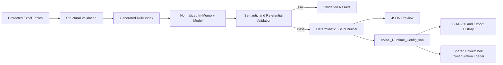

# eMAS Mapping and Configuration Workbook — Technical Requirements

**Project:** eMAS — eCTD Migration Assessment Script  
**Version:** 3.0  
**Status:** Effective Requirements Baseline  
**Scope:** XLSM logical model, VBA, validation and runtime JSON export  
**Classification:** Internal  
**Branding:** EXTEDO | a cormeo brand  
**Owner:** Technical Architect  
**Effective date:** 2026-07-13  
**Decision references:** Approved Decision Baseline v1.0; JSON-001–JSON-023; RM-001–RM-027; XL-001–XL-014; TEST-001–TEST-020

---

## 1. Purpose and authority

This document defines the effective technical requirements for implementing the eMAS mapping and configuration workbook as a controlled Microsoft Excel XLSM application.

The workbook maintains business-friendly tables, converts them into a normalized in-memory model through VBA, validates that model and exports one deterministic runtime JSON file directly from Excel.

The reviewed XLSM is the authoring source of truth. The validated immutable JSON is the runtime source of truth. PowerShell shall not read the workbook and shall not generate, repair or rewrite the JSON.

## 2. Technical architecture



## 3. Technology baseline

| Area | Requirement |
|---|---|
| Workbook | Microsoft Excel `.xlsm` |
| Supported Excel baseline | Excel 2019, Excel 2021 and Microsoft 365 for Windows |
| Office bitness | 32-bit and 64-bit |
| Automation | VBA contained in the workbook |
| Runtime output | One `eMAS_Runtime_Config.json` |
| JSON encoding | UTF-8 without BOM |
| External dependency | None required for validation/export |
| PowerShell dependency | Prohibited for workbook-to-JSON conversion |
| Runtime PowerShell baseline | Windows PowerShell 5.1 |
| Internet dependency | None |
| Database dependency | None |
| Production signing | Required before controlled release, subject to corporate certificate process |
| Locale support | Culture-invariant output regardless of Windows/Excel locale |

## 4. Workbook and table model

Logical entities shall be normalized even when several tables are grouped on one worksheet. Worksheet names may be business-friendly; Excel table names and technical headers shall be stable.

### 4.1 Governance tables

- `tblDocumentControl`
- `tblWorkbookControl`
- `tblChangeHistory`
- `tblChangeHistoryItems`
- `tblExportHistory`

### 4.2 Controlled-value and catalogue tables

- `tblValueLists`
- `tblFieldCatalogue`
- `tblMetricCatalogue`
- `tblReportDefinitions`
- `tblAliases`

### 4.3 Regulatory master-data tables

- `tblRegions`
- `tblAuthorities`
- `tblTechnicalStandards`
- `tblRegionalImplementations`
- `tblProductDomains`
- `tblLifecycleContexts`
- `tblProductClasses`
- `tblProcedureContexts`
- `tblSourcePresentations`
- `tblMasterDataRelationships`

### 4.4 Core rule tables

- `tblRules`
- `tblRulePhaseAssignments`
- `tblConditionGroups`
- `tblRuleConditions`
- `tblRuleOutputs`
- `tblRuleSupersession`

### 4.5 Findings, recommendations and policies

- `tblFindings`
- `tblRecommendations`
- `tblFindingRecommendationLinks`
- `tblConflictPolicies`
- `tblExceptionPolicies`
- `tblRagPolicies`
- `tblConfidencePolicies`
- `tblEffortDriverDefinitions`
- `tblEffortThresholds`
- `tblDecisionPolicies`
- `tblQuestionnaireMap`

### 4.6 Validation and technical tables

- `tblValidationControls`
- `tblValidationResults`
- `tblRuleIndex`
- `tblTechnicalSettings`

## 5. Fixed schema and Excel controls

| ID | Priority | Requirement |
|---|---|---|
| TR-SCHEMA-001 | MUST | Column headers shall remain fixed, protected and version-controlled. |
| TR-SCHEMA-002 | MUST | Excel table names shall remain stable and independent of visible worksheet names. |
| TR-SCHEMA-003 | MUST | Every finite value set shall be sourced from `Value_Lists` through data validation. |
| TR-SCHEMA-004 | MUST | Technical field names shall map deterministically to JSON properties. |
| TR-SCHEMA-005 | MUST | VBA shall identify columns by table and column name, never fixed cell position. |
| TR-SCHEMA-006 | MUST | Unsupported or missing mandatory columns shall block controlled export. |
| TR-SCHEMA-007 | MUST | User-maintained tables shall use Excel Tables with filters and frozen headers. |
| TR-SCHEMA-008 | MUST | Protected technical structures shall not be silently repaired during export. |

## 6. Identifiers and data types

| ID | Priority | Requirement |
|---|---|---|
| TR-ID-001 | MUST | Stable identifiers shall be unique within their entity type and globally unambiguous through prefix conventions. |
| TR-ID-002 | MUST | RuleId, FindingCode, RecommendationCode, ConditionId, relationship IDs and policy IDs shall never be reused for a different meaning. |
| TR-ID-003 | MUST | RuleRevision shall be an integer. |
| TR-ID-004 | MUST | Duplicate identifiers shall block export. |
| TR-FIELD-001 | MUST | `Field_Catalogue` shall define every field rules may evaluate. |
| TR-FIELD-002 | MUST | Supported data types shall include String, Code, Integer, Decimal, Boolean, Date, DateTime and Path. |
| TR-FIELD-003 | MUST | Operators shall be constrained by data type. |
| TR-FIELD-004 | MUST | Derived fields shall identify producing component and evaluation order. |
| TR-FIELD-005 | MUST | Unknown field codes shall block export. |
| TR-FIELD-006 | MUST | Decimal, date, date-time and Boolean serialization shall be culture-invariant. |

## 7. Rule, phase and condition model

| ID | Priority | Requirement |
|---|---|---|
| TR-RULE-001 | MUST | `tblRules` shall contain rule identity, revision, lifecycle, priority, conflict and source-reference fields. |
| TR-PHASE-001 | MUST | One row in `tblRulePhaseAssignments` shall represent one rule/phase behavior. |
| TR-PHASE-002 | MUST | Phase codes shall be `PRE_SALES`, `PRE_MIGRATION` and `POST_MIGRATION`. |
| TR-PHASE-003 | MUST | `All` shall not appear in runtime JSON; VBA may expand a helper value into explicit rows. |
| TR-COND-001 | MUST | One row in `tblConditionGroups` shall define one logical condition group. |
| TR-COND-002 | MUST | One row in `tblRuleConditions` shall represent one condition. |
| TR-COND-003 | MUST | Conditions in one group shall evaluate with AND. |
| TR-COND-004 | MUST | Separate groups for one rule shall evaluate with OR. |
| TR-COND-005 | MUST | Schema 1.0.0 shall support no more than two logical levels. |
| TR-COND-006 | MUST | Arbitrary expression code shall not be supported. |
| TR-COND-007 | MUST | Supported operators shall include `EQUALS`, `NOT_EQUALS`, `IN_LIST`, `CONTAINS`, `STARTS_WITH`, `ENDS_WITH`, `MATCHES_PATTERN`, `EXISTS`, `MISSING`, `GT`, `GTE`, `LT`, `LTE` and `BETWEEN`. |
| TR-COND-008 | MUST | Value serialization shall follow the data type from `Field_Catalogue`. |
| TR-OUT-001 | MUST | One row in `tblRuleOutputs` shall represent one ordered output. |
| TR-OUT-002 | MUST | Output types shall be controlled values. |

## 8. Lifecycle and supersession

| ID | Priority | Requirement |
|---|---|---|
| TR-LIFE-001 | MUST | Editable `IsActive` shall not be used on rule tables. |
| TR-LIFE-002 | MUST | Rule lifecycle shall use `Draft`, `InReview`, `Reviewed`, `Effective`, `Superseded` and `Retired`. |
| TR-LIFE-003 | MUST | Runtime eligibility shall be derived from status and effective dates. |
| TR-LIFE-004 | MUST | `tblRuleSupersession` shall maintain predecessor/successor relationships. |
| TR-LIFE-005 | MUST | Effective rules only shall enter controlled runtime JSON. |
| TR-LIFE-006 | SHOULD | Reviewed rules may enter DEV exports only. |
| TR-LIFE-007 | MUST | No rule shall move directly from Draft or InReview to Effective without Reviewed status. |

## 9. Classification and relationship model

The controlled classification dimensions are:

- Region;
- Authority;
- TechnicalStandard;
- RegionalImplementation;
- ProductDomain;
- LifecycleContext;
- ProductClass;
- ProcedureContext;
- SourcePresentation.

| ID | Priority | Requirement |
|---|---|---|
| TR-CLASS-001 | MUST | Regional implementation shall be stored independently from technical standard. |
| TR-CLASS-002 | MUST | ASMF shall be stored as ProcedureContext. |
| TR-CLASS-003 | MUST | Paper/scanned packaging shall be SourcePresentation where it is not a technical standard. |
| TR-CLASS-004 | MUST | Matched candidates, evidence strength, evidence score and confidence shall be preserved. |
| TR-CLASS-005 | MUST | New regulatory values shall not become Effective without the required SME review evidence. |
| TR-MD-001 | MUST | Master-data relationships shall use explicit relationship rows with stable IDs. |
| TR-MD-002 | MUST | Relationship type, source entity, target entity, status, effective dates and source reference shall be stored. |
| TR-MD-003 | MUST | Broken mandatory relationships shall block export. |
| TR-MD-004 | MUST | Broad regions such as MENA or LATAM shall not be treated as regulatory authorities. |

## 10. Evaluation, RAG and provenance

| Concept | Controlled values |
|---|---|
| EvaluationStatus | Evaluated, NotAssessed, NotApplicable, Skipped, Error, InsufficientEvidence, Conflict |
| RAG | Green, Amber, Red, Unknown |
| ValueSource | Observed, CustomerProvided, Imported, Derived, Assumed |

| ID | Priority | Requirement |
|---|---|---|
| TR-EVAL-001 | MUST | EvaluationStatus, RAG and ValueSource shall be separate fields in the in-memory and JSON models. |
| TR-EVAL-002 | MUST | `NotAssessed` and `NotApplicable` shall never be serialized as RAG. |
| TR-EVAL-003 | MUST | `Calculated` shall normalize to `Derived` where legacy source data is imported. |
| TR-EVAL-004 | MUST | Missing evidence shall not be treated as Green. |

## 11. Priority and conflict model

| ID | Priority | Requirement |
|---|---|---|
| TR-CONFLICT-001 | MUST | Lower numeric priority shall execute first. |
| TR-CONFLICT-002 | MUST | Priority shall normally use increments of 100. |
| TR-CONFLICT-003 | MUST | Executable rules shall support ConflictGroup, ConflictStrategy, Specificity and StopProcessing. |
| TR-CONFLICT-004 | MUST | Supported strategies shall include FirstMatch, MostSpecific, MostSevere, Aggregate, ErrorOnMultipleMatch, HighestEvidenceScore and ManualReview. |
| TR-CONFLICT-005 | MUST | Classification shall default to HighestEvidenceScore. |
| TR-CONFLICT-006 | MUST | Equal top scores shall produce Unknown or ManualReview. |
| TR-CONFLICT-007 | MUST | Folder/file findings shall default to Aggregate. |
| TR-CONFLICT-008 | MUST | RAG shall default to MostSevere. |
| TR-CONFLICT-009 | MUST | Decisions shall use ordered FirstMatch with mandatory blocker override. |
| TR-CONFLICT-010 | MUST | Unresolved conflicts shall be retained and shall not be silently resolved. |

## 12. Threshold, effort and exception model

| ID | Priority | Requirement |
|---|---|---|
| TR-THR-001 | MUST | Thresholds shall contain LowerBound, UpperBound, LowerInclusive, UpperInclusive and Unit. |
| TR-THR-002 | MUST | Default convention shall be lower-inclusive and upper-exclusive. |
| TR-THR-003 | MUST | Gaps, overlaps, inverted ranges and duplicate bands shall be validation errors where complete coverage is required. |
| TR-THR-004 | MUST | Open-ended lowest and highest bands shall be supported. |
| TR-EFF-001 | MUST | Effort-driver definitions and threshold bands shall be separate entities. |
| TR-EFF-002 | MUST | Hybrid effort calculation shall support weighted score plus minimum-band override. |
| TR-EFF-003 | MUST | Effort confidence shall be computed separately. |
| TR-EXC-001 | MUST | Exception policies shall define eligibility and allowed effects. |
| TR-EXC-002 | MUST | Project-specific accepted exceptions shall not be stored in the master workbook. |
| TR-EXC-003 | MUST | Original finding, original RAG and adjusted decision impact shall remain separately traceable. |
| TR-EXC-004 | MUST | Carry-forward to post-migration shall default to False. |

## 13. Findings, recommendations, aliases and report definitions

| ID | Priority | Requirement |
|---|---|---|
| TR-FIND-001 | MUST | Finding definitions shall be separate from rules and recommendations. |
| TR-FIND-002 | MUST | Finding-to-recommendation relationships shall use a link table. |
| TR-FIND-003 | MUST | Multiple ordered recommendations shall be supported without fixed numbered columns. |
| TR-ALIAS-001 | MUST | Aliases shall be scoped, versioned, validated and traceable. |
| TR-ALIAS-002 | MUST | Alias resolution shall not change raw evidence values. |
| TR-RPT-001 | MUST | Report definitions and terminology shall use controlled phase and result codes. |
| TR-RPT-002 | MUST | Customer-facing and consultant-facing text shall remain separate. |

## 14. VBA architecture

### 14.1 Standard modules

- `modMain`
- `modConstants`
- `modWorkbookStructure`
- `modValidation`
- `modRuleValidation`
- `modReferenceValidation`
- `modConditionValidation`
- `modThresholdValidation`
- `modConflictValidation`
- `modJsonBuilder`
- `modJsonWriter`
- `modExportHistory`
- `modChecksum`
- `modLogging`
- `modUtilities`

### 14.2 Class modules

- `clsRule`
- `clsCondition`
- `clsConditionGroup`
- `clsRulePhase`
- `clsRuleOutput`
- `clsFinding`
- `clsRecommendation`
- `clsValidationResult`
- `clsJsonObject`

### 14.3 Engineering requirements

| ID | Priority | Requirement |
|---|---|---|
| TR-VBA-001 | MUST | All modules shall use `Option Explicit`. |
| TR-VBA-002 | MUST | VBA shall not rely on ActiveCell, Selection or fixed coordinates. |
| TR-VBA-003 | MUST | Errors shall capture procedure, number, description and entity context. |
| TR-VBA-004 | MUST | JSON generation shall occur in memory before writing to disk. |
| TR-VBA-005 | MUST | JSON escaping shall support Unicode, control characters and special characters. |
| TR-VBA-006 | MUST | JSON output shall be UTF-8 without BOM. |
| TR-VBA-007 | MUST | Decimal, date, time and Boolean values shall be serialized culture-invariantly. |
| TR-VBA-008 | MUST | JSON property and collection ordering shall be deterministic where required by the contract. |
| TR-VBA-009 | SHOULD | VBA source shall be exported to `.bas`, `.cls` and `.frm` files for source control. |
| TR-VBA-010 | SHOULD | Release workbook creation should import approved source-controlled modules. |
| TR-VBA-011 | MUST | Export shall be atomic: a failed export shall not leave a file represented as controlled. |

## 15. Mandatory validation sequence

1. Confirm workbook structure and protected tables.
2. Read document and workbook control metadata.
3. Rebuild `Rule_Index`.
4. Validate required tables and columns.
5. Validate controlled values and code lists.
6. Validate globally unique identifiers.
7. Validate lifecycle, effective dates and supersession.
8. Validate phase assignments.
9. Validate field codes, types and operators.
10. Validate condition groups and logical depth.
11. Validate master-data relationships.
12. Validate thresholds for gaps, overlaps and inversions.
13. Validate conflicts, priorities and specificity.
14. Validate findings and rule outputs.
15. Validate recommendation links.
16. Validate exception policies.
17. Validate report terminology and aliases.
18. Validate schema and engine compatibility metadata.
19. Build normalized in-memory objects.
20. Generate JSON in memory.
21. Validate generated JSON structure and semantics.
22. Display preview and section counts.
23. Export UTF-8 JSON without BOM.
24. Calculate SHA-256.
25. Record export history.

Critical validations shall not be disableable through `Validation_Controls`.

## 16. Runtime JSON technical contract

### 16.1 Canonical files and schema

- Controlled runtime filename: `eMAS_Runtime_Config.json`
- Schema: `config/schema/eMAS-runtime-config.schema.json`
- JSON Schema dialect: Draft 2020-12
- Initial schema version: `1.0.0`

### 16.2 Canonical top-level sections

```json
{
  "configuration": {},
  "valueLists": {},
  "fieldCatalogue": [],
  "metricCatalogue": [],
  "masterData": {},
  "relationships": [],
  "rules": [],
  "rulePhases": [],
  "conditionGroups": [],
  "ruleConditions": [],
  "ruleOutputs": [],
  "findings": [],
  "recommendations": [],
  "findingRecommendationLinks": [],
  "exceptionPolicies": [],
  "aliases": [],
  "reportTerminology": {}
}
```

The JSON Schema is authoritative for exact property names, required fields, controlled values and additional-property behavior.

### 16.3 Versioning and compatibility

| ID | Priority | Requirement |
|---|---|---|
| TR-JSON-001 | MUST | SchemaVersion, MappingVersion and SourceWorkbookVersion shall be independent. |
| TR-JSON-002 | MUST | Schema and mapping versions shall use Semantic Versioning. |
| TR-JSON-003 | MUST | JSON shall include MinimumEngineVersion and may include MaximumTestedEngineVersion. |
| TR-JSON-004 | MUST | Unsupported major schema versions shall be rejected. |
| TR-JSON-005 | MUST | Unknown executable operators, conflict strategies and controlled values shall be rejected. |
| TR-JSON-006 | MUST | Unknown descriptive metadata may be ignored only according to the approved compatibility policy and with warning. |
| TR-JSON-007 | MUST | New optional descriptive fields may be backward compatible. |
| TR-JSON-008 | MUST | Removed/renamed fields, changed data types, new mandatory sections or changed code meaning are breaking changes. |

### 16.4 Serialization and file integrity

| ID | Priority | Requirement |
|---|---|---|
| TR-EXP-001 | MUST | Output shall be complete UTF-8 without BOM. |
| TR-EXP-002 | MUST | JSON preview may be truncated for display; exported JSON shall never be truncated. |
| TR-EXP-003 | MUST | Numbers shall use a period decimal separator. |
| TR-EXP-004 | MUST | Dates and date-times shall use ISO 8601-compatible representations. |
| TR-EXP-005 | MUST | Booleans and nulls shall use JSON-native tokens. |
| TR-EXP-006 | MUST | Controlled export shall be deterministic for equivalent approved workbook content. |
| TR-EXP-007 | MUST | SHA-256 shall be calculated after export and recorded in export history and the release manifest. |
| TR-EXP-008 | MUST | The runtime file shall be immutable after export. |
| TR-EXP-009 | MUST | Version information shall be stored in metadata and manifests, not embedded in the controlled runtime filename. |

## 17. Runtime loader boundary

The Windows PowerShell 5.1 loader shall:

- verify file existence, readability, size and SHA-256;
- parse JSON without relying on PowerShell 7-only `Test-Json`;
- validate supported schema and engine compatibility;
- validate required sections, identifiers and references;
- distinguish invalid configuration from unavailable customer evidence;
- stop before source scanning when configuration validation fails;
- never repair, normalize or rewrite the runtime JSON.

## 18. Security, signing and repository controls

| ID | Priority | Requirement |
|---|---|---|
| TR-SEC-001 | MUST | VBA source used for controlled releases shall be reviewable through exported source files. |
| TR-SEC-002 | MUST | Production workbook signing shall follow the approved corporate certificate and trust process. |
| TR-SEC-003 | MUST | The public repository shall not contain confidential controlled XLSM binaries, customer data or project evidence. |
| TR-SEC-004 | MUST | Runtime JSON shall not contain credentials, secrets or uncontrolled workbook comments. |
| TR-SEC-005 | MUST | Export paths and temporary files shall be handled safely and cleaned after successful or failed export. |
| TR-SEC-006 | MUST | Release manifests shall record hashes for controlled workbook, JSON, scripts and templates where applicable. |

## 19. Verification requirements

Verification shall include:

- supported Excel versions and 32/64-bit Office;
- German and English locale execution;
- Unicode and escaping cases;
- deterministic export comparison;
- valid and invalid schema fixtures;
- duplicate and broken-reference cases;
- lifecycle and supersession cases;
- condition and conflict cases;
- threshold boundary cases;
- controlled versus DEV export cases;
- checksum and atomic-export cases;
- Windows PowerShell 5.1 loader compatibility.

## 20. Acceptance criteria

The technical baseline is satisfied when:

1. the workbook uses stable protected tables and headers;
2. normalized entities and relationships are represented without comma-separated relationships;
3. VBA builds and validates a normalized in-memory model;
4. the generated Rule Index is reproducible;
5. critical failures block export;
6. JSON matches the approved schema and canonical top-level structure;
7. output is deterministic UTF-8 without BOM and culture-invariant;
8. the canonical filename is `eMAS_Runtime_Config.json`;
9. SHA-256 and export history are recorded;
10. PowerShell is not used to generate or repair JSON;
11. controlled regulatory content requires the approved SME workflow;
12. the solution works on the supported Excel/Office baseline and the runtime loader supports Windows PowerShell 5.1.

## 21. Delivery state

This document defines the Effective technical design. The XLSM/VBA implementation, code signing, golden fixtures, independent schema validation and controlled release qualification remain implementation work tracked separately.

## 22. Revision history

| Version | Date | Change |
|---|---|---|
| 2.0 | 2026-07-12 | Draft normalized technical design before approved-decision synchronization |
| 3.0 | 2026-07-13 | Effective technical baseline aligned to governance, terminology, JSON contract and normalized rule model |
