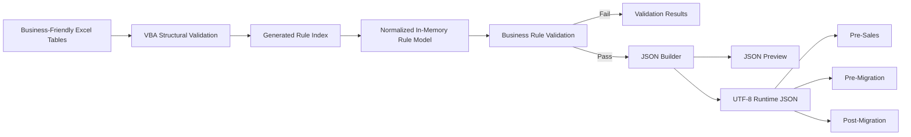

# eMAS Mapping and Configuration Workbook — Technical Requirements

**Project:** eMAS — eCTD Migration Assessment Script  
**Version:** 2.0  
**Status:** Draft for Review  
**Scope:** XLSM Logical Model, VBA, Validation and Runtime JSON  
**Classification:** Internal  
**Branding:** EXTEDO | a cormeo brand

---

## 1. Purpose

This document defines the technical requirements for implementing the eMAS mapping and configuration workbook as a controlled Microsoft Excel XLSM application.

The workbook shall maintain business-friendly sheets, normalize their content into a structured in-memory model through VBA, validate the model and export one UTF-8 runtime JSON file directly from Excel.

PowerShell shall not read the workbook and shall not generate the JSON.

---

## 2. Technical Architecture



---

## 3. Technology Baseline

| Area | Requirement |
|---|---|
| Workbook | Microsoft Excel `.xlsm` |
| Initial Excel support | Excel 2019, Excel 2021 and Microsoft 365 for Windows |
| Office bitness | 32-bit and 64-bit |
| Automation | VBA contained in workbook |
| Runtime output | One UTF-8 JSON file |
| External dependency | None required for validation/export |
| PowerShell dependency | Prohibited for workbook-to-JSON conversion |
| Internet dependency | None |
| Database dependency | None |
| Production signing | Required before controlled release, subject to corporate certificate process |

---

## 4. Fixed Schema and Dropdown Requirements

| ID | Priority | Requirement |
|---|---|---|
| TR-SCHEMA-001 | MUST | Column headers shall remain fixed, protected and version-controlled. |
| TR-SCHEMA-002 | MUST | Excel table names shall remain stable and independent of visible sheet names. |
| TR-SCHEMA-003 | MUST | Every finite value set shall be sourced from `Value_Lists` through data validation. |
| TR-SCHEMA-004 | MUST | Column headers shall not use dropdowns. |
| TR-SCHEMA-005 | MUST | Technical field names shall map deterministically to JSON properties. |
| TR-SCHEMA-006 | MUST | VBA shall identify columns by table and column name, never fixed cell position. |

---

## 5. Normalized Table Architecture

### 5.1 Governance tables

- `tblDocumentControl`
- `tblChangeHistory`
- `tblChangeHistoryItems`
- `tblExportHistory`

### 5.2 Master data tables

- `tblAssessmentProfile`
- `tblValueLists`
- `tblFieldCatalogue`
- `tblMetricCatalogue`
- `tblRegions`
- `tblAuthorities`
- `tblFormats`
- `tblProductDomains`
- `tblLifecycleContexts`
- `tblProductClasses`
- `tblMasterDataRelationships`

### 5.3 Business rule tables

- `tblClassificationRules`
- `tblFolderRules`
- `tblFileRules`
- `tblXmlDetectionRules`
- `tblRagRules`
- `tblConfidenceRules`
- `tblEffortDriverDefinitions`
- `tblEffortDriverBands`
- `tblDecisionRules`

### 5.4 Shared relationship tables

- `tblRulePhaseAssignments`
- `tblRuleConditions`
- `tblRuleOutputs`
- `tblRuleSupersession`

### 5.5 Finding and action tables

- `tblFindings`
- `tblRecommendations`
- `tblFindingRecommendationLinks`
- `tblQuestionnaireMap`
- `tblExceptionPolicies`
- `tblAliases`

### 5.6 Validation and technical tables

- `tblValidationControls`
- `tblValidationResults`
- `tblRuleIndex`
- `tblTechnicalSettings`

---

## 6. Field Catalogue and Data Types

| ID | Priority | Requirement |
|---|---|---|
| TR-FIELD-001 | MUST | `Field_Catalogue` shall define every field rules may evaluate. |
| TR-FIELD-002 | MUST | Each field shall define DataType, AllowedOperators, SupportedPhases, SourceType and EvaluationOrder. |
| TR-FIELD-003 | MUST | Supported data types shall include String, Code, Integer, Decimal, Boolean, Date, DateTime and Path. |
| TR-FIELD-004 | MUST | Operators shall be constrained by data type. |
| TR-FIELD-005 | MUST | Derived fields shall identify the producing engine component. |
| TR-FIELD-006 | MUST | Unknown field codes shall block export. |

---

## 7. Condition Model

| ID | Priority | Requirement |
|---|---|---|
| TR-COND-001 | MUST | One row in `tblRuleConditions` shall represent one condition. |
| TR-COND-002 | MUST | Conditions shall contain ConditionId, RuleId, GroupId, FieldCode, Operator, Value1, Value2 and Sequence. |
| TR-COND-003 | MUST | Conditions within one GroupId shall evaluate with AND. |
| TR-COND-004 | MUST | Separate groups for the same RuleId shall evaluate with OR. |
| TR-COND-005 | MUST | Maximum logical nesting depth for schema 1.0.0 shall be two levels. |
| TR-COND-006 | MUST | Arbitrary expression text shall not be supported. |
| TR-COND-007 | MUST | Allowed operators shall include EQUALS, NOT_EQUALS, IN_LIST, CONTAINS, STARTS_WITH, ENDS_WITH, MATCHES_PATTERN, EXISTS, MISSING, GT, GTE, LT, LTE and BETWEEN. |
| TR-COND-008 | MUST | Value serialization shall follow the data type from Field_Catalogue. |

---

## 8. Priority, Specificity and Conflict Model

| ID | Priority | Requirement |
|---|---|---|
| TR-CONFLICT-001 | MUST | Lower numeric priority shall execute first. |
| TR-CONFLICT-002 | MUST | Priority shall normally use increments of 100. |
| TR-CONFLICT-003 | MUST | Each executable rule shall support ConflictGroup, ConflictStrategy, Specificity and StopProcessing. |
| TR-CONFLICT-004 | MUST | Supported strategies shall include FirstMatch, MostSpecific, MostSevere, Aggregate, ErrorOnMultipleMatch, HighestEvidenceScore and ManualReview. |
| TR-CONFLICT-005 | MUST | Classification shall default to HighestEvidenceScore. |
| TR-CONFLICT-006 | MUST | Equal top classification scores shall produce Unknown or ManualReview. |
| TR-CONFLICT-007 | MUST | Folder/file findings shall default to Aggregate. |
| TR-CONFLICT-008 | MUST | RAG shall default to MostSevere. |
| TR-CONFLICT-009 | MUST | Decisions shall use ordered FirstMatch with blocker override. |

---

## 9. Lifecycle and Supersession Model

| ID | Priority | Requirement |
|---|---|---|
| TR-LIFE-001 | MUST | Editable `IsActive` shall not be used on rule tables. |
| TR-LIFE-002 | MUST | Runtime eligibility shall be derived from Status, EffectiveFrom and EffectiveTo. |
| TR-LIFE-003 | MUST | `tblRuleSupersession` shall maintain predecessor/successor relationships. |
| TR-LIFE-004 | MUST | RuleId shall never be reused. |
| TR-LIFE-005 | MUST | Effective rules only shall enter controlled runtime JSON. |
| TR-LIFE-006 | SHOULD | Reviewed rules may enter DEV exports only. |

---

## 10. Threshold and Band Model

| ID | Priority | Requirement |
|---|---|---|
| TR-THR-001 | MUST | Thresholds shall contain LowerBound, UpperBound, LowerInclusive, UpperInclusive and Unit. |
| TR-THR-002 | MUST | Default convention shall be lower-inclusive and upper-exclusive. |
| TR-THR-003 | MUST | Gaps, overlaps and duplicate bands shall be validation errors for complete band sets. |
| TR-THR-004 | MUST | Open-ended lowest and highest bands shall be supported. |
| TR-THR-005 | MUST | Effort-driver definitions and effort bands shall be separate tables. |

---

## 11. Findings, Recommendations and Exception Policies

| ID | Priority | Requirement |
|---|---|---|
| TR-FIND-001 | MUST | Finding definitions shall be separate from rules and recommendations. |
| TR-FIND-002 | MUST | Finding-to-recommendation relationships shall use a link table. |
| TR-FIND-003 | MUST | Multiple recommendations shall be supported without fixed numbered columns. |
| TR-EXC-001 | MUST | Exception policies shall define eligibility and allowed effects. |
| TR-EXC-002 | MUST | Project-specific exceptions shall not be stored in the master workbook. |
| TR-EXC-003 | MUST | Original finding, original RAG and adjusted decision impact shall remain separately traceable. |

---

## 12. VBA Architecture

### 12.1 Standard modules

- `modMain`
- `modConstants`
- `modWorkbookStructure`
- `modValidation`
- `modRuleValidation`
- `modReferenceValidation`
- `modConditionValidation`
- `modThresholdValidation`
- `modConflictValidation`
- `modJsonBuilder`
- `modJsonWriter`
- `modExportHistory`
- `modLogging`
- `modUtilities`

### 12.2 Class modules

- `clsRule`
- `clsCondition`
- `clsConditionGroup`
- `clsRulePhase`
- `clsFinding`
- `clsRecommendation`
- `clsValidationResult`
- `clsJsonObject`

### 12.3 Engineering requirements

| ID | Priority | Requirement |
|---|---|---|
| TR-VBA-001 | MUST | All modules shall use `Option Explicit`. |
| TR-VBA-002 | MUST | VBA shall not rely on ActiveCell, Selection or fixed coordinates. |
| TR-VBA-003 | MUST | Errors shall capture procedure, number, description and object context. |
| TR-VBA-004 | MUST | JSON generation shall occur in memory before writing to disk. |
| TR-VBA-005 | MUST | JSON escaping shall support Unicode and special characters. |
| TR-VBA-006 | MUST | Exported JSON shall be UTF-8 and complete. |
| TR-VBA-007 | SHOULD | VBA source shall be exported to `.bas`, `.cls` and `.frm` files for source control. |
| TR-VBA-008 | SHOULD | Release workbook creation should import approved source-controlled VBA modules. |

---

## 13. Validation Architecture

Mandatory validation sequence:

1. Confirm workbook structure.
2. Read document-control metadata.
3. Rebuild Rule_Index.
4. Validate required tables and columns.
5. Validate code lists.
6. Validate globally unique IDs.
7. Validate lifecycle and effective dates.
8. Validate phase assignments.
9. Validate field codes and operators.
10. Validate condition groups.
11. Validate thresholds for gaps and overlaps.
12. Validate conflicts, priorities and specificity.
13. Validate finding references.
14. Validate recommendation links.
15. Validate exception policies.
16. Validate schema and engine compatibility.
17. Build normalized in-memory objects.
18. Generate JSON in memory.
19. Validate generated JSON structure.
20. Display preview.
21. Export UTF-8 JSON.
22. Calculate checksum where enabled.
23. Record export history.

Critical validations shall be built into VBA and shall not be disableable through `Validation_Controls`.

---

## 14. JSON Technical Contract

| ID | Priority | Requirement |
|---|---|---|
| TR-JSON-001 | MUST | SchemaVersion shall use semantic versioning, initially `1.0.0`. |
| TR-JSON-002 | MUST | MappingVersion shall use semantic versioning independently. |
| TR-JSON-003 | MUST | JSON shall include MinimumEngineVersion. |
| TR-JSON-004 | MUST | Unsupported major schema versions shall be rejected by the engine. |
| TR-JSON-005 | MUST | Unknown executable operators shall be rejected. |
| TR-JSON-006 | MUST | Unknown descriptive metadata may be ignored with warning. |
| TR-JSON-007 | MUST | New optional descriptive fields may be backward compatible. |
| TR-JSON-008 | MUST | Renamed/removed fields, changed data types, new mandatory sections or changed code meanings shall be treated as breaking. |

Indicative top-level sections:

```json
{
  "configuration": {},
  "valueLists": {},
  "fieldCatalogue": [],
  "metricCatalogue": [],
  "masterData": {},
  "rules": [],
  "findings": [],
  "recommendations": [],
  "findingRecommendationLinks": [],
  "exceptionPolicies": [],
  "aliases": []
}
```

---

## 15. JSON Preview and Export

| ID | Priority | Requirement |
|---|---|---|
| TR-EXP-001 | MUST | JSON preview shall show mapping version, schema version, validation state and section counts. |
| TR-EXP-002 | SHOULD | Large JSON preview may be truncated in the worksheet. |
| TR-EXP-003 | MUST | Exported JSON shall never be truncated. |
| TR-EXP-004 | MUST | Export history shall record user, timestamp, status, filename, path, validation run and checksum when enabled. |
| TR-EXP-005 | SHOULD | SHA-256 shall be used for controlled release packages. |
| TR-EXP-006 | MUST | DEV exports shall be clearly named and recorded. |

---

## 16. Security and Release Controls

- Workbook shall operate offline.
- No credentials or customer data shall be embedded.
- Workbook structure and VBA project should be protected.
- Controlled production release should be digitally signed.
- Signing certificate ownership and re-signing procedure shall be documented.
- Macro trust requirements shall be included in administrator guidance.

---

## 17. Test Requirements

- Positive and negative workbook fixtures.
- Expected JSON fixtures.
- Unicode and special-character tests.
- Boolean, date, null and numeric serialization tests.
- Duplicate ID tests.
- Broken-reference tests.
- Threshold gap/overlap tests.
- Conflict and tie tests.
- Lifecycle and supersession tests.
- DEV versus Effective export tests.
- Schema compatibility tests.
- One end-to-end example for every rule category.

---

## 18. Open Questions

| ID | Open question |
|---|---|
| OQ-TR-001 | Confirm corporate minimum Excel build and macro trust policy. |
| OQ-TR-002 | Confirm certificate owner and signing/re-signing procedure. |
| OQ-TR-003 | Confirm whether SHA-256 is mandatory in the first controlled release. |
| OQ-TR-004 | Confirm maximum expected rule, condition and link volumes. |
| OQ-TR-005 | Confirm whether JSON Schema validation will also be implemented independently outside VBA. |
| OQ-TR-006 | Confirm whether report configuration belongs in schema 1.0.0 or remains script/template controlled. |

---

## 19. Technical Acceptance Criteria

The technical design is ready when:

1. the logical tables and keys are frozen;
2. field/operator/data-type contracts are frozen;
3. lifecycle and phase relationships are deterministic;
4. conditions normalize into a two-level model;
5. conflict strategies are deterministic;
6. JSON Schema 1.0.0 can represent every relationship;
7. one representative rule per category can travel Excel → VBA object → JSON → PowerShell result;
8. validation blocks all known structural and referential defects.
