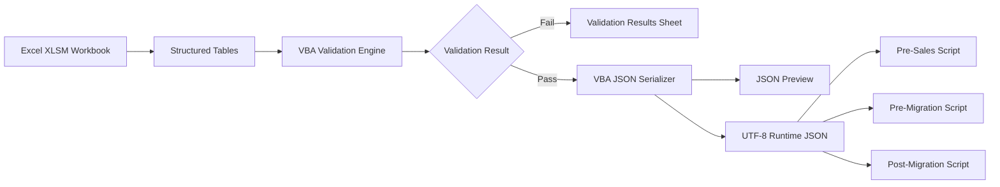

# eMAS Mapping and Configuration Workbook — Technical Requirements

**Project:** eMAS — eCTD Migration Assessment Script  
**Document Type:** Technical Requirements Specification  
**Version:** 1.0  
**Status:** Draft for Review  
**Scope:** Internal XLSM Mapping Workbook and Runtime JSON Export  
**Classification:** Internal  
**Branding:** EXTEDO | a cormeo brand

---

## 1. Purpose

This document defines the technical requirements for implementing the eMAS mapping and configuration workbook as a Microsoft Excel macro-enabled workbook that validates maintained rules and exports one runtime JSON file directly from Excel.

PowerShell shall not read the workbook and shall not generate the runtime JSON.

---

## 2. Technical Architecture



---

## 3. Technology Baseline

| Area | Requirement |
|---|---|
| Authoring Platform | Microsoft Excel Desktop |
| Workbook Type | `.xlsm` |
| Automation | VBA contained in the workbook |
| Runtime Output | One UTF-8 JSON file |
| External Dependencies | None required for export |
| PowerShell Dependency | Prohibited for JSON generation |
| Database Dependency | None |
| Internet Dependency | None |
| Customer Distribution | Workbook prohibited; JSON only where required |
| Supported Operating Environment | Windows desktop with an approved Excel version |

---

## 4. Technical Requirements

### 4.1 Workbook structure

| ID | Priority | Requirement |
|---|---|---|
| TR-MAP-001 | MUST | The workbook shall use Excel structured tables for all maintained rule data. |
| TR-MAP-002 | MUST | Each table shall have a stable technical table name. |
| TR-MAP-003 | MUST | Table names shall not depend on visible sheet names. |
| TR-MAP-004 | MUST | Required columns shall use stable technical column names. |
| TR-MAP-005 | MUST | The workbook shall separate user-maintained sheets, validation sheets, code lists and technical support sheets. |
| TR-MAP-006 | SHOULD | Technical support sheets shall be hidden or very hidden where appropriate. |
| TR-MAP-007 | MUST | Workbook structure protection shall prevent accidental deletion or renaming of required sheets. |
| TR-MAP-008 | MUST | Protection shall not prevent authorized maintainers from editing intended input cells. |

### 4.2 Recommended technical table names

| Sheet | Table name |
|---|---|
| Document_Control | tblDocumentControl |
| Change_History | tblChangeHistory |
| Assessment_Profile | tblAssessmentProfile |
| Regions | tblRegions |
| Authorities | tblAuthorities |
| Formats | tblFormats |
| Dossier_Types | tblDossierTypes |
| Classification_Rules | tblClassificationRules |
| Folder_Rules | tblFolderRules |
| File_Rules | tblFileRules |
| XML_Detection_Rules | tblXmlDetectionRules |
| RAG_Rules | tblRagRules |
| Confidence_Rules | tblConfidenceRules |
| Effort_Drivers | tblEffortDrivers |
| Decision_Rules | tblDecisionRules |
| Recommendations | tblRecommendations |
| Questionnaire_Map | tblQuestionnaireMap |
| Aliases | tblAliases |
| Value_Lists | tblValueLists |
| Validation_Controls | tblValidationControls |
| Validation_Results | tblValidationResults |
| Export_History | tblExportHistory |

### 4.3 Data typing

| ID | Priority | Requirement |
|---|---|---|
| TR-MAP-010 | MUST | Each maintained column shall have a defined data type. |
| TR-MAP-011 | MUST | Boolean values shall use controlled TRUE/FALSE or Yes/No values and shall serialize consistently. |
| TR-MAP-012 | MUST | Dates shall serialize as ISO 8601 values. |
| TR-MAP-013 | MUST | Date-time values shall include timezone offset where available. |
| TR-MAP-014 | MUST | Numeric thresholds shall remain numeric in JSON. |
| TR-MAP-015 | MUST | Empty optional values shall serialize as null or be omitted according to the approved schema. |
| TR-MAP-016 | MUST | Empty required values shall cause validation failure. |
| TR-MAP-017 | MUST | Multi-value fields shall not use uncontrolled comma-delimited text where a child table or structured array is required. |

### 4.4 VBA design

| ID | Priority | Requirement |
|---|---|---|
| TR-MAP-020 | MUST | VBA shall be modular and separated into validation, serialization, export, utility and UI-control modules. |
| TR-MAP-021 | MUST | Suggested modules shall include modValidation, modJsonSerializer, modExport, modWorkbookControl and modUtilities. |
| TR-MAP-022 | MUST | VBA procedures shall use explicit variable declarations. |
| TR-MAP-023 | MUST | Error handling shall capture procedure, error number, description and context. |
| TR-MAP-024 | MUST | VBA shall not silently suppress export errors. |
| TR-MAP-025 | MUST | JSON special characters shall be escaped correctly. |
| TR-MAP-026 | MUST | JSON output shall support Unicode content. |
| TR-MAP-027 | MUST | Export shall use UTF-8 without introducing an invalid encoding marker. |
| TR-MAP-028 | SHOULD | VBA source modules should be exportable to repository text files for code review and version control. |
| TR-MAP-029 | SHOULD | A workbook build process should import approved VBA modules into the release workbook. |

### 4.5 JSON schema

| ID | Priority | Requirement |
|---|---|---|
| TR-MAP-030 | MUST | The runtime JSON shall have one top-level object. |
| TR-MAP-031 | MUST | The JSON shall contain a configuration metadata section. |
| TR-MAP-032 | MUST | The JSON shall include configurationId, mappingVersion, schemaVersion, status, exportedAt and exportedBy. |
| TR-MAP-033 | MUST | Rule collections shall be serialized as arrays. |
| TR-MAP-034 | MUST | Stable IDs shall be preserved exactly. |
| TR-MAP-035 | MUST | Active runtime rules shall be distinguishable by category. |
| TR-MAP-036 | MUST | JSON property names shall use a single approved naming convention, recommended camelCase. |
| TR-MAP-037 | MUST | The schema shall define required and optional properties. |
| TR-MAP-038 | MUST | The schema shall define approved enum values. |
| TR-MAP-039 | MUST | The schema shall define supported operators and units. |
| TR-MAP-040 | MUST | The schema shall support compatibility checks by PowerShell. |

### 4.6 Indicative JSON structure

```json
{
  "configuration": {
    "configurationId": "EMAS-CONFIG-001",
    "mappingVersion": "1.0",
    "schemaVersion": "1.0",
    "status": "Reviewed",
    "exportedAt": "2026-07-12T12:00:00+02:00",
    "exportedBy": "DOMAIN\\User"
  },
  "valueLists": {},
  "regions": [],
  "authorities": [],
  "formats": [],
  "dossierTypes": [],
  "classificationRules": [],
  "folderRules": [],
  "fileRules": [],
  "xmlDetectionRules": [],
  "ragRules": [],
  "confidenceRules": [],
  "effortDrivers": [],
  "decisionRules": [],
  "recommendations": [],
  "questionnaireMap": [],
  "aliases": []
}
```

### 4.7 Rule-condition model

| ID | Priority | Requirement |
|---|---|---|
| TR-MAP-050 | MUST | Conditions shall use structured fields rather than executable code. |
| TR-MAP-051 | MUST | The workbook shall not export VBA expressions, PowerShell expressions or arbitrary script fragments as rules. |
| TR-MAP-052 | MUST | Supported operators shall be controlled, such as Equals, NotEquals, Contains, StartsWith, EndsWith, MatchesPattern, Exists, Missing, GreaterThan, GreaterThanOrEqual, LessThan, LessThanOrEqual, Between and InList. |
| TR-MAP-053 | MUST | Each condition shall identify EvidenceField, Operator and ExpectedValue. |
| TR-MAP-054 | SHOULD | Compound rules shall use ConditionGroupId and logical operator AND/OR. |
| TR-MAP-055 | MUST | Nested logic depth shall be limited and documented. |
| TR-MAP-056 | MUST | Invalid or unsupported operators shall fail workbook validation. |

### 4.8 Priority and conflict processing

| ID | Priority | Requirement |
|---|---|---|
| TR-MAP-060 | MUST | Every executable rule shall have an integer priority. |
| TR-MAP-061 | MUST | Priority semantics shall be documented consistently, for example lower number executes first. |
| TR-MAP-062 | MUST | Conflict strategy shall be represented by controlled values. |
| TR-MAP-063 | SHOULD | Supported strategies may include FirstMatch, HighestPriority, MostSevere, Aggregate and ManualReview. |
| TR-MAP-064 | MUST | Conflicting rules that cannot be resolved deterministically shall produce Unknown or Review Required according to rule category. |
| TR-MAP-065 | MUST | Duplicate active rules with identical scope, condition and priority shall fail validation. |

### 4.9 Threshold representation

| ID | Priority | Requirement |
|---|---|---|
| TR-MAP-070 | MUST | Threshold rules shall not rely on descriptive text only. |
| TR-MAP-071 | MUST | Thresholds shall contain operator, lower value, upper value, unit and boundary behaviour. |
| TR-MAP-072 | MUST | Inclusive and exclusive boundaries shall be explicit. |
| TR-MAP-073 | MUST | Overlapping active thresholds in the same scope shall fail validation unless an approved overlap strategy exists. |
| TR-MAP-074 | MUST | Gaps between mandatory scoring bands shall produce a validation warning or error. |

### 4.10 Validation engine

| ID | Priority | Requirement |
|---|---|---|
| TR-MAP-080 | MUST | Validation shall run before JSON preview and export. |
| TR-MAP-081 | MUST | Validation shall include structural, field, reference, uniqueness, enum, threshold and compatibility checks. |
| TR-MAP-082 | MUST | Validation results shall be written to tblValidationResults. |
| TR-MAP-083 | MUST | Each result shall include ValidationId, Severity, Sheet, Table, RowNumber, ObjectId, Field, Message and CorrectiveAction. |
| TR-MAP-084 | MUST | Critical and Error findings shall block export. |
| TR-MAP-085 | SHOULD | Warning findings shall require explicit acknowledgement before export. |
| TR-MAP-086 | MUST | Validation shall be repeatable and shall clear or supersede prior run results. |
| TR-MAP-087 | MUST | Validation run timestamp and user shall be recorded. |

### 4.11 Export controls

| ID | Priority | Requirement |
|---|---|---|
| TR-MAP-090 | MUST | Export shall open a controlled Save As dialog or use a configured export folder. |
| TR-MAP-091 | MUST | The default file name shall include configuration ID and mapping version. |
| TR-MAP-092 | MUST | Export shall prevent accidental overwrite unless confirmed. |
| TR-MAP-093 | MUST | Export shall verify that the resulting JSON can be reopened and parsed by the workbook serializer or validator. |
| TR-MAP-094 | MUST | Export history shall record success or failure. |
| TR-MAP-095 | SHOULD | Export shall calculate SHA-256 using an approved implementation if technically feasible without external dependencies. |
| TR-MAP-096 | MUST | The exported JSON shall not contain hidden workbook data, formulas, VBA source or comments not designated for runtime. |

### 4.12 Security and protection

| ID | Priority | Requirement |
|---|---|---|
| TR-MAP-100 | MUST | Macro execution requirements shall be documented. |
| TR-MAP-101 | SHOULD | The workbook VBA project and workbook structure should be protected against accidental modification. |
| TR-MAP-102 | SHOULD | The release workbook should be digitally signed where an approved certificate process exists. |
| TR-MAP-103 | MUST | No credentials, connection strings or customer data shall be embedded in the workbook. |
| TR-MAP-104 | MUST | The workbook shall operate offline. |
| TR-MAP-105 | MUST | The exported JSON shall contain business rules only and no customer-specific source evidence. |

### 4.13 Performance

| ID | Priority | Requirement |
|---|---|---|
| TR-MAP-110 | SHOULD | Validation shall complete within an acceptable time for the expected rule volume. |
| TR-MAP-111 | SHOULD | Export shall avoid cell-by-cell processing where table-array processing is possible. |
| TR-MAP-112 | SHOULD | JSON preview may be truncated or paged if the full content exceeds practical worksheet limits, while exported JSON remains complete. |
| TR-MAP-113 | MUST | Large rule sets shall not cause silent truncation. |

### 4.14 Compatibility and release

| ID | Priority | Requirement |
|---|---|---|
| TR-MAP-120 | MUST | The workbook shall declare supported JSON schema versions. |
| TR-MAP-121 | MUST | Each script release shall declare supported schema-version range. |
| TR-MAP-122 | MUST | Export shall warn when the selected target script version is incompatible, if target compatibility is maintained in the workbook. |
| TR-MAP-123 | SHOULD | Backward-compatible schema changes shall add optional fields without changing existing meaning. |
| TR-MAP-124 | MUST | Breaking changes shall increment the schema major version. |
| TR-MAP-125 | MUST | Mapping content changes shall increment mapping version without necessarily changing schema version. |

### 4.15 Testability

| ID | Priority | Requirement |
|---|---|---|
| TR-MAP-130 | MUST | VBA functions shall be testable independently where practical. |
| TR-MAP-131 | MUST | Controlled test workbooks shall cover valid and invalid rule sets. |
| TR-MAP-132 | MUST | JSON output shall be compared against approved expected-output fixtures. |
| TR-MAP-133 | MUST | Special characters, Unicode, nulls, dates, booleans and numeric values shall have dedicated tests. |
| TR-MAP-134 | MUST | Duplicate IDs, broken references, overlapping thresholds and invalid enums shall have negative tests. |
| TR-MAP-135 | SHOULD | A JSON Schema file should be maintained in the repository for independent validation. |

---

## 5. Recommended Repository Structure

```text
mapping/
├── workbook/
│   └── eMAS_Mapping_Configuration.xlsm
├── vba/
│   ├── modValidation.bas
│   ├── modJsonSerializer.bas
│   ├── modExport.bas
│   ├── modWorkbookControl.bas
│   └── modUtilities.bas
├── schema/
│   └── eMAS-runtime-config.schema.json
├── examples/
│   └── eMAS_Runtime_Config.example.json
└── tests/
    ├── valid/
    ├── invalid/
    └── expected-json/
```

---

## 6. Open Questions

| ID | Open question | Technical impact |
|---|---|---|
| OQ-TR-001 | Which minimum and maximum Excel desktop versions must be supported? | VBA and feature compatibility |
| OQ-TR-002 | Is digital signing of the workbook/VBA required for the first release? | Deployment and trust settings |
| OQ-TR-003 | Should JSON preview show the complete JSON or only a formatted summary plus export? | Worksheet limits and usability |
| OQ-TR-004 | Which conflict strategy is the default for each rule category? | Runtime evaluation design |
| OQ-TR-005 | What maximum compound-condition nesting depth is required? | Schema and PowerShell evaluator complexity |
| OQ-TR-006 | Should SHA-256 generation be mandatory, optional or omitted in v1? | Integrity control and VBA implementation |
| OQ-TR-007 | Should runtime JSON contain rule comments and source rationale, or only executable fields? | File size and traceability |
| OQ-TR-008 | Should one JSON include report configuration, or should report structure remain fully hardcoded in phase templates/scripts? | JSON scope |
| OQ-TR-009 | How should scripts behave when JSON contains recognized optional fields from a newer minor schema version? | Forward compatibility |
| OQ-TR-010 | Should VBA code be source-controlled as exported `.bas` files and rebuilt into the XLSM? | Development governance |

---

## 7. Technical Acceptance Criteria

The technical implementation is acceptable when:

1. required workbook tables and columns are stable and versioned;
2. validation detects structural and content defects;
3. export is blocked on critical defects;
4. JSON is generated directly by VBA;
5. JSON is valid UTF-8 and follows the approved schema;
6. no PowerShell or external dependency is required for export;
7. one JSON supports all three eMAS phases;
8. active rules, values and references are exported accurately;
9. export history is recorded;
10. schema compatibility can be checked by the PowerShell runtime.
