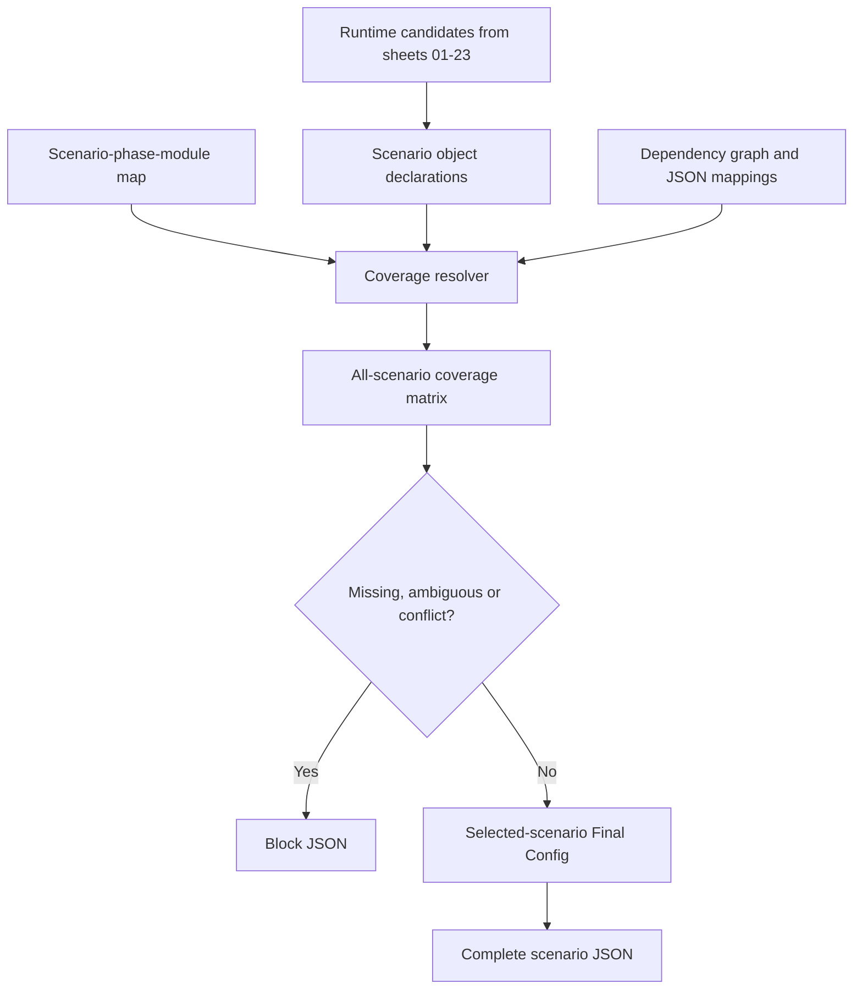

# eMAS Mapping Workbook Implementation Specification

**Version:** 1.0 MVP  
**Date:** 16 September 2026  
**Requirements baseline:** eMAS Mapping Workbook and Scenario JSON MVP Requirements v4.23  
**Target workbook:** `eMAS_Mapping_Workbook_MVP_v1.0.xlsx`  
**Target engine:** Microsoft Excel desktop or Excel for the web; macro-free `.xlsx`

## 1. Outcome of the end-to-end consistency audit

The audit covered all approved sheets `01`–`27`, their maintained/generated boundary, stable identifiers, cross-sheet references, scenario and phase scope, controlled values, JSON mappings, preview, validation and DMS-to-DMS exclusion.

| Audit area | Result | Implementation decision |
|---|---|---|
| Sheet order and ownership | Consistent | Preserve exactly `00_Home` through `27_Validation_Results`. |
| Scenario catalogue | Consistent | Seed MS-01 through MS-08. |
| Module coverage | Complete at module level | Seed all 360 Scenario × Phase × Module rows. |
| Individual-object scenario coverage | Gap closed in v4.23 | Add maintained `tblScenarioObjectMap` and generated `tblScenarioCoverageMatrix`. |
| Phase coverage | Previously distributed across row fields and module map | Expand `All` into three phases and retain `Shared` only for phase-neutral configuration. |
| Conditional content | Risk of premature exclusion | Scenario JSON includes the complete conditional definition and its operands; runtime/project context evaluates it. |
| Optional content | Selection semantics were not uniform | Default to IncludeDefinition; IncludeWhenSelected requires an explicit policy/result. |
| Dependency objects | Could be indirectly included without visible scenario proof | DependencyDriven coverage plus complete transitive closure. |
| Final Config | Selected-scenario audit existed | Add all-scenario/phase object coverage matrix and reconcile selected rows. |
| JSON mapping | Complete declarative mapping model | Require ExpectedJsonSection and exact object/property mappings for exported candidates. |
| Validation | Extensive controls existed | Add blocking object-coverage controls and tests through MVP-AT-560. |
| Unsupported DMS-to-DMS | Consistent | Remains MS-07/NeedsReview, Blocked, NotGenerated. |

The audit found no need to change the eight scenarios, fifteen modules, workbook-to-JSON boundary, offline PowerShell model or generated-sheet authority rules.

## 2. Scenario-completeness rule

Every active Runtime/Both object must have one explainable coverage declaration. The transformer expands those declarations across all active scenarios and phases before selecting one scenario.

For the selected scenario, JSON must include:

- all Required objects;
- all Conditional object definitions, atomic conditions and operands;
- Optional definitions unless an explicit IncludeWhenSelected policy excludes them;
- all fields, lists, findings, actions, sources and mappings reached through dependency closure;
- all phase-specific readiness/reconciliation configuration applicable to the scenario; and
- no NotApplicable, unsupported, inactive or runtime-ineligible objects.

Absence of a mapping is an error. It is never treated as NotApplicable.

## 3. Physical workbook design

- Create 28 worksheets in the approved order.
- Keep exact sheet and table names because they are contract values.
- Use Excel Tables with filter buttons and unique table names.
- Put one concise title in row 2 and a short purpose/instruction in row 3.
- Begin the first table on row 6. Stack additional tables vertically with three blank rows and a small section label.
- Freeze rows through each table header when practical. On sheets with several tables, freeze the title/instruction area and rely on each table's filters.
- Hide gridlines.
- Use Arial 10 pt body text, 14 pt titles and 10 pt dark-blue table headers with white text.
- Use light yellow only for maintained input cells, light blue/grey for generated areas, red/amber conditional formatting for validation states and no decorative status colouring.
- Store identifiers/codes as text, booleans as Boolean values, numbers as numeric values and dates as typed dates.
- Do not merge working table cells.
- Do not use VBA, hidden executable formulas, SQL, XPath evaluation code or PowerShell in cells.
- Generated sheets 24, 26 and 27 are read-only outputs in the implemented solution; the base workbook contains their table structures and clear generated-data warnings.

## 4. Home sheet

`00_Home` contains:

- workbook title, version and MVP boundary;
- one editable `SelectedScenarioId` cell validated against `tblMigrationScenarios[ScenarioId]`;
- calculated scenario name and description;
- links to all sheets;
- mapping/validation/preview status placeholders;
- concise generation workflow;
- glossary for Scenario, Module, Requirement, Rule, Evidence, Finding, RAG, Confidence, Coverage, Final Config and Runtime JSON.

The Home sheet is authoring-only and is not exported.

## 5. Maintained-table behavior

- Every maintained row uses a stable identifier independent of row number.
- `IsActive` controls lifecycle only. It does not replace scenario applicability.
- Controlled-code columns use sheet 22 lists.
- Source-bearing records resolve to normalized sheet-23 provenance.
- Multi-value data uses relationship rows. Comma-separated codes are prohibited.
- Repeating conditions use condition groups and deterministic sequence.
- Blank, Unknown, NotApplicable and NotAssessed remain distinct.
- Every active Runtime/Both record must resolve through `tblScenarioObjectMap`.

## 6. Generated-sheet behavior

### Sheet 24

Generated from maintained sources and contains context, selected-scenario projections, dependency edges, summary counts and the full all-scenario coverage matrix. It is never transformation input.

### Sheet 26

Displays the exact candidate JSON bytes using the approved header/count/object/validation/chunk tables. The preview and downloadable JSON use one object, serializer and byte stream.

### Sheet 27

Displays the registered controls and current validation run. Mandatory NotEvaluated controls, stale fingerprints, coverage errors or technical failures block export.

## 7. Seed content included in the base workbook

- eight migration scenarios;
- twenty-three reusable scenario questions;
- fifteen assessment modules;
- all 360 scenario-phase-module mappings;
- object-coverage declarations for every seeded runtime object;
- core controlled lists needed to maintain the seeded rows;
- one requirements-document source record;
- one active MVP JSON schema row and top-level section definitions;
- empty, formatted tables for remaining configuration and generated outputs.

The seed is structural/configuration content. It does not claim that every regulatory profile, migration adapter or detailed rule has been populated or verified.

## 8. Population sequence

1. Verify scenarios, questions, derivation rules, modules and 360 module mappings.
2. Populate requirements and fields.
3. Populate profiles and assessment rule families.
4. Populate interpretation, findings/actions, readiness and reconciliation.
5. Populate complete value/source catalogues.
6. Populate one object-coverage declaration for every active Runtime/Both object.
7. Complete JSON mappings for every maintained table/column.
8. Generate the all-scenario coverage matrix.
9. Resolve every Missing/Ambiguous/Conflict result.
10. Generate and schema-validate JSON for MS-01 through MS-08.
11. Verify workbook-to-coverage-to-Final-Config-to-JSON traceability.
12. Only then implement PowerShell consumption.

## 9. Workbook acceptance

The workbook structure is acceptable when:

- all 28 sheets and every table below exist with exact names and columns;
- no table names overlap or repeat;
- scenario/module/value/source keys are unique;
- the 360 module mapping rows exist;
- each seeded runtime object has a coverage declaration;
- no generated table is consumed as maintained configuration;
- every eligible scenario can resolve zero Missing/Ambiguous/Conflict coverage;
- JSON counts reconcile from coverage to Final Config to Preview;
- validation and scenario boundaries match the requirements baseline; and
- the workbook exports as a macro-free `.xlsx` without formula-reference errors.

## 10. Sheet and table register

| Order | Sheet | Role | Tables | Purpose |
|---:|---|---|---:|---|
| 0 | `00_Home` | AuthoringOnly | 0 | Workbook purpose, scenario selector, navigation, status and generation instructions. |
| 1 | `01_Migration_Scenarios` | Maintained | 1 | Eight stable base migration scenarios. |
| 2 | `02_Scenario_Questionnaire` | Maintained | 1 | Reusable business-first scenario questions. |
| 3 | `03_Scenario_Derivation_Rules` | Maintained | 1 | Deterministic scenario selection and context validation. |
| 4 | `04_Assessment_Modules` | Maintained | 1 | Reusable assessment capabilities. |
| 5 | `05_Scenario_Module_Map` | Maintained | 2 | Scenario-phase-module applicability and individual object coverage declarations. |
| 6 | `06_Requirement_Catalogue` | Maintained | 1 | Atomic migration-script requirements. |
| 7 | `07_Fields_Evidence` | Maintained | 1 | Canonical fields, evidence and result semantics. |
| 8 | `08_Regulatory_Profiles` | Maintained | 2 | Regulatory profile definitions and evidence locators. |
| 9 | `09_Dossier_Sequence_ID` | Maintained | 1 | Dossier, application, sequence and lifecycle identification. |
| 10 | `10_Folder_File_Structure` | Maintained | 2 | Repository/container/folder/file structure expectations. |
| 11 | `11_Missing_Refs_Integrity` | Maintained | 2 | Reference, orphan, checksum and file-integrity rules. |
| 12 | `12_Technical_Observations` | Maintained | 1 | Technical XML, PDF, file, path and platform checks. |
| 13 | `13_Size_Volume_Metrics` | Maintained | 3 | Typed metric definitions, conditions and dimensions. |
| 14 | `14_Source_DB_Archive_DMS` | Maintained | 6 | Source adapter, DB/archive/DMS mappings and safeguards. |
| 15 | `15_RAG_Severity` | Maintained | 3 | Finding severity, RAG and aggregation. |
| 16 | `16_Confidence` | Maintained | 3 | Evidence confidence and aggregation. |
| 17 | `17_Effort_Drivers` | Maintained | 6 | Complexity models, drivers and bands. |
| 18 | `18_Findings` | Maintained | 2 | Reusable finding definitions and exception policy. |
| 19 | `19_Recommendations_Actions` | Maintained | 3 | Recommendations, actions and finding links. |
| 20 | `20_PreMigration_Readiness` | Maintained | 7 | Readiness models, decisions and baseline contracts. |
| 21 | `21_PostMigration_Reconciliation` | Maintained | 9 | Scenario-specific expected-versus-observed reconciliation. |
| 22 | `22_Value_Lists` | Maintained | 5 | Controlled list definitions, values, usage, aliases and dependencies. |
| 23 | `23_Source_References` | Maintained | 6 | Normalized source documents, claims, locations and object links. |
| 24 | `24_Final_Config_Master` | Generated | 5 | Generated inclusion/exclusion, dependencies, counts and all-scenario object coverage. |
| 25 | `25_JSON_Field_Map` | Maintained | 6 | Schema, section, object/property/reference mapping and transformations. |
| 26 | `26_JSON_Preview` | Generated | 5 | Exact candidate JSON preview, counts, object index and chunks. |
| 27 | `27_Validation_Results` | Generated | 7 | Generated controls, evaluations, issues, targets and export decision. |

## 11. Complete physical table schema

### `00_Home`

No Excel Table is required. The sheet uses controlled cells and navigation blocks defined below.

### `01_Migration_Scenarios`

- **`tblMigrationScenarios`** — primary identity: `ScenarioId`; 16 columns.

  Columns: `ScenarioId`, `ScenarioCode`, `ScenarioName`, `ScenarioFamily`, `BusinessDescription`, `ExistingECTDManager`, `SourceSystemCategory`, `SourceDatabaseType`, `PrimaryMigrationMethod`, `TargetPlatform`, `SupportsMixedScope`, `FallbackScenario`, `DisplaySequence`, `IsActive`, `SourceId`, `Notes`.

### `02_Scenario_Questionnaire`

- **`tblScenarioQuestions`** — primary identity: `QuestionId`; 20 columns.

  Columns: `QuestionId`, `SectionCode`, `DisplaySequence`, `QuestionText`, `BusinessMeaning`, `AnswerType`, `AnswerListCode`, `AnswerOwner`, `Phase`, `ParentQuestionId`, `TriggerOperator`, `TriggerValue`, `MapsToContextField`, `RequiredWhenShown`, `MissingAnswerImpact`, `Guidance`, `VerificationGuidance`, `PreSalesDetailLevel`, `IsActive`, `SourceId`.

### `03_Scenario_Derivation_Rules`

- **`tblScenarioDerivationRules`** — primary identity: `DerivationRuleId`; 20 columns.

  Columns: `DerivationRuleId`, `RulePurpose`, `RuleName`, `Priority`, `ConditionGroup`, `ConditionSequence`, `InputContextField`, `OriginQuestionId`, `Operator`, `ExpectedValue`, `CandidateScenarioId`, `OnMatchStatus`, `MissingInputAction`, `FollowUpQuestionId`, `ReasonCode`, `ReasonTemplate`, `BaseConfidence`, `IsActive`, `SourceId`, `Notes`.

### `04_Assessment_Modules`

- **`tblAssessmentModules`** — primary identity: `ModuleId`; 21 columns.

  Columns: `ModuleId`, `ModuleName`, `BusinessPurpose`, `AssessmentBoundary`, `ModuleLayer`, `ExecutionMode`, `PrimaryEvidenceDomain`, `PrimaryEngineCapabilityGroup`, `SupportsPreSales`, `SupportsPreMigration`, `SupportsPostMigration`, `InputSummary`, `OutputSummary`, `ProducesFindings`, `ProducesMetrics`, `CanProduceBaselineData`, `CanSupportReconciliation`, `IsRuntimeModule`, `IsActive`, `SourceId`, `Notes`.

### `05_Scenario_Module_Map`

- **`tblScenarioModuleMap`** — primary identity: `ScenarioModuleMapId`; 19 columns.

  Columns: `ScenarioModuleMapId`, `ScenarioId`, `Phase`, `ModuleId`, `Applicability`, `AssessmentDepth`, `ActivationContextField`, `ActivationOperator`, `ActivationValue`, `ActivationValueListCode`, `DefaultMissingEvidenceOutcome`, `PhaseOutcomeImpact`, `BaselineContribution`, `ReconciliationRole`, `ReasonCode`, `BusinessReason`, `IsActive`, `SourceId`, `Notes`.
- **`tblScenarioObjectMap`** — primary identity: `ScenarioObjectMapId`; 20 columns.

  Columns: `ScenarioObjectMapId`, `SourceSheet`, `SourceTable`, `ObjectType`, `ObjectId`, `CoverageMode`, `ScenarioId`, `Phase`, `ModuleId`, `RequirementId`, `Applicability`, `JsonInclusionPolicy`, `ConditionSetId`, `ExpectedJsonSection`, `ReasonCode`, `BusinessReason`, `IsActive`, `SourceId`, `SourceSection`, `Notes`.

### `06_Requirement_Catalogue`

- **`tblRequirementCatalogue`** — primary identity: `RequirementId`; 31 columns.

  Columns: `RequirementId`, `RequirementTitle`, `RequirementStatement`, `BusinessPurpose`, `RequirementDomain`, `RequirementType`, `ObligationLevel`, `OwningComponent`, `ModuleId`, `LifecycleStage`, `PhaseScope`, `ApplicabilityBasis`, `ScenarioId`, `MissingEvidenceBehavior`, `PhaseOutcomeImpact`, `ImplementationDisposition`, `ImplementationSheet`, `EngineCapability`, `RuntimeExport`, `JSONPath`, `AcceptanceCriterion`, `VerificationMethod`, `TestReference`, `SourceId`, `SourceSection`, `RequirementBasis`, `RequirementStatus`, `ImplementationStatus`, `VerificationStatus`, `IsActive`, `Notes`.

### `07_Fields_Evidence`

- **`tblFieldsEvidence`** — primary identity: `FieldCode`; 32 columns.

  Columns: `FieldCode`, `DisplayName`, `Definition`, `OwnerModuleId`, `FieldRole`, `EntityType`, `DataType`, `Cardinality`, `ValueDomainType`, `ValueDomainCode`, `UnitCode`, `CanonicalFormat`, `DefaultValueOrigin`, `PrimaryEvidenceSourceType`, `ProducerCapability`, `NormalizationCode`, `ProvenanceProfileCode`, `NullPolicy`, `OperatorListCode`, `PhaseListCode`, `BaselineRole`, `ReconciliationRole`, `ReportUsage`, `LogUsage`, `SensitivityClass`, `ExportPolicy`, `SourceId`, `SourceSection`, `DefinitionStatus`, `IsActive`, `ExampleValue`, `Notes`.

### `08_Regulatory_Profiles`

- **`tblRegulatoryProfiles`** — primary identity: `ProfileId`; 19 columns.

  Columns: `ProfileId`, `ProfileName`, `Region`, `Authority`, `TechnicalFormat`, `SpecificationVersion`, `RegionalImplementation`, `RegionalImplementationVersion`, `BackboneModel`, `ParserProfile`, `LifecycleModel`, `AllowedApplicationTypeListCode`, `AllowedDossierContextListCode`, `AllowedProcedureContextListCode`, `SupportStatus`, `SourceId`, `SourceSection`, `IsActive`, `Notes`.
- **`tblProfileEvidenceLocators`** — primary identity: `ProfileEvidenceId`; 21 columns.

  Columns: `ProfileEvidenceId`, `ProfileId`, `EvidencePurpose`, `ArtifactType`, `FileNameOrPattern`, `NamespaceUri`, `SelectorType`, `Selector`, `AttributeName`, `ExpectedValueOrPattern`, `OutputFieldCode`, `EvidenceStrength`, `EvidenceRole`, `Priority`, `FallbackOnly`, `ProducerCapability`, `ConflictStrategy`, `SourceId`, `SourceSection`, `IsActive`, `Notes`.

### `09_Dossier_Sequence_ID`

- **`tblDossierSequenceRules`** — primary identity: `ProfileId`; 23 columns.

  Columns: `IdentificationRuleType`, `DetectionTarget`, `ProfileScope`, `ProfileId`, `SubjectScope`, `SubjectKeyFieldCode`, `ParentKeyFieldCode`, `ProfileEvidenceId`, `OutputFieldCode`, `CandidateValueMode`, `CandidateValue`, `CandidateSourceFieldCode`, `NormalizationCode`, `ExpectedPattern`, `MinimumEvidenceStrength`, `MinimumEvidenceCount`, `RequiresCorroboration`, `CandidateAcceptancePolicy`, `MatchAction`, `IndeterminateAction`, `ConflictGroup`, `ConflictStrategy`, `ResultStatusOnMatch`.

### `10_Folder_File_Structure`

- **`tblStructureRules`** — primary identity: `ProfileId`; 24 columns.

  Columns: `StructureRuleType`, `ProfileScope`, `ProfileId`, `HierarchyMode`, `TargetType`, `NodeKind`, `PathAnchor`, `ParentRuleId`, `RelativePathPattern`, `PatternSyntax`, `NamePattern`, `TraversalScope`, `CaseSensitivity`, `RequirementLevel`, `MinimumOccurrences`, `MaximumOccurrences`, `ExpectedDepth`, `AllowEmpty`, `EmptyNodePolicy`, `UnexpectedItemPolicy`, `ContainerPolicyId`, `ObservationTypeOnDeviation`, `OutputFieldCode`, `BusinessExample`.
- **`tblContainerDiscoveryPolicies`** — primary identity: `ContainerPolicyId`; 18 columns.

  Columns: `ContainerPolicyId`, `ContainerType`, `DiscoveryMode`, `MaximumContainerDepth`, `MaximumEntryCount`, `MaximumExpandedBytes`, `MaximumSingleEntryBytes`, `MaximumCompressionRatio`, `EncryptedContainerAction`, `CorruptContainerAction`, `PathTraversalAction`, `SymbolicLinkAction`, `ExtractionMode`, `TemporaryCleanupRequired`, `PreserveOriginalContext`, `IsActive`, `SourceId`, `Notes`.

### `11_Missing_Refs_Integrity`

- **`tblIntegrityRules`** — primary identity: `ProfileId`; 25 columns.

  Columns: `IntegrityRuleType`, `ProfileScope`, `ProfileId`, `SubjectScope`, `SubjectKeyFieldCode`, `ReferenceKind`, `ProfileEvidenceId`, `SourceReferenceFieldCode`, `ResolutionPolicyId`, `TargetInventoryFieldCode`, `OutputFieldCode`, `ExpectedIntegrityState`, `ObservationTypeOnFailure`, `RequiresCompleteReferenceInventory`, `RequiresCompleteTargetInventory`, `ChecksumMode`, `DeclaredAlgorithmFieldCode`, `DeclaredChecksumFieldCode`, `CalculatedChecksumFieldCode`, `AllowedAlgorithmListCode`, `DuplicateScope`, `ContentTypeDetectionMethod`, `ExcludedItemPolicyCode`, `IndeterminateAction`, `BusinessExample`.
- **`tblReferenceResolutionPolicies`** — primary identity: `ResolutionPolicyId`; 22 columns.

  Columns: `ResolutionPolicyId`, `ProfileScope`, `ProfileId`, `ReferenceKind`, `ResolutionBase`, `PathSeparatorPolicy`, `UriDecodingPolicy`, `UnicodeNormalization`, `CaseSensitivity`, `DotSegmentPolicy`, `FragmentPolicy`, `QueryPolicy`, `AbsolutePathPolicy`, `ExternalUriPolicy`, `ContainerBoundaryPolicy`, `SymbolicLinkPolicy`, `AmbiguousTargetPolicy`, `EngineCapability`, `SourceId`, `SourceSection`, `IsActive`, `Notes`.

### `12_Technical_Observations`

- **`tblTechnicalObservationRules`** — primary identity: `RuleId`; 33 columns.

  Columns: `RuleId`, `RuleName`, `RequirementId`, `ModuleId`, `IsActive`, `Priority`, `Phase`, `ScenarioId`, `ProfileId`, `ScopeLevel`, `ObservationType`, `TargetMediaType`, `TargetExtension`, `InputFieldCode`, `ComparisonFieldCode`, `Operator`, `ExpectedValueDataType`, `ExpectedValue`, `MinimumValue`, `MaximumValue`, `ComparisonUnit`, `PassOutcomeCode`, `FailOutcomeCode`, `UnsupportedOutcomeCode`, `UnavailableOutcomeCode`, `ResultFieldCode`, `FindingCode`, `RecommendationCode`, `TechnicalImpact`, `EngineCapability`, `SourceId`, `SourceSection`, `Notes`.

### `13_Size_Volume_Metrics`

- **`tblMetricDefinitions`** — primary identity: `MetricCode`; 34 columns.

  Columns: `MetricCode`, `MetricName`, `MetricDescription`, `RequirementId`, `ModuleId`, `IsActive`, `Priority`, `Phase`, `ScenarioId`, `ProfileId`, `ScopeLevel`, `EvidenceSourceType`, `PopulationFieldCode`, `CalculationType`, `ValueFieldCode`, `DistinctKeyFieldCode`, `NumeratorMetricCode`, `DenominatorMetricCode`, `SubtractMetricCode`, `OutputFieldCode`, `OutputDataType`, `UnitCode`, `Precision`, `RoundingMode`, `NullHandling`, `EmptyPopulationHandling`, `ZeroDenominatorHandling`, `EvidenceRetention`, `BaselineRole`, `ReconciliationRole`, `EffortDriverId`, `SourceId`, `SourceSection`, `Notes`.
- **`tblMetricConditions`** — primary identity: `MetricConditionId`; 12 columns.

  Columns: `MetricConditionId`, `MetricCode`, `ConditionGroup`, `ConditionSequence`, `FieldCode`, `Operator`, `ValueDataType`, `Value1`, `Value2`, `MissingInputBehavior`, `IsActive`, `Notes`.
- **`tblMetricDimensions`** — primary identity: `MetricDimensionId`; 8 columns.

  Columns: `MetricDimensionId`, `MetricCode`, `DimensionSequence`, `DimensionFieldCode`, `IncludeUnknown`, `UnknownBucketCode`, `IsActive`, `Notes`.

### `14_Source_DB_Archive_DMS`

- **`tblSourceProfiles`** — primary identity: `SourceProfileId`; 19 columns.

  Columns: `SourceProfileId`, `SourceSystemFamily`, `Vendor`, `ProductName`, `SourceKind`, `ProductVersionFromInclusive`, `ProductVersionToExclusive`, `DatabasePlatform`, `HostingModel`, `AdapterKey`, `ImplementationSpecificationId`, `SupportStatus`, `VerificationStatus`, `SupportedTargetPlatform`, `UnsupportedSemanticsOutcome`, `SourceId`, `SourceSection`, `IsActive`, `Notes`.
- **`tblSourceCapabilities`** — primary identity: `SourceCapabilityId`; 13 columns.

  Columns: `SourceCapabilityId`, `SourceProfileId`, `ScenarioId`, `Phase`, `ModuleId`, `AssessmentDepth`, `CapabilityCode`, `SourceEntityType`, `EvidenceRequirementCode`, `MissingEvidenceOutcome`, `EngineCapability`, `Priority`, `IsActive`.
- **`tblSourceFieldMappings`** — primary identity: `MappingRuleId`; 26 columns.

  Columns: `MappingRuleId`, `RequirementId`, `SourceProfileId`, `SourceCapabilityId`, `ScenarioId`, `Phase`, `MappingPurpose`, `SourceEntityType`, `SourceLogicalFieldCode`, `SourceFieldCode`, `TargetEntityType`, `TargetFieldCode`, `SourceDataType`, `CanonicalDataType`, `Cardinality`, `NormalizationPolicyCode`, `TransformationPolicyCode`, `NullHandling`, `KeyRole`, `ComparisonKeyCode`, `BaselineRole`, `ReconciliationRole`, `SourceId`, `SourceSection`, `BusinessExplanation`, `IsActive`.
- **`tblSourceRelationshipMappings`** — primary identity: `RelationshipMappingId`; 23 columns.

  Columns: `RelationshipMappingId`, `RequirementId`, `SourceProfileId`, `ScenarioId`, `Phase`, `ParentEntityType`, `ChildEntityType`, `RelationshipType`, `ParentKeyFieldCode`, `ChildKeyFieldCode`, `Cardinality`, `RelationshipRequired`, `MissingParentOutcome`, `MissingChildOutcome`, `AmbiguousOutcome`, `ComparisonKeyCode`, `BaselineRole`, `ReconciliationRole`, `EngineCapability`, `SourceId`, `SourceSection`, `BusinessExplanation`, `IsActive`.
- **`tblArchiveIdentityRules`** — primary identity: `ArchiveIdentityRuleId`; 25 columns.

  Columns: `ArchiveIdentityRuleId`, `RequirementId`, `SourceProfileId`, `ScenarioId`, `Phase`, `SourceEntityType`, `SourceRecordKeyFieldCode`, `RawArchiveIdentifierFieldCode`, `IdentifierFormatCode`, `NormalizationPolicyCode`, `NormalizedIdentifierFieldCode`, `PathDerivationPolicyCode`, `LookupRootRoleCode`, `CandidateNamePolicyCode`, `ExtensionListCode`, `CaseSensitivityPolicyCode`, `RecursionPolicyCode`, `SafeguardPolicyId`, `ExpectedObjectKeyFieldCode`, `ChecksumFieldCode`, `LookupStatusFieldCode`, `EngineCapability`, `SourceId`, `SourceSection`, `IsActive`.
- **`tblArchiveLookupSafeguards`** — primary identity: `SafeguardRuleId`; 11 columns.

  Columns: `SafeguardRuleId`, `SafeguardPolicyId`, `SafeguardSequence`, `SafeguardType`, `IsMandatory`, `FailureLookupStatus`, `AllowsMissingConclusion`, `ResultFieldCode`, `EngineCapability`, `BusinessExplanation`, `IsActive`.

### `15_RAG_Severity`

- **`tblRagSeverityRules`** — primary identity: `RagSeverityRuleId`; 18 columns.

  Columns: `RagSeverityRuleId`, `RequirementId`, `FindingCode`, `ModuleId`, `ScenarioId`, `Phase`, `ScopeLevel`, `Severity`, `RAG`, `IsBlocker`, `DecisionImpact`, `ExceptionEligible`, `AggregationPolicyId`, `Priority`, `Rationale`, `SourceId`, `SourceSection`, `IsActive`.
- **`tblRagSeverityConditions`** — primary identity: `RagConditionId`; 12 columns.

  Columns: `RagConditionId`, `RagSeverityRuleId`, `ConditionGroup`, `ConditionSequence`, `ConditionSubjectType`, `ReferenceCode`, `Operator`, `ValueDataType`, `Value1`, `Value2`, `MissingInputBehavior`, `IsActive`.
- **`tblRagAggregationPolicies`** — primary identity: `RagAggregationPolicyId`; 15 columns.

  Columns: `RagAggregationPolicyId`, `AggregationScope`, `AggregationStrategy`, `ConfirmedRedBehavior`, `RequiredCoverageBehavior`, `ConflictBehavior`, `AmberBehavior`, `GreenPrerequisite`, `AllNotApplicableBehavior`, `OptionalSkippedBehavior`, `BlockerAggregation`, `TieStrategy`, `SourceId`, `SourceSection`, `IsActive`.

### `16_Confidence`

- **`tblConfidenceRules`** — primary identity: `ConfidenceRuleId`; 16 columns.

  Columns: `ConfidenceRuleId`, `RequirementId`, `ConfidenceContext`, `AppliesToResultType`, `ModuleId`, `ScenarioId`, `Phase`, `ScopeLevel`, `ResultConfidence`, `ReasonCode`, `ReasonTemplate`, `AggregationPolicyId`, `Priority`, `SourceId`, `SourceSection`, `IsActive`.
- **`tblConfidenceCriteria`** — primary identity: `ConfidenceCriterionId`; 13 columns.

  Columns: `ConfidenceCriterionId`, `ConfidenceRuleId`, `CriterionGroup`, `CriterionSequence`, `CriterionType`, `ReferenceCode`, `Operator`, `ValueDataType`, `Value1`, `Value2`, `MissingInputBehavior`, `IsMandatory`, `IsActive`.
- **`tblConfidenceAggregationPolicies`** — primary identity: `ConfidenceAggregationPolicyId`; 15 columns.

  Columns: `ConfidenceAggregationPolicyId`, `ConfidenceContext`, `AggregationScope`, `AggregationStrategy`, `RequiredResultTreatment`, `OptionalResultTreatment`, `UnknownBehavior`, `ConflictBehavior`, `MinimumCoveragePercent`, `HighConfidencePrerequisite`, `NoUsableEvidenceOutcome`, `TieStrategy`, `SourceId`, `SourceSection`, `IsActive`.

### `17_Effort_Drivers`

- **`tblEffortModels`** — primary identity: `EffortModelId`; 17 columns.

  Columns: `EffortModelId`, `ModelName`, `ModelVersion`, `EffortContext`, `Phase`, `BaseScore`, `ScoreUnit`, `MinimumRequiredCoveragePercent`, `IncompleteEvidenceBehavior`, `NoUsableEvidenceBehavior`, `RawScoreVisibility`, `SupportsHourEstimate`, `OutputFieldCode`, `ConfidenceContext`, `SourceId`, `SourceSection`, `IsActive`.
- **`tblEffortDriverDefinitions`** — primary identity: `EffortDriverId`; 17 columns.

  Columns: `EffortDriverId`, `DriverCode`, `DriverName`, `DriverDescription`, `DriverCategory`, `ModuleId`, `ScopeLevel`, `EffortContext`, `ConfidenceEvidenceRole`, `DoubleCountGroup`, `DoubleCountPolicyId`, `RecommendationCode`, `CustomerExplanation`, `ConsultantExplanation`, `SourceId`, `SourceSection`, `IsActive`.
- **`tblEffortImpactRules`** — primary identity: `EffortImpactRuleId`; 17 columns.

  Columns: `EffortImpactRuleId`, `RequirementId`, `EffortModelId`, `EffortDriverId`, `ScenarioId`, `Phase`, `Priority`, `ImpactMode`, `ScoreImpact`, `ComplexityFloor`, `ContributionCap`, `MissingInputBehavior`, `ResultReasonCode`, `RecommendationCode`, `SourceId`, `SourceSection`, `IsActive`.
- **`tblEffortDriverConditions`** — primary identity: `EffortConditionId`; 13 columns.

  Columns: `EffortConditionId`, `EffortImpactRuleId`, `ConditionGroup`, `ConditionSequence`, `ConditionSubjectType`, `ReferenceCode`, `Operator`, `ValueDataType`, `Value1`, `Value2`, `UnitCode`, `MissingInputBehavior`, `IsActive`.
- **`tblEffortDoubleCountPolicies`** — primary identity: `DoubleCountPolicyId`; 11 columns.

  Columns: `DoubleCountPolicyId`, `DoubleCountGroup`, `ResolutionStrategy`, `GroupScoreCap`, `FloorBehavior`, `PriorityBehavior`, `RetainSuppressedDrivers`, `CustomerExplanation`, `SourceId`, `SourceSection`, `IsActive`.
- **`tblComplexityBands`** — primary identity: `ComplexityBandThresholdId`; 14 columns.

  Columns: `ComplexityBandThresholdId`, `EffortModelId`, `BandCode`, `BandSequence`, `LowerBound`, `UpperBound`, `LowerInclusive`, `UpperInclusive`, `ScoreUnit`, `CustomerDefinition`, `ConsultantInterpretation`, `SourceId`, `SourceSection`, `IsActive`.

### `18_Findings`

- **`tblFindingDefinitions`** — primary identity: `FindingCode`; 19 columns.

  Columns: `FindingCode`, `FindingTitle`, `FindingCategory`, `FindingClass`, `ScopeLevel`, `CustomerSummaryTemplate`, `ConsultantDetailTemplate`, `EvidenceExplanationTemplate`, `StatementBasisType`, `ReportAudience`, `CustomerVisible`, `ContainsSensitiveDetail`, `AggregationBehavior`, `IsActive`, `SourceId`, `SourceSection`, `Rationale`, `ExampleOccurrence`, `Notes`.
- **`tblFindingExceptionPolicies`** — primary identity: `ExceptionPolicyId`; 15 columns.

  Columns: `ExceptionPolicyId`, `FindingCode`, `ScenarioId`, `Phase`, `ExceptionEligible`, `AllowedEffect`, `RequiredApproverRole`, `ReasonRequired`, `EvidenceRequirement`, `ExpiryRequired`, `MaximumValidityDays`, `CarryForwardToPostMigration`, `IsActive`, `SourceId`, `Rationale`.

### `19_Recommendations_Actions`

- **`tblRecommendationDefinitions`** — primary identity: `RecommendationCode`; 15 columns.

  Columns: `RecommendationCode`, `RecommendationTitle`, `RecommendationType`, `CustomerFacingText`, `ConsultantGuidance`, `ExpectedOutcome`, `ActionBasisType`, `DefaultAudience`, `IsAutomatable`, `RequiresConsultantReview`, `IsActive`, `SourceId`, `SourceSection`, `Rationale`, `Notes`.
- **`tblRecommendationActions`** — primary identity: `ActionCode`; 13 columns.

  Columns: `ActionCode`, `RecommendationCode`, `ActionSequence`, `ActionTitle`, `ActionText`, `ResponsibilityCategory`, `ActionRequirement`, `DuePhase`, `CompletionEvidenceRequirement`, `CustomerVisible`, `IsActive`, `SourceId`, `Rationale`.
- **`tblFindingRecommendationLinks`** — primary identity: `FindingRecommendationLinkId`; 14 columns.

  Columns: `FindingRecommendationLinkId`, `FindingCode`, `RecommendationCode`, `ScenarioId`, `Phase`, `LinkType`, `RequiredEvaluationStatus`, `RequiredRAG`, `RequiredSeverity`, `Priority`, `Sequence`, `IsActive`, `SourceId`, `Rationale`.

### `20_PreMigration_Readiness`

- **`tblReadinessModels`** — primary identity: `ReadinessModelId`; 12 columns.

  Columns: `ReadinessModelId`, `ScenarioId`, `ModelName`, `BusinessMeaning`, `DecisionStrategy`, `MinimumMandatoryCoveragePercent`, `BaselineRequired`, `AcceptedExceptionsPermitted`, `NoMatchBehavior`, `IsActive`, `SourceId`, `Rationale`.
- **`tblReadinessEvidenceRequirements`** — primary identity: `ReadinessEvidenceRequirementId`; 20 columns.

  Columns: `ReadinessEvidenceRequirementId`, `ReadinessModelId`, `RequirementId`, `ModuleId`, `RequirementTitle`, `RequirementLevel`, `ActivationQualifierCode`, `ActivationOperator`, `ActivationValue`, `RequiredEvaluationStatus`, `RequiredEvidenceState`, `MinimumCoveragePercent`, `MissingEvidenceBehavior`, `ConflictBehavior`, `ExceptionHandling`, `FindingCode`, `Priority`, `IsActive`, `SourceId`, `Rationale`.
- **`tblReadinessDecisionRules`** — primary identity: `ReadinessRuleId`; 12 columns.

  Columns: `ReadinessRuleId`, `ReadinessModelId`, `RuleTitle`, `DecisionEffect`, `ConditionGroupOperator`, `ExceptionHandling`, `FindingCode`, `Priority`, `StopProcessing`, `IsActive`, `SourceId`, `Rationale`.
- **`tblReadinessDecisionConditions`** — primary identity: `ReadinessConditionId`; 14 columns.

  Columns: `ReadinessConditionId`, `ReadinessRuleId`, `ConditionGroupId`, `GroupSequence`, `ConditionSequence`, `ConditionSubjectType`, `ReferenceCode`, `Operator`, `ValueType`, `Value1`, `Value2`, `Negate`, `MissingInputBehavior`, `IsActive`.
- **`tblBaselineEntityRequirements`** — primary identity: `BaselineEntityRequirementId`; 15 columns.

  Columns: `BaselineEntityRequirementId`, `ReadinessModelId`, `ScenarioId`, `EntityType`, `ModuleId`, `PopulationDefinition`, `RequirementLevel`, `ActivationQualifierCode`, `ParentEntityType`, `ExpectedCountMetricCode`, `PostMigrationComparisonRequired`, `MissingPopulationBehavior`, `IsActive`, `SourceId`, `Rationale`.
- **`tblBaselineFieldRequirements`** — primary identity: `BaselineFieldRequirementId`; 14 columns.

  Columns: `BaselineFieldRequirementId`, `BaselineEntityRequirementId`, `FieldCode`, `BaselineFieldRole`, `RequirementLevel`, `ComparisonKeyGroup`, `ComparisonKeySequence`, `KeyStrength`, `NormalizationRuleId`, `NullBehavior`, `SensitiveDataHandling`, `IsActive`, `SourceId`, `Rationale`.
- **`tblBaselineRelationshipRequirements`** — primary identity: `BaselineRelationshipRequirementId`; 13 columns.

  Columns: `BaselineRelationshipRequirementId`, `ReadinessModelId`, `RelationshipRuleId`, `FromEntityRequirementId`, `ToEntityRequirementId`, `RelationshipType`, `RequirementLevel`, `ExpectedCardinality`, `MissingRelationshipBehavior`, `PostMigrationComparisonRequired`, `IsActive`, `SourceId`, `Rationale`.

### `21_PostMigration_Reconciliation`

- **`tblReconciliationModels`** — primary identity: `ReconciliationModelId`; 13 columns.

  Columns: `ReconciliationModelId`, `ScenarioId`, `ModelName`, `BusinessMeaning`, `ReadinessModelId`, `DecisionStrategy`, `MinimumMandatoryCoveragePercent`, `BaselineCompatibilityPolicy`, `AcceptedDifferencesPermitted`, `NoMatchBehavior`, `IsActive`, `SourceId`, `Rationale`.
- **`tblReconciliationEvidenceRequirements`** — primary identity: `ReconciliationEvidenceRequirementId`; 17 columns.

  Columns: `ReconciliationEvidenceRequirementId`, `ReconciliationModelId`, `EvidenceRole`, `SourceProfileId`, `RequiredCapabilityCode`, `RequirementLevel`, `ActivationQualifierCode`, `ActivationOperator`, `ActivationValue`, `AuthorityRank`, `MinimumCoveragePercent`, `MissingBehavior`, `UnsupportedVersionBehavior`, `ConflictBehavior`, `IsActive`, `SourceId`, `Rationale`.
- **`tblReconciliationEntityRules`** — primary identity: `ReconciliationEntityRuleId`; 17 columns.

  Columns: `ReconciliationEntityRuleId`, `ReconciliationModelId`, `BaselineEntityRequirementId`, `TargetSourceProfileId`, `ExpectedEntityType`, `ObservedEntityType`, `ComparisonMode`, `RequirementLevel`, `ExpectedCardinality`, `MissingTargetBehavior`, `ExtraTargetBehavior`, `DuplicateKeyBehavior`, `AmbiguousMatchBehavior`, `Priority`, `IsActive`, `SourceId`, `Rationale`.
- **`tblReconciliationKeyMappings`** — primary identity: `ReconciliationKeyMappingId`; 14 columns.

  Columns: `ReconciliationKeyMappingId`, `ReconciliationEntityRuleId`, `ComparisonKeyGroup`, `KeySequence`, `KeyStrength`, `BaselineFieldCode`, `TargetFieldCode`, `NormalizationPolicyCode`, `MatchMode`, `CaseSensitivityPolicy`, `NullKeyBehavior`, `IsActive`, `SourceId`, `Rationale`.
- **`tblReconciliationFieldComparisons`** — primary identity: `ReconciliationFieldRuleId`; 15 columns.

  Columns: `ReconciliationFieldRuleId`, `ReconciliationEntityRuleId`, `BaselineFieldCode`, `TargetFieldCode`, `ComparisonType`, `RequirementLevel`, `NormalizationPolicyCode`, `NullComparisonBehavior`, `TolerancePolicyCode`, `ToleranceValue`, `ToleranceUnit`, `Priority`, `IsActive`, `SourceId`, `Rationale`.
- **`tblReconciliationAggregateComparisons`** — primary identity: `AggregateComparisonRuleId`; 17 columns.

  Columns: `AggregateComparisonRuleId`, `ReconciliationModelId`, `PopulationEntityType`, `DimensionSetCode`, `BaselineMetricCode`, `TargetMetricCode`, `ComparisonType`, `TolerancePolicyCode`, `ToleranceValue`, `ToleranceUnit`, `DecisionRole`, `RequirementLevel`, `FindingCode`, `Priority`, `IsActive`, `SourceId`, `Rationale`.
- **`tblReconciliationRelationshipComparisons`** — primary identity: `RelationshipComparisonRuleId`; 13 columns.

  Columns: `RelationshipComparisonRuleId`, `ReconciliationModelId`, `BaselineRelationshipRequirementId`, `TargetRelationshipMappingId`, `ComparisonType`, `RequirementLevel`, `MissingRelationshipBehavior`, `ExtraRelationshipBehavior`, `AmbiguousRelationshipBehavior`, `Priority`, `IsActive`, `SourceId`, `Rationale`.
- **`tblReconciliationDecisionRules`** — primary identity: `ReconciliationDecisionRuleId`; 12 columns.

  Columns: `ReconciliationDecisionRuleId`, `ReconciliationModelId`, `RuleTitle`, `DecisionEffect`, `ConditionGroupOperator`, `ExceptionHandling`, `FindingCode`, `Priority`, `StopProcessing`, `IsActive`, `SourceId`, `Rationale`.
- **`tblReconciliationDecisionConditions`** — primary identity: `ReconciliationConditionId`; 14 columns.

  Columns: `ReconciliationConditionId`, `ReconciliationDecisionRuleId`, `ConditionGroupId`, `GroupSequence`, `ConditionSequence`, `ConditionSubjectType`, `ReferenceCode`, `Operator`, `ValueType`, `Value1`, `Value2`, `Negate`, `MissingInputBehavior`, `IsActive`.

### `22_Value_Lists`

- **`tblValueListDefinitions`** — primary identity: `ListCode`; 16 columns.

  Columns: `ListCode`, `ListName`, `Description`, `BusinessDomain`, `ValueOwner`, `CodeFormat`, `AllowsUnknown`, `AllowsNotApplicable`, `AllowsMultipleSelection`, `Usage`, `RuntimeExportMode`, `DefinitionStatus`, `SourceId`, `SourceSection`, `Rationale`, `IsActive`.
- **`tblValueListValues`** — primary identity: `ValueId`; 15 columns.

  Columns: `ValueId`, `ListCode`, `Code`, `Label`, `Description`, `SortOrder`, `IsDefault`, `IsSelectable`, `RuntimeEligible`, `DefinitionStatus`, `ReplacementCode`, `SourceId`, `SourceSection`, `Rationale`, `Notes`.
- **`tblValueListUsageMap`** — primary identity: `ValueListUsageId`; 13 columns.

  Columns: `ValueListUsageId`, `ListCode`, `SheetName`, `TableName`, `ColumnName`, `UsagePurpose`, `Requiredness`, `AllowsBlank`, `AllowsAllWildcard`, `AllowedSubsetCode`, `JsonPath`, `DependencyBehavior`, `IsActive`.
- **`tblValueAliases`** — primary identity: `ValueAliasId`; 13 columns.

  Columns: `ValueAliasId`, `ListCode`, `AliasValue`, `CanonicalCode`, `AliasScope`, `SourceProfileId`, `NormalizationPolicyCode`, `CaseSensitivityPolicy`, `Priority`, `PreserveRawValue`, `IsActive`, `SourceId`, `Rationale`.
- **`tblValueDependencies`** — primary identity: `ValueDependencyId`; 11 columns.

  Columns: `ValueDependencyId`, `ParentListCode`, `ParentCode`, `ChildListCode`, `ChildCode`, `RelationshipType`, `ValueListUsageId`, `Priority`, `IsActive`, `SourceId`, `Rationale`.

### `23_Source_References`

- **`tblSourceDocuments`** — primary identity: `SourceId`; 22 columns.

  Columns: `SourceId`, `SourceType`, `SourceTitle`, `DocumentIdentifier`, `SourceVersion`, `PublicationDate`, `EffectiveDate`, `AuthorityOrOwner`, `Jurisdiction`, `LanguageCode`, `TranslationStatus`, `CanonicalReference`, `RetrievedOn`, `LocalReference`, `LifecycleStatus`, `VerificationStatus`, `VerifiedBy`, `VerifiedOn`, `VerificationBasis`, `RuntimeEligible`, `IsActive`, `Notes`.
- **`tblSourceLocations`** — primary identity: `SourceLocationId`; 12 columns.

  Columns: `SourceLocationId`, `SourceId`, `LocationType`, `Locator`, `LocationTitle`, `PageNumber`, `TableFigureNumber`, `AnchorReference`, `RelevantSummary`, `ShortExcerpt`, `VerificationStatus`, `IsActive`.
- **`tblSourceClaims`** — primary identity: `ClaimId`; 11 columns.

  Columns: `ClaimId`, `ClaimType`, `ClaimStatement`, `ObligationLevel`, `ApplicabilitySummary`, `AuthorityClass`, `VerificationStatus`, `DefinitionStatus`, `RequiresSMEReview`, `IsActive`, `Notes`.
- **`tblSourceClaimEvidence`** — primary identity: `ClaimEvidenceId`; 8 columns.

  Columns: `ClaimEvidenceId`, `ClaimId`, `SourceLocationId`, `EvidenceRole`, `Priority`, `IsPrimary`, `IsActive`, `Rationale`.
- **`tblSourceObjectLinks`** — primary identity: `SourceObjectLinkId`; 12 columns.

  Columns: `SourceObjectLinkId`, `ClaimId`, `SourceLocationId`, `TargetSheet`, `TargetTable`, `TargetIdColumn`, `TargetRecordId`, `LinkRole`, `IsPrimary`, `RuntimeExport`, `IsActive`, `Rationale`.
- **`tblSourceRelationships`** — primary identity: `SourceRelationshipId`; 8 columns.

  Columns: `SourceRelationshipId`, `FromSourceId`, `ToSourceId`, `RelationshipType`, `EffectiveDate`, `ApplicabilitySummary`, `IsActive`, `Rationale`.

### `24_Final_Config_Master`

- **`tblFinalConfigContext`** — primary identity: `ContextRowId`; 11 columns.

  Columns: `ContextRowId`, `SelectedScenarioId`, `ContextFieldCode`, `ResolvedValue`, `ValueOrigin`, `ResolutionStatus`, `AffectsInclusion`, `SourceQuestionId`, `DerivationRuleId`, `Explanation`, `ValidationStatus`.
- **`tblFinalConfigMaster`** — primary identity: `FinalConfigRowId`; 54 columns.

  Columns: `FinalConfigRowId`, `SelectedScenarioId`, `ResolvedPhase`, `SourceSheet`, `SourceTable`, `SourceRecordType`, `SourceRecordId`, `RecordTitle`, `RecordSummary`, `SourceRowLink`, `ModuleId`, `RequirementId`, `ProfileId`, `Region`, `Authority`, `TechnicalFormat`, `SpecificationVersion`, `ApplicationType`, `DossierContext`, `ProcedureContext`, `ScopeLevel`, `FieldCode`, `RuleId`, `FindingCode`, `RecommendationCode`, `ConditionSummary`, `ExpectedEvidenceSummary`, `OutcomeSummary`, `RagImpact`, `Severity`, `ConfidenceImpact`, `EffortImpact`, `ReadinessContribution`, `ReconciliationContribution`, `PrimarySourceId`, `PrimarySourceSection`, `SourceVerificationStatus`, `ScenarioApplicability`, `ModuleApplicability`, `ProfileApplicability`, `PhaseApplicability`, `ActivationStatus`, `ActivationReasonCode`, `ActivationReason`, `InclusionStatus`, `InclusionReasonCode`, `InclusionReason`, `ExportStatus`, `MappingId`, `JSONPath`, `EngineCapability`, `EngineSupportStatus`, `ValidationStatus`, `CanonicalSortKey`.
- **`tblFinalConfigDependencies`** — primary identity: `DependencyRowId`; 10 columns.

  Columns: `DependencyRowId`, `SelectedScenarioId`, `ResolvedPhase`, `ParentFinalConfigRowId`, `ChildFinalConfigRowId`, `DependencyType`, `DependencyStatus`, `CausedInclusion`, `ReasonCode`, `Explanation`.
- **`tblFinalConfigSummary`** — primary identity: `SummaryRowId`; 14 columns.

  Columns: `SummaryRowId`, `SelectedScenarioId`, `ResolvedPhase`, `ModuleId`, `SourceRecordType`, `CandidateCount`, `IncludedCount`, `ExcludedCount`, `DeferredCount`, `ErrorCount`, `ExportedCount`, `DistinctJSONObjectCount`, `WarningCount`, `ReconciliationStatus`.
- **`tblScenarioCoverageMatrix`** — primary identity: `CoverageRowId`; 21 columns.

  Columns: `CoverageRowId`, `ScenarioId`, `Phase`, `SourceSheet`, `SourceTable`, `ObjectType`, `ObjectId`, `CoverageMode`, `ResolvedModuleId`, `ResolvedRequirementId`, `ResolvedApplicability`, `JsonInclusionPolicy`, `ConditionSetId`, `ExpectedJsonSection`, `ResolutionSourceId`, `CoverageStatus`, `ReasonCode`, `Explanation`, `ExpectedInJson`, `ResolvedDependencyCount`, `ValidationStatus`.

### `25_JSON_Field_Map`

- **`tblJsonSchemas`** — primary identity: `SchemaId`; 17 columns.

  Columns: `SchemaId`, `SchemaVersion`, `SchemaArtifactReference`, `SchemaUri`, `RootType`, `Encoding`, `ByteOrderMark`, `LineEnding`, `IndentationSpaces`, `FinalNewline`, `MinimumRuntimeVersion`, `MaximumRuntimeVersion`, `CompatibilityStatus`, `DefinitionStatus`, `SourceId`, `SourceSection`, `IsActive`.
- **`tblJsonSections`** — primary identity: `JsonSectionId`; 15 columns.

  Columns: `JsonSectionId`, `SchemaId`, `SectionCode`, `ParentSectionId`, `JsonPropertyName`, `JsonSectionPointer`, `ContainerType`, `Required`, `EmptyBehavior`, `SectionOrder`, `InclusionPolicyCode`, `SortPolicyCode`, `SourceId`, `SourceSection`, `IsActive`.
- **`tblJsonObjectMappings`** — primary identity: `ObjectMappingId`; 19 columns.

  Columns: `ObjectMappingId`, `SchemaId`, `JsonSectionId`, `SourceSheet`, `SourceTable`, `SourceRecordKeyColumn`, `ParentObjectMappingId`, `OutputObjectType`, `ObjectIdProperty`, `MappingDisposition`, `InclusionPolicyCode`, `GroupingPolicyCode`, `SortPolicyCode`, `DuplicateKeyBehavior`, `RequirementId`, `SourceId`, `SourceSection`, `DefinitionStatus`, `IsActive`.
- **`tblJsonPropertyMappings`** — primary identity: `MappingId`; 25 columns.

  Columns: `MappingId`, `ObjectMappingId`, `SourceColumn`, `ValueSourceType`, `ConstantValue`, `JsonPropertyName`, `RelativePropertyPointer`, `SchemaPropertyPointer`, `JsonDataType`, `Required`, `NullPolicy`, `DeclaredDefaultValue`, `TransformationCode`, `FormatCode`, `ValueListCode`, `PropertyOrder`, `MappingDisposition`, `SensitivityClass`, `ExampleSourceValue`, `ExampleJsonValue`, `RequirementId`, `SourceId`, `SourceSection`, `DefinitionStatus`, `IsActive`.
- **`tblJsonReferenceMappings`** — primary identity: `ReferenceMappingId`; 18 columns.

  Columns: `ReferenceMappingId`, `ReferenceGroupId`, `ComponentSequence`, `FromObjectMappingId`, `FromSourceColumn`, `ToObjectMappingId`, `ToSourceKeyColumn`, `OutputPropertyPointer`, `Cardinality`, `EmbedMode`, `MissingReferenceBehavior`, `CaseSensitivityPolicy`, `NormalizationCode`, `SortPolicyCode`, `CircularReferenceBehavior`, `SourceId`, `SourceSection`, `IsActive`.
- **`tblJsonTransformations`** — primary identity: `TransformationCode`; 14 columns.

  Columns: `TransformationCode`, `TransformationName`, `TransformationKind`, `Description`, `InputDataType`, `OutputJsonDataType`, `FormatCode`, `TransformerCapabilityCode`, `ImplementationStatus`, `VerificationStatus`, `FailureBehavior`, `SourceId`, `SourceSection`, `IsActive`.

### `26_JSON_Preview`

- **`tblJsonPreviewHeader`** — primary identity: `PreviewId`; 27 columns.

  Columns: `PreviewId`, `SelectedScenarioId`, `ScenarioName`, `MappingVersion`, `SchemaId`, `SchemaVersion`, `TransformerVersion`, `ValidatorVersion`, `ValidationControlSetFingerprint`, `RuntimeCompatibilityStatus`, `GeneratedInputFingerprint`, `CurrentInputFingerprint`, `StaleStatus`, `StaleReasonCode`, `ExportEligibility`, `ValidationRunId`, `ErrorCount`, `WarningCount`, `ExpectedObjectCount`, `ActualObjectCount`, `CanonicalByteLength`, `CanonicalSHA256`, `OutputFileName`, `OutputFileReference`, `PreviewFileStatus`, `GeneratedOn`, `GenerationStatusReason`.
- **`tblJsonPreviewSectionCounts`** — primary identity: `SectionCountId`; 14 columns.

  Columns: `SectionCountId`, `PreviewId`, `SectionCode`, `JsonSectionPointer`, `ContainerType`, `Required`, `EmptyBehavior`, `ExpectedCount`, `ActualCount`, `Difference`, `CountStatus`, `SchemaValidationStatus`, `FinalConfigSummaryRowId`, `Explanation`.
- **`tblJsonPreviewObjects`** — primary identity: `PreviewObjectId`; 18 columns.

  Columns: `PreviewObjectId`, `PreviewId`, `SectionCode`, `ObjectOrdinal`, `JsonObjectPointer`, `StableObjectId`, `ObjectType`, `ObjectSummary`, `SourceSheet`, `SourceTable`, `SourceRecordId`, `FinalConfigRowId`, `ObjectMappingId`, `PrimarySourceId`, `ValidationStatus`, `ObjectByteLength`, `ObjectSHA256`, `TraceabilityLink`.
- **`tblJsonPreviewValidationSummary`** — primary identity: `ValidationSummaryId`; 10 columns.

  Columns: `ValidationSummaryId`, `PreviewId`, `ValidationRunId`, `Severity`, `ControlCode`, `ResultCount`, `BlockingCount`, `SummaryStatus`, `ValidationResultsLink`, `SummaryMessage`.
- **`tblJsonPreviewChunks`** — primary identity: `PreviewChunkId`; 10 columns.

  Columns: `PreviewChunkId`, `PreviewId`, `ChunkSequence`, `StartCharacter`, `EndCharacterExclusive`, `CharacterCount`, `ChunkText`, `ChunkSHA256`, `IsFinalChunk`, `ValidationStatus`.

### `27_Validation_Results`

- **`tblValidationRuns`** — primary identity: `ValidationRunId`; 28 columns.

  Columns: `ValidationRunId`, `SelectedScenarioId`, `PreviewId`, `MappingVersion`, `SchemaId`, `SchemaVersion`, `TransformerVersion`, `ValidatorVersion`, `GeneratedInputFingerprint`, `CurrentInputFingerprint`, `GeneratedControlSetFingerprint`, `CurrentControlSetFingerprint`, `StaleStatus`, `RunStatus`, `ValidationDecision`, `ExportEligibility`, `ApplicableControlCount`, `PassedControlCount`, `WarningControlCount`, `FailedControlCount`, `NotApplicableCount`, `NotEvaluatedCount`, `ErrorCount`, `WarningCount`, `InfoCount`, `BlockingCount`, `GeneratedOn`, `SummaryReason`.
- **`tblValidationControls`** — primary identity: `ControlCode`; 16 columns.

  Columns: `ControlCode`, `ControlVersion`, `ControlName`, `Description`, `ValidationLayer`, `DefaultSeverity`, `Blocking`, `ScopeType`, `ValidatorCapabilityCode`, `RequirementId`, `WhyItMatters`, `CorrectiveActionTemplate`, `Priority`, `SourceId`, `SourceSection`, `ControlStatus`.
- **`tblValidationControlApplicability`** — primary identity: `ControlApplicabilityId`; 11 columns.

  Columns: `ControlApplicabilityId`, `ControlCode`, `ScopeType`, `ScenarioId`, `Phase`, `TargetSheet`, `TargetTable`, `TargetColumn`, `RequiredWhenApplicable`, `ApplicabilityReasonCode`, `Priority`.
- **`tblValidationControlDependencies`** — primary identity: `ControlDependencyId`; 6 columns.

  Columns: `ControlDependencyId`, `ControlCode`, `PrerequisiteControlCode`, `DependencyBehavior`, `Sequence`, `Reason`.
- **`tblValidationControlEvaluations`** — primary identity: `EvaluationId`; 12 columns.

  Columns: `EvaluationId`, `ValidationRunId`, `ControlCode`, `ControlApplicabilityId`, `ApplicabilityStatus`, `ExecutionStatus`, `Outcome`, `EvaluatedRecordCount`, `ResultCount`, `BlockingResultCount`, `SkippedReasonCode`, `EvaluationSequence`.
- **`tblValidationResults`** — primary identity: `ValidationResultId`; 15 columns.

  Columns: `ValidationResultId`, `ValidationRunId`, `EvaluationId`, `ControlCode`, `Severity`, `Blocking`, `MessageCode`, `Message`, `ExpectedCondition`, `ObservedSummary`, `WhyItMatters`, `CorrectiveAction`, `RootCauseGroupId`, `OccurrenceSequence`, `DeduplicationKey`.
- **`tblValidationResultTargets`** — primary identity: `ValidationTargetId`; 13 columns.

  Columns: `ValidationTargetId`, `ValidationResultId`, `TargetRole`, `SheetName`, `TableName`, `RecordId`, `ColumnName`, `JsonPointer`, `FinalConfigRowId`, `ObjectMappingId`, `PreviewObjectId`, `SourceObjectLinkId`, `NavigationLink`.

