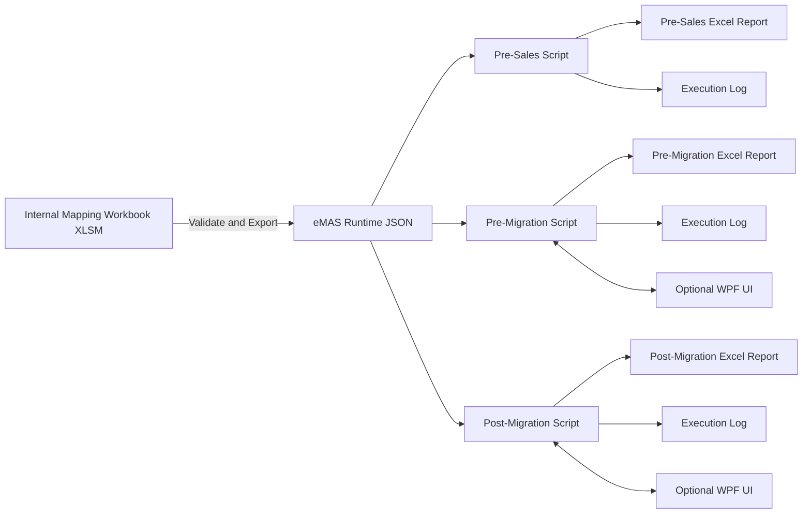
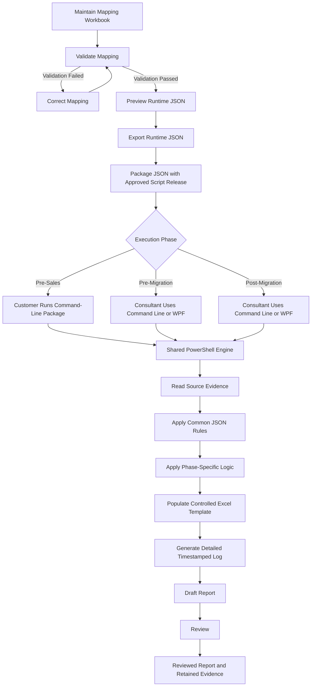
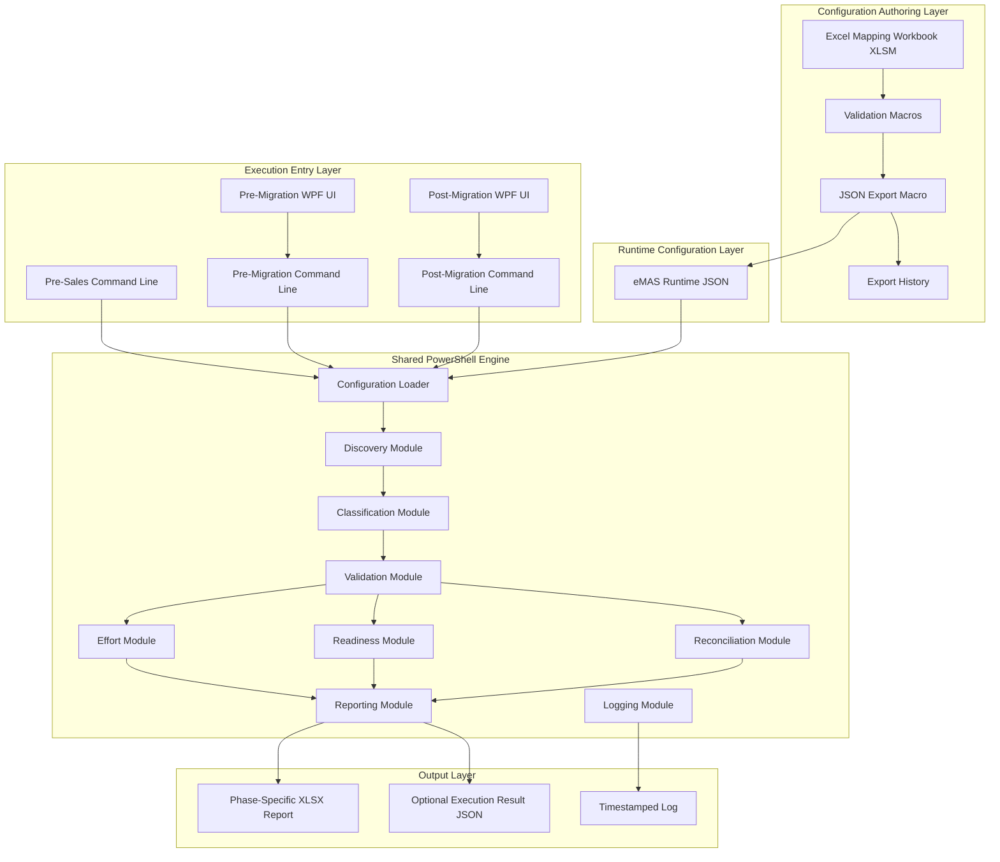

# eMAS Enterprise Requirements Specification

**Project:** eMAS — eCTD Migration Assessment Script  
**Document Type:** Enterprise Business, Functional and Technical Requirements Specification  
**Version:** 3.0  
**Status:** Final Requirements Baseline  
**Classification:** Internal  
**Branding:** EXTEDO | a cormeo brand  
**Prepared For:** EXTEDO eCTDmanager migration assessment initiative  
**Date:** 11 July 2026

---

## 1. Document Purpose

This document defines the final agreed requirements for the redesign of eMAS as a professional, GxP-oriented and fully traceable migration assessment framework.

The specification covers:

- pre-sales migration assessment;
- pre-migration readiness assessment;
- post-migration reconciliation;
- internal rule management through a controlled Excel mapping workbook;
- direct export of one runtime JSON file from Excel;
- phase-specific PowerShell execution;
- optional portable WPF user interfaces for pre-migration and post-migration;
- controlled Excel report templates;
- detailed execution logging;
- traceability, review and evidence-retention expectations.

This document is the baseline for architecture, development, testing, validation planning, controlled release and future enhancement of eMAS.

---

## 2. Executive Summary

eMAS is a mapping-driven, read-only migration assessment framework designed to support three distinct phases of eCTDmanager migration work:

1. **Pre-Sales Assessment**
2. **Pre-Migration Readiness**
3. **Post-Migration Verification**

The central technical principle of eMAS is that business and regulatory interpretation is maintained in a reviewed internal Excel mapping workbook. The workbook provides a controlled function to validate maintained rules and export one runtime JSON configuration file directly from Excel.

PowerShell does not read, interpret or convert the mapping workbook. The runtime JSON is created directly by the mapping workbook through a controlled Excel/VBA export function.

The same JSON configuration file is used by all three phases. It contains shared business rules such as:

- migration scenarios;
- region, format and dossier type values;
- folder and file rules;
- RAG criteria;
- confidence rules;
- effort drivers;
- recommendation texts;
- approved code lists;
- report terminology.

The JSON does not define the complete workflow of each script. The amount of detail, checks performed, required inputs, calculations and report output are defined independently in the pre-sales, pre-migration and post-migration scripts.

All three phases can be executed in command-line mode. Pre-migration and post-migration additionally support an optional portable Windows WPF interface. The WPF interface is only an input and execution interface; it invokes the same shared PowerShell engine as command-line mode.

The pre-sales package is intentionally lightweight because it may be executed by a customer before project initiation or contract signature. The customer should receive only the components required to run the pre-sales assessment, without access to the internal mapping workbook or configuration-maintenance process.

Each execution must:

- remain read-only;
- record the active script, JSON and template versions;
- use controlled phase-specific Excel templates;
- create a timestamped execution log;
- record warnings, errors and limitations;
- preserve source evidence;
- clearly distinguish observed, calculated, provided, assumed and not-assessed values.

eMAS is intended to provide structured, reproducible and traceable assessment evidence. It does not perform migration, regulatory validation, formal customer validation or electronic approval.

---

## 3. Product Definition

| Item | Definition |
|---|---|
| Product Name | eMAS — eCTD Migration Assessment Script |
| Product Type | Read-only migration assessment framework |
| Primary Technology | PowerShell, Excel XLSM, JSON, OpenXML-compatible XLSX, optional WPF |
| Primary Purpose | Support migration scoping, readiness and reconciliation |
| Primary Users | Pre-sales consultants, technical consultants, migration consultants, project managers and reviewers |
| Runtime Rule Source | One reviewed JSON configuration exported directly from the mapping workbook |
| Report Output | Phase-specific Excel workbook |
| Execution Evidence | Timestamped detailed log |
| UI Scope | Optional WPF UI for pre-migration and post-migration only |
| Customer-Facing Scope | Lightweight pre-sales package |
| Data Modification | Not permitted |
| Migration Execution | Out of scope |
| Formal Regulatory Validation | Out of scope |
| Electronic Signature | Out of scope |
| Central Database | Not required |
| Central Audit Trail Repository | Not required |
| Retention Model | Controlled project folder and archive |

---

## 4. Confirmed Architecture Decisions

| Decision Area | Final Decision |
|---|---|
| Regulatory Positioning | Pre-sales is non-GxP estimation support; pre- and post-migration are GxP-oriented controlled assessment evidence |
| Application Model | PowerShell engine with optional portable WPF UI for pre- and post-migration |
| Mapping Authoring | Internal Excel XLSM workbook only; no mapping UI |
| Runtime Configuration | One JSON file |
| Audit Trail Storage | No database; generate detailed logs |
| Authentication | No application authentication; record Windows execution identity |
| Electronic Approval | Approval/review fields in Excel only |
| Retention | Project folder and archive |
| Deployment Environments | One internally controlled release package |
| Customer Deployment | Customer receives pre-sales package only |
| Report Lifecycle | Draft to Reviewed |
| Branding | Official EXTEDO logo and EXTEDO | a cormeo brand |

---

## 5. Design Principles

### 5.1 Read-only operation

eMAS must not:

- delete source files;
- move source files;
- rename source files;
- modify source folders;
- modify source XML;
- update source databases;
- import dossiers;
- repair source data;
- correct customer workbooks;
- overwrite original evidence.

### 5.2 Separation of technical processing and business interpretation

PowerShell performs generic technical operations, including:

- reading folders and files;
- enumerating sequences;
- calculating size and count values;
- checking path accessibility;
- reading XML metadata;
- reading input workbooks;
- comparing baseline and migrated records;
- generating reports;
- writing logs.

Business interpretation is supplied by the runtime JSON, including:

- classification meaning;
- RAG impact;
- confidence impact;
- effort impact;
- recommendation text;
- expected folder and file rules;
- allowed values.

### 5.3 One shared runtime JSON

The same runtime JSON must be used by:

- pre-sales;
- pre-migration;
- post-migration.

The JSON defines shared interpretation, not full phase workflow.

### 5.4 Phase-specific orchestration

Each phase script defines:

- required parameters;
- optional parameters;
- required input evidence;
- assessment depth;
- checks performed;
- output workbook structure;
- final result terminology;
- handling of missing inputs;
- performance behaviour.

### 5.5 Consistent shared engine

Common capabilities should be implemented once and reused across all phases.

### 5.6 Controlled reporting

Each phase has a separate controlled Excel template.

### 5.7 GxP-oriented traceability

Every material result should be explainable through:

- source evidence;
- rule ID;
- script version;
- JSON version;
- template version;
- execution ID;
- timestamp;
- result status;
- warning or limitation;
- reviewer comment where applicable.

---

## 6. System Context



---

## 7. End-to-End Operating Flow



---

## 8. Solution Architecture



---

## 9. Mapping Workbook Requirements

### 9.1 Purpose

The mapping workbook is the internal rule-authoring and JSON-export tool.

It must not be distributed to customers.

It must not be read by the runtime PowerShell scripts.

### 9.2 File format

- Microsoft Excel macro-enabled workbook: `.xlsm`
- Internal use only
- Version-controlled
- Protected structure where practical
- Controlled dropdowns
- Separate value-list sheet
- Validation results sheet
- JSON preview sheet
- Export history sheet

### 9.3 Required sheets

| Sheet | Purpose |
|---|---|
| Home | Navigation, version, status and export controls |
| Document_Control | Document ID, version, status, owner, effective date |
| Assessment_Profile | Global assessment settings and supported scenarios |
| Classification_Rules | Region, format and dossier type detection rules |
| Folder_Rules | Expected folder and sequence structure |
| File_Rules | Mandatory, optional and conditional file expectations |
| RAG_Rules | Green, Amber, Red, Unknown and Not Assessed logic |
| Effort_Drivers | Thresholds and effort impacts |
| Confidence_Rules | High, Medium, Low and Unknown confidence logic |
| Decision_Rules | Readiness and reconciliation decision criteria |
| Recommendations | Controlled finding and recommendation text |
| Value_Lists | Dropdown and code-list values |
| Validation_Controls | Mapping integrity checks |
| Validation_Results | Output of validation |
| JSON_Preview | Read-only JSON preview |
| Export_History | Exported file, timestamp, version and user |
| Change_History | Change summary and review information |

### 9.4 Required workbook controls

The workbook must provide:

- **Validate Mapping**
- **Preview JSON**
- **Export Runtime JSON**
- **Clear Validation Results**
- **Open Export Folder**

### 9.5 Validation requirements

The workbook must detect:

- duplicate rule IDs;
- missing required values;
- invalid status values;
- invalid RAG values;
- invalid confidence values;
- invalid numeric thresholds;
- missing recommendation references;
- unsupported phase values;
- duplicate code-list values;
- inactive rules incorrectly referenced;
- missing workbook version;
- missing schema version;
- missing export status.

### 9.6 JSON export requirements

The workbook must:

1. generate JSON directly from Excel;
2. not invoke PowerShell to create JSON;
3. not require external applications;
4. export one JSON file;
5. validate before export;
6. block export when mandatory validation fails;
7. record export timestamp;
8. record Windows user;
9. record workbook version;
10. record JSON schema version;
11. record export filename;
12. record export folder;
13. preserve stable rule IDs;
14. produce valid UTF-8 JSON;
15. escape special characters correctly.

---

## 10. Runtime JSON Requirements

### 10.1 General requirements

The runtime JSON must:

- be a single file;
- be used by all phases;
- be human-readable;
- be machine-readable;
- be versioned;
- include schema version;
- include mapping version;
- include export timestamp;
- include export user;
- include status;
- include stable rule IDs;
- support backward compatibility checks;
- not include macros;
- not include formulas;
- not include uncontrolled free text where controlled codes are available.

### 10.2 Indicative structure

```json
{
  "configuration": {
    "configurationId": "EMAS-CONFIG-001",
    "mappingVersion": "3.0",
    "schemaVersion": "1.0",
    "status": "Reviewed",
    "exportedAt": "2026-07-11T18:00:00+02:00",
    "exportedBy": "DOMAIN\\User"
  },
  "migrationScenarios": [],
  "regions": [],
  "formats": [],
  "dossierTypes": [],
  "classificationRules": [],
  "folderRules": [],
  "fileRules": [],
  "ragRules": [],
  "confidenceRules": [],
  "effortDrivers": [],
  "decisionRules": [],
  "recommendations": [],
  "valueLists": []
}
```

### 10.3 Runtime loading requirements

The shared PowerShell configuration loader must:

- verify that the file exists;
- validate JSON syntax;
- verify supported schema version;
- verify required top-level sections;
- reject duplicate rule IDs;
- reject unsupported status values;
- log the loaded configuration version;
- log the mapping version;
- log the JSON file path;
- stop execution if critical configuration is invalid.

---

## 11. Shared PowerShell Engine Requirements

### 11.1 Shared modules

| Module | Responsibility |
|---|---|
| Configuration | Load and validate runtime JSON |
| Discovery | Read folders, files, counts, sizes and source paths |
| Classification | Determine region, format and dossier type |
| Validation | Apply folder, file, XML and readiness checks |
| Effort | Calculate pre-sales effort drivers |
| Readiness | Calculate pre-migration readiness outcome |
| Reconciliation | Compare baseline and post-migration evidence |
| Reporting | Populate controlled Excel templates |
| Logging | Produce structured timestamped logs |
| Utilities | Common path, date, null and formatting functions |

### 11.2 General execution requirements

The engine must:

- run without Microsoft Excel installed;
- avoid external PowerShell modules unless explicitly approved;
- support Windows PowerShell 5.1 as the baseline;
- use defensive null handling;
- continue on recoverable warnings;
- stop on invalid required inputs;
- not overwrite source files;
- not overwrite input workbooks;
- write outputs only to the selected output folder;
- generate unique output names;
- display clear progress in the console;
- avoid excessive per-file output;
- create a detailed log.

---

## 12. Pre-Sales Requirements

### 12.1 Objective

The pre-sales assessment supports early migration scoping and estimation before project initiation.

### 12.2 Customer simplicity principle

The pre-sales package must be simple enough for a customer to execute without:

- understanding the mapping workbook;
- editing JSON;
- installing Microsoft Excel;
- installing a WPF application;
- installing a database;
- installing external PowerShell modules;
- entering large numbers of parameters.

### 12.3 Customer package

```text
eMAS_PreSales_Package/
├── eMAS-PreSalesAssessment.ps1
├── eMAS_Runtime_Config.json
├── eMAS_PreSales_Template.xlsx
├── Start-eMAS-PreSales.cmd
├── Instructions.pdf
└── Output/
```

### 12.4 Execution methods

Pre-sales supports command-line execution only.

A simple launcher may be included to reduce the number of parameters.

### 12.5 Minimum customer inputs

- migration scenario;
- export root where applicable;
- archive root where applicable;
- storage root where applicable;
- database information where applicable;
- output folder.

### 12.6 Pre-sales checks

The pre-sales script should perform lightweight checks such as:

- input-path accessibility;
- file count;
- folder count;
- total size;
- dossier count;
- sequence count;
- high-level region detection;
- high-level format detection;
- high-level dossier type detection;
- high-level folder RAG;
- file-type breakdown;
- volume drivers;
- structure-complexity drivers;
- confidence calculation;
- missing-information identification;
- customer clarification generation.

### 12.7 Pre-sales checks that should not be mandatory

The pre-sales script should avoid or limit:

- exhaustive referenced-file analysis;
- deep XML validation;
- full checksum validation;
- detailed duplicate analysis;
- approved-exception management;
- baseline approval;
- formal readiness decision;
- post-import reconciliation.

### 12.8 Pre-sales final results

- Very Low
- Low
- Medium
- High
- Very High

Confidence:

- High
- Medium
- Low
- Unknown

### 12.9 Pre-sales report lifecycle

- Generated as Draft
- Reviewed internally or with customer as appropriate

---

## 13. Pre-Migration Requirements

### 13.1 Objective

The pre-migration assessment determines whether the agreed migration inputs and source data are ready for migration.

### 13.2 Execution methods

- command line;
- optional portable WPF UI.

### 13.3 Pre-migration inputs

- runtime JSON;
- migration scenario;
- source/export roots;
- archive and index roots;
- storage roots;
- database information;
- backup information;
- staging information;
- accepted exceptions;
- output folder;
- controlled Excel template.

### 13.4 Pre-migration checks

The script may perform:

- detailed path-access checks;
- detailed inventory;
- dossier and sequence inventory;
- folder validation;
- mandatory-file validation;
- XML readability checks;
- long-path checks;
- zero-byte-file checks;
- inaccessible-folder detection;
- missing referenced-file detection;
- duplicate or same-name nested-folder detection;
- backup readiness;
- staging readiness;
- storage readiness;
- cleanup-action generation;
- exclusion handling;
- accepted-exception handling;
- readiness decision;
- baseline generation.

### 13.5 Pre-migration final results

- Ready
- Ready with Accepted Exceptions
- Blocked

### 13.6 Baseline requirements

The pre-migration output must provide a baseline that can be consumed by post-migration verification.

The baseline should include:

- dossier identifier;
- sequence identifier;
- expected counts;
- expected source path;
- expected classification;
- expected inclusion status;
- exclusion status;
- exception reference;
- baseline version;
- execution ID;
- source evidence reference.

---

## 14. Post-Migration Requirements

### 14.1 Objective

The post-migration assessment reconciles the agreed pre-migration baseline with import and post-import evidence.

### 14.2 Execution methods

- command line;
- optional portable WPF UI.

### 14.3 Required inputs

- runtime JSON;
- pre-migration baseline report;
- MigrationSummary workbook;
- Import Report Detail sheet;
- Post Import Verification sheet;
- accepted exceptions;
- output folder;
- controlled Excel template.

### 14.4 Post-migration checks

The script must:

- read the approved baseline;
- read Import Report Detail;
- read Post Import Verification;
- preserve source column names;
- preserve original raw values;
- compare dossiers;
- compare sequences;
- identify missing records;
- identify extra records;
- classify warnings and errors;
- identify discrepancies;
- apply accepted exceptions;
- generate unresolved-item lists;
- produce reconciliation status.

### 14.5 Post-migration final results

- Reconciled
- Reconciled with Accepted Exceptions
- Review Required
- Not Reconciled

---

## 15. Optional WPF UI Requirements

### 15.1 Scope

WPF is optional and is limited to:

- pre-migration;
- post-migration.

It is not required for:

- pre-sales;
- mapping maintenance.

### 15.2 Deployment

The WPF UI should be portable and run from the approved eMAS package.

No conventional application installation should be required.

### 15.3 UI responsibilities

The WPF UI may:

- collect parameters;
- provide dropdowns;
- browse for files and folders;
- validate mandatory fields;
- invoke the command-line script;
- show execution progress;
- display summary result;
- open the output folder.

### 15.4 UI restrictions

The UI must not:

- contain separate assessment logic;
- create different rules;
- alter runtime JSON;
- bypass required checks;
- silently change source values;
- overwrite approved files.

### 15.5 Command-line equivalence

The same input values and same JSON must produce the same outcome in:

- WPF mode;
- command-line mode.

---

## 16. Excel Reporting Requirements

### 16.1 General

Each phase must use a separate controlled report template.

### 16.2 Common report features

- EXTEDO logo;
- EXTEDO | a cormeo brand;
- eMAS product name;
- report title;
- project/customer reference;
- generated timestamp;
- execution ID;
- script version;
- JSON version;
- template version;
- summary;
- limitations;
- execution details;
- reviewer fields;
- Draft or Reviewed status.

### 16.3 Recommended pre-sales sheets

1. Summary
2. Scope and Volume
3. Effort Drivers
4. Dossier Assessment
5. Customer Clarifications
6. Assumptions and Instructions
7. Execution Details
8. Technical Evidence, optional

### 16.4 Recommended pre-migration sheets

1. Summary
2. Readiness Decision
3. Required Inputs
4. Dossier Readiness
5. Sequence Readiness
6. Issues and Actions
7. Storage, Backup and Transfer
8. Accepted Exceptions
9. Assumptions and Instructions
10. Execution Details
11. Technical Evidence, optional

### 16.5 Recommended post-migration sheets

1. Summary
2. Verification Scope
3. Baseline versus Migrated
4. Dossier Reconciliation
5. Sequence Reconciliation
6. Import Evidence Review
7. Discrepancies
8. Accepted Exceptions
9. Review and Handover
10. Execution Details
11. Import Report Detail, optional raw evidence
12. Post Import Verification, optional raw evidence

---

## 17. Logging Requirements

### 17.1 General

Each execution must create one detailed timestamped log.

### 17.2 Minimum log content

- eMAS name;
- phase;
- execution ID;
- start time;
- end time;
- duration;
- Windows user;
- computer name;
- operating system;
- PowerShell version;
- script name;
- script version;
- runtime JSON path;
- runtime JSON version;
- mapping version;
- schema version;
- template path;
- template version;
- input parameters;
- input paths;
- output folder;
- checks started;
- checks completed;
- warnings;
- errors;
- skipped checks;
- reason for skipped checks;
- final result;
- generated workbook path;
- total warning count;
- total error count.

### 17.3 Log integrity

Logs should:

- be append-only during execution;
- not expose passwords or credentials;
- include timestamps;
- include severity levels;
- use UTF-8 encoding;
- have unique filenames;
- remain with the report in the project evidence folder.

---

## 18. GxP and Traceability Requirements

### 18.1 Traceability model


### 18.2 Required identifiers

| Object | Example |
|---|---|
| Requirement | REQ-PS-001 |
| Mapping Rule | RULE-REG-EU-001 |
| Test Case | TC-PS-001 |
| Execution | EXEC-20260711-001 |
| Finding | FND-000001 |
| Exception | EXC-000001 |
| Recommendation | REC-000001 |

### 18.3 Source and derived data

Every important report value should be classified as:

- Observed
- Calculated
- Customer Provided
- Consultant Entered
- Assumed
- Not Assessed

### 18.4 ALCOA+ expectations

| Principle | eMAS Control |
|---|---|
| Attributable | Windows user, reviewer and execution ID |
| Legible | Excel report and readable log |
| Contemporaneous | Timestamped execution records |
| Original | Source evidence not modified |
| Accurate | Controlled rules and tested calculations |
| Complete | Pass, warning, error, skipped and not-assessed outcomes |
| Consistent | Stable IDs, versions and terminology |
| Enduring | Retained project folder |
| Available | Archived with project evidence |

### 18.5 Report review

The selected report lifecycle is:

```text
Draft → Reviewed
```

The report should include:

- prepared by;
- generated date;
- reviewed by;
- review date;
- review comment;
- status.

Electronic signature is not required.

---

## 19. Security and Privacy Requirements

The system must:

- avoid storing credentials;
- avoid logging passwords;
- operate with least privilege;
- not require administrator rights unless source access requires it;
- mask sensitive paths when configured;
- restrict output to approved folders;
- not transmit customer data externally;
- not require internet access;
- not require a central service;
- not require a central database.

---

## 20. Performance Requirements

The scripts should:

- support large repositories;
- stream or incrementally enumerate where possible;
- avoid loading unnecessary file content;
- avoid storing all file records in memory unless required;
- provide periodic progress messages;
- remain responsive in WPF mode;
- record long-running steps in the log;
- allow optional detailed evidence to be disabled where not required.

---

## 21. Error Handling Requirements

| Condition | Required Behaviour |
|---|---|
| Invalid JSON | Stop with clear error |
| Missing mandatory input | Stop with clear error |
| Missing optional input | Continue and mark Not Assessed |
| Inaccessible path | Log warning; continue where possible |
| Unreadable XML | Log warning; mark finding |
| Invalid source workbook | Stop if critical |
| Missing source sheet | Stop post-migration execution |
| Unexpected column | Use approved alias only; otherwise warn or stop |
| Output file locked | Stop and provide corrective action |
| Invalid template | Stop and log template error |
| Partial scan failure | Record limitation and continue if possible |

---

## 22. Deployment Requirements

### 22.1 Package structure

```text
eMAS/
├── scripts/
├── engine/
├── config/
├── templates/
├── ui/
├── docs/
├── output/
├── logs/
└── tests/
```

### 22.2 Release package

The internally controlled release should contain:

- versioned scripts;
- shared engine modules;
- one runtime JSON;
- phase templates;
- optional WPF files;
- instructions;
- release note;
- known limitations;
- checksum manifest if implemented.

### 22.3 Customer pre-sales package

The customer should receive only the lightweight pre-sales subset.

---

## 23. Testing Requirements

### 23.1 Test levels

- unit testing;
- integration testing;
- scenario testing;
- regression testing;
- user review;
- report-template validation;
- JSON export validation.

### 23.2 Mandatory scenarios

- SQL to SQL;
- Access to SQL;
- Oracle to SQL;
- external dossier migration;
- hybrid migration;
- archive-only sizing;
- unknown repository;
- valid Green structure;
- Amber incomplete structure;
- Red invalid structure;
- inaccessible path;
- long path;
- zero-byte file;
- unreadable XML;
- missing referenced file;
- post-migration reconciled;
- post-migration accepted exception;
- missing migrated sequence;
- extra migrated dossier;
- warning-only import;
- invalid JSON;
- invalid template;
- missing required workbook sheet.

### 23.3 Acceptance evidence

Each test should record:

- test ID;
- requirement ID;
- script version;
- JSON version;
- template version;
- input data;
- command executed;
- expected result;
- actual result;
- evidence file;
- reviewer;
- date;
- pass/fail status.

---

## 24. Non-Functional Requirements

| ID | Requirement |
|---|---|
| NFR-001 | Run without Microsoft Excel installed during script execution |
| NFR-002 | Avoid external PowerShell modules unless approved |
| NFR-003 | Support Windows PowerShell 5.1 baseline |
| NFR-004 | Generate valid XLSX without repair prompt |
| NFR-005 | Use one shared runtime JSON |
| NFR-006 | Preserve source evidence |
| NFR-007 | Support command-line execution in all phases |
| NFR-008 | Support optional WPF only for pre- and post-migration |
| NFR-009 | Produce detailed timestamped logs |
| NFR-010 | Support large repositories |
| NFR-011 | Use consistent phase-specific terminology |
| NFR-012 | Remain portable and customer-environment friendly |

---

## 25. Out of Scope

The following are outside the current requirement baseline:

- central SQL database;
- central web application;
- electronic signatures;
- application-specific authentication;
- enterprise identity management;
- central immutable audit-trail service;
- cloud deployment;
- direct migration execution;
- source-data repair;
- regulatory validation engine;
- automatic customer acceptance;
- mapping-maintenance UI;
- pre-sales WPF UI;
- PowerShell-generated JSON;
- PowerShell reading the mapping workbook.

---

## 26. Acceptance Criteria

The solution is acceptable when:

1. The Excel mapping workbook can validate and export one JSON file directly.
2. PowerShell does not read the mapping workbook.
3. The same JSON is used by all three phases.
4. Pre-sales remains lightweight and command-line driven.
5. Pre-migration supports command line and optional WPF.
6. Post-migration supports command line and optional WPF.
7. The WPF interface invokes the same scripts as command mode.
8. Each phase performs its own defined assessment depth.
9. Each phase produces a separate Excel report.
10. Each execution produces a detailed timestamped log.
11. Reports include EXTEDO branding and official logo.
12. Source evidence is not modified.
13. Results can be traced to source evidence, rule and version.
14. Reports support Draft to Reviewed lifecycle.
15. The solution runs without a central database.
16. The pre-sales customer package is simple and self-contained.
17. The solution does not overstate validation or migration completion.

---

## 27. Final Requirement Statement

The final eMAS solution shall use one internal Excel XLSM mapping workbook as the reviewed source for business and regulatory rules. The workbook shall validate its content and provide a direct option to export one runtime JSON file.

PowerShell shall not read the mapping workbook and shall not create the JSON.

The exported JSON shall be the common business-rule configuration used by pre-sales, pre-migration and post-migration.

Each phase shall define its own:

- inputs;
- workflow;
- assessment depth;
- checks;
- decision logic;
- report structure;
- final result language.

All phases shall support command-line execution.

Pre-migration and post-migration shall additionally support an optional portable WPF interface that invokes the same PowerShell engine.

The pre-sales package shall remain simple, portable and customer-friendly.

Every execution shall remain read-only, populate a controlled phase-specific Excel template and create a detailed timestamped log that supports complete traceability.

---

## 28. Glossary

| Term | Meaning |
|---|---|
| eMAS | eCTD Migration Assessment Script |
| XLSM | Macro-enabled Excel workbook |
| JSON | JavaScript Object Notation runtime configuration |
| WPF | Windows Presentation Foundation |
| RAG | Green, Amber, Red assessment status |
| Baseline | Expected pre-migration source inventory |
| Reconciliation | Comparison of expected and migrated evidence |
| ALCOA+ | Data integrity principles |
| Not Assessed | Input unavailable or check not performed |
| Reviewed | Report reviewed but not electronically signed |

---

## 29. Revision History

| Version | Date | Change |
|---|---|---|
| 1.0 | Earlier baseline | Initial eMAS concept |
| 2.0 | 10 July 2026 | Consolidated mapping-driven documentation |
| 3.0 | 11 July 2026 | Final enterprise redesign with one Excel-exported runtime JSON, phase-specific scripts, optional WPF for pre/post migration and GxP-oriented traceability |
