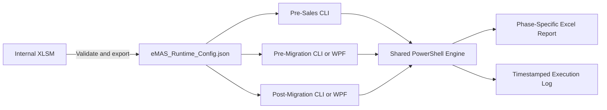

# eMAS Enterprise Requirements Specification

**Project:** eMAS — eCTD Migration Assessment Script  
**Document Type:** Enterprise Business, Functional and Technical Requirements Specification  
**Version:** 3.1  
**Status:** Effective Requirements Baseline  
**Classification:** Internal  
**Branding:** EXTEDO | a cormeo brand  
**Owner:** Product Owner  
**Effective date:** 2026-07-13  
**Decision references:** Approved Decision Baseline v1.0; approved 171-item decision register  
**Canonical references:** Authority and Precedence Policy; Controlled Terminology; Runtime JSON Contract; Normalized Rule Model

---

## 1. Purpose and supersession

This document defines the effective enterprise requirements for eMAS. Version 3.1 consolidates the Product Owner-approved decisions from the 171-item decision register and supersedes Enterprise Requirements v3.0 for implementation use.

Lower-authority documents, examples, generated summaries, historical Word packs and code comments must not override this baseline.

## 2. Product definition

eMAS is a read-only, mapping-driven migration assessment framework supporting:

1. **Pre-Sales Assessment**
2. **Pre-Migration Readiness**
3. **Post-Migration Verification**

It provides structured, reproducible and traceable assessment evidence. It does not perform migration, regulatory validation, formal customer validation, electronic approval or customer acceptance.

| Item | Effective definition |
|---|---|
| Product name | eMAS — eCTD Migration Assessment Script |
| Primary technology | PowerShell, Excel XLSM, JSON, OpenXML-compatible XLSX and optional WPF |
| Authoring source of truth | Reviewed internal XLSM mapping workbook |
| Runtime source of truth | Validated immutable JSON exported from the approved XLSM |
| Execution source | Exact JSON version and SHA-256 checksum loaded for one execution |
| Runtime file | `eMAS_Runtime_Config.json` |
| Runtime baseline | Windows PowerShell 5.1 |
| Customer-facing scope | Lightweight Pre-Sales package only |
| Data modification | Prohibited |
| Central database | Not required |
| Electronic signature | Out of scope |

## 3. Core architecture decisions

1. Business and regulatory interpretation is maintained in the internal XLSM.
2. The workbook validates configuration and exports one runtime JSON file directly through controlled VBA.
3. PowerShell never reads the XLSM and never creates, repairs or reinterprets runtime JSON.
4. The same runtime JSON is used by all three phases.
5. The JSON defines shared interpretation and controlled values, not the complete workflow of each phase.
6. Each phase defines its own inputs, checks, assessment depth, performance behavior, result logic and controlled report template.
7. Shared technical processing is implemented once in the shared PowerShell engine.
8. All phases support command-line execution.
9. Optional portable WPF is limited to Pre-Migration Readiness and Post-Migration Verification and invokes the same scripts.
10. Every execution creates one phase-specific Excel report and one detailed timestamped log.
11. Source evidence remains read-only.



## 4. Read-only and safety requirements

eMAS must not:

- delete, move or rename source files;
- modify source folders or XML;
- update source databases;
- import dossiers;
- repair or correct customer evidence;
- overwrite original input workbooks;
- store credentials or passwords;
- transmit customer data externally;
- require internet access for normal execution.

Output may be written only to the selected output location.

## 5. Separation of technical processing and interpretation

PowerShell performs generic technical operations such as:

- reading folders, files, XML and input workbooks;
- enumerating dossiers and sequences;
- calculating sizes and counts;
- checking accessibility and technical integrity;
- comparing baseline and migrated evidence;
- populating reports and writing logs.

Runtime JSON supplies business interpretation such as:

- normalized classification meaning;
- RAG, severity and confidence impact;
- effort impact;
- expected folder and file rules;
- findings and linked recommendations;
- conflict and exception policies;
- controlled values and report terminology.

Business or regulatory meaning must not be hardcoded in PowerShell when it belongs in controlled configuration.

## 6. Mapping workbook requirements

The mapping workbook is internal only and must not be distributed to customers.

It shall:

- use `.xlsm` format;
- provide controlled dropdowns and protected technical headers;
- maintain separate versions for document, workbook, mapping and JSON schema;
- separate rules, phases, condition groups, conditions and outputs;
- separate findings, recommendations and their links;
- maintain explicit master-data relationships;
- use calculated runtime eligibility instead of editable `IsActive`;
- support lifecycle and supersession;
- support conflict, threshold, effort, confidence and exception policies;
- provide validation results, JSON preview and export history;
- export one deterministic UTF-8 JSON file without BOM;
- record SHA-256 after controlled export.

The normalized logical model in the effective configuration requirements and content catalogue is canonical. Visible worksheet grouping may be optimized for usability, but logical entities and stable headers must remain normalized.

## 7. Runtime JSON requirements

### 7.1 Canonical structure

The approved JSON Schema is authoritative. The required top-level model is:

```json
{
  "configuration": {},
  "valueLists": {},
  "fieldCatalogue": [],
  "metricCatalogue": [],
  "masterData": {},
  "relationships": [],
  "rules": [],
  "rulePhases": [],
  "conditionGroups": [],
  "ruleConditions": [],
  "ruleOutputs": [],
  "findings": [],
  "recommendations": [],
  "findingRecommendationLinks": [],
  "exceptionPolicies": [],
  "aliases": [],
  "reportTerminology": {}
}
```

### 7.2 Metadata and compatibility

The JSON shall include:

- configuration ID;
- schema version;
- mapping version;
- source workbook version;
- minimum engine version;
- optional maximum tested engine version;
- export type;
- export timestamp in UTC;
- exporting Windows identity;
- status and effective date;
- validation run ID.

Schema and mapping versions use Semantic Versioning independently. Unsupported major schema versions, invalid controlled values, unknown executable operators, duplicate identifiers, broken mandatory references and failed controlled-package checksums shall stop execution.

### 7.3 Serialization and integrity

The JSON shall be:

- UTF-8 without BOM;
- complete and never truncated;
- culture-invariant for decimals, dates, date-times and booleans;
- deterministic for equivalent approved content where required;
- immutable during execution;
- packaged with a SHA-256 checksum recorded in release and execution evidence.

PowerShell must never modify the JSON in place.

## 8. Normalized classification model

Classification dimensions are independent:

- Region;
- Authority;
- TechnicalStandard;
- RegionalImplementation;
- ProductDomain;
- LifecycleContext;
- ProductClass;
- ProcedureContext where applicable;
- SourcePresentation where required.

Requirements:

- Regional implementation is layered on technical standard.
- ASMF is ProcedureContext, not TechnicalStandard.
- Paper/scanned packaging is SourcePresentation when it describes evidence form rather than standard.
- Broad groupings such as MENA and LATAM are not regulatory authorities.
- Matched candidates, evidence, evidence strength, score and confidence are preserved.
- Classification defaults to `HighestEvidenceScore`.
- Equal top scores or contradictory strong evidence result in `Unknown` or `ManualReview`.
- New regulatory content remains Draft until the required Regulatory SME evidence is recorded.

## 9. Rule model and lifecycle

Every executable rule shall have a stable `RuleId` and integer `RuleRevision`.

- Non-semantic formatting corrections do not create a new RuleId.
- Clarifications that preserve business meaning increment RuleRevision.
- Material changes to condition logic, severity, blocker meaning, output type, phase meaning or threshold value create a new RuleId and supersession relationship.
- Retired and superseded IDs are never reused.

Rule lifecycle codes are:

- Draft;
- InReview;
- Reviewed;
- Effective;
- Superseded;
- Retired.

Approved transition path:

```text
Draft → InReview → Reviewed → Effective
```

Runtime eligibility is calculated from status and effective dates. Only Effective, runtime-eligible rules enter controlled JSON.

## 10. Conditions, outputs and conflicts

- One condition is stored per row.
- Conditions within one group use AND.
- Separate groups for one rule use OR.
- Schema 1.0.0 supports two logical levels.
- Arbitrary VBA, PowerShell or expression-language code in cells is prohibited.
- One rule may have multiple ordered outputs.

Supported conflict strategies include:

- FirstMatch;
- MostSpecific;
- MostSevere;
- Aggregate;
- ErrorOnMultipleMatch;
- HighestEvidenceScore;
- ManualReview.

Defaults:

- classification: HighestEvidenceScore;
- tied classification: Unknown or ManualReview;
- folder/file findings: Aggregate;
- RAG aggregation: MostSevere;
- decisions: ordered FirstMatch with mandatory blocker override.

Unresolved conflicts must not be silently resolved.

## 11. Findings, recommendations and exceptions

A finding records evidence or an evaluated outcome. A recommendation records proposed action or guidance.

- Findings and recommendations remain separate.
- They are linked through explicit relationship rows.
- Customer-facing and consultant-facing text remain separate.
- A finding may have multiple ordered recommendations by phase.

The master configuration stores exception policies, not project-specific accepted exceptions.

Supported effects include:

- AcknowledgeOnly;
- RemoveBlock;
- ExcludeFromScope;
- AcceptDifference;
- DowngradeDecisionImpact.

An accepted exception may alter decision or blocker treatment but must never erase or replace the original finding, original RAG or evidence. Carry-forward to Post-Migration defaults to False.

## 12. Evaluation status, RAG and provenance

These concepts are separate.

**EvaluationStatus**

- Evaluated
- NotAssessed
- NotApplicable
- Skipped
- Warning
- Error
- InsufficientEvidence
- Conflict

`Warning` means evaluation completed with a usable result, but a recoverable condition requires attention. It does not independently determine RAG, severity, blocker status, effort band, readiness result or reconciliation result.

**RAG**

- Green
- Amber
- Red
- Unknown

**ValueSource**

- Observed
- CustomerProvided
- Imported
- Derived
- Assumed

`NotAssessed` and `NotApplicable` are never RAG values. `Calculated` is a legacy synonym of `Derived` and is not a separate controlled code. Missing evidence must not be treated as Green or Pass.

## 13. Threshold, effort and confidence requirements

Thresholds shall define lower and upper bounds, inclusivity flags and unit. The default convention is lower-inclusive and upper-exclusive.

Gaps, overlaps, inverted ranges and duplicate bands shall fail validation where complete coverage is required.

Effort uses a hybrid model:

- weighted driver score;
- mandatory minimum-band overrides for critical conditions;
- separately calculated effort confidence;
- customer-facing presentation of final band, confidence, key drivers, assumptions and missing information;
- raw numeric score remains internal unless approved for disclosure.

Exact weights and thresholds require approved Product Owner or Migration SME evidence before Effective configuration status.

## 14. Phase requirements

### 14.1 Pre-Sales Assessment

Purpose:

- lightweight scope and complexity estimation;
- confidence assessment;
- customer clarification generation.

Execution:

- command line or simple launcher;
- no WPF requirement.

The customer package shall contain only the required Pre-Sales script, shared engine, controlled runtime JSON, Pre-Sales template, instructions and output location. It shall not include the internal XLSM, VBA, Pre-Migration/Post-Migration interfaces, internal tests or governance material.

Pre-Sales shall not perform mandatory deep XML, checksum, referenced-file, backup or reconciliation checks. Such checks may be optional when proportionate.

Approved outcomes:

- complexity: Very Low, Low, Medium, High or Very High;
- confidence: High, Medium, Low or Unknown;
- scope summary and clarification items.

Pre-Sales must not use readiness or validation-success wording.

### 14.2 Pre-Migration Readiness

Purpose:

- detailed readiness assessment;
- blocker, warning and preparation-action identification;
- reusable baseline creation.

Execution:

- command line or optional WPF.

Approved outcomes:

- Ready;
- Ready with Accepted Exceptions;
- Blocked.

The report shall create the expected baseline and record stable comparison identifiers, exclusions, exceptions and limitations for Post-Migration Verification.

### 14.3 Post-Migration Verification

Purpose:

- compare migrated evidence against the approved Pre-Migration baseline;
- reconcile dossier, sequence and other agreed measures;
- classify discrepancies and accepted differences.

Execution:

- command line or optional WPF.

Approved outcomes:

- Reconciled;
- Reconciled with Accepted Exceptions;
- Review Required;
- Not Reconciled.

Post-Migration Verification must preserve raw input evidence where included and must not claim formal validation or customer acceptance.

## 15. Shared PowerShell engine requirements

The shared engine shall contain reusable modules for:

- configuration loading and validation;
- discovery;
- classification;
- technical validation;
- effort calculation;
- readiness;
- reconciliation;
- reporting;
- logging;
- common utilities.

The engine shall:

- support Windows PowerShell 5.1;
- run without Microsoft Excel installed;
- run without unapproved external modules;
- validate runtime JSON before source scanning;
- use stable internal object schemas;
- handle null and missing properties defensively;
- distinguish configuration errors, technical errors, unavailable evidence and business findings;
- continue only for recoverable warnings defined by phase policy;
- never overwrite source evidence.

## 16. Excel reporting requirements

Each phase uses a separate controlled template.

Every report shall include:

- phase and purpose;
- generated timestamp;
- execution identity and ExecutionId;
- engine, schema, mapping, workbook, JSON and template versions;
- JSON path, size and checksum;
- inputs and scope;
- findings, recommendations, warnings, errors and limitations;
- controlled outcome terminology;
- review fields;
- intended-use and non-validation statement.

Reports must open without a repair prompt and must not claim migration execution, regulatory validation, formal customer validation, electronic approval or customer acceptance.

## 17. Logging requirements

Every execution creates a timestamped UTF-8 log containing:

- ExecutionId;
- start and end time;
- Windows identity and machine;
- operating system and PowerShell version;
- phase and parameters;
- engine, schema, mapping, source workbook, JSON and template versions;
- JSON checksum;
- validation results;
- steps performed and elapsed times;
- warnings, recoverable errors and fatal errors;
- final result and output paths.

Logs must not contain passwords or unnecessary sensitive content.

## 18. GxP-oriented traceability

eMAS supports ALCOA+-aligned traceability practices but does not itself establish regulatory compliance or computerised-system validation.

Material outputs should be traceable through:

```text
Requirement → Design → Rule → Runtime JSON → Engine Function → Test → Execution Evidence → Report Result → Review Record
```

Stable prefixes shall be used for requirements, decisions, rules, findings, recommendations, exceptions, conflicts, tests and executions. Identifiers must never be reused for a different semantic object.

The operational report lifecycle is:

```text
Draft → Reviewed
```

This is not electronic approval.

## 19. Security, privacy and deployment

- Least privilege applies.
- No central database, central service or internet dependency is required.
- Customer data, production logs, project evidence and project-specific exceptions must not be committed to the public repository.
- The controlled internal release shall include scripts, engine modules, one runtime JSON, phase templates, optional WPF files, instructions, known limitations and checksum manifest.
- Shipped component filenames shall not contain internal Confluence IDs or embedded versions; versions belong in metadata, logs and manifests.
- The internal XLSM and VBA are excluded from customer packages.

## 20. Performance and error handling

The engine should use memory-conscious enumeration, avoid unnecessary content loading, provide progress for long operations and remain responsive in WPF mode.

| Condition | Required behavior |
|---|---|
| Invalid or incompatible JSON | Stop before source scanning |
| Missing mandatory input | Stop with clear corrective action |
| Missing optional evidence | Continue with configured evaluation status, normally NotAssessed |
| Inaccessible path | Warn and continue where phase policy permits |
| Unreadable XML | Record technical error/finding without crashing the full run where possible |
| Missing mandatory Post-Migration sheet | Stop Post-Migration execution |
| Unexpected source column | Use approved alias only; otherwise warn or stop according to contract |
| Locked output | Stop and identify corrective action |
| Invalid template | Stop and log template error |

## 21. Testing requirements

Required test levels:

- unit;
- integration;
- scenario;
- regression;
- performance;
- JSON/schema validation;
- report-template validation;
- supported Excel/locale validation;
- release and rollback verification.

Mandatory scenarios include SQL-to-SQL, Access-to-SQL, Oracle-to-SQL, external dossier, hybrid, archive-only, unknown repository, Green/Amber/Red structures, inaccessible/long paths, zero-byte files, unreadable XML, missing referenced files, invalid JSON, invalid templates and Post-Migration matched/missing/extra/accepted-exception cases.

Each test records requirement IDs, versions, inputs, command, expected and actual results, evidence, reviewer, date and pass/fail status.

## 22. Non-functional requirements

| ID | Requirement |
|---|---|
| NFR-001 | Script execution shall not require Microsoft Excel installed. |
| NFR-002 | Unapproved external PowerShell modules shall not be required. |
| NFR-003 | Windows PowerShell 5.1 is the runtime baseline. |
| NFR-004 | Generated XLSX shall open without repair prompt. |
| NFR-005 | One shared runtime JSON shall be used across all phases. |
| NFR-006 | Source evidence shall remain read-only. |
| NFR-007 | All phases shall support command-line execution. |
| NFR-008 | Optional WPF is limited to Pre-Migration and Post-Migration. |
| NFR-009 | Detailed timestamped logs are mandatory. |
| NFR-010 | Large repositories shall be handled proportionately. |
| NFR-011 | Controlled terminology and stable identifiers shall be consistent across JSON, logs and reports. |
| NFR-012 | JSON and date/number serialization shall be culture-invariant. |
| NFR-013 | Evaluation status, RAG and provenance shall remain separate. |
| NFR-014 | Exceptions shall preserve original findings and evidence. |

## 23. Out of scope

- central web application;
- central SQL configuration or audit database;
- direct migration/import execution;
- source-data repair;
- regulatory validation engine;
- formal customer validation or acceptance;
- electronic signatures;
- application authentication;
- cloud deployment;
- mapping-maintenance UI;
- Pre-Sales WPF;
- PowerShell-generated JSON;
- PowerShell reading the mapping workbook.

## 24. Acceptance criteria

The baseline is accepted when:

1. the XLSM implements the approved normalized model;
2. controlled values and relationships are validated;
3. the workbook exports one deterministic `eMAS_Runtime_Config.json` directly;
4. JSON is UTF-8 without BOM, culture-invariant and schema-valid;
5. SHA-256 and version metadata are recorded;
6. PowerShell never reads the workbook or creates/repairs JSON;
7. the same JSON is used by all three phases;
8. classification dimensions and regulatory taxonomy follow the controlled model;
9. findings, recommendations, evaluation status, RAG and provenance remain separate;
10. accepted exceptions preserve original evidence;
11. phase outcomes use approved terminology;
12. source evidence remains read-only;
13. reports and logs provide versioned traceability;
14. regulatory content and estimation values require the approved owner/SME evidence before Effective status;
15. documentation, implementation, verification and release are tracked as separate delivery states.

## 25. Delivery state

The requirements decisions are Effective. The following remain implementation or verification work:

- workbook data dictionary and ER diagram;
- finalized JSON relationship matrix;
- JSON fixtures and independent validation;
- architecture and phase-contract synchronization;
- operational skill implementation;
- XLSM/VBA proof of concept and signing;
- PowerShell OpenXML/reporting spike;
- detailed regulatory and migration content population;
- tests, CI, release manifest, rollback and recall controls.

## 26. Revision history

| Version | Date | Change |
|---|---|---|
| 1.0 | Earlier baseline | Initial eMAS concept |
| 2.0 | 2026-07-10 | Consolidated mapping-driven documentation |
| 3.0 | 2026-07-11 | One Excel-exported runtime JSON, phase-specific scripts and optional WPF baseline |
| 3.1 | 2026-07-13 | Consolidated approved governance, normalized rule/JSON model, controlled terminology, taxonomy, provenance, conflict, exception and release requirements |
