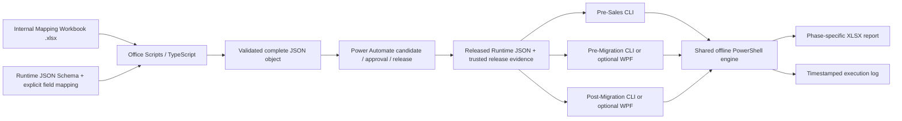

# eMAS — eCTD Migration Assessment Script

eMAS is a read-only, configuration-driven migration assessment framework supporting Pre-Sales Assessment, Pre-Migration Readiness, and Post-Migration Verification.

> **September 2026 update:** the current working target architecture no longer uses XLSM/VBA as the production authoring/export route. The July XLSM/VBA implementation remains historical proof-of-concept evidence. See `docs/updates/2026-09-12/README.md`.

## Current target architecture

- Internal authoring: macro-free Excel `.xlsx`, primarily Excel for the web, under controlled SharePoint storage/versioning.
- Runtime contract: JSON-first and independently defined from workbook layout.
- Transformation: reviewed Office Scripts / TypeScript implement explicit workbook-to-JSON mapping and validation.
- Release: Power Automate coordinates frozen candidates, independent approval, immutable publication and release evidence.
- Runtime source: one immutable released Runtime JSON shared by all phases, plus separate trusted release evidence.
- PowerShell never reads, converts or repairs the Mapping Workbook; normal project runtime is offline.
- Customer/project assessment input and derived evidence must not be exported into Runtime JSON.

## September 2026 design baseline

1. Enterprise architecture v4 direction — `.xlsx` + SharePoint + Office Scripts + Power Automate, immutable Runtime JSON and release digest/manifest.
2. Integrated assessment workbook — project, dossier, sequence and evidence layers coexist with reusable configuration while `DataScope` prevents project/customer evidence becoming runtime rules.
3. Filterable assessment catalogue — 3,726 condition rows across 55 profiles, structured by Region → Format → Version → Application/Dossier Type and phase.
4. Regulatory/technical migration guide — separates dossier/application, region/authority, technical format, application/pathway, dossier/content type and lifecycle purpose; connects physical/XML evidence to migration rules, RAG, confidence, readiness and reconciliation.

See the files in `docs/updates/2026-09-12`, `docs/requirements`, `docs/configuration`, and `docs/regulatory`.

## Regulatory and assessment principles

- eMAS is a migration assessment framework, not a migration execution or formal regulatory-validation system.
- Region, technical format, application/pathway type, dossier/content type and lifecycle purpose are independent dimensions.
- ASMF is a regulatory dossier/master-file concept, not a unique transport format; an ASMF may be delivered using eCTD.
- Folder names are supporting evidence; strong identification should use authoritative metadata/XML/profile evidence where available.
- Preserve traceability: physical file → XML path/element/attribute/value → interpretation → RuleId → finding → severity/confidence → migration action.
- `Unknown` and `Not Assessed` are meaningful outcomes. Missing/inaccessible evidence must not become Green/Pass.
- Severity/RAG and confidence are separate concepts.
- Technical completeness is not equivalent to an authority's complete official validation-rule execution.

## Positioning

eMAS provides structured, reproducible and traceable migration assessment evidence. It does not perform migration, formal regulatory validation, customer validation, electronic approval or customer acceptance solely from an assessment result.
